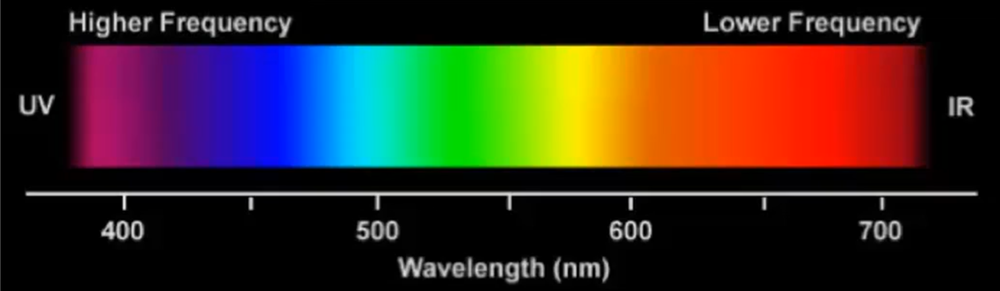

On the retina there are special cells called rods, sensible to light intensity,
and cones, sensible to light color. These cells allow the brain to see.

There are three different types of cones (sometimes called p, B, vy), all
equally distributed over the retina.

However, current graphics adapters are able to draw everything
supporting just three types of primitives:

* Points: basically a pixel or a set of pixel which are "closer" to a coordinate
* Lines
* Filled triangles

Current displays are able to show different resolutions, and are available in different sizes and form factors.

Applications want to display the same content regardless of the resolution, the size and the shape of the screen. They also want to exploit all the features of the display at their best.

A special coordinate system, called Normalized Screen Coordinates is used to address points on screen in a device independent way. 

Normalized Screen Coordinates are a Cartesian coordinate system, where x and y values range between two canonical values (generally between -1 and 1, but other standards such as 0 and 1 also exists), and axes oriented along a specific direction.

)

Both OpenGL and Vulkan uses normalized screen
coordinates in the [-1, 1] range.

However, OpenGL has the y-axis going up, while Vulkan follows the
convention of pixel coordinates with the y-axis pointing down.

As we introduced, screen buffers are usually accessed using their drivers and specific software libraries.

The primitives used to draw on the screen (or on one of its windows) automatically perform the computations to determine the correct pixels on the screen starting from normalized screen coordinates.

Software always uses Normalized Screen Coordinates, unless it works at a very low level in which it has to directly communicate with the frame buffer.

The x, y, and z coordinates of the vector with w = 1 identify the "real" position of the point in the 3D space. 

$$
(x, y, z, w) \rightarrow\left(x^{\prime}, y^{\prime}, z^{\prime}\right)=\left(\frac{x}{w}, \frac{y}{w}, \frac{z}{w}\right)
$$

$$
(x, y, z) \rightarrow(x, y, z, 1)
$$

# Transformations

> Resources: [3Blue1Brown - Linear transformations and matrices | Chapter 3, Essence of linear algebra](https://www.youtube.com/watch?v=kYB8IZa5AuE&list=PL0-GT3co4r2y2YErbmuJw2L5tW4Ew2O5B)

The process of varying the coordinates of the points of an object in the space is called transformation. Transformation in 3D can be quite complex, since all the points of the object might be repositioned in a three-dimensional space. However, there is an important and large set of transformations that can be summarized with a mathematical concept known as the **affine transforms**. 

The affine transforms are usually grouped in four classes:

- Translation
- Scaling: enlarge, shrink, deform, mirror, flatten
- Rotation
- Shear

When using homogeneous coordinates, 4x4 matrices can express
the considered geometrical transforms.
The new vertex p' can be computed from the old point p by simply
multiplying it with the corresponding transform matrix M.
The basic transformations we are considering, are constructed to
maintain the fourth component of the resulting vector unchanged.

When using homogeneous coordinates, 4x4 matrices can express the considered geometrical transforms. The new vertex p' can be computed from the old point p by simply multiplying it with the corresponding transform matrix M. The basic transformations we are considering, are constructed to maintain the fourth component of the resulting vector unchanged. 

$$
\begin{array}{ll}
p=(x, y, z, 1) & p=(x, y, z, 1) \\
p^{\prime}=\left(M \cdot p^T\right)^T & p^{\prime}=p \cdot M^T \\
p^{\prime}=\left(x^{\prime}, y^{\prime}, z^{\prime}, 1\right) & p^{\prime}=\left(x^{\prime}, y^{\prime}, z^{\prime}, 1\right)
\end{array}
$$

Some books, libraries or game engine will use matrix-on-the-left or matrix-on-the-right. 

At this moment let's try to imagine how each transformation is represented with a matrix without actually reading the next lines. 

$$
M=\left|\begin{array}{ccc:c}
n_{x x} & n_{y x} & n_{z x} & d_x \\
n_{x y} & n_{y y} & n_{z y} & d_y \\
n_{x z} & n_{y z} & n_{z z} & d_z \\
\hdashline 0 & 0 & 0 & 1
\end{array}\right|=\left|\begin{array}{c:c}
M_R & \mathbf{d}^T \\
\hdashline \mathbf{0} & 1
\end{array}\right|
$$

the matrix product exchanges the three Cartesian axis
of the original coordinate system, with three new directions.

The columns in the sub-matrix  represent the directions and sizes of the new axes in the old reference system 

$$
M=\left|\begin{array}{ccc}
n_{x x} & n_{y x} & n_{z x} \\
n_{x y} & n_{y y} & n_{z y} \\
n_{x z} & n_{y z} & n_{z z} \\
\end{array}\right|
$$

Each $j$-th column rapresent the "new direction" of the $j$-th column.  

Vector $\vec  d$ represents the position of the origin of the new coordinates system in the old one. Translations use the last column only.

$$
\vec d=\left|\begin{array}{c}
d_x \\
d_y \\
d_z \\
\end{array}\right|
$$

# Transformations 

Remember that we are using the convention that the matrix is put on the left.
Remember that the matrices with the on-the-right notation are switched and transposed: 

In this course, we will never use the matrix-on-the-right convention.

###  Translation

$$
\begin{aligned}
& x^{\prime}=x+d_x \\
& y^{\prime}=y+d_y \\
& z^{\prime}=z+d_z
\end{aligned}
$$
$$
T\left(d_x, d_y, d_z\right)=\left|\begin{array}{cccc}
1 & 0 & 0 & d_x \\
0 & 1 & 0 & d_y \\
0 & 0 & 1 & d_z \\
0 & 0 & 0 & 1
\end{array}\right|
$$

The new coordinates can be obtained by simply adding the corresponding movement to each axis

### Scaling

$$
\begin{aligned}
& x^{\prime}=s_x \cdot x \\
& y^{\prime}=s_y \cdot y \\
& z^{\prime}=s_z \cdot z
\end{aligned}
$$
Proportional scaling is obtained using identical scaling factors.
$$
S\left(s_x, s_y, s_z\right)=\left|\begin{array}{cccc}
s_x & 0 & 0 & 0 \\
0 & s_y & 0 & 0 \\
0 & 0 & s_z & 0 \\
0 & 0 & 0 & 1
\end{array}\right|
$$

Mirroring can be obtained by using negative scaling factors.

Planar mirroring creates the symmetric object with respect to a plane.

$$
\begin{aligned}
& s_x=-1 \\
& s_y=1 \\
& s_z=1
\end{aligned}
$$

Axial mirroring creates the symmetric object with respect to an axis. It is obtained by assigning -1 to all the scaling factors but the one of the axis (x and z for y-axis).

$$
\begin{aligned}
& S_x=-1 \\
& s_y=1 \\
& S_z=-1
\end{aligned}
$$

Central mirroring creates the symmetric object with respect to the origin.

$$
\begin{aligned}
& s_x=-1 \\
& s_y=-1 \\
& s_z=-1
\end{aligned}
$$

### Rotation

x-axis
$$
\begin{aligned}
& x^{\prime}=x \\
& y^{\prime}=y \cdot \cos \alpha-z \cdot \sin \alpha \\
& z^{\prime}=y \cdot \sin \alpha+z \cdot \cos \alpha \\
\end{aligned}
$$
$$
\begin{aligned}
&R_x(\alpha)=\left|\begin{array}{cccc}
1 & 0 & 0 & 0 \\
0 & \cos \alpha & -\sin \alpha & 0 \\
0 & \sin \alpha & \cos \alpha & 0 \\
0 & 0 & 0 & 1
\end{array}\right|
\end{aligned}
$$

y-axis
$$\begin{aligned} \\
& x^{\prime}=x \cdot \cos \alpha+z \cdot \sin \alpha \\
& y^{\prime}=y \\
& z^{\prime}=-x \cdot \sin \alpha+z \cdot \cos \alpha \\
\end{aligned}
$$ 

$$
\begin{aligned}
&R_y(\alpha)=\left|\begin{array}{cccc}
\cos \alpha & 0 & \sin \alpha & 0 \\
0 & 1 & 0 & 0 \\
-\sin \alpha & 0 & \cos \alpha & 0 \\
0 & 0 & 0 & 1
\end{array}\right|
\end{aligned}
$$

z-axis
$$\begin{aligned}\\
& x^{\prime}=x \cdot \cos \alpha-y \cdot \sin \alpha \\
& y^{\prime}=x \cdot \sin \alpha+y \cdot \cos \alpha \\
& z^{\prime}=z \\
\end{aligned}
$$

$$
\begin{aligned}
&R_z(\alpha)=\left|\begin{array}{cccc}
\cos \alpha & -\sin \alpha & 0 & 0 \\
\sin \alpha & \cos \alpha & 0 & 0 \\
0 & 0 & 1 & 0 \\
0 & 0 & 0 & 1
\end{array}\right|
\end{aligned}
$$

Addendum: 

Eigenvector with eigenvalue = 1 of a 3D rotation is the axis of the rotation. The eigenvectors of a 3D rotation matrix represent the axis or direction of the rotation.  https://www.youtube.com/watch?v=PFDu9oVAE-g&list=PL0-GT3co4r2y2YErbmuJw2L5tW4Ew2O5B

### Shear

The shear transform bends an object in one direction. Shear is performed along an axis and has a center. We initially focus on the y-axis passing through the origin.

$$
\begin{aligned}
& x^{\prime}=x \\
& y^{\prime}=y+x \cdot h_y \\
& z^{\prime}=z+x \cdot h_z \\
& x^{\prime}=x+y \cdot h_x \\
& y^{\prime}=y \\
& z^{\prime}=z+y \cdot h_z \\
& x^{\prime}=x+z \cdot h_x \\
& y^{\prime}=x+z \cdot h_y \\
& z^{\prime}=z
\end{aligned}
$$

$$
\begin{aligned}
& H_x\left(h_y, h_z\right)=\left|\begin{array}{cccc}
1 & 0 & 0 & 0 \\
h_y & 1 & 0 & 0 \\
h_z & 0 & 1 & 0 \\
0 & 0 & 0 & 1
\end{array}\right| \\
& H_y\left(h_x, h_z\right)=\left|\begin{array}{cccc}
1 & h_x & 0 & 0 \\
0 & 1 & 0 & 0 \\
0 & h_z & 1 & 0 \\
0 & 0 & 0 & 1
\end{array}\right| \\
& H_z\left(h_x, h_y\right)=\left|\begin{array}{cccc}
1 & 0 & h_x & 0 \\
0 & 1 & h_y & 0 \\
0 & 0 & 1 & 0 \\
0 & 0 & 0 & 1
\end{array}\right|
\end{aligned}
$$

Note that the last row in all the 4x4 transformation matrices is always
Some engines exploit this to save memory. 

Shear bends the axis along which it is performed. For example a shear over $y$ , so $H_y(h_x,h_z)$ is: 

