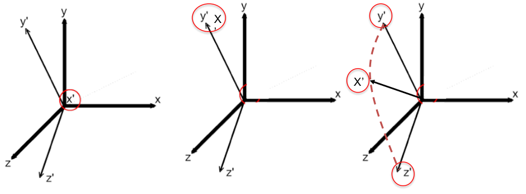
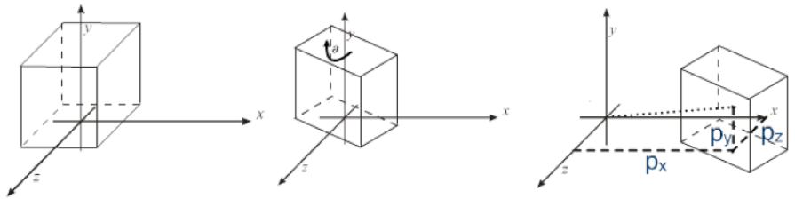
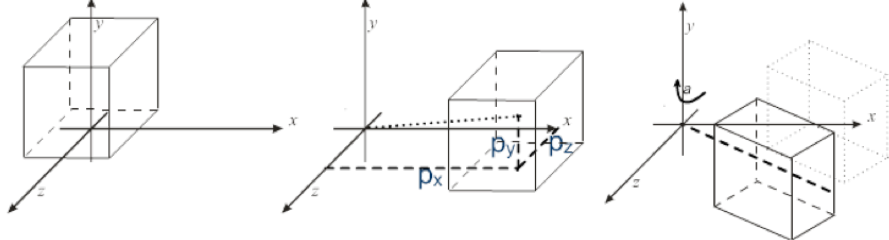

> feature: [Matrix multiplication as composition | Chapter 4, Essence of linear algebra](https://www.youtube.com/watch?v=XkY2DOUCWMU&list=PL0-GT3co4r2y2YErbmuJw2L5tW4Ew2O5B)

$$
\underbrace{\left[\begin{array}{ll}
1 & 1 \\
0 & 1
\end{array}\right]}_{\text {Shear }}(\underbrace{\left[\begin{array}{cc}
0 & -1 \\
1 & 0
\end{array}\right]}_{\text {Rotation }}\left[\begin{array}{l}
x \\
y
\end{array}\right])=\underbrace{\left[\begin{array}{cc}
1 & -1 \\
1 & 0
\end{array}\right]}_{\text {Composition }}\left[\begin{array}{l}
x \\
y
\end{array}\right]
$$
Read from right to left ! Like $f(g(x))$ ... (first apply $g(x))$ (right) and then apply $f()$ )

A nice feature about using matrices is that the inverse transformation can
be obtained by inverting the corresponding matrix

It has been proved that all these matrices can be inverted. 

This is generally the case, except when for some reasons one or
more of the projected axis degenerates to be either of zero length,
or when two axis perfectly overlaps, or when one axis is aligned
with the plane defined by the other two. 

If 2 axis become identical -> matrix useless/broken. 

If the axes become co-planar , they are no longer linear independent. 

The inverse of a general transformation matrix can be obtained by applying numerical inversion techniques but (since the structure) we have simple matrix patterns that we can use to compute them immediately.

For example applying all the transformations (or simply knowing the rules) you can achieve:

$$
T\left(d_x, d_y, d_z\right)=\left|\begin{array}{cccc}
1 & 0 & 0 & d_x \\
0 & 1 & 0 & d_y \\
0 & 0 & 1 & d_z \\
0 & 0 & 0 & 1
\end{array}\right|
$$
inversion:
$$
T\left(d_x, d_y, d_z\right)=\left|\begin{array}{cccc}
1 & 0 & 0 & -d_x \\
0 & 1 & 0 & -d_y \\
0 & 0 & 1 & -d_z \\
0 & 0 & 0 & 1
\end{array}\right|
$$

$$
S\left(s_x, s_y, s_z\right)=\left|\begin{array}{cccc}
\frac{1}{s_x} & 0 & 0 & 0 \\
0 & \frac{1}{s_y} & 0 & 0 \\
0 & 0 & \frac{1}{s_z} & 0 \\
0 & 0 & 0 & 1
\end{array}\right|
$$

rotations:

$$
\begin{aligned}
&R_x(-\alpha)=\left|\begin{array}{cccc}
1 & 0 & 0 & 0 \\
0 & \cos \alpha & \sin \alpha & 0 \\
0 & -\sin \alpha & \cos \alpha & 0 \\
0 & 0 & 0 & 1
\end{array}\right|\\
&R_y(-\alpha)=\left|\begin{array}{cccc}
\cos \alpha & 0 & -\sin \alpha & 0 \\
0 & 1 & 0 & 0 \\
\sin \alpha & 0 & \cos \alpha & 0 \\
0 & 0 & 0 & 1
\end{array}\right|\\
&R_z(-\alpha)=\left|\begin{array}{cccc}
\cos \alpha & \sin \alpha & 0 & 0 \\
-\sin \alpha & \cos \alpha & 0 & 0 \\
0 & 0 & 1 & 0 \\
0 & 0 & 0 & 1
\end{array}\right|
\end{aligned}
$$

## CHECK this

---

# Composition 

During the creation of a scene, an object is subject to several
transformations.
The application of a sequence of transformation is called **composition**.
Usually, an object should be translated and rotated in all directions to be
positioned in the scene.
Moreover, rotations among arbitrary axis and scaling with different centers
can be performed by composing different transformations.
Thanks to the properties of matrix product, composition of transformations
can be be done in a very efficient way.

Advanced transformations can be obtained with composition of transformations. 

To summarize, a rotation of $\alpha$ about an arbitrary axis passing through
point (px, py, pz) and such that the x-axis can be aligned to it by first
rotating an angle $\gamma$ around the z-axis, and then an angle $\beta$ around the y-
axis, can be computed as:

Hell: 

$$
p^{\prime}=T\left(p_x, p_y, p_z\right) \cdot R_y(\beta) \cdot R_z(\gamma) \cdot R_x(\alpha) \cdot R_z(\gamma)^{-1} \cdot R_y(\beta)^{-1} \cdot T\left(p_x, p_y, p_z\right)^{-1} \cdot p
$$

Since the product of matrices and the matrix-vector productive are associative we can factorize all the transforms in a
single matrix we can "create" a final matrix which represents the overall transformation. 

Computing the composed matrix greatly improves the performance of executing multiple transformations.

The transformation matrix is computed once per object.

Then all the nv points are transformed by multiplying all of them
with the same transformation matrix

But it's not commutative .. 

