# Projections 

to watch: https://www.youtube.com/watch?v=U0_ONQQ5ZNM (also good graphics)


Projection is the technique to create a 2D image from a 3D scene. This is done by intersecting projection rays with a surface to create a 2D representation of the 3D object. In this course, we will specifically concentrate on **planar projections**.
Computer graphics uses projections to describe objects in 3D and then displays a 2D representation on the screen.
One important properties of planar projection, is that the
projection of linear segments in the 3D scene remain straight.
Since the projected segments connect the projections of their end
points It is sufficient to connect the projected vertices to recreate a 2D representation of the corresponding 3D Objects. 

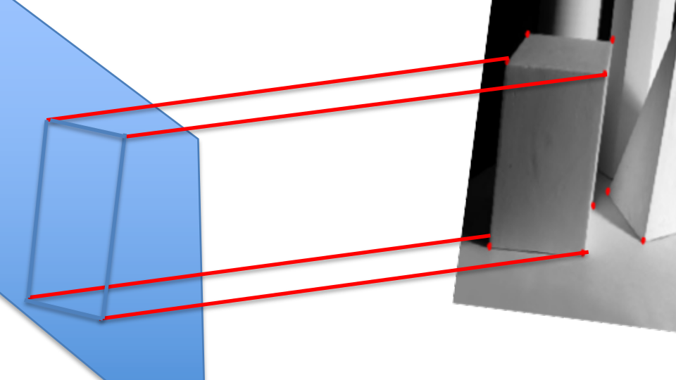


We will consider two types of planar projections:

- **Parallel projections**: all rays are parallel to the same direction. all points that pass through a line parallel to the projection ray are mapped to same pixel. 
- **Perspective projection**s: all the rays pass through a point, called the center of projection. all points that are aligned with both the projected pixel and the center of projection are mapped to the same location.


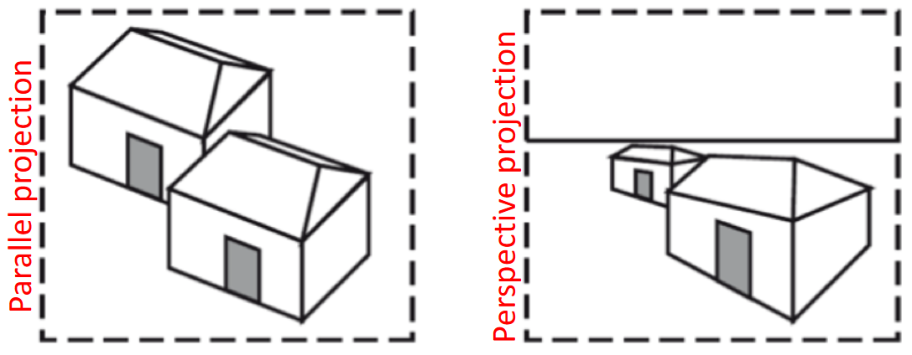{width=50%}


Projections involve converting 3D coordinates between two reference systems: world coordinates to 3D Normalized Screen Coordinates. Despite screens being 2D surfaces, distance from the viewer is necessary for proper surface sorting to avoid unrealistic images. Vulkan 3D Normalized Screen Coordinates have a third component (z value) within `[0,1]`, with smaller z values indicating closer viewer distance. 

## Parallel projections (Orthogonal)

The screen boundaries implicitly limit the portion of 3D world
that can be visualized on a screen for the horizontal and
vertical axes.
There is however the need to limit the range of a scene also
for the depth axis:

- To avoid displaying object behind the observer.
- To avoid showing objects too far away from the
considered spot.
- To allow the z-axis of the normalized screen coordinates
be confined in the 0 to +1 range.

These limits defines two planes: 

- near plane
- far plane 

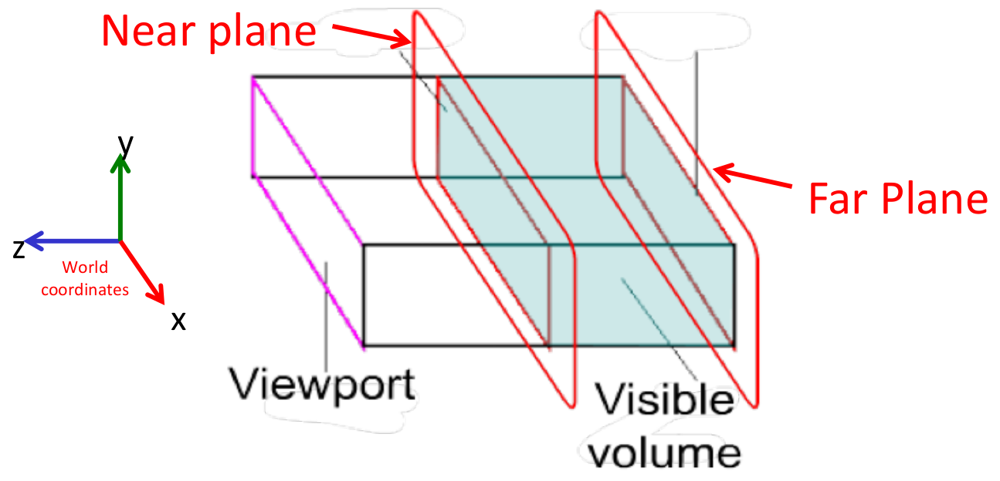{width=50%}


In particular, we define the projection matrix $P_ort$ , as the matrix that multiplied with a world coordinate $p_W$ computes the corresponding normalized screen coordinate $p_N$. 

$p_N = P_{ort} \cdot p_w$  

In order to obtain normalized coordinates, we need to know which
are the coordinates of the borders of the screen in the 3D space.


We call l and r the x coordinates in the 3D space of locations
displayed on the left and right borders of the screen.
Everything on the left of l will be cut out of the screen, and nothing
to the right of r will be visualized.
Similarly we use t and b for the y coordinates of the top and
bottom borders of the screen in the 3D space.
We also call -n and -f the z coordinates of the near and far planes in
the 3D space.

$$
P_{\text {ort }}=M_{\text {ort }} \cdot S_{\text {ort }} \cdot T_{\text {ort }}=\left|\begin{array}{cccc}
\frac{2}{r-l} & 0 & 0 & \frac{r+l}{l-r} \\
0 & \frac{2}{b-t} & 0 & \frac{t+b}{t-b} \\
0 & 0 & \frac{1}{n-f} & \frac{n}{n-f} \\
0 & 0 & 0 & 1
\end{array}\right|
$$


But using aspect ratio 

$$
\begin{gathered}
l=-w \\
r=w \\
t=\frac{w}{a} \\
b=-\frac{w}{a}
\end{gathered} \quad P_{\text {ort }}=\left|\begin{array}{cccc}
\frac{1}{w} & 0 & 0 & 0 \\
0 & \frac{-a}{w} & 0 & 0 \\
0 & 0 & \frac{1}{n-f} & \frac{n}{n-f} \\
0 & 0 & 0 & 1
\end{array}\right|
$$


````cpp
#define GLM_FORCE_DEPTH_ZERO_TO_ONE 
glm::mat4 Port = 
glm::scale(glm::mat4(1.0),glm::vec3(1,-1,1)) * //this to flip y-axis 
glm::ortho(l, r, b, t, n, f);
````


The most important types of orthographic axonometric projections are:
- Isometric
- Dimetric
- Trimetric

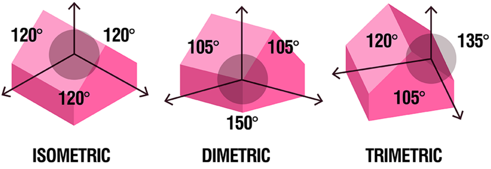{width=50%}


Dimetric

Due to its ease of implementation using only integer arithmetic, It was used a lot in 80's, both for arcade games such as Q*Bert or Zaxxon, and in many home games such as Knight Lore on the ZX Spectrum. Currently, it is still widely used in retro-style games and applications.

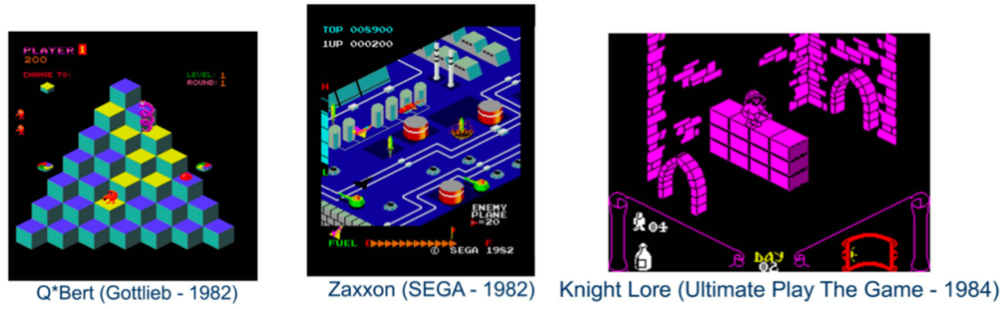{width=50%}


Trimetric
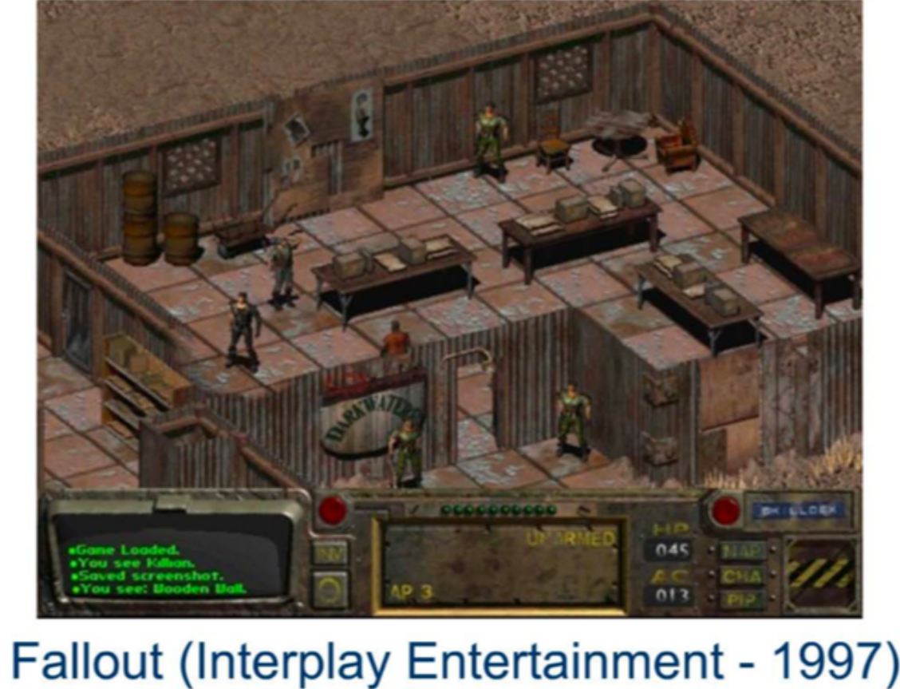{width=50%}


### Oblique projections 

In oblique projections rays are parallel, but oblique with respect to the projection plane. This has the effect that two of the three axes (namely x and y) are parallel to the screen. 


For some reason if we keep the same length on the z-axis it seems "too long". For this reason, the length of the z-axis can be halved. 

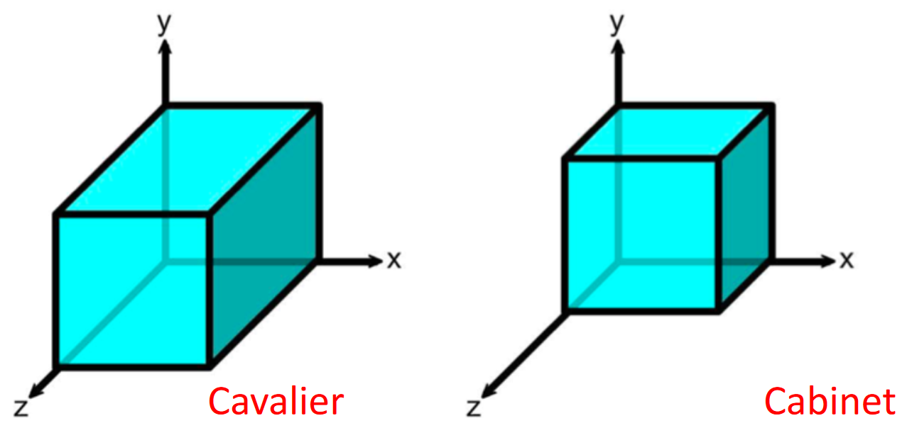{width=50%}

If the length is maintained, the projection is called Cavalier, otherwise it is called Cabinet.


## Perspective Projections

https://www.youtube.com/watch?v=U0_ONQQ5ZNM

Parallel projections do not change the apparent size of an object with the distance from the observer. This type of projection is generally used for technical drawings. Perspective projections represent an object with a different size depending on its distance from the projection plane. This makes it more suitable for immersive visualizations.

A point with coordinates (x,y,z) in the space, is projected on the plane to a point with Normalized Screen Coordinates (xs, y s, zs), where zs is required to sort points according to the distance from the viewer, as for parallel projections

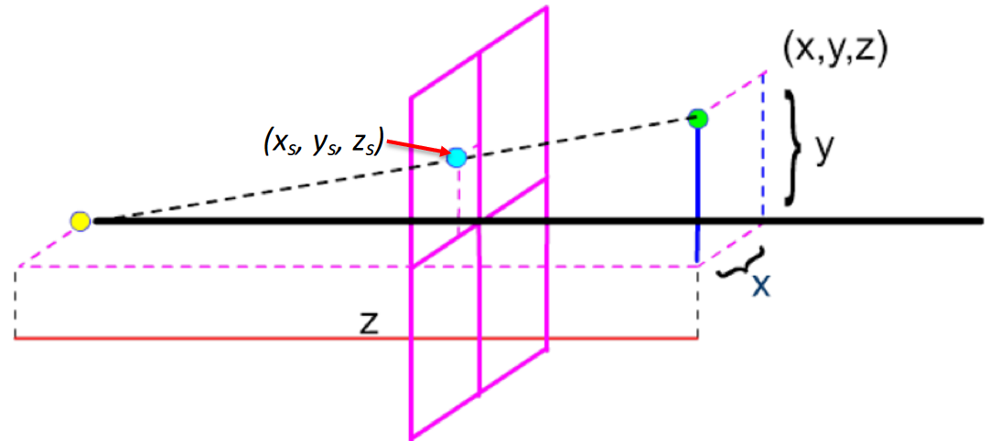{width=50%}


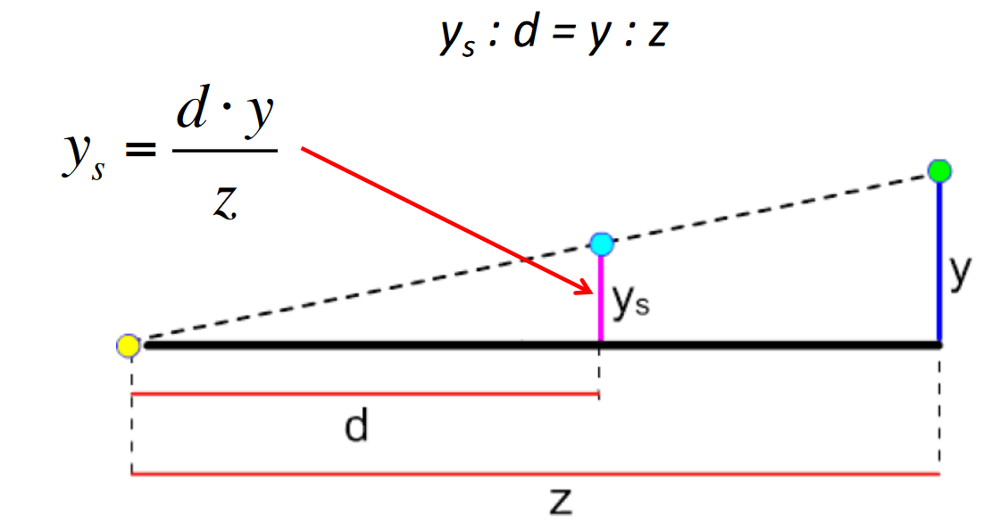


$$x_s= \frac{d \cdot x}{z}$$

$$x_s= \frac{d \cdot y}{z}$$

Parameter d represents the distance of the center of projection from the  
projection plane.  
It can be used to simulate the focal length of the lens of a camera.  
In particular, changing d has the effect of performing a zoom.


Parallel (orthographic) projections can be obtained from perspective as d tends to the infinity.


CHECK MATRICES 

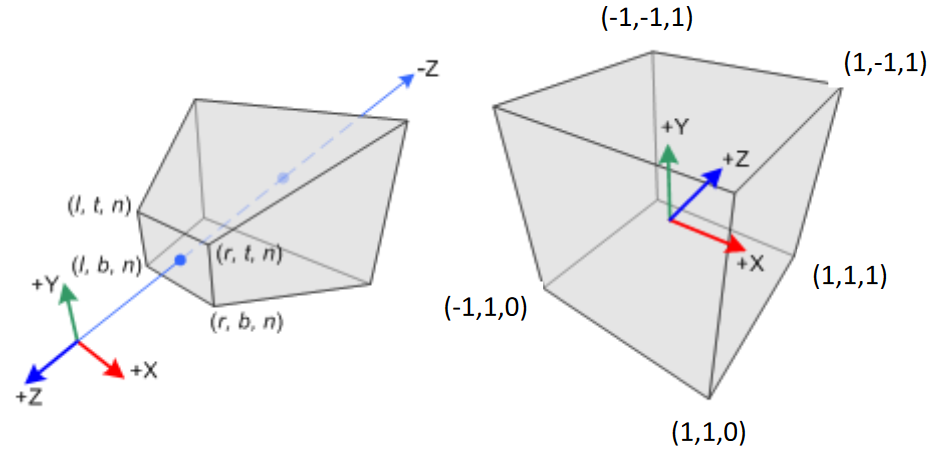{width=50%}


what is behind the near plane by definition will not be visible. 


This is due to the fact that the visible area in this case is not a box,  
but a frustum

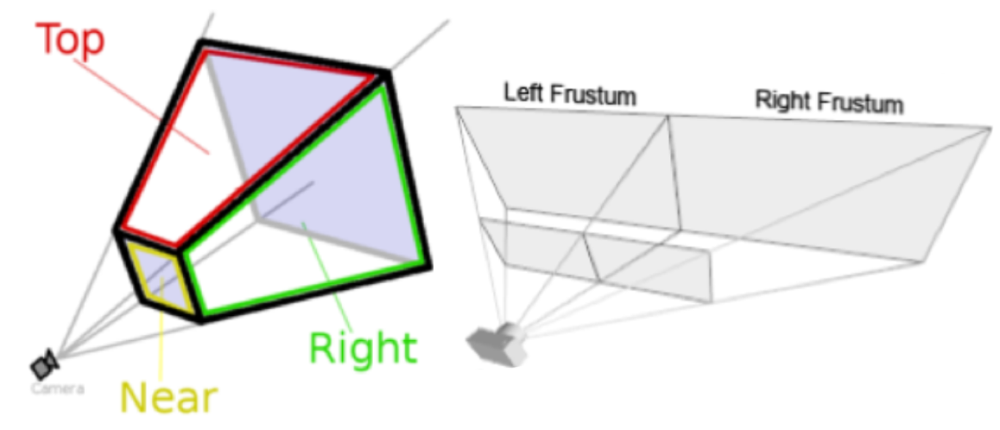


..... all stuff

$$
P_{p e r s p}=M_{p e r s p} \cdot S_{p e r s p} \cdot T_{p e r s p} \cdot U_{p e r s p}=\left|\begin{array}{cccc}
\frac{2 n}{r-l} & 0 & \frac{r+l}{r-l} & 0 \\
0 & \frac{2 n}{b-t} & \frac{t+b}{b-t} & 0 \\
0 & 0 & \frac{f}{n-f} & \frac{n f}{n-f} \\
0 & 0 & -1 & 0
\end{array}\right|
$$
....

in practice:

n practical cases, parameters similar to the one available in a  
camera are used.  
In this case, only the distances $n$ and $f$ of the near and far planes, the  
angle $\theta$ at the top of the frustum (known as "field of view" fov-$y$)  
over the $y$-axis, and the aspect ratio a of the screen are given.

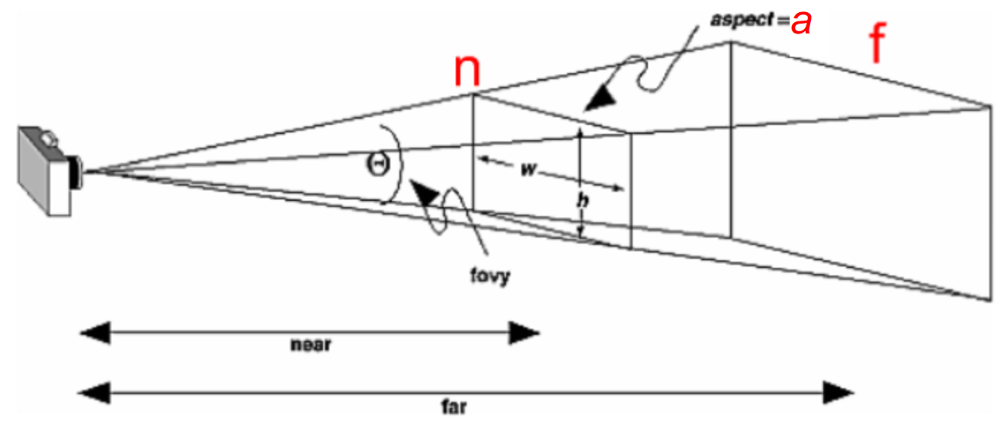{width=50%}


```cpp
glm::mat4 Port = glm::frustum(l, r, b, t, n, f);
```

But remember to multiply -1 always for conventions of glm and vulkan 


