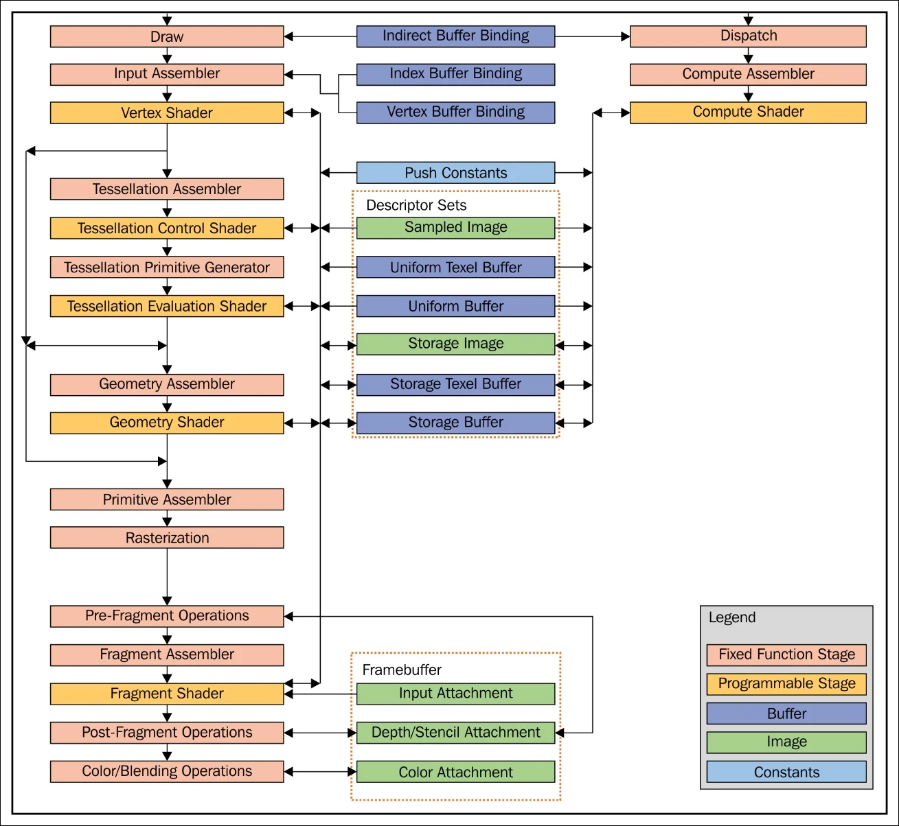
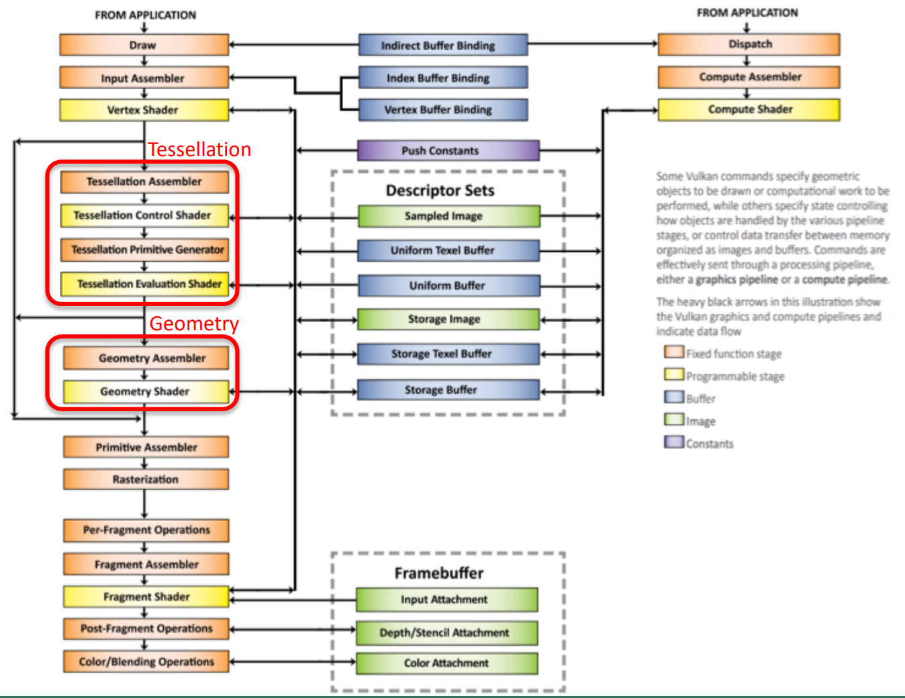
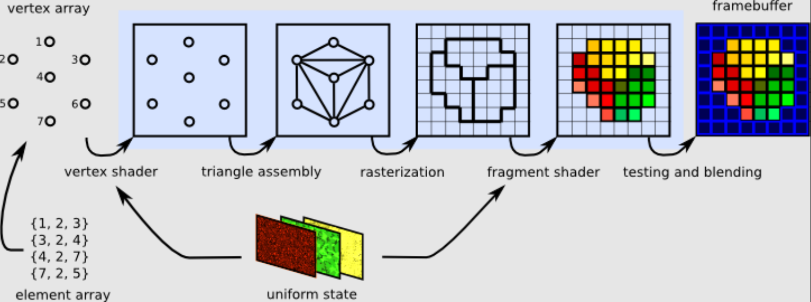
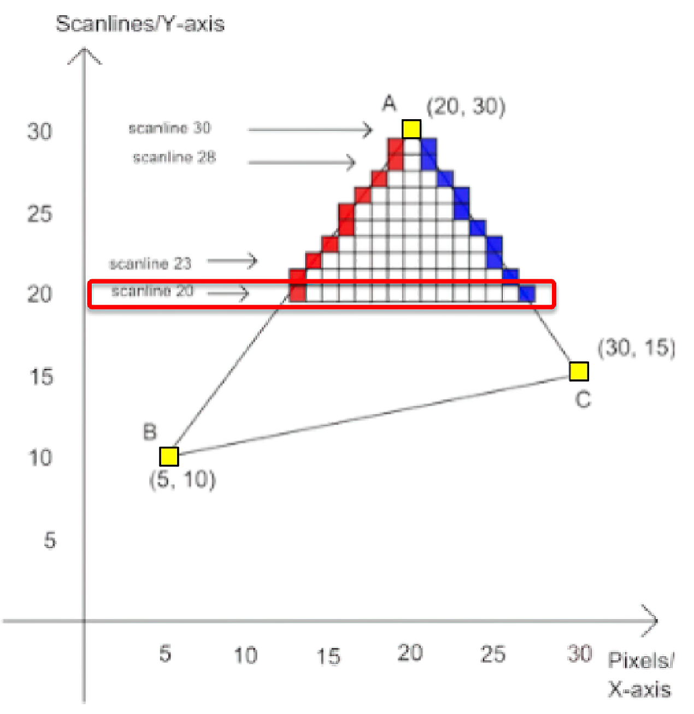
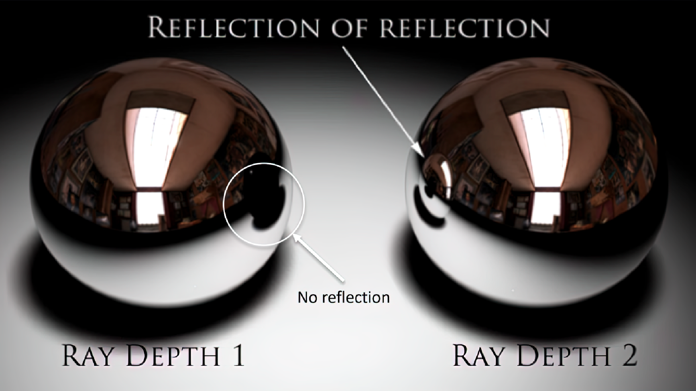
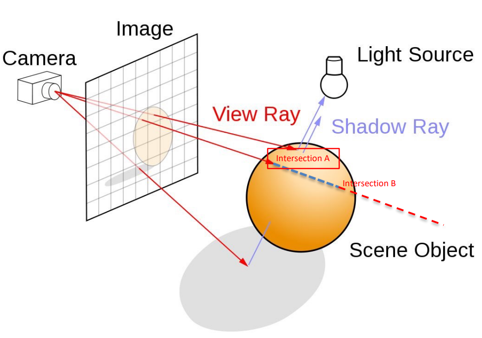
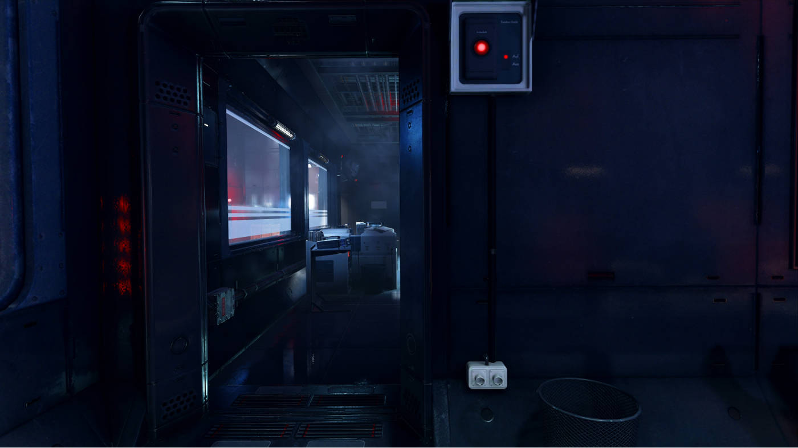
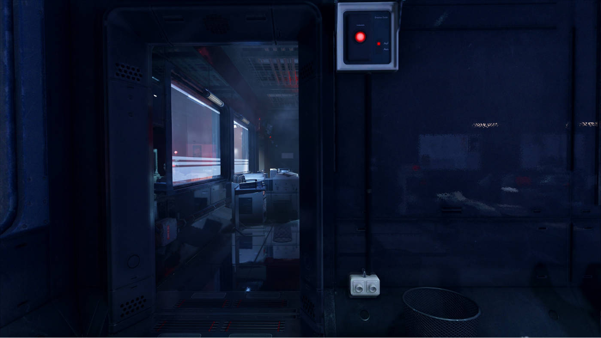

# The graphics pipeline

The graphics pipeline in Vulkan is structured into five types of shaders to define the programmable stages of the pipeline. The tessellation and geometry stages are optional and can be ignored if not present. The most important are 

{width=25%}

- Tessellation is used to increase object resolution.
- Geometry shaders can add or remove primitives.
- Rasterization determines fragments (not pixels) in the frame-buffer.
- An application usually requires several pipelines to compose the final image.

{width=50%}

# Rendering Techniques 

### Scan-line rendering 

{width=50%}

Scanline rendering technique generates fragments per **line**, from left to right in relation to the corresponding triangle. This is why it's commonly known as **scanline** rendering.

- Scan-line rendering simplifies the rendering process by not considering projected shadows or indirect lighting.
- Objects can only reflect light but cannot illuminate other objects or have inter-reflection.
- Objects only reflect lights.
- They may emit some light, but cannot illuminate other objects.
- Inter-reflection between objects is not considered.
- Lights are characterized by having only the emission term in the rendering equation, which can vary in position and direction.
- The vertices of mesh triangles are projected onto the screen to find hardware coordinates.
- Every pixel belonging to a triangle is enumerated and solves the rendering equation for that point.

### Rays 

- Ray casting traces rays from points to light sources, accounting for projected shadows and occlusion by objects.
- Ray tracing adds consideration for mirror reflection and refraction, allowing for more realistic rendering of transparent objects.
- Both algorithms rely on a ray-casting procedure to compute the colors seen from a given point and direction.
- The procedure searches for the closest object to the given point in the given direction and applies the rendering equation to compute the final color.

**recursion** 

For considering the reflection and refraction part of each pixel, the procedure is called recursively with different points and direction rays. The recursion is repeated up to a given number of bounces, called the ray depth. 

In Vulkan there is the Ray Tracing pipeline: it creates images from pixels on screen, and it is not driven by triangles and their corresponding vertices. For each fragment on screen, a ray is cast into the scene, and it is intersected with all the triangles of all the meshes in the 3D environment. The hard part? Been able to find the correct triangle that intersects the ray in the scene. 

Ray tracing in realtime is achievable thanks to specific data structures (things like B-trees) that permits to reduce the complexity of the problem from $o(n^2)$ o $log(n)$ in the number of triangles. 

{width=50%}

- The Acceleration Structure Traversal: the determination of the closest hit. 
- The Intersection shader: it allows to compute custom ray triangle intersection procedure. 
- Closest Hit shader: it's called on the point that is closer to the viewer. Its purpose is computing its color, and for doing this, it can recursively cast other rays. 
- Any Hit shader:  it is used to filter out intersections that should not be considered, for example to handle partially transparent objects. 
- The Miss shader: it is instead called if the ray does not hit any object: generally it is used to draw some sort of background that should appear behind everything else. 

However, ray tracing is not able to simulate **indirect lighting** or consider** glossy reflections**, limiting the level of achievable realism (but still better than scanlines or ray casting). 

Radiosity is an algorithm used to capture indirect lightning, but it considers only materials that have a **constant** BRDF: 
the light emitted by objects will depend only by the point of the point of the objects and **not** also by the direction. 
So it's basically a semplification that also permits to discretize the entire world into patches: 

{width=50%}

The rendering equation becomes a (large) system of linear equations that can be solved with an iterative technique.

The solutions of the equations are then interpolated to produce a view of the scene. 

- Radiosity is a method that it's added over scan-line or raytracing algorithm
- Computes indirect lighting
- Off-line technique, almost never implemented in real-time
- Not supported by Vulkan or other low-level graphics engines due to lack of pipeline

### Montecarlo techniques 

To achieve photorealistic results, we use Montecarlo techniques to approximate the solution of the complex rendering equation. These techniques involve computing the integral of the Rendering Equation by averaging several randomly chosen points and directions. Each advanced rendering engine uses a different approach. However, Montecarlo algorithms produce noisy images, which can only be reduced by increasing the number of rays, thereby increasing the rendering time.

Graphics pipeline 
Raytracing pipeline
Mesh Shader pipeline 
Compute pipeline 

The Mesh Shader pipeline is a generalization of the graphics pipeline where no initial fixed part of the pipeline is considered and mesh generation can be entirely handled by shaders.

Mesh shaders computes indexed triangle lists, returned as a set of vertices and groups of three indices for each triangle. Vertices are computed in normalized screen coordinates, to simplify rasterization.

The number of vertices and triangles that a Mesh shader can generate is limited. For this reason each object is divided in so called Meshlets: small patches of a mesh. The purpose of the optional Task shader is to subdivide a larger mesh into smaller Meshlets, and control the corresponding Mesh shader for generating all the required patches. 

## Compute pipeline

Standard computation (general purpose computation). Particles system for example. 
The Compute pipeline is not for rendering images, but for performing GPGPU computing. In this case the application provides a single shader, the Compute Shader, that performs the desired computations.