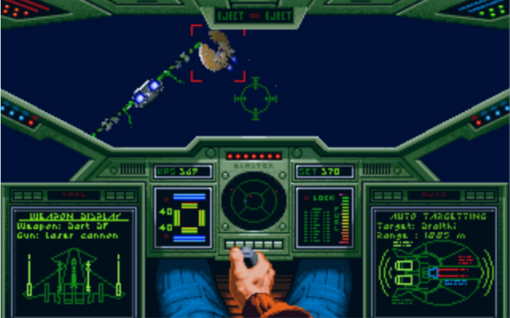
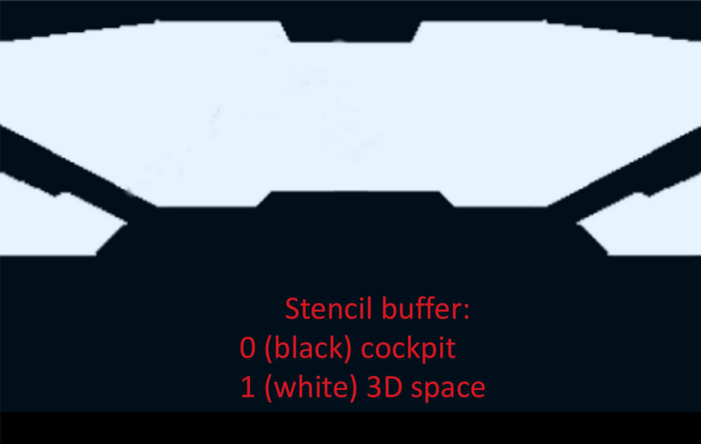
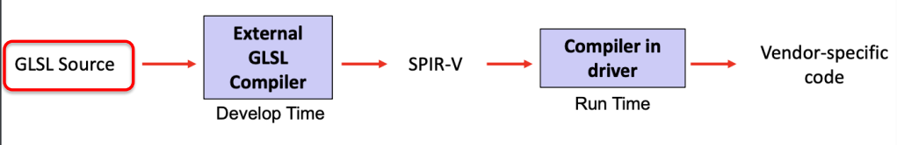

# GLSL 


GLSL Reference:
https://www.khronos.org/opengl/wiki/Data_Type_(GLSL)#Basic_types


GLSL is a C-like language, and it is very similar to C, C++, C#, JAVA, JavaScript, PHP and many other. 
Generally the entry point of the shader is the function `main()` .


Blocks are denoted using `{}` 

Beside type and name, variables can be preceded with a large number of different qualifiers. Most of them are required to interface them with the pipeline. 

GLSL supports a large number of types but mainly we will use the basic ones: 

| name                | function                                |
|:------------------- |:--------------------------------------- |
| void                | no function return value                |
| bool                | boolean                                 |
| int, uint           | signed/unsigned integers                |
| float               | single-precision floating-point scalar  |
| double              | double-precision floating scalar        |
| vec2, vec3, vec4    | floating point vector                   |
| dvec2, dvec3, dvec4 | double precision floating-point vectors |
| bvec2, bvec3, bvec4 | Boolean vectors                         |
| ivec2, ivec3, ivec4 | signed and unsigned integer             |
| uvec2, uvec3, uvec4 | vectors                                 |
| mat2, mat3, mat4    | 2x2,3x3,4x4 float matrix                |
| mat2x3, mat2x4  | 2 column float matrix of 3 or 4 rows (GLSL uses column major encoding (column first) )|                       |

Vector elements can be accessed individually using the `.` syntax and using the standard array notation `[ ]` .  Since vectors can be used to store coordinates, colors or texture, several aliases exist for each component when using `.` notation: 

-   `{x, y, z, w}`  for vectors representing points or normals.
-   `{r, g, b, a}` for vectors representing colors
-   `{s, t, p, q}` for vectors representing texture coordinates

Also we can use more than one letter to refer to more elements:

````glsl 
vec3 l1 = light.xyz;
vec2 l2 = light.rb;
light.zxy = light.xyz;

//the first index is the column first 
vec4 v;
mat4 m;
m[1] = v; // sets the second column 
m[0][0] = 42.0 // sets the upper left element
m[2][3] = 42.0 // sets the 4th element of the third column
````

GLSL naming convention uses the same convention of GLM library. 

SIMD architecture is efficient but has some drawbacks:

- Both if and else branches are executed regardless of the condition.
- In variable length loops, all executions depend on the longest loop being run concurrently.

To optimize performance, it's important to **minimize the use of loops and conditional statements**.

`in` and `out` variables are used to interface with the programmable or configurable part of the pipeline. `gl_Position` is a special variable that holds the position of the vertex in clip space. Since a vertex shader's main output is the position in clip space, it must always set `gl_Position`.

## Fixed functions 

Several important actions occurs in the final fixed sections of the pipeline.

### Primitives clipping

Clipping is the process of truncating and eliminating parts of graphics primitives to make them entirely contained on the screen. This is usually done after projection transform but before normalization, in an area called Clipping Coordinates. Triangles of a mesh can intersect the screen boundaries, resulting in partial display.
Performed at **Primitive Assembler** pipeline stage. 

### Back-face culling

Back-face culling excludes backside faces by checking their orientation through a simple cross-product. The check can be performed before or after projection. Vulkan implements back-face culling in normalized screen coordinates. Since only the sign of the $z$ component is required, the test can be performed in a very efficient way.
It's performed at **Rasterization** pipeline stage. 

### Depth testing (z-buffer)]

Performed at **Post-Fragment Operations** pipeline stage. 
To handle overlapping objects in a complex scene, we need to ensure that polygons closer to the observer always cover the ones behind them. This can be achieved through the Painter Algorithm, which is used for non-transparent objects. In some cases the Painter Algorithm can't find a correct order.
The $z$-buffer technique is applied at the pixel level: a memory area called the depth-buffer stores additional information for every pixel on the screen. Both color and distance from the observer are computed for each pixel, but the pixel color is written only if its distance is less than the one already (if there is) in the $z$-buffer. Consequently, the value in the $z$-buffer is updated with the new distance.
Obviously this problem applied only for scanline .. raytracing won't have this problem.
Numerical precision is a major challenge when using $z$-buffer. Due to floating points, objects far from the camera may suffer from a lack of accuracy causing artifacts. Sufficient precise values are needed to store $z_s$ for further distances from the projection plane. This phenomena is called $z$-fightning. 


### Stencil 





A typical application of stencil buffer is to allow the rendering area to be of arbitrary shapes: for example, reserving the space to draw the cabin of a ship, or the HUD (Head-Up Display).
Stencil buffer is a technique similar to z-buffer, usually adopted to prevent an application from drawing in some region of the screen.

Like z-buffering, it is implemented by storing additional information for every pixel on the screen in a special memory area called the stencil buffer. 


Performed at **Color/Blending Operations** pipeline stage. 


## How to compile using GLSLC 

Many correct Vulkan installations makes `glslc` directly available in the main command path:
````bat 
C:\VulkanSDK\1.3.239.0\Bin\glslc.exe
````

After it's found the executable, it's super simple compile a shader:  

````
C:\VulkanSDK\1.3.239.0\Bin\glslc.exe PhongShader.vert -o PhongVert.spv
````


| Extension  | for what? |
| :--- | :--- |
| .vert | for a vertex shader |
| .tesc | for a tessellation control shader |
| .tese | for a tessellation evaluation shader |
| .geom | for a geometry shader |
| .frag | for a fragment shader |
| .comp | for a compute shader |
| .mesh | for a mesh shader |
| .task | for a task shader |
| .rgen | for a ray generation shader |
| .rint | for a ray intersection shader |
| .rahit | for a ray any hit shader |
| .rchit | for a ray closest hit shader |
| .rmiss | for a ray miss shader |
| .rcall | for a ray callable shader |

Compiled shaders into SPIR-V files have instead the .spv extension.

Shaders are written in high level languages, such as: 

- GLSL (openGL Shading Language) 
- HLSL (High Level Shading Language – Microsoft Direct X)



At development time, the shaders are compiled from their original language to SPIR-V.

SPIR stands for Standard Portable Intermediate Representation, and it is a binary format for specifying instructions that a GPU can run in a device independent way. Every Vulkan driver converts the SPIR-V code into the binary instructions of their corresponding GPU.


