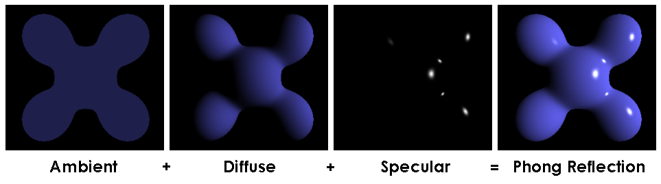

The BRDF used for scan line rendering does not fulfill the energy conservation property in most of the cases.

Generally, the BRDF is expressed as the sum of two terms:

- The diffuse reflection: main color of the object 
- The specular reflection: shiny objects tend to reflect the incoming light in a particular angle, called the specular direction

$$f_{r}\left(x, \overrightarrow{l x}, \omega_{r}\right)=f_{d i f f u s e}\left(x, \overrightarrow{l x}, \omega_{r}\right)+f_{s p e c u l a r}\left(x, \overrightarrow{l x}, \omega_{r}\right)$$

In scan-line rendering, values of the BRDF for each color frequency, and for both the diffuse and specular components, are in the range $[0,1]$. Since the influence of lights values can lead to values larger than $1$, at the end of the computation $\operatorname{clamp}$ function is applied.
Newer rendering techniques permits **HDR** perform more advanced computation, allowing values outside the $[0,1]$ range: the final color is then mapped into the range at the end of the process, using suitable **non-linear functions**.

In this course we will present the following diffuse reflection models:

-   Lambert
-   Oren-Nayar
-   Toon

And the following specular reflection models:

-   Phong specular reflection
-   Blinn specular reflection
-   Ward
-   Cook-Torrance specular reflection
-   Toon

## Lambert

The reflection is calculated by taking the dot product of the surface's unit normal vector, $\mathbf{N}$, and a normalized light-direction vector, $\mathbf{L}$, pointing from the surface to the light source. This number is then multiplied by the color of the surface and the intensity of the light hitting the surface. 

When a face is on the opposite direction with respect to a light source, it cannot be illuminated despite of the angle. To make this happen for back faces, clamping the value at zero simply avoids illuminating the faces. In Lambert diffuse model, the viewing angle has no effect, and the final image depends only on the position of the objects and on the direction the lights.
The rendering equations becomes :

$$\begin{gathered}
L\left(x, \omega_{r}\right)=\boldsymbol{l} * \boldsymbol{m}_{D} \cdot \operatorname{clamp}\left(\boldsymbol{d} \cdot \boldsymbol{n}_{x}\right) \\
L\left(x, \omega_{r}\right)=\boldsymbol{l} * \boldsymbol{m}_{D} \cdot \operatorname{clamp}\left(\frac{\boldsymbol{p}-\boldsymbol{x}}{|\boldsymbol{p}-\boldsymbol{x}|} \cdot \boldsymbol{n}_{x}\right)
\end{gathered}$$

with $m_D$ is a vector that expresses the capability of a material to perform the Lambert reflection for each of the three primary color frequencies RGB $m_{D}=\left(m_{R}, m_{G}, m_{B}\right)$ . 

The vector that points in the direction from which the object is seen is $w_r=\frac{c-x}{|c-x|}$ where $c$ is the center of the project and $x$ the point on the surface (this for perspective projection only).    
Note that the pixel color does **not depend** on $w_r$ : in other words when just Lambert diffuse reflection is used, the viewing angle has no effect, and the final image depends only on the position of the objects and on the direction the lights.

## Phong 

The Phong model calculates the intensity of the specular reflection using the cosine of  the angular distance between the "exact" specular direction and the observer direction. When the specular direction is aligned with the observer, the value is maximum, and when the angle is greater, it is zero: 

{width=50%}

To create more contained highlight regions, the term $cos \alpha$ is raised at a power.

{width=50%}

The formula is: 

$$\boldsymbol{r}_{l, x}=2\left(\overrightarrow{x l} \cdot \boldsymbol{n}_x\right) \boldsymbol{n}_x-\overrightarrow{x l}$$
and then 

$$f_{\text {specular }}\left(x, \overrightarrow{l x}, \omega_r\right)=\boldsymbol{m}_S \cdot \operatorname{clamp}\left(\omega_r \cdot \boldsymbol{r}_{l, x}\right)^\gamma$$

where $\boldsymbol{m}_S$ is the collection of the specular color and the specular power. 

## Blinn reflection model  

The Blinn reflection model is an alternative to the Phong shading model that uses the half vector $h$ : a vector that is in the middle between the viewer direction $\omega_r$ and the light $d$. 

$$\boldsymbol{h}_{l, x}=\frac{\overrightarrow{l x}+\omega_r}{\left|\overrightarrow{l x}+\omega_r\right|}=\operatorname{normalize}\left(\overrightarrow{l x}+\omega_r\right)$$

The angle $\alpha$ between the observer and the reflected ray, is approximated by the angle $\alpha^{\prime}$ between the normal vector $n_x$ and the half vector $h$.

## Toon shading

Toon shading simplifies color output by using discrete values based on thresholds, producing a cartoon-like effect. It can be applied to both diffuse and specular BRDF components. 
Generally in modern hardware the thresholds are implemented not with program branching but with a color that is a function of the cosine of the angles between the considered rays. 

## Oren-Nayar diffuse model

Oren-Nayar diffuse reflection model is used for modeling materials like clay, dirt, and some types of cloths.
It's pretty complex: 

We have to compute the two angles: 
$$\theta_{\boldsymbol{i}}=\cos ^{-1}\left(\overrightarrow{l x} \cdot \boldsymbol{n}_x\right)$$
$$\theta_{\boldsymbol{r}}=\cos ^{-1}\left(\omega_r \cdot \boldsymbol{n}_x\right)$$
and then compute both maximum and minimum of them: 
$$\alpha=\max \left(\theta_{\boldsymbol{i}}, \theta_{\boldsymbol{r}}\right)$$$$\beta=\min \left(\theta_{\boldsymbol{i}}, \theta_{\boldsymbol{r}}\right)$$
then it's necessary to compute two coefficients for the roughness:

$$A=1-0.5 \frac{\sigma^2}{\sigma^2+0.33}$$
$$B=0.45 \frac{\sigma^2}{\sigma^2+0.09}$$
later the two vectos:

$$\boldsymbol{v}_{\boldsymbol{i}}=\operatorname{normalize}\left(\overrightarrow{l x}-\left(\overrightarrow{l x} \cdot \boldsymbol{n}_x\right) \boldsymbol{n}_x\right)$$
$$\boldsymbol{v}_{\boldsymbol{r}}=\operatorname{normalize}\left(\omega_r-\left(\omega_r \cdot \boldsymbol{n}_x\right) \boldsymbol{n}_x\right)$$

the angle between the two are just the dot product: 

$$G=\max \left(0, \boldsymbol{v}_{\boldsymbol{i}} \cdot \boldsymbol{v}_{\boldsymbol{r}}\right)$$ 
and at the end after computing $L$:
$$L=m_D \cdot \operatorname{clamp}\left(\overrightarrow{l x} \cdot \boldsymbol{n}_x\right)$$ there is this final formula:

$$f_{\text {diffuse }}\left(x, \overrightarrow{l x}, \omega_r\right)=L(A+B G \sin \alpha \tan \beta)$$

## The Ward anisotropic specular model 

The Ward specular model is derived from physically inspired principles and it supports anisotropic reflections. To support anisotropy, an orientation of the grooves ("scanalatura") on the surface must be specified: this is done assigning two extra vectors: tangent $t$ and bitangent $b$.

{width=50%}

$$f_{\text {specular }}\left(x, \overrightarrow{l x}, \omega_r\right)=\boldsymbol{m}_S \frac{e^{-\frac{\left(\frac{\boldsymbol{h} \cdot \boldsymbol{t}_x}{\alpha_t}\right)^2+\left(\frac{\left(\boldsymbol{h} \cdot \boldsymbol{b}_x\right.}{\alpha_b}\right)^2}{\left(\boldsymbol{h} \cdot \boldsymbol{n}_x\right)^2}}}{4 \pi \alpha_t \alpha_b \cdot \sqrt{\frac{\omega_r \cdot \boldsymbol{n}_x}{\overrightarrow{\overrightarrow{l x} \cdot \boldsymbol{n}_x}}}}$$

## The Cook-Torrance reflection model 

Current game engines usually don't adopt any of these models just presented. Today we have more physically accurated models which are based on the Cook-Torrance one. 
To achieve a physically accurate behavior, diffuse and specular channels are linearly interpolated, according to a coefficient $k$ :

$$
\begin{array}{c}
f_r\left(x, \overrightarrow{l x}, \omega_r\right)=k f_{\text {diffuse }}\left(x, \overrightarrow{l x}, \omega_r\right)+(1-k) f_{\text {specular }}\left(x, \overrightarrow{l x}, \omega_r\right) \\
f_{\text {diffuse }}\left(x, \overrightarrow{l x}, \omega_r\right)=\boldsymbol{m}_D \cdot \operatorname{clamp}\left(\overrightarrow{l x} \cdot \boldsymbol{n}_x\right)
\end{array}
$$

The specular term is : 

- $m_s$ is the specular color
- $F$ is the Fresnel term
- $G$ is the Geometric term
- $D$ is the Distribution term

$$
f_{\text {specular }}\left(x, \overrightarrow{l x}, \omega_r\right)=\boldsymbol{m}_S \frac{D \cdot F \cdot G}{4 \cdot \operatorname{clamp}\left(\omega_r \cdot \boldsymbol{n}_x\right)}
$$

The Distribution term accounts for the roughness of the surface. The blinn version of $D$ is: 

$$D=\frac{\left(\boldsymbol{h}_{l, x} \cdot \boldsymbol{n}_x\right)^{\frac{2}{\rho^2}-2}}{\pi \cdot \rho^2}$$

where $\rho$ is a roughness parameter. But there are many other versions, like the Beckmann one and the GGX. 
The fresnel version defines how the light response changes with the angle of incidence with respect to the viewer. 
The model depends on two colors $m_D$ and $m_S$ and three parameters, $F_0$ , $m$ and $k$. Using the Beckmann and microfacet models, we have: 

$$\boldsymbol{h}_{l, x}=\operatorname{normalize}\left(\overrightarrow{l x}+\omega_r\right)$$
$$G=\min \left(1, \frac{2\left(\boldsymbol{h}_{l, x} \cdot \boldsymbol{n}_x\right)\left(\omega_r \cdot \boldsymbol{n}_x\right)}{\left(\omega_r \cdot \boldsymbol{h}_{l, x}\right)}, \frac{2\left(\boldsymbol{h}_{l, x} \cdot \boldsymbol{n}_x\right)\left(\overrightarrow{l x} \cdot \boldsymbol{n}_x\right)}{\left(\omega_r \cdot \boldsymbol{h}_{l, x}\right)}\right)$$

$$D=\frac{e^{-\frac{1-\left(\boldsymbol{h}_{l, x} \cdot \boldsymbol{n}_x\right)^2}{\left(\boldsymbol{h}_{l, x} \cdot \boldsymbol{n}_x\right)^2 \rho^2}}}{\pi \cdot \rho^2\left(\boldsymbol{h}_{l, x} \cdot \boldsymbol{n}_x\right)^4}$$ 

$$F=F_0+\left(1-F_0\right)\left(1-\operatorname{clamp}\left(\omega_r \cdot \boldsymbol{h}_{l, x}\right)\right)^5$$

$$f_{\text {specular }}\left(x, \overrightarrow{l x}, \omega_r\right)=\boldsymbol{m}_S \frac{D \cdot F \cdot G}{4 \cdot \operatorname{clamp}\left(\omega_r \cdot \boldsymbol{n}_x\right)}$$ 
$$f_{\text {diffuse }}\left(x, \overrightarrow{l x}, \omega_r\right)=m_D \cdot \operatorname{clamp}\left(\overrightarrow{l x} \cdot \boldsymbol{n}_x\right)$$

$$f_r\left(x, \overrightarrow{l x}, \omega_r\right)=k f_{\text {diffuse }}\left(x, \overrightarrow{l x}, \omega_r\right)+(1-k) f_{\text {specular }}\left(x, \overrightarrow{l x}, \omega_r\right)$$ 
