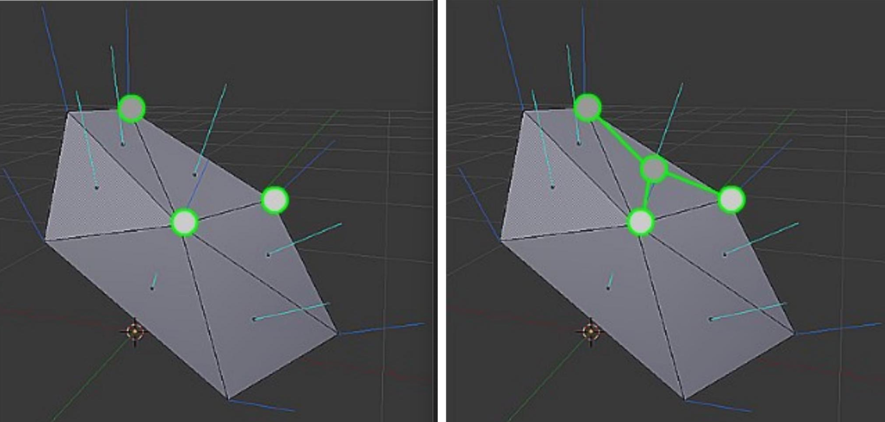
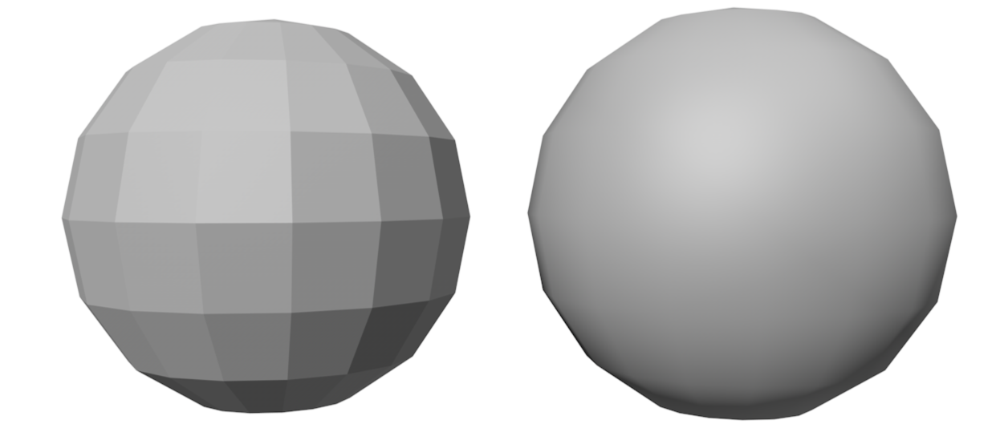
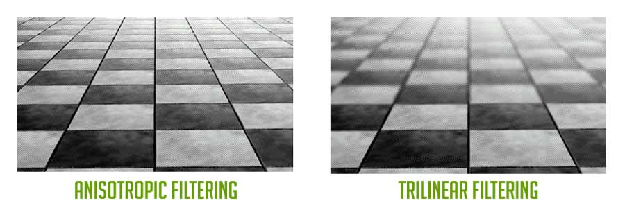
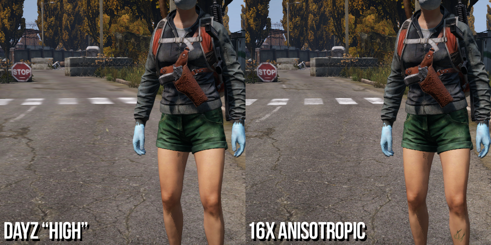

## Smooth shading 

The two most common smooth shading techniques are: 

- **Gouraud shading** (per-vertex)
- **Phong shading** (per-pixel)


The two methods however tends to give the same result when considering geometries composed by many vertices, since in this case, the area of each triangle is just a few pixel wide.


To improve rendering of curved surfaces, the vertex encoding is extended to include 6 values: position $(x, y, z)$ and direction of the normal vector $(n_x, n_y, n_z)$.
The normal vector direction is used in the rendering equation to compute the color of a surface.
Interpolation techniques are used to compute the colors of the internal pixels of the triangles.



If all the faces that share the same vertex have a different normal vector direction, the edges appear to be sharp. This is the case for example of the cube.


### Gouraud shading

A vertex is encoded with 6 values, defining position and direction of the surface normal $\boldsymbol{v}=\left(x, y, z, n_x, n_y, n_z\right)$. Gouraud shading computes the colors of the vertices, then interpolates them for inner triangle pixels.
The Gouraud technique may produce artifacts on the image, and cannot capture specific lighting conditions: this happens because interpolation might miss some of the details that appear between the vertices. 


### Phong shading 

{width=50%}

- Computes color of each internal pixel separately
- Per-pixel shading algorithm
- Vertex normal vectors are interpolated to approximate surface normal in internal points of triangle

Interpolation is performed by considering the x, y, z components of the normal vector separately.

Using normals it's possible to encode both sharp and smooth edges.  triangles, with the same position but different normal vector direction, can be used encode sharp surfaces.

In a smooth solid such as a sphere, each vertex in a position has the same normal vector direction in all the triangles to which it belongs. This normal vector direction corresponds to the one of the sphere it is approximating.

If all the faces that share the same vertex have a different normal vector direction, the edges appear to be sharp. This is the case for example of the cube.


TO FIX: 
It's possible to transform the normal but the matrix is different 


## Texture

Appearance of 3D objects should be defined in great detail for realism.
Assigning different materials to small triangles is impractical for memory reasons.
Common approach uses tables (textures) to assign values to shader parameters.
Tables contain diffuse color and other surface properties.
There are different types of textures: 1D, 2D, 3D, and cube map.

- 1D Texture
- 2D Texture
- 3D Texture
- Cube map: often used for mirror reflection and transparency

2D textures are mapped onto 3D objects using a mapping relation where: 

- **UV coordinates** are used to address points on 2D textures.
- UV coordinates vary between 0 and 1 along horizontal and vertical axes and are assigned to vertices and interpolated for internal points.
- UV mapping does not have to be a bijection, allowing for shared parts of textures.
- Obviously vertices can have different UV coordinates even with the same position in space (this is necessary to "wrap" the object with the texture).

In some cases, the $u$ or $v$ values can fall outside the $[0,1]$ range.

Several behaviors are possible, and the four most popular are:

- Clamp: Clamp extends the colors of the border to the texels that are outside the $[0,1]$ range.
- Repeat: considers only the fractional part of the UV coordinates, and discards their integer part.
- Mirror: repeats the pattern of the texture, but it flips at every repetition.
- Constant: replaces the samples of the texture that fall outside the $[0,1]$ range with a default color $c_{d}$.

This techniques are fundamental to make variance in some 3d materials. 


## Behind the scenes 

- Perspective correct interpolation is a technique used for interpolating texture coordinates and other parameters of vertices.
- It is necessary to perform perspective correct interpolation when using perspective projection, as conventional interpolation can result in wobbling effects.
- Everything here is managed by Vulkan and the GPU, which efficiently applies this to all parameters. 
- The formula in practice is a little bit tricky but it's not necessary to know.


## Texture filtering

Problem: The shape of a pixel on the screen may correspond to a complex polygon composed of multiple texels on the texture. The a texel can be larger than the corresponding pixel on screen (challenging to handle than the first.

Solution: filtering.

For the first problem, two magnification filters are usually defined:

- Nearest pixel: Transform UV coordinates based on texture size. Return texel $p[i][j]$ using only the integer part of scaled coordinates.
- (bi)linear interpolation: it involves interpolating the color of a pixel from its nearest neighbors, resulting in smooth results. This method requires 4 texture accesses and 3 interpolations.

The most common minification filters are (second problem):

- **Nearest pixel**: Nearest pixel and bilinear interpolation perform exactly in the same way as for the magnification: however they both give very poor results if the reduction is large.
- **(bi)linear interpolation**: This is due to the fact that minification should average the texels that fall inside a pixel, instead of simply guessing an intermediate value.
- **Mip-mapping**: The easiest solution for texture mapping is Mip-mapping, which pre-computes scaled versions of the texture (called levels) with halved size. Each pixel in an inner level corresponds to the integration of a set of pixels in the original image. The algorithm selects the closest image in the mip-map based on the ratio between the texture and the pixels. Mip-maps require 33% extra space and can be generated on the fly or created off-line.
- **(Tri)linear interpolation**: When images are angled with respect to the viewer, there may be a change in level within their mapping, which can result in visible artifacts. To address this issue, a smooth transition among the Mip-map levels is created.
- **Rip-mapping**: The Mip-map approach results in blurred images when surfaces are angled with respect to the viewer because it considers only square regions of the texture. This is because pixels on the screen correspond to rectangles on the texture. In contrast, a Rip-map (Rip = Rectim in Parvo) can effectively handle rectangular scaling of the original texture. While a Rip-map can provide sharp results in angled views, it requires 4x the memory of a standard texture and can be pre-computed or generated on the fly. 
- **Anisotropic**: Rip-mapping is not suitable for surfaces angled with respect to the screen border. In these cases, the pixel on the screen corresponds to a trapezoid shape on the texture. To address this, the Anisotropic Unconstrained Filter can be used. This algorithm approximates the area of texels corresponding to a pixel on the screen. It utilizes Mip-maps and samples one of its levels following the pixel's direction over the texels. The algorithm determines the position of the four borders of the pixel on the texture and selects the most appropriate Mip-map level based on the smallest side of the trapezoid. It then samples this selected level on a line in the pixel's direction. The number of samples is generally limited to a maximum value. 



In older engines such as OpenGL, generation of Mip-Maps was left to the Driver, with the opportunity for the developer to pass the Mip-Map layer directly. In Vulkan, everything must be done by the user and the Vulkan tutorial suggests a procedure for generating the Mip-Maps.
Rip-mapping is rarely implemented due to its large memory requirements and inability to handle angled planes effectively.
Anisotropic is very effective but has a significant overhead that can slow down rendering. Vulkan allows enabling Anisotropic filtering if supported by the graphics adapter.



## Textures in Shaders

Textures are passed to shaders as particular uniform variables of "Combined Texture Sample" type.


A lot of different samplers exists. The most important ones are:

- sampler1D
- sampler2D
- sampler3D
- samplerCube

The first parameter determines the images, and the second defines where to read the texel (with a format dependent on the sampler type). The function returns a vec4 color, where the last component is the alpha channel (transparency). Each graphics adapter has its own internal format for images, including resolution per color component, texture size restrictions, and data organization in memory. Texture sampling involves interpolations and floating point operations, and Texture Units on the GPU can assist with this process. The source image in memory often does not match the GPU's internal format, so the input texture data must be converted to a format that the GPU and its Texture Units can handle efficiently. In OpenGL and other graphic subsystems, this conversion is done automatically by the drivers without requiring any special developer support. However, Vulkan requires programmers to explicitly implement this process. Unfortunately, Vulkan developers have chosen a terminology that is arguable and confusing.

- Organization of texels in memory and their color specification formats are called Layout. The bad thing is that the term "Layout" is used several times in the specification, with completely different meanings.
- The verb "to Transition" has been used to define the process of converting a texture format from one Layout to another. Although grammatically correct, it was not the best choice for non-native speaker, who associate the word "transition" more naturally to a name rather than a verb.

The following data needs to be stored for each texture:

```
uint32_t mipLevels;
VkImage texture Image;
VkDeviceMemory textureImageMemory;
VkImageView textureImageView;
VkSampIer textureSampIer;
```

The first step in defining a texture is loading the image into CPU-accessible memory using libraries like `stb_image`. The `stbi_load()` command returns an array of RGBA pixels and size information. Size measurements determine memory requirements and Mip-Map levels. Staging buffers are created using `VK_BUFFER_USAGE_TRANSFER_SRC_BIT`. Once the image is in the staging buffer, the source memory can be released. Finally, the texture is moved to its specific memory area and the format is converted for the GPU using `createImage()`.

## Texture Image View

Images needs to be accessed using an ImageView data structure. We can exploit the createImageView () procedure proposed in the Vulkan Tutorial, which will be better detailed in a future lesson.

## Sampler creation
