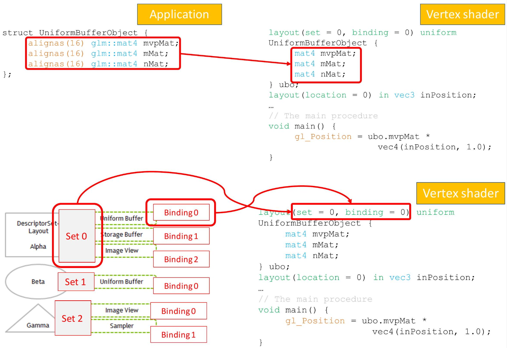

# Datasets and Uniforms 

how to interface cpp <-> shaders : datasets and uniforms 
how to create the pipeline <-> data structure used by Vulkan to draw  stuff on screens.

starter.hpp comes from the vulkan tutorial

## Uniform buffers

As we have seen when introducing GLSL, application can send scene and mesh dependent data using Uniform Blocks global variables.

  

## Shader-application communication


Communication between the Shaders and the application occurs using Uniform Variables Blocks.

  


 

The same technique is also used to pass textures to Shaders.
Textures are passed to shaders as particular uniform variables of "Combined Texture Sample" type.


#### High level view of rendering cycle

```c
// example for typical loops in rendering
for each view {
	bind view resources // camera, environment...
	for each shader {
		bind shader pipeline
		bind shader resources	// shader control values
		for each material {
			bind material resources // mat parameters and textures
			for each object {
				bind object resources // object transforms
				draw object
			}
		}
	}
}
```


The organization of global variables chosen by Vulkan is designed to facilitate the rendering cycle of an application. Parameters used by shaders are often scene dependent, such as the camera position, ambient light definition, and specifications of different light types. Each shader requires its own pipeline and specific parameters, including algorithm selection and special debugging views. Materials may also have their own settings like specular power, roughness, colors, and textures. These parameters can be shared among objects to optimize rendering, with meshes of identical material properties being grouped together and drawn consecutively. Additionally, each mesh may have its own properties like world transform matrices and UV animations that shaders will utilize to draw their triangles.

Vulkan groups uniform variables into Sets. Each one represents the "levels" of the frequency at which values are updated. 

Each set is characterized by an ID (starting from 0) and sets with smaller ID are assumed to change less often. 

Each set can contain a lot of resources:

- Several uniform blocks with different purposes (i.e. light definitions, environment properties.)
- Textures
- Other data


  

DescriptorSetLayouts define what type of resources are bound within the group

Resources inside a set must be identified with a secondary index, again starting from zero, called the Binding.
To avoid performance pitfalls of traditional individual bindings Vulkan organizes bindings in groups, which are called **DescriptorSets**. Each group can itself provide multiple bindings and there can be multiple such groups in parallel using a different set number.


  
Binding it's an information passed by cpu to the shaders. 
Several types of resources can be accessed as global Uniform Variables:  

- An uniform block of variables
- A texture sampler
- An image
- A combined image + sampler
- A render pass attachment (we will return on this in a future lesson)

## Uniforms: Descriptor Sets, Descriptor Layouts and Pipeline Layout

Descriptor Set Layouts -> the application will pass specific types of elements (like a contract / like a class in some way)  
 
In this context, descriptors are characterized by two data structures:

- **Descriptor Set Layouts**: Descriptor Set Layouts define the characteristics of uniform variables, such as their type (such as uniform or texture image), binding ID, and the shader stage in which they will be used (for example, Vertex or Fragment shader).PipelineLayout defines which sets may be used by a Pipeline and at which set number. DescriptorSetLayouts define what type of resources are bound within the group. PipelineLayout defines which sets may be use by a Pipeline and at which set number. Why this complexity? The goal of Vulkan is to recycle everything that can be recycle. Pipeline is a collection of shaders basically. 
- **Descriptor Sets**: In OOP terms, Descriptor Sets are the Instances of the uniform data: they actually define the values that will be passed to the uniforms. For example, different meshes with the same material, but requiring a different world matrix, will access a different Descriptor Set associated to the same Descriptor Layout.


  

Descriptor Layouts in the same set (but with different bindings), are defined inside an array of VkDescriptorSetLayoutBinding.

Each binding must specify its integer ID starting from zero, its type (Uniform, Texture sampler, etc), and which Shaders can use it.


Possible stage **flags** are (used to optimize -> "in which shader stage we will use this information?"):

- VK SHADER STAGE VERTEX BIT: Vertex Shader
- VK_SHADER_STAGE_FRAGMENT_BIT: Fragment Shader
- VK_SHADER_STAGE_ALL_GRAPHICS: all Shaders

Uniform blocks can be defined in arrays composed of several elements, and if a texture will not be varied in all the pipelines it appears in, some optimization might be triggered. These capabilities are however outside the scope of this course and will not be considered.


## Descriptor layout and pipeline layout


Descriptor sets are then grouped inside an array, and passed in the pSetLayouts field of the VkPipelineLayoutCreateInfo structure, used to create the VkPipelineLayout in the VkCreatePipel ineLayout command. The number of sets passed is defined in the setLayoutcount field (the sets which defines "the priority" of frequency update).


## Descriptor layout and pipeline layout


The position inside the array used to create the pipeline Layout corresponds to the Set ID used to define that particular Descriptor Layout.


Descriptor Sets layouts are the "classes" we will allocate the Descriptor Sets into pools <- which is the memory area where the Descriptor Sets are. 

Descriptor sets must be allocated from Descriptor Pools, similarly to what we have seen for Command Buffers.


## Command Pools


Command Pools are created with the `vkCreateCommandPool()` function. The only parameter that needs to be defined in the creation structure is the Queue family on which its commands will be executed using the queueFamilyIndex field. On success, the handle to the command pool fills the VkCommandPool argument.


The pool is defined as a set of VkDescriptorPoolsize objects, each one describing the type and the quantity of descriptors (descriptorcount field).


  
This array of requests is used to fill a VkDescriptorPoolCreatelnfo structure.
This also requires the specification of the maximum number of descriptor sets used by the application


  


## 53. Descriptor Pools


Determining the right number of descriptors and descriptor sets required by an application is quite challenging, and it deeply depends on how the rendering engine is structured.

If no special structure is used, they should be equal to the sum of the number of different Descriptor Sets and elements of a specific type used in the application.


* Even if in a production environment this must be avoided at all costs, in the code create for this course overprovisioning will be tolerated as a way to simplify this specific part!


The descriptor pool can then be created using the `VkCreateDescriptorPool ()` command.


Descriptor Pools are needed to allocate the Descriptor Sets using the VkAl locateDescriptorSet ( ) command, and the information filled inside a VkDescriptorSetAllocateInfo structure.


The creation structure contains a pointer to the Pool and the number of Descriptor Sets to create.

  

It also includes, for each element of the set, the pointer to the corresponding Set Layout.


## 61. Memory allocation for Descriptor Sets

Since each Descriptor Set can have a potentially different Set Layout, this information needs to be passed as an array. Each pointer must repeated if several sets shares the same layout.

  

The array constructor having two parameters (the count and an instance of the template type), can be useful to assign the same value to all the elements.

Pay attention to the return value of the allocation call: if all the Sets of the Pool have been used, this will be the point where the application will fail.

  
## 64. Memory allocation for Descriptor Sets


Sets are then returned as an array of VkDescriptorset elements. Each element of this array is (just) an handle to the corresponding Descriptor Set.


Descriptor Sets instances the Descriptor Layouts: unless advanced techniques are used, we need at least a Descriptor Set for each different value assigned to a Uniform.

  

For Uniforms that changes with the Scene, one per scene; for the ones that changes with the material, a Descriptor Set per material, and so on.

  

The way, in which the Descriptors Sets handles are linked to the corresponding objects, depends on their type: in this lesson we will focus on Uniform Buffers, and next time to Images and Textures.

  

## 68. Descriptor Buffers in RAM


First of all, a C++ data structure is created to store the variables that need to be sent to the shader.

  

This structure will occupy memory in the CPU space (i.e. in RAM).

  

## 69. Descriptor Buffer: alignment requirements

  

For being accessible inside the shader, it must be transferred to GPU accessible memory (i.e. VRAM).

  

This type memory, might have different memory alignment requirements, which must be respected also inside the `C++` version of the structure.


This can be obtained using the `alignas ( )` C++ command !!

  

## Descriptor Buffer: alignment requirements


The alignment requirements for the most common data types are:

- float : alignas(4)
- vec2 : alignas(8)
- vec3 : alignas(16)
- vec4 : alignas(16)
- mat3 : alignas(16)
- mat4 : alignas(16)


## Memory buffers


Memory buffers allows to store and retrieve information from the GPU accessible video memory.

They are characterized by two handles objects: a VkBuffer that identifies the buffer as a whole, and a VkDeviceMemory type that describes the corresponding allocated memory.  

Since these types of buffers have lots of uses in Vulkan rendering, it is useful to define a specific procedure for creating them.


## Memory buffers creation

To create a buffer, three elements are needed:

- The buffer size
- A set of flags determining what is the purpose of this memory area.
- A second set of flags defining which type of memory should be used.

The procedure returns both handles previously mentioned.

## Memory buffers creation

size and usage parameters are used to fill the corresponding fields of a VkBufferCreateInfo.
The VkBuffer object is then created with the vkCreateBuffer () command.


## Memory buffers creation

Possible usage flags are the following:

- VK BUFFER USAGE TRANSFER SRC BIT for memory transfer.
- VK_BUFFER_USAGE_TRANSFER_DST_BIT for memory transfer.
- VK_BUFFER_USAGE_UNIFORM_BUFFER_BIT for Uniforms.
- VK_BUFFER_USAGE_VERTEX_BUFFER_BIT for Vertex buffers.
- VK_BUFFER_USAGE_INDEX_BUFFER_BIT for Index buffers


Each GPU, depending on the usage and on the size of the required buffer, might support such space only in specific types of its memory. Moreover, for allowing such space, it might change the actual size and require specific alignments.
Vulkan allows Drivers to inform the Application about which type of memory can support the requested buffer with the vkGetBufferMemoryRequirements () command.

As it was previously outlined, each Physical Device has different types of memory.

It is important to select a memory type that satisfies both user and GPU requirements.
This can be done creating a specific function.

## GPU Memory

Memory types and heaps can be inspected with the vkGetPhyiscalDeviceMemoryProperties () command, which fills a VkPhysicalDeviceMemoryPropreties structure.


  

## 85. Memory buffers creation

The memRequirment structure returned by

  

vkGetBufferMemoryRequirements has one field called memoryTypeBits, which has one bit per memory type availble in the system.

  

If the bit at the same position as the index of the corresponding memory type is set, then that memory type can support the requested buffer.


The procedure to find the correct storage space (as presented in the Vulkan tutorial), scans all the memory types that support the request, and considers only the ones with the required properties.

  
The required memory properties which were briefly outlined when presenting device selection, includes:

- VK_MEMORY_PROPERTY_DEVICE_LOCAL_BIT: the most efficient memory accessible by the GPU.
- VK_MEMORY_PROPERTY_HOST_VISIBLE_BIT: the memory can be accessed by the CPU.
- VK_MEMORY_PROPERTY_HOST_COHERENT_BIT: the memory cache for this area is done automatically by the system.

## Memory buffers allocation


The memory information can be used to allocate the actual memory filling a VkMemoryAl locate Info and calling the vkAllocateMemory () command. In particular, this structure requires the actual required memory size, and the index of the selected memory type.


## 93. Memory buffers allocation

Finally the allocated memory can be associated with the buffer using the vkBindBufferMemory () command.


Buffers for Uniform variables can then be created using type VK_BUFFER_USAGE_UNIFORM_BUFFER_BIT, and specifying the VK MEMORY PROPERTY HOST VISIBLE BIT and the VK_MEMORY_PROPERTY_HOST_COHERENT_BIT.

  

## 97. Descriptor Buffer Info


Once the memory area on the graphic adapter, identified by a VkBuffer object, has been created, it must be linked with the corresponding Descriptor Set handle.

  

This is accomplished by filling a VkDescriptorBuffer Info object, where the VRAM buffer handle is stored into its buffer field.

  

Each element of the array connects a shader variable, specifying both its descriptor set, and its binding id.


It also specifies the type of descriptor, and the type dependent information.

  

For uniform buffer, the pointer to the bufferIn $f o$ data structure previously populated with the VkBuffer handle.

ubo -> uniform buffer object at each frame we pass the ubo to the shader (gpu).  

## Copy the Uniform Buffer in the GPU memory

Once the Descriptors have been setup, the application can update them in three steps:

1. Acquiring a pointer to a memory area where the CPU can write the data, using the `vkMapMemory()` command.
2. Filling that memory area with the new values, generally done with a standard `memcpy()` command.
3. Trigger the update of the video memory with the `vkUnmapMemory()` command.

DescriptorSet -> Init -> Bind -> Map 

```cpp
void DescriptorSet::bind(VkCommandBuffer commandBuffer, 
						 Pipeline &P,
				 		 int currentImage) {
	
	vkCmdBindDescriptorSets(commandBuffer,
					VK_PIPELINE_BIND_POINT_GRAPHICS,
					P.pipelineLayout, 0, 1, &descriptorSets[currentImage],
					0, nullptr);
}

void DescriptorSet::map(int currentImage, void *src, int size, int slot) {
	void* data;
	vkMapMemory(BP->device, uniformBuffersMemory[slot][currentImage], 0,size, 0, &data);
	memcpy(data, src, size);
	vkUnmapMemory(BP->device, uniformBuffersMemory[slot][currentImage]);	
}
```

Once all the memory corresponding to Uniform Buffer has been set up, these are the only operations needed to update the values the Shaders will receive!



The shaders must reflect the same data types, in the same order, as the corresponding CPU object.

```cpp
// The uniform buffer object used in this example
struct UniformBufferObject {
    alignas(16) glm::mat4 mvpMat;
    alignas(16) glm::mat4 mMat;
    alignas(16) glm::mat4 nMat;
};

struct GlobalUniformBufferObject {
    alignas(16) glm::vec3 selector;
    alignas(16) glm::vec3 lightDir;
    alignas(16) glm::vec4 lightColor;
    alignas(16) glm::vec3 eyePos;
};
```

## Descriptor Pools

The pool is defined as a set of VkDescriptorPoolSize objects, each one describing the type and the quantity of descriptors (descriptorcount field).
The actual texture pointer is specified when creating the Descriptor Set object corresponding to the specified Descriptor Set Layout. std: : array<VkWriteDescriptorset, 2> descriptorWrites $\{$;
In this case the pointers to the Sampler and to the Image View of the texture must be provided inside a VkDescriptorImageInfo object. std: : array<VkWriteDescriptorSet, 2> descriptorWrites\{\}; $\cdots$
The descriptorwrite object, beside the correct binding, specifies that this descriptor is a Combined Image Sampler. std: : array<VkWriteDescriptorset, $2>$ descriptorwrites \{\} ;
VkDescriptorImageInfo imageInfo\{\}; imageInfo.imageLayout = VK_IMAGE_LAYOUT_SHADER_READ_ONLY_OPTIMAL; imageInfo.imageView = textureImageView; imageInfo.sampler = textureSampler;

The pointer to the image In fo object is specified in the pImage In fo field. std::array<VkWriteDescriptorSet, 2> descriptorWrites\{\}; ..
In practice, every shader accessing the same data in the same set + layout position can be used as an alternative rendering algorithm.


## Instancing

https://www.reddit.com/r/vulkan/comments/tplxf7/vulkan_instanced_rendering_storing_per_object/ 