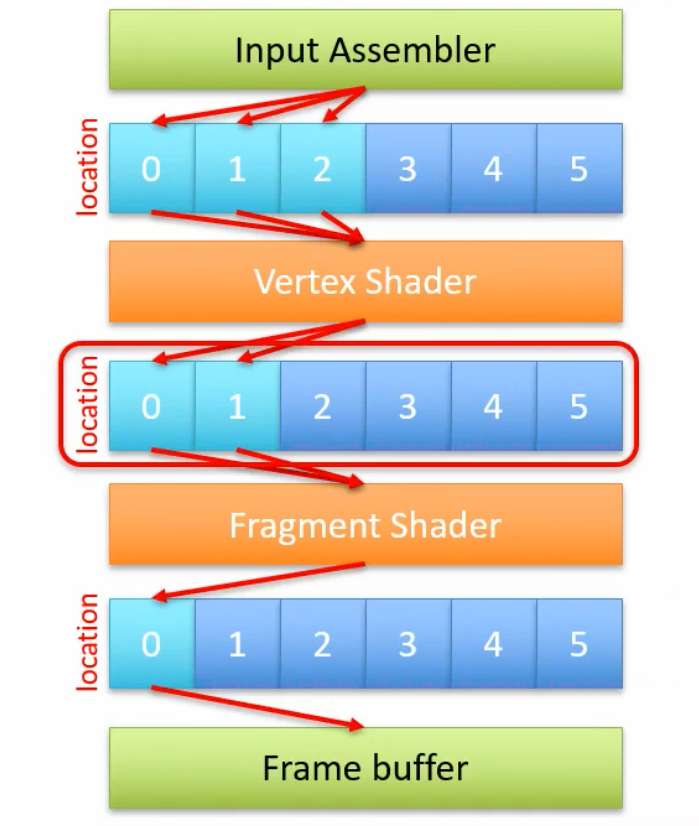

# Pipeline Creation

The Vulkan pipeline (VkPipeline) is the most complex and important data structure of the entire 3D visualization process. It's a huge object consisting of various configuration structures, some of which include pointers and arrays. 


## Vertex attributes and Uniforms

How vertex has sent to the shaders? 

As we have seen, Shaders are the pipeline components that compute the positions and the colors of the pixels on screen corresponding to points of the objects.
We have already seen how uniform blocks and textures can be passed to the shaders using Dataset Layouts and Dataset. Now we will see how we can pass attributes associated to vertices, and move information between shading stages (i.e. from vertex to fragment shader).

Shader-pipeline communication: in and out

`in` and `out` variables are used to interface with the programmable or configurable part of the pipeline. The `in` and `out` variables, used for the shaders communication, are implemented with a set of slots, each one identified by a location number.
Location numbers starts from zero, and are limited by a hardware dependent constant (usually large enough to support standard applications).
Whenever an `in` or `out` variable is defined, the user provides the location id of the slot used for communication in a layout directive.

Vulkan relies on the developer to use the correct locations values when defining in and out variables. An error in these settings creates unexpected and unpredictable results.

The slots used by the Input Assembler, which will be available inside in variables of the Vertex Shader, are configured in the pipeline creation.

The configuration of the pipeline, also defines the out variables that the Fragment Shader will write: the final color of the pixel (fragment).

- Vertex shaders operate per-vertex and handle geometric transformations.
- Fragment shaders operate per-pixel/fragment and determine final pixel colors.

{width=50%}


Communication between the Vertex and Fragment shader is controlled by their GLSL specification.


The fixed functions of the pipeline interpolate the values of the out variables emitted by the Vertex Shader, according to the position of the corresponding pixels on screen, before passing their values to the Fragment Shader.

The default interpolation between Vertex and Fragment shader is via Perspective Correct interpolations.

However it can be controlled with the flat and noperspective directives before the in and out variables.

Vulkan is very flexible in configuring the pipeline for specifying the vertex attributes to send to the Vertex Shader.

In particular, it allows to split vertex data into different arrays, each one containing some of the attributes.

Each of these array is known as a binding, and it is characterized by a progressive **binding** id.

```cpp
std::vector<VkVertexInputBindingDescription> VertexDescriptor::getBindingDescription() {
	std::vector<VkVertexInputBindingDescription>bindingDescription{};
	bindingDescription.resize(Bindings.size());
	for(int i = 0; i < Bindings.size(); i++) {
		bindingDescription[i].binding = Bindings[i].binding;
		bindingDescription[i].stride = Bindings[i].stride;
		bindingDescription[i].inputRate = Bindings[i].inputRate;
	}
	return bindingDescription;
}
```

## A constant specifying its

 data type (format) is then required.
 
## Vertex attributes: Vertex Input Descriptors

Finally, the offset in byte inside the data structure for the considered field must be provided.

This can be computed using the C++ offsetof( ) macro.

## Input Assembler configuration

Next, both binding and attributes descriptors are collected into a

## Input Assembler configuration

The structure requires the pointer to both the binding and attribute description arrays, and the count of the corresponding elements.

## Input Assembler configuration

The configuration of the Input Assembler stage of the graphic pipeline is competed filling up a VkPipeline InputAssemblyStateCreate Info structure with the type of primitives being drawn - i.e. triangle lists or triangle strips (with or without restart).

## Loading the Shaders

As we have seen, Vulkan can load the shaders from SPIR-V binary files.
We compile the shaders to SPIR-V binary files using something like this: 

```Powershell
@echo off  
setlocal enabledelayedexpansion  
  
for %%F in (*.frag) do (  
    set "filename=%%~nF"  
    set "outputname=!filename:Shader=!"  
    glslc "%%F" -o "!outputname!Frag.spv"  
)  
endlocal
```

Here we see how to load them in the application code, and prepare them for being linked to a pipeline: 

The SPIR-V can be loaded into a byte array using conventional C++ functions. In particular, we can create a readFile () function that receive as input the $f i l e n a m e$ and returns a char array containing it.

## Loading the Shaders

The std: : ios: ate opening mode and the tellg() method can be used to determine the file size.

## Loading the Shaders

In this way, a properly sized buffer can be created, and used to store the binary code of the shader read from the file.

## Create the Shader Module

The binary code can be used to create a Shader Module, the data structure Vulkan uses to access the shaders. Since we need one module per Shader, it is handy to create a procedure to perform this task.

## Create the Shader Module

Shader modules handles are stored into VkShaderModule objects, created with the vkCreateShaderModule () function, after filling a VkShaderModuleCreate Info structure.

## Create the Shader Module

The function requires only the pointer to the binary data, and an integer specifying its size.

## Create the Shader Module

Since SPIR-V files contain just an intermediate binary representation of the Shader programs, they are no longer necessary at the end of the pipeline creation process. For this reason they should be destroyed once the pipeline has been created using the vkDestroyshaderModule( ) function.

## Configuring the Shader Stages

Shaders are then used in the pipeline creation process as an array of 

## Configuring the Shader Stages

The stage field of each element defines which type of shader is contained in the module

## Configuring the Shader Stages

The module field contain a pointer to the corresponding Shader Module previously created.

VkPipelineShaderStageCreateInfo shaderStages [ ] = \{vertShaderStageInfo, fragShaderStageInfo\};

## Configuring the Shader Stages

Each shader might have several entry points. The pName field contains the name of the procedure that must be called to perform the corresponding function. Usually, this will be "main".


# RECAP 

Vertex formats

```cpp
// The vertices data structures  
// Example  
struct Vertex {  
   glm::vec3 pos;  
   glm::vec2 UV;  
};
```

Uniform Block Objects 

```cpp
struct UniformBlock {  
   alignas(16) glm::mat4 mvpMat;  
};
```

(C++ side) The UBOs contain the data sent from the CPP code to the shaders. For example we will have to pass the `World-view-projection` matrix.


Descriptor Set Layouts 

```cpp
// Descriptor Layouts ["classes" of what will be passed to the shaders]  
DescriptorSetLayout DSL;
```

| Variable | Binding | Type | Which shader |
| :--- | :--- | :--- | :--- |
| DSL | 0 | Uniform Block Objects | ALL |
|  | 1 | Texture | Fragment |
|  |  |  |  |

This array contains the bindings:  
         // first  element : the binding number         
         // second element : the type of element (buffer or texture)         //                  using the corresponding Vulkan constant         // third  element : the pipeline stage where it will be used         //                  using the corresponding Vulkan constant         

```cpp
DSL.init(this, {  
         {0, VK_DESCRIPTOR_TYPE_UNIFORM_BUFFER, VK_SHADER_STAGE_ALL_GRAPHICS},  
         {1, VK_DESCRIPTOR_TYPE_COMBINED_IMAGE_SAMPLER, VK_SHADER_STAGE_FRAGMENT_BIT}  
      });
```

which is "the class specification" of the Descriptor Sets: 

| Variable | Descriptor Set Layout | Binding | Type | C++ data structure | Variable with values | Texture |
| :--- | :--- | :--- | :--- | :--- | :--- | :--- |
| DS | DSL | 0 | UBO | UniformBlock | UBO |  |
|  |  | 1 | Tex |  |  | T |

// Descriptor sets  
DescriptorSet DS;

Vertex Descriptor 

```cpp
// Vertex formats  
VertexDescriptor VD;

// Vertex descriptors  
VD.init(this, {  
        // this array contains the bindings  
        // first  element : the binding number        // second element : the stride of this binging        // third  element : whether this parameter change per vertex or per instance        //                  using the corresponding Vulkan constant        {0, sizeof(Vertex), VK_VERTEX_INPUT_RATE_VERTEX}  
      }, {  
        // this array contains the location  
        // first  element : the binding number        // second element : the location number        // third  element : the offset of this element in the memory record        // fourth element : the data type of the element        //                  using the corresponding Vulkan constant        // fifth  elmenet : the size in byte of the element        // sixth  element : a constant defining the element usage        //                   POSITION - a vec3 with the position        //                   NORMAL   - a vec3 with the normal vector        //                   UV       - a vec2 with a UV coordinate        //                   COLOR    - a vec4 with a RGBA color        //                   TANGENT  - a vec4 with the tangent vector        //                   OTHER    - anything else        //        // ***************** DOUBLE CHECK ********************        //    That the Vertex data structure you use in the "offsetoff" and        //   in the "sizeof" in the previous array, refers to the correct one,        //   if you have more than one vertex format!        // ***************************************************        {0, 0, VK_FORMAT_R32G32B32_SFLOAT, offsetof(Vertex, pos),  
               sizeof(glm::vec3), POSITION},  
        {0, 1, VK_FORMAT_R32G32_SFLOAT, offsetof(Vertex, UV),  
               sizeof(glm::vec2), UV}  
      });
```

| Variable | Format (C++) | Location | Type | Usage |
| :--- | :--- | :--- | :--- | :--- |
| VD | Vertex | 0 | vec3 | POSITION |
|  |  | 1 | vec2 | UV |
|  |  |  |  |  |


Pipelines 


| Variable | Vertex Shader | Fragment Shader | Vertex format (C++) | Vertex descriptor | Set ID | Descriptor set Layout |
| :--- | :--- | :--- | :--- | :--- | :--- | :--- |
| P | ShaderVert.spv | ShaderFrag.spv | Vertex | VD | 0 | DSL |

  ```cpp
// Pipelines [Shader couples]  
Pipeline P;

// Pipelines [Shader couples]  
// The second parameter is the pointer to the vertex definition  
// Third and fourth parameters are respectively the vertex and fragment shaders  
// The last array, is a vector of pointer to the layouts of the sets that will  
// be used in this pipeline. The first element will be set 0, and so on..  
P.init(this, &VD, "shaders/ShaderVert.spv", "shaders/ShaderFrag.spv", {&DSL});
so at the end for each objects we will have multiple objects which will share eventually the same pipeline `P` : 
```


| ID | Pipeline | Mesh | Desciptor Set |
| :--- | :--- | :--- | :--- |
| A cube | P | M1 | DS |
| A plane | P | M2 | DS |


With Mesh objects characterized by Vertex structs and vertex descriptor.
Each texture has it's own binary file and a sampler and will be saved in a cpp variable. 


The professor called "gubo" the ubo where he puts everything that needs to be passed globally to all the shaders (generally mpvMap )


## Populate the command buffer

```cpp

// Here it is the creation of the command buffer:  
// You send to the GPU all the objects you want to draw,  
// with their buffers and textures  
  
void populateCommandBuffer(VkCommandBuffer commandBuffer, int currentImage) {  
   // binds the pipeline  
   P.bind(commandBuffer);  
   // For a pipeline object, this command binds the corresponing pipeline to the command buffer passed in its parameter  
  
   // binds the data set   DS.bind(commandBuffer, P, 0, currentImage);  
   // For a Dataset object, this command binds the corresponing dataset  
   // to the command buffer and pipeline passed in its first and second parameters.   // The third parameter is the number of the set being bound   // As described in the Vulkan tutorial, a different dataset is required for each image in the swap chain.   // This is done automatically in file Starter.hpp, however the command here needs also the index   // of the current image in the swap chain, passed in its last parameter               // binds the model  
   M1.bind(commandBuffer);  
   // For a Model object, this command binds the corresponing index and vertex buffer  
   // to the command buffer passed in its parameter      // record the drawing command in the command buffer  
   vkCmdDrawIndexed(commandBuffer,  
         static_cast<uint32_t>(M1.indices.size()), 1, 0, 0, 0);  
   // the second parameter is the number of indexes to be drawn. For a Model object,  
   // this can be retrieved with the .indices.size() method.  
   M2.bind(commandBuffer);  
   vkCmdDrawIndexed(commandBuffer,  
         static_cast<uint32_t>(M2.indices.size()), 1, 0, 0, 0);  
}
```

