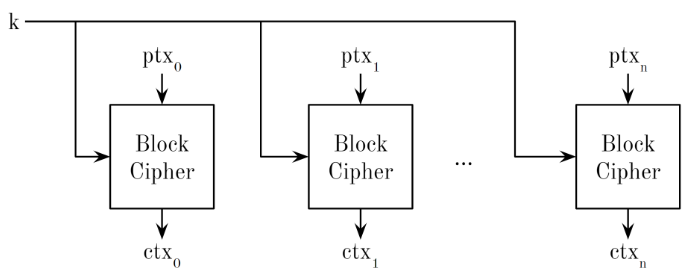

# Foundations of Cryptography

We will cover the basics of cryptography that are relevant to discussions about system security. 
Definitions:

- **Plaintext** space $P$ : set of possible messages $ptx \in P$  (Old words, now $\{0, 1\}$)
- **Ciphertext** space $C$: set of possible ciphertext $ctx \in C$  
- **Key** space $K$: set of possible keys  

{width=70%}

A perfect cipher is a cipher where the ciphertext  reveals no details regarding the plaintext . 
For a symmetric cipher, designated as $<P, K, C, E, D>$ with $|P| = |K| = |C|$, perfect security is guaranteed if:

1. Each key occurs with the same probability which means that all keys possess an equal likelihood of being employed.
2. For any given combination of plaintext and ciphertext within the sets $P$ and $C$, there exists a unique key in set $K$ that will map the plaintext to the ciphertext. 

The **One Time Pad** (OTP) exemplifies a minimalist perfect cipher. It is achieved by passing a random key of identical size as the message through an XOR operation. However, this key must not be reused. Hence, despite confirmation of the existence of a perfect cipher, practical usage is unattainable.
An easy way to understand the concept of perfect cipher:

```
M = UGO (21 7 15) 
K=+3 
C = XJR (24 10 18) 
```

In the case of the non-perfect cipher example, the attacker would need to bruteforce all possible keys by shifting each letter and comparing it to a dictionary of known words or phrases to find the correct key. 

"Toy" Perfect Cipher Example 
```
M = UGO (21 7 15) 
K=+5+2+2 
C = ZIQ (22 9 18) 
```

In the case of a perfect cipher, the attacker would obtain all possible combinations of the letters through bruteforcing, which are equally probable to be the original text. 
Brute-force is the upper bound to the robustness of an algorithm, it is the worst case scenario to apply (most time-consuming method) in order to break an algorithm. In real life algorithms the same key is re-used more than once: this is why algorithms are not perfect, furthermore the key is the only unknown thing (the algorithm must be known). At this point, the attacker in order to break the algorithm has to find the key, and all real world algorithms are vulnerable to brute-force attacks.

## Some fundamentals of Information Theory

It's possible to mathematically quantify the difficulty of guessing a changed secret string between two entities using a random variable $X$. The amount of information which can be transmitted depends on the distribution of $X$. 

$$H(X)=\sum _{i=0}^{n-1} = - p_i log_b (p_i)$$

The entropy $H(X)$ is a good way to express the hardness to guess a string.  
Compression of bitstrings without loss is impossible: cryptographic hashes discard some information.


## Computationally secure 

Our road from perfect ciphers to pseudo-random generators: 

0. **Random Functions**: functions that take an input and produce an output that is not easily predictable. The output of the function appears to be random, even if the input is known.
1. **Pseudo Random Functions** (PRF): A function that appears to be random, but is actually deterministic and produces the same output for the same input. This is just a RF which can be used in practice. 
2. **Pseudo Random Number Generator** (PRNG): A deterministic function that generates a sequence of random-looking numbers from a seed or key $\{0,1\}^\lambda \rightarrow\{0,1\}^{\lambda+n}$ where $n$ is called stretch of the PRNG. Is called "pseudorandom" since it's truly random and are deterministic, meaning that given the same seed, the same sequence of numbers will be produced every time.
3. **Cryptographically Secure Pseudo Random Number Generator** (CSPRNG): Cryptographically Safe Pseudorandom Number Generator (CSPRNG) is a PRNG whose output cannot be distinguished from an uniform random sampling of ${0, 1}^{\lambda +n}$ in $O(poly(\lambda))$ time. This function stretch the key you use. It's not a perfect tool but it's a practical tool.  
4. Pseudo Random Permutations (PRP) (also called **Block cipher**): a function which maintains input/output length (permutation) where it's not possible to tell apart in $O(poly(\lambda))$ from a Random Function $RF$. Operatively speaking acts on a block of bits outputs another one of the same size which looks unrelated (but actually it is.. since it's **pseudo** random). 

{width=50%}

A block cipher is said to be broken if, without knowing the key, the plaintext can be derived from the ciphertext with less than $2^{\lambda}$ operations. Which means that it's broken if exists a way to broke it that is not a bruteforce technique. 
The standard algorithm is now Advanced Encryption Standard (AES). In AES, the block has a length of 128 bits, and the key can be 128, 192 or 256 bits long.

A first attempt to encryption with PRPs are ECB, which are based on the idea of split-and-encrypt.

{width=50%}


This method is fast and parallelizable, **but** plaintext blocks with the same value will be encrypted to ciphertext blocks with the same value. Furthermore, if the attacker knows the position of a zero-filled plaintext block, she’ll be able to decrypt all the messages sent.

## Counter (CTR) Mode

This method uses a counter and encryption to generate a unique output. The counter can start at any number and an increment other than 1 can be used, but 1 is both secure and efficient.

{width=50%}

Ideas evoluted from CTR: 

- manipulate the key every time it is used
- choose each time a different number (called nonce) as starting point of the counter
- symmetric ratcheting

The exploited main idea is always the same: adding an extra source of pseudo-randomness. 

{width=50%}

### Symmetric Ratcheting

The idea takes the name from the mechanical component: a plugin to the cipher tool creates a different key for each block starting from a single original key (a seed). "Every single time you call it you move the ratchet". 

{width=50%}


## Integrity 

To ensure data integrity, we can append a Message Authentication Code (**MAC**) to the message. The MAC acts as a tag that an attacker cannot forge and it's used to guarantee that the message has not been tampered.
From an high-level pov the idea is: 

- `computeMAC(string, key) = tag` 
- `verifyMAC(string, tag, key) = {true|false}``

Calculating message tags is time-consuming and costly. Ensuring file integrity requires comparing it bit by bit or computing a MAC by reading the entire file. This is not feasible. Can we create something similar to the ideal situation? Yes, using Cryptographic Hash Functions. However, they are **not perfect** and trade-offs are involved. One trade-off is that every file has a lower bound of compression, as per Shannon Theory.

{width=50%}

The main idea is to have a hash function that can hash any binary stream in a way that is difficult for attackers to create collisions between different objects. 
A good hash function should be resistant to:

1) **first preimage attack**: inverting $H$. given $d = H(s)$ find $s$  should take $O(2^d)$ hash computations. 
2) **second preimage attack**: finding a different $s$ that produces the same digest. Knowing $d, H(s)$ find another object $j \ne s$ with same $H(j)=d$  should take $O(2^d)$ hash computations.  
3) **Collisions**: finding two different inputs with the same hash. Find two objects $s \ne r$ which $H(s) \ne H(r)$ . 

Nowadays, past functions like `SHA-1` (Google found a collission with two pdf files) and `MD5` (this one is totally broken) have been shown to be flawed, but currently, the unbroken and widely standardized `SHA-2` and `SHA-3` can produce 256, 384, or 512-bit digests. SHA-3 exists because SHA-2 utilizes mechanisms from flawed functions.
Where are used hash functions? Hash functions are widely used for various purposes such as document signature, HTTPS certificate, version control (git), and ensuring data integrity in backup systems.
Command `certutil -hashfile 42.pdf SHA256` uses the `certutil` Windows tool to calculate the `SHA256` (`SHA-2` variant) hash value of `42.pdf`. 

## Authencity 

We’d like to be able to verify the authenticity of a piece of data without a pre-shared secret. With an asymmetric cipher, we can actually provide authenticity.
To guarantee that the sender of the message is the same as the one who originally transmitted the public key we can use a **Digital Signature**. But a practical issue of this is that encrypt large documents is slow.
A solution to slow encryption are **Cryptographic Hash Functions**: generating a fixed-length string of bytes where a change in the input message will result in a completely different output.
The RSA standard, other than confidentiality, is built to provide authenticity as well: it ensures that the **message sender is who they claim to be**.

## PKI CA chain 

Cautionary (obvious) note: In both asymmetric encryption and digital signatures, it is crucial to bind the public key to the correct user identity.

How to achieve this? 

This can be achieved by using a Public Key Infrastructure (PKI) that employs a trusted third party called a Certification Authority (CA). The CA issues digital certificates that bind an identity to a public key. 
The CA digitally **signs** these certificates and employs a private key to do so. This creates a **chain of certificates**, known as the** Certificate Chain**. At some point in the chain, a self-signed certificate is used (**Root of trust**), which must be trusted a priori.


Generally CA is already installed in a system/browser. The root CA's list can be checked in a system, and all the root certificates installed within it are trusted when an OS is trusted. 

The private key is the most important asset. If it is stolen or compromised it can't be destroyed but it's possible to revoke the digital certificate itself using one of the Certificate Revocation Lists that are stored online. The problem is that CRL cannot be verified offline, which poses another security issue.

## Symmetric Encryption

{width=70%}

The basic idea of encryption:

- Use a key $K$ (also known as shared) to encrypt plaintext into ciphertext
- Use the same key $K$ to decrypt the ciphertext back into plaintext

Issues with encryption:

- The key is shared ...  we cannot send the key on the same channel as the message.
- An off-band transmission mechanism is needed.
- Scalability problem: a $n$ system needs  $O(n^2)$ keys 

## Asymmetric Encryption 

{width=50%}


And doing this we can provide authencity: 

{width=50%}

We can use only asymmetric cryptosystems but in practice it would be inefficient since they are much slower compared to symmetric cryptosystems. 
The solution is to use hybrid encryption schemes, where asymmetric schemes are used for key transport/agreement and symmetric schemes are used for encrypting the data. This approach combines the best of both worlds and is the basis of all modern secure transport protocols.


