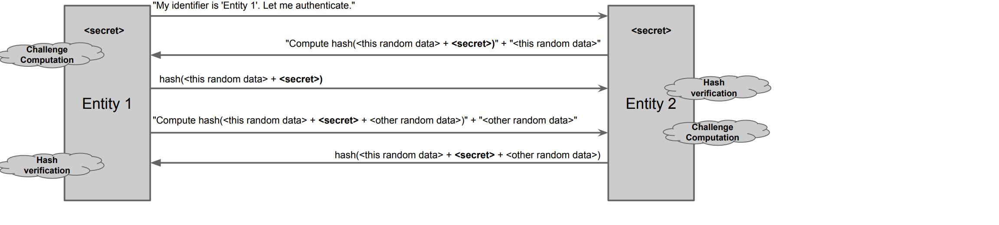
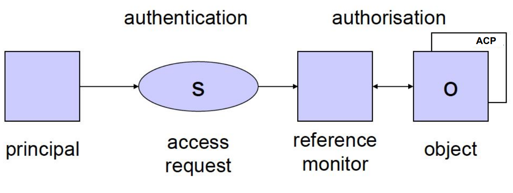

# Authentication

Three factors of Authentication:

1) Something that the entity knows (to know)
2) Something that the entity has (to have)
3) Something that the entity is (to be)

## To know

Why passwords are appealing?

- Low cost
- Easy deployment
- Low technical barrier 

| Disadvantages | Countermeasures |
| :--- | :---: |
| Secrets can be easily stolen or snooped | Change or expire frequently |
| Passwords can be easily guessed | Are not based on any personal information of the user |
| Passwords can be cracked through enumeration | Are long and contain a variety of characters |

But countermeasures have costs and humans are not machines:

- They are inherently unable to keep secrets
- It is hard to remember complex passwords

#### Secure Password Exchange

How to minimize the risk that the password is stolen? **Challenge-Response** scheme is the solution. Shift from the problem to "have and pass the password" to demonstrate to have the password. 

Random data is important to hide the hash of the secret and protect against replay attacks.

#### Secure Password Storage

- Use cryptographic protection: never store passwords in clear text, implement hashing and salting techniques: salting involves adding a random nonce to a password and it ensures that different users identical passwords have distinct hashes.
- Access control policies
- Never disclose secrets in password-recovery schemes
- It's necessary to minimize the cache of the clear password

## To have 

Advantages: 

- Human factor: forgetting a password is more common than losing a physical key.
- Relatively low cost 
- Provides a good level of security 

| Disadvantages | Countermeasures |
| :--- | :---: |
| Hard to deploy, | none |
| can be lost or stolen. | use with second factor. |

Some examples: 

- OTP: One-time password generators
- Smart cards (also with embedded reader in USB keys)
- TOTP: software that implements the same functionality of password generators

## To Be

Advantages:

- High level of security
- No extra hardware required to carry around since are physical characteristics

|       Disadvantages        |  Countermeasures   |
|:--------------------------:|:------------------:|
|       Hard to deploy       |        none        |
|   probabilistic matching   |        none        |
|    invasive measurement    |        none        |
|       can be cloned        |        none        |
| bio-characteristics change |  re-measure often  |
|    privacy sensitivity     | secure the process |
|  users with disabilities   |   need alternate   |

Some examples: 

- Fingerprints
- Face geometry
- Retina scan
- DNA 
- Voice analysis: not really used since its not "stable feature". 

## Extra

### Single Sign-On (SSO)

Managing multiple passwords is complex. With SSO it's possible to authenticate user across multiple domains with an identity provider.  It's more usable but it's more "dangerous": 

- **single point of failure**: if it's down, it's like all the services are down
- **single point of trust**: if compromised, all sites are compromised

### Password managers 

Another tradeoff of security and usability are password managers: 

- Password managers eliminate the need to remember all passwords.
- Password managers allow for generating robust passwords.

but again password managers are more "dangerous": 

- **single point of failure**: if it's down, it's like all the services are down)
- **single point of trust**: if comprimesed, all accounts are compromised
- Password managers are softwares...

## Access Control 

{width=50%}

The Reference Monitor is responsible for enforcing access control policies, dictating who is allowed to perform what actions on which resources. It is a crucial component of all modern kernels. 

Access control models:

- **Discretionary Access Control** (DAC)
- **Mandatory Access Control** (MAC), it differs from DAC since in DAC privileges are assigned by the owner of the resource while in MAC they are assigned by a central authority.
- **Role-Based Access Control** (RBAC): which is an hybrid of DAC and MAC

Examples of DAC systems are both Windows and Unix OS: which are based on users and groups of users which have privilidges over objects (files). 

### DAC 

#### HRU model 

The HRU model is a computer security model that stands for Harrison-Ruzzo-Ullman. It is a formal mathematical model or a framework which is used to analyze the effectiveness of systems. 
Basic operations in the HRU model:

  - Create or destroy subject
  - Create or destroy object 
  - Add or remove into [s,o] matrix 
  
Transitions are sequences of basic operations. **Safety problems** can be translated into the question "Can a certain right $r$ be leaked through a sequence of transitions?" or in other words "Is it possible from an initial protection state to perform a transition that steals someone else’s file?". If there is no such sequence, then the system is safe regarding right $r$. Note that this is an undecidable problem in a generic HRU model (with infinite resources).

#### AC matrix

The **Access Control** matrix with $S$ rows and $O$ columns. Each cell $A[S,O]$ of the matrix defines the privileges of subject $S$ over object $O$, where the privileges are read, write and own. The **safety problem** consists on checking the AC matrix to avoid leaking privileges. AC matrix is usually sparse matrix and there are different implementations to solve sparse matrix issue:

- **Authorizations table**: records **non-null** triples $S-O-A$ ($S$ubjects can perform $A$ction over $O$bject).
- **Access Control Lists**: focused on objects, for each object there is a list of subjects and authorizations.
- **Capability Lists**: focused on subjects, for each subject there is a list of objects and authorizations. 

The most common implementation in OS is based on **ACLs**.

### MAC 

The main idea is to not let owners assign privileges, which are set by an **admin** using a classification.
An implementation of MAC can be the Bell-LaPadula Model, which is based on two rules:

   - A subject $s$ cannot read an object $o$ at a higher secrecy level
   - A subject $s$ cannot write an object $o$ at a lower secrecy level

The main consequence of these two rules is the "tranquillity" property: by design priviledges over objects cannot change dynamically. 

