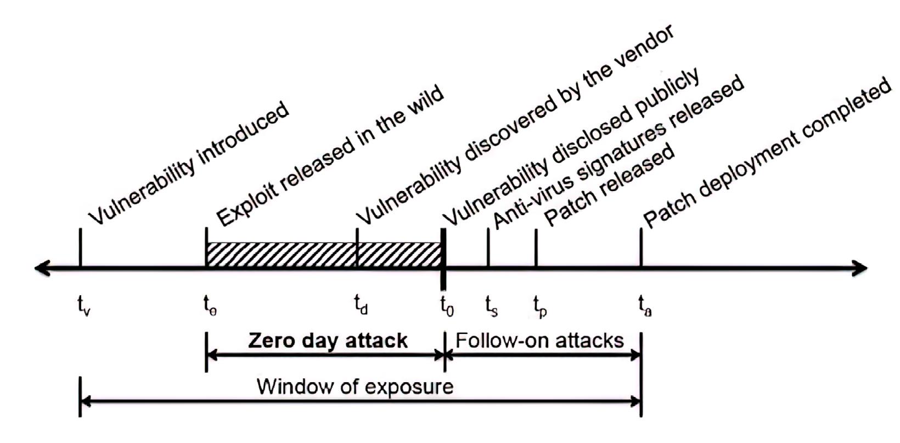
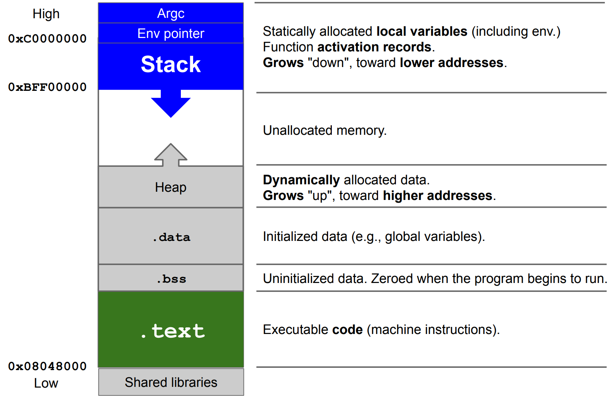
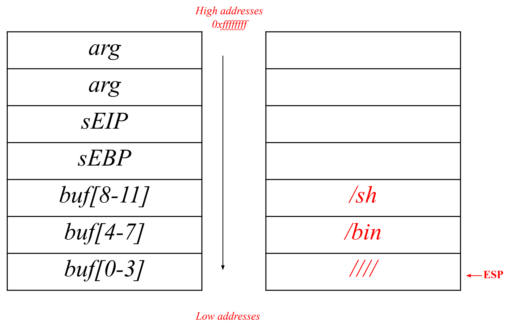

# Software Security 

- Bug-free software does not exist. 
- Not all bugs lead to vulnerabilities.
- Vulnerabilities without a working exploit exist.
- Vulnerability-free software is difficult to achieve. 

{width=50%}

To minimize the window of exposure, the following steps should ideally be followed:

1. The vendor should find the vulnerability.
2. The vendor should patch the vulnerability.
3. The vulnerability should be disclosed.

## Buffer Overflow 

Buffer overflow caused overwrite of the saved $EIP$ (which contains the next instruction to execute) on stack due to lack of size checks. The corrupted return address can lead to various consequences: the program may crash, execute unexpected instructions or attackers can craft malicious payloads to take control of the program. 

> Proper input validation and size checks are necessary to avoid buffer overflows.

How to exploit this vulnerability? We have to jump to a valid memory address where there is a valid piece of code.

The method is called **stack smashing** : we place the code that we want to run directly inside of the buffer and rewrite the return address with the address of the buffer itself.




### Recap stack function prologue and epilogue 

Every time you call a function you will find in the disassembled code the **function prologue**:

```assembly
push %ebp
mov %esp, %ebp 
sub $0x4, %esp 
```

in particular: 

1) `push %ebp` saves the current stack base address onto the stack
2) `mov %esp, %ebp` saves into `ebp` the old top of the stack (`esp`)
3) `sub $0x4, %esp` allocates `0x4` bytes

Regarding the **function epilogue**: 

```assembly
leave
ret
```

can be converted into:

```assembly
mov %ebp, %esp 
pop %ebp
ret
```

where: 

1) `mov %ebp, %esp` is the exact opposite action of the prologue ... we are "saving" in the register that stores the top of the stack the `%ebp` .. basically we are **removing the all function stack segment**. 
2) `pop %ebp` is used to restore the saved ebp to registry 
3) `ret` is used to pop the saved `EIP`  and jump there: this `EIP` will be the address of the instruction after the function call (which has just returned). 

{width=50%}


### Stack smashing

To exploit a buffer overflow vulnerability, we need to overwrite the $ESP$ register and have the computer jump to the code we wrote in the buffer. To obtain the assembly code, we write, compile, and then disassemble a program. However, finding the exact address of the buffer can be difficult. We can estimate it by examining the value of $ESP$ from a debugger, but this value may not be completely accurate due to the debugger's presence. This inaccuracy makes it challenging to execute the code precisely.
To solve this problem, we use a `NOP` sled. A `NOP` instruction is a command that does nothing and moves to the next cell. By inserting a sequence of `NOP` instructions before our code, called a `NOP` sled, we can jump "somewhere" in the sled since we don't know the exact address. The CPU will execute all `NOP` instructions and eventually reach our code.
Historically, the goal of an attacker is to spawn a privileged shell on a local or remote machine. A shell code is a set of machine instructions that basically can do anything, including spawning a shell.  

Advantages: 

- Can be done remotely. 
- Input can be used as code.

Disadvantages: 

- Buffer size limitations. 
- Memory must be marked as executable. 
- Relies on accurate address guessing.

### Alternatives techniques 

- Memory that we can control 
	- The buffer itself 
	- Some other variable (for example **environment variable**)
- **Built-in existing functions**
- Heap overflows 

#### Environment Variable

```shell
user@pc: env 
HOME=/home/username 
USER=username ...
```

We allocate an area of memory that contains the exploit. Then, we put the content of that memory in an environment variable. Finally, we have to overwrite the `EIP` with the address of the environment variable by filling the buffer.

Disadvantages:

- valid only for **local** exploiting 

#### Built in existing function

In the saved `EIP` we will place the address of a function, for example `system()`. But the CPU is expecting the arguments of the function but also the returning address (after the call of the function). 

Advantages:

- Work remotely and reliably
- No need for executable stack 
- Functions are usually executable

Disadvantages:

- Stack frame must be carefully prepared (the attacker has to emulate the function frame)

### Defending agains Buffer Overflow

Many strategies exist apart from the correct best practices to accept input from the user (for example, the `%7s` syntax is a limit specifier in the placeholder which limits the string accepted to 7). Most advanced countermeasures transparent to the developers are:

- ASLR 
- not executable stack (NX)
- stack canary 

More specifically:

- Defenses at **source code** level involve the process of finding and removing vulnerabilities:
	- mainly developers cause buffer overflows 
	- using safer libraries 
	- dynamically memory management (e.g. Java) that makes them more resilient (*You can't mash my stack if the stack doesn't exists*).
- Defenses at **compiler level** are focused on making vulnerabilities non-exploitable. 
	- warnings at compile time
	- randomized reordering of stack variables make the stack mashing more difficult. 
	- **canary** is the most important mitigation.
- Defenses at **operating system** level aim to increase the attacks difficulty.
	- **non-executable stack** to clearly distinguish data from code. But this actually is bypassed since it is possible to point the return address to existing machine instructions (code-reuse attacks)
	- **address space layout randomization (aslr)** is a technique which translates the stack at each execution at random, which makes impossible to guess the addresses correctly. 

#### Canary 

Canary mecahnism consists of a variable which is usually placed between local vars and control vars (such as `EIP`/`EBP`) so that it can be used as a "flag" which is checked every time a function returns. A **canary** could be read but if it's correctly implemented, every time the program is run, the canary value changes! So it's impossible to get around it.
There are different types of canaries that can be used for protection:

- **Terminator canaries**: made with terminator characters that cannot be overwritten by string-copy functions.
- **Random canaries**: random sequence of bytes are chosen when the program is run.
- **Random XOR canaries**: same as random canaries, but they are XORed with a part of the structure that needs protection. This helps to protect against non-overflows. 

## Format string bugs

The vulnerability arises because many programming languages provide functions for formatting strings using placeholders that are replaced with values at runtime. For example, in C, `printf()` is used to print formatted output on console. If the user input contains special characters such as `%s` (string), `%d` (integer), `%x` (hexadecimal), etc., and these are not properly sanitized by the program, there is the possibility to leak information from the stack.  
For example, if arguments are omitted, we can read the stack:

```c
printf("%i, %i, %i", a, b, c); // NOT vulnerable 
printf("%x, %x, %x"); // vulnerable
```

Placeholders modifiers of interest: 

- `I$` (or `pos$` or `n$`) where `I` is any number (integer) is a placeholder modifier which is place between `%` and the **conversion specifier**. It prints the value of the `I`-th argument passed to the `printf` function, for example: `%2$d` will print the second argument as a decimal number. 
- `%n` is another **conversion specifier** which writes in the **address pointed** by the argument, the number of chars (bytes) printed so far in the `printf`. In this example, after the call of `printf`, we will have that `i=5` since `hello` has length of 5 chars. `%n` allows us to write directly on the stack and we can exploit this to change any memory cell, maybe an address. 
```c
int x;
printf("hello%n" , &i);
``` 
- `%Ic`, where `I` is an integer that specifies how many times the first character argument should be printed. 

The idea: 

1. Put, on the stack, the address of the target cell to modify
2. Use `%I$x` to go find it on the stack using the "displacement" `I` as `pos`. 
3. Use `%n` to write the number of bytes written so far (this can be manipulated by `%Ic`) in the target, which is pointed to by address you have pushed in 1.  

The problem with this is that to write an address we will have to manipulate the bytes printed so far with `%Ic` with an **huge** number of characters (billions). This is not feasible on any device (memory limits). So we divide the single 32 bit write in two separate 16 bits writes using only one format string (actually it can be seen as a combination of two format strings):

```shell
<target><target+2>%<lower_value>c%pos$hn<higher_value>c%pos+1$n
```

Note that in `%pos$hn` (composed by `%hn` and `pos$`), we use `%hn` instead of `%n` because we are writing 16 bits instead of 32 and we do not want to overwrite the two following bytes with 0s. Also remember that `<lower_value>` rapresents the first 2 bytes of the word that we want to write. The `<higher_value>` will not rapresents in decimal form the second part of the address, but the **difference between lower_value - higher_value>** since the mechanism of `%Ic` ! For the same motivation when we are writing the first value we have to keep in mind how many chars (bytes) the `printf` has already printed at that point: `<low_value> = <lower_part> - len(printed)` . 

#### Example

We need to write `0xbeefdead` to `0xffbfdd9c`. As in this case `0xbeef` < `0xdead`, we need to **swap**: in the formula we must to write `0xbeef` before so, the first target is not just `<target>` but necessary `<target+1>`.
The general format string structure is: 

```
<where to write+2><where to write>
%<low_value>c%<pos>$hn
%<high value>c%<pos+1>$hn
```

- Where to write (inverted) = `\x9c\xdd\xbf\xff`
- Where to write + 2 (inverted) = `\x9e\xdd\xbf\xff`
- If in the `printf` we have already written some characters, we have to count them. We have written a total of 8 characters (bytes) for the target address, which is represented by 4+4 bytes. Along with this, we have also written 16 additional characters (just for this example) within the `printf` function. To calculate the remaining characters that need to be written, we subtract `24` from the total.
- low value = `0x49d0 -> 48879 - 24`
- high value = `0xf7e3 -> 57005 - 48879`


### A word on countermeasures

Buffer overflow countermeasures like **ASLR** and **XOR canary** are not always effective to prevent also this vulnerability. Compilers warns when a format string function is used without the right specifications.
Sometimes is possible for the attacker to use the format string to leak the value of the canary and rewrite it using the buffer overflow vulnerability.

