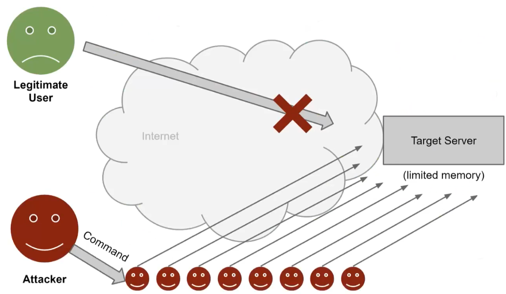
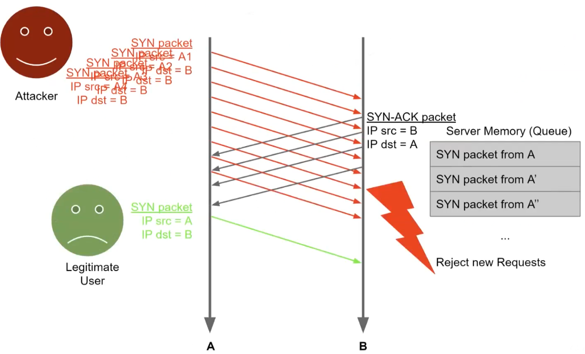
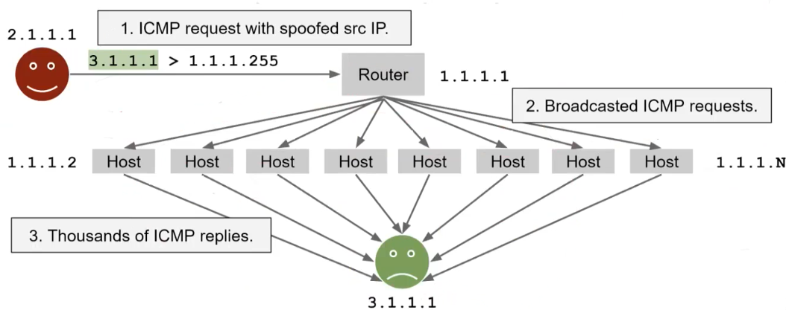

# Network Security 

## Network attacks

We can distinguish 3 main types of attacks:

- **Denial of Service** (DoS): make a service unavailable (against availability)
	- killer-packets: malicious packets crafted in specifically to make the application/OS that reads them to crash or become unresponsive.
	- flooding: sending tons of requests to choke the connection to the service.
- **Sniffing**: abusive reading of network packets (against confidentiality)
- **Spoofing**: forging of network packets (against integrity and authenticity)

### Dos 

Flooding attacks, such as DoS attacks, cannot be completely eliminated. 

The security problem increases when there is a way for the attacker to **multiply** his effort in doing the attack: the attacker uses `x` amount of resources but consumes `Nx` resources on the server. We want to take away the possibility of having that multiplier.
One example of this multiplier factor is **SYN flood**, which exploits the three-way handshake of TCP. The attacker sends a lot of SYN packets with spoofed source IPs, never acknowledging them. The server needs to reply with SYN-ACK and **store** pending connections in a queue, consuming bandwidth and **memory**. The limiting factor is the server's memory usage. 

Although this attack cannot be avoided due to how TCP works, mitigation is possible by removing the multiplier (storing connections in memory).

#### DDoS

In the case of Distributed DoS (DDoS) the attacker can control a large number of machines (a botnet) and have them send requests to a target server to consume its bandwidth. The multiplier is in the controlled machines: one packet/command will be multiplied by the number of machines.
Many protocols on the internet have characteristics that make them suitable for DoS and DDoS attacks (they have some built in multiplier). BAF (Bandwith Amplification Factor) = multiplier of response payload to request payload.

| Protocol   | all   | BAF 50 | PAF 10 | all  | Scenario                     |
| ---------- | ----- | ------ | ------ | ---- | ---------------------------- |
| SNMP v2    | 6.3   | 8.6    | 11.3   | 1.00 | GetBulk request              |
| NTP        | 556.9 | 1083.2 | 4670.0 | 3.84 | Request client statistics    |
| DNS NS     | 54.6  | 76.7   | 98.3   | 2.08 | ANY lookup at author. NS     |
| DNS OR     | 28.7  | 41.2   | 64.1   | 1.32 | ANY lookup at open resolv.   |
| NetBios    | 3.8   | 4.5    | 4.9    | 1.00 | Name resolution              |
| SSDP       | 30.8  | 40.4   | 75.9   | 9.92 | SEARCH request               |
| CharGen    | 358.8 | n / a  | n / a  | 1.00 | Character generation request |
| QOTD       | 140.3 | n / a  | n / a  | 1.00 | Quote request                |
| BitTorrent | 3.8   | 5.3    | 10.3   | 1.58 | File search                  |
| Kad        | 16.3  | 21.5   | 22.7   | 1.00 | Peer list exchange           |
| Quake 3    | 63.9  | 74.9   | 82.8   | 1.01 | Server info exchange         |
| Steam      | 5.5   | 6.9    | 14.7   | 1.12 | Server info exchange         |
| ZAv2       | 36.0  | 36.6   | 41.1   | 1.02 | Peer list and cmd exchange   |
| Sality     | 37.3  | 37.9   | 38.4   | 1.00 | URL list exchange            |
| Gameover   | 45.4  | 45.9   | 46.2   | 5.39 | Peer and proxy exchange      |

#### ICMP flooding

ICMP is the protocol used for the classical ping (echo request and echo reply).
**ICMP flooding** nowadays works only inside the LAN and also the RAM's of devices theoretically can support such overload. 

### Sniffing and spoofing

Often used in combination: spoof an machine (for example a gateway) to sniff packets of the lan or in general to act as man in the middle (MITM). 

#### ARP spoofing  

Spoof the MAC address of an ARP reply. Since there is no check, the machine who made the ARP request will trust the first answer that comes, also **poisoning** the ARP cache with the address of the attacker. Now the attacker can use this to pretend being someone else.  

Possible mitigations are:

- include a random nonce in each request
- anomaly detection: if someone is constantly sending out ARP replies is weird.
- address conflict: the correct reply will eventually reach the host that could notice the conflict and alert the user.  

#### MAC flooding

Fill the CAM table of switches by sending tons of spoofed packets. If the CAM table is full: the switch cannot cache ARP replies and must forward every packet to every port (like a hub does). The broadcasting of every packet permits the attacker to be able to sniff any packet if it's in the LAN.  

The main mitigation is: 

- Port security (CISCO terminology) tells the switch roughly how many hosts are supposed to be connected to some port and refuse to save more addresses.
- "hard-coded" MAC addresses 

#### DNS cache poisoning

The objective is to poison the victim DNS server, which is non-authoritative, by impersonating the authoritative server. This can be achieved through a recursive query of the victim's DNS server by the attacker. The victim after the query, contacts the authoritative server for the requested domain. 
The attacker has in some way to reply to the victim's DNS server before the legitimate authoritative server does. 
Once the attacker successfully impersonates the authoritative server, any client DNS request will be redirected to the attacker's chosen IP address.

#### DHCP poisoning

DHCP is another **unauthenticated** protocol since it needs to work without any configuration. The attacker can spoof the DHCP answer to manipulate the information sent to the client:

- IP address assigned
- DNS server
- default gateway

Of course the attacker needs to be on the local network and reply first.

#### ICMP redirect

The ICMP protocol not only includes "ping message" but also the *redirect* one. The ICMP redirect is used by routers to inform hosts about a better route for a specific destination. This allows hosts to update their routing table with the new gateway for that route. 
Attackers can manipulate these messages to redirect hosts to malicious gateways and basically doing sniffing/MITM (Man-in-the-Middle) attacks. 
This attack requires the attacker to be in the same network and modern OS typically ignore ICMP redirect messages by default.

## Firewalls 

Firewalls are network access control systems that verify packets flowing through them. A firewall is a computer which can be considered as a stupid “bouncer at the door”: they cannot perform content analyze (for that we need a proxy.

There are different types of firewalls, such as:

- Stateless Packet Filters
- Stateful Packet Filters

The main difference between the two is that the stateful one keeps track of connections and not just packets. This makes deny rules safer but the performance is bounded by connections and not by packets. 

## Network Design 

To secure a network, we split the network by privileges zones and we use firewalls to regulate access. The DMZ zone can host public servers (web, FTP, public DNS server, intake SMTP) and is assumed to be exposed as the internet. 

### VPNs 

We can also use a VPN to build an encrypted overlay connection on top of a public network to ensure the confidentiality, integrity, and availability of data transmitted. 

A VPN can be configured in: 

- Full tunnelling where every packet goes through the tunnel.
- Split tunnelling where the traffic to the Corporate Network is routed through the VPN, while the other traffic goes to the ISP.