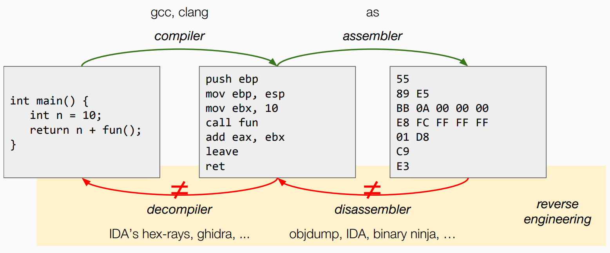
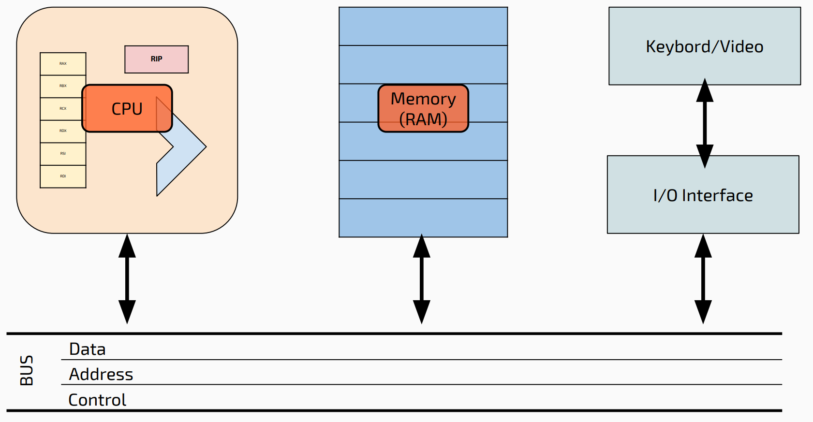
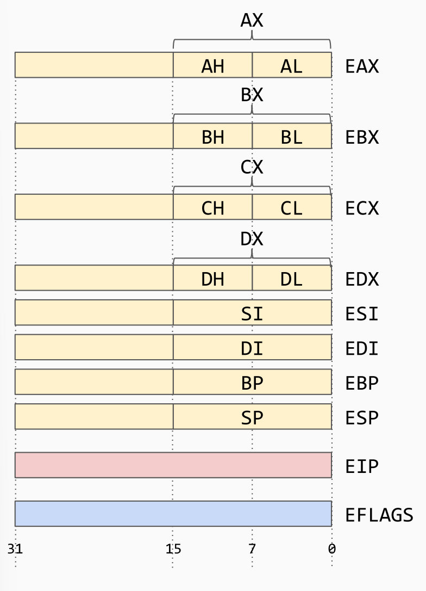
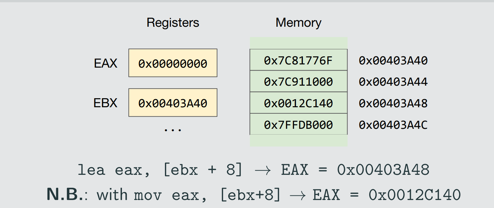
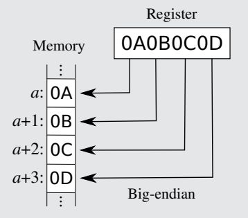
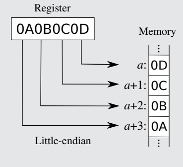
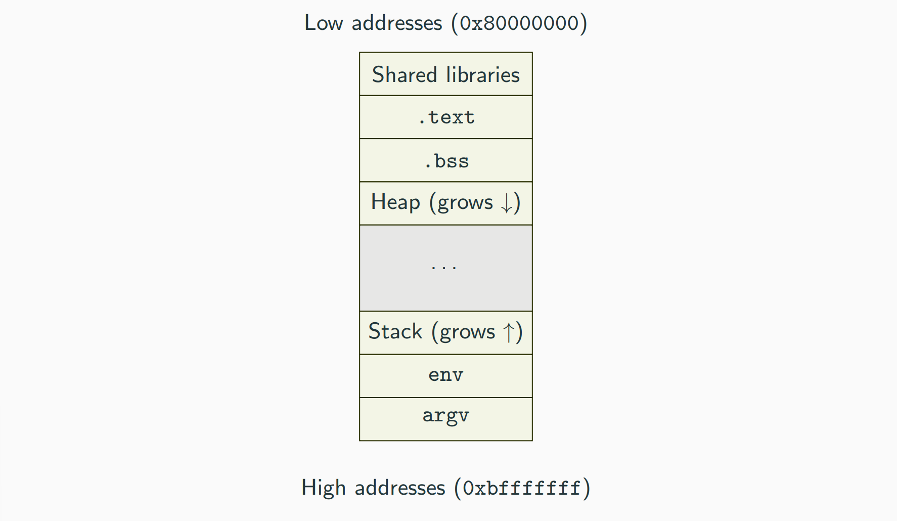
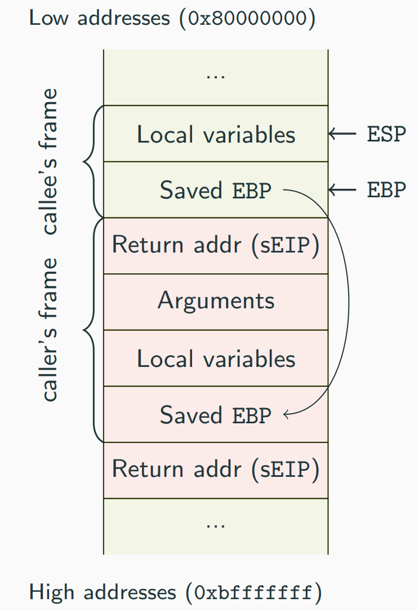
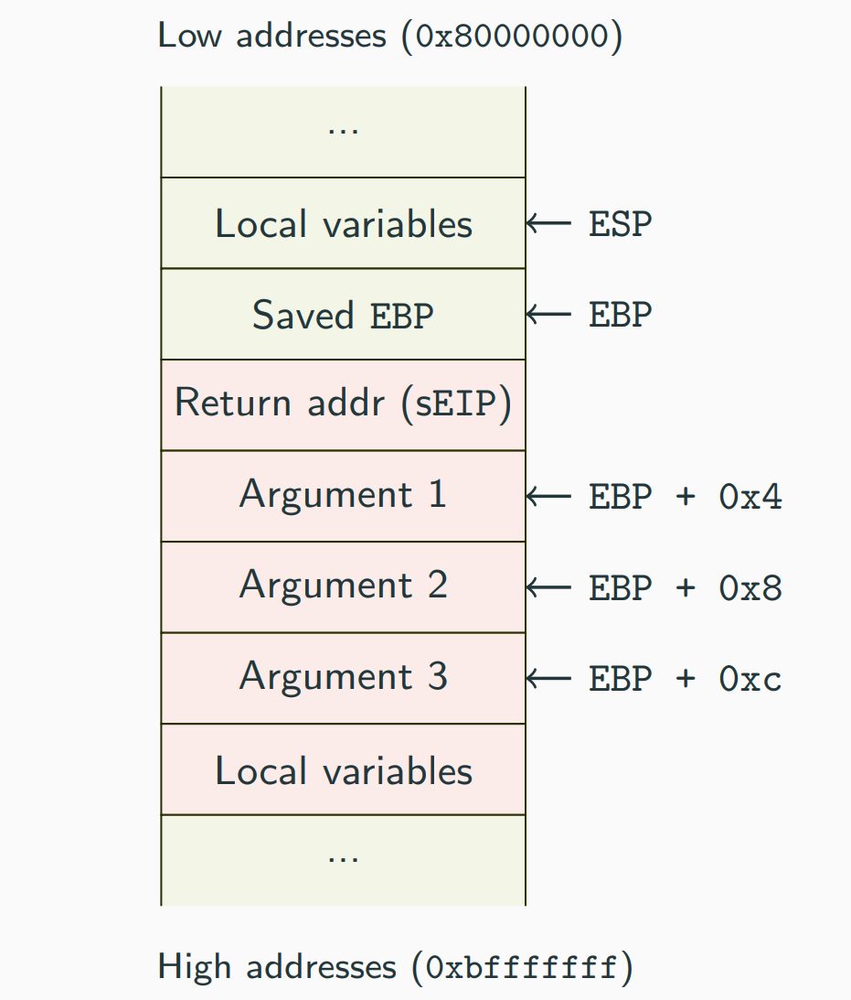

# x86 Crash Course (WIP)

 


{width=50%}


Registers: 

{width=50%}


- General-purpose registers: `EAX`, `EBX`, ECX, `EDX`, `ESI`, `EDI`, `EBP`, `ESP`
- `ESI` and `EDI` used for string operations 
- `EBP` used as base pointer 
- `ESP` used as the top stack pointer 
- `EIP` 
	- Accessed implicitly, not explicitly 
	- Modified by jmp, call, ret 
	- Value can be read through the stack (saved IP)

`EFLAGS` register is used basically for control flow decision. 


x86 Fundamental data types:

- Byte: 8 bits
- Word: 2 bytes
- Doubleword: 4 bytes (32 bits)
- Quadword: 8 bytes (64 bits)


Moving the value 0 (immediate) to register `EAX`:  

````x86
mov eax, 0h
````

`0h` means 0 in exadecimal

````x86
mov [ebx+4h],0h
````

To move a **memory** value from one point to another, it is necessary to pass through the CPU by using a register.

````x86
mov eax, [ebx]
mov eax, [ebx + 4h]
mov eax, [edx + ebx*4 + 8]
````

## Basic instructions 

Instruction = opcode + operand


Most important: 

- Data Transfer: mov, push, pop, xchg, lea
- Integer Arithmetic: add, sub, mul, imul, div, idiv, inc, dec
- Logical Operators: and, or, not, xor
- Control Transfer: jmp, jne, call, ret
- And many more...


- `mov` **destination** , **source** 
	- `MOV eax, ebx `
	- `MOV eax, FFFFFFFFh` 
	- `MOV ax, bx` 
	- `MOV [eax],ecx `
	- `MOV [eax],[ecx]` **NOT POSSIBLE**
	- `MOV al, FFh`
- `lea` **destination** , **source** to store **the pointer** to the memory, not the value
 
- `add` **destination** , **source** makes: `dest <- dest + source`
- `sub` **destination** , **source** makes: `dest <- dest - source`
- `mul` **source** : one of the operands is **implied** (it can be `AL`,`AX` or `EAX`) and the destination can be `AX`,`DX:AX`, `EDX:EAX` (the results could eventually occupy two registers)
- `div` **divisor** : dividend is **implied** (it's in `EDX:EAX` according to the size)
- `cmp` **op1**, **op2** computes `op1 - op2` and **sets the flags** 
- `test` **op1**, **op2** computes `op1 & op2` and **sets the flags** 
- `j<cc>` **address** to conditional jumps, reference: http://www.unixwiz. net/techtips/x86-jumps.html
- `jmp` **address** is unconditional jump 
- `nop` no operation, just move to next instruction. 
- `int` value is software interrupt number. 
- `push` **immediate** (or register): stores the immediate or register value at the top of the stack and obviously decrements the `ESP` of the operand size.
- `pop` **destination**: loads to the destination a word off the top of the stack and it increases `ESP` of the operand’s size.
- `call`: push to the stack the address of the next instruction (not the function called) and move the address of **the first instruction of the callee** into `EIP`
- `ret` : it's the opposite of `call` function ... restores the return address saved by `call` from the top of the stack. It's equivalent to `pop eip` . 
- `leave` restores the caller’s base pointer and it's equivalent to say: `mov esp, ebp` and `pop ebp`  ... basically you are "deleting" the func's frame. 


Endianness 

Endianness refers to the order in which bytes of a data word are stored in memory.

Big endian (left)




Little endian (right)





## Program Layout and Functions STACK



PE (Portable Executable): used by Microsoft binary executables • ELF: common binary format for Unix, Linux, FreeBSD and others • In both cases, we are interested in how each executable is mapped into memory, rather than how it is organized on disk.

- PE is used by Microsoft binary executables while ELF is common in Unix, Linux, FreeBSD, and others.
- The focus is on how the executable is mapped into memory rather than how it is organized on disk.


How an executable is mapped to memory in Linux (ELF) ? 

| Executable | Description |
| :---: | :---: |
| .plt | This section holds stubs which are responsible of  external functions linking. |
| .text | This section holds the "text," or executable instructions, of a program. |
| .rodata | This section holds read-only data that contribute to  the program's memory image |
| .data | This section holds initialized data that contribute to  the program's memory image |
| .bss | This section holds uninitialized data that contributes to the program's memory image.  By definition, the system initializes the data with zeros when the program begins to run. |
| .debug | This section holds information symbolic debugging. |
| .init | This section holds executable instructions that contribute to the process initialization code  That is, when a program starts to run, the system arranges to execute the code in this  section before calling the main program entry point (called main for "C" programs). |
| got | This section holds the global offset table. |


Stack and heap like always used. The stack pointer is the register `ESP`. The **stack grows towards lower addresses**. 

`EIP` is an x86 register that stores the "Extended Instruction Pointer" for the stack. This register directs the computer to the next instruction to execute. Remember that we can’t read or set `EIP` directly. 

The concept of stack frame refers to the stack area allocated to a function: basically the ideas is that each function called has its own area on the stack dedicated to the local variables used by the function. 
To refers this variables we used `EBP` which is called "base pointer" since it points to the start of the function's frame. 
 

{width=50%}


So the `EBP` is used to access local variables easily and the local variables stored in stack frame, at lower address than `EBP` (negative offsets). 
Depending on the calling convention `EBP` may be used to access function arguments which are at a higher address than `EBP` (positive offsets).

{width=50%}

Calling conventions

- Calling conventions determine the mechanism for passing parameters, either through the stack, registers, or both.
- They also define who is responsible for cleaning up the parameters.
- Additionally, they specify how values are returned from functions.
- Lastly, calling conventions determine which registers are saved by the caller and which ones are saved by the callee.
- Up to two parameters can be passed through two registers (`ECX` and `EDX` ) the others are pushed to the stack. 
- Return is the register `EAX` 


---

To debug we use `gdb <name>` . We use `pwndbg` which is a GDB plug-in that makes debugging with GDB suck less, with a focus on features needed by low-level software developers, hardware hackers, reverse-engineers and exploit developers.

[GitHub - pwndbg/pwndbg: Exploit Development and Reverse Engineering with GDB Made Easy](https://github.com/pwndbg/pwndbg)


We also see IDA and Ghidra. 


