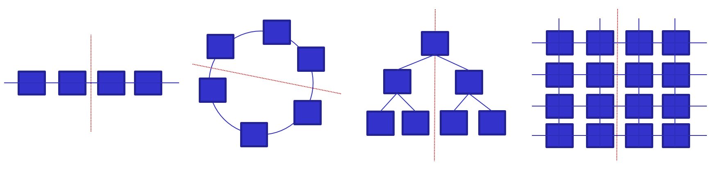
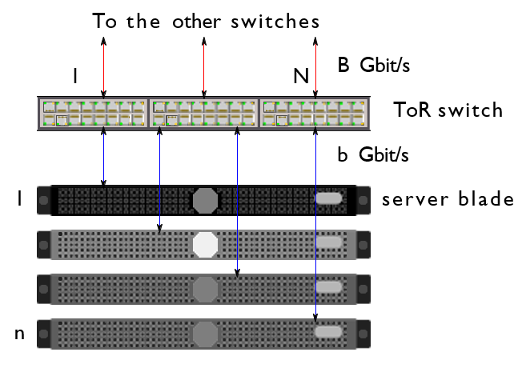
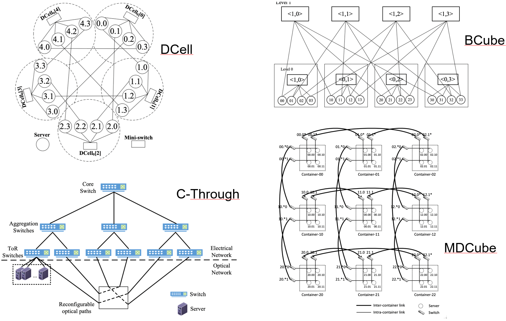
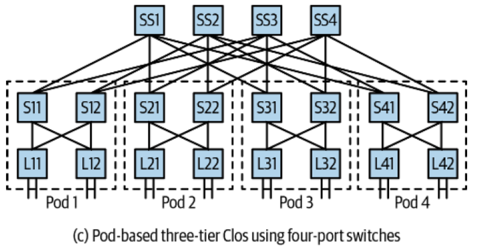
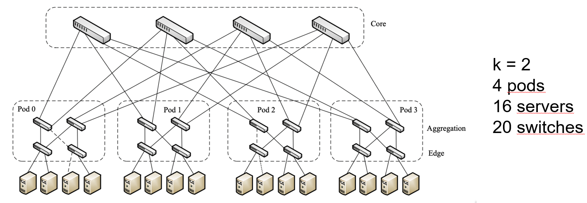

Power usage effectiveness (PUE) is the ratio of the total amount of energy used by a DC facility to the energy delivered to the computing equipment
$$
P U E=\frac{\text { Total Facility Power }}{\text { IT Equipment power }}
$$

$$\begin{array}{|c|c|c|}
\hline \text { PUE } & \text { DCiE } & \text { Level of Efficieny } \\
\hline 3.0 & 33 \% & \text { Very Inefficient } \\
\hline 2.5 & 40 \% & \text { Inefficient } \\
\hline 2.0 & 50 \% & \text { Average } \\
\hline 1.5 & 67 \% & \text { Efficient } \\
\hline 1.2 & 83 \% & \text { Very Efficient } \\
\hline
\end{array}$$

# Infrastructure

A high-performance data center WSC (Web-Scale Computing) must operate continuously at optimal conditions, requiring efficient and reliable power delivery and building infrastructure. 

## Cooling

Cooling usually requires about half the energy required by the IT equipment (servers + network + disks).

| Amortized Cost | Component | Sub-Components |
| :--- | :--- | :--- |
| $\sim 45\%$ | Servers | CPU, memory, disk |
| $\sim 25\%$  | Infrastructure | UPS, cooling, power distribution |
| $\sim 15\%$  | Power draw | Electrical utility costs |
| $\sim 15\%$  | Network | Switches, links, transit |

Cooling topologies have tradeoffs in complexity, efficiency, and cost.

- Open loop is the the simplest cooling approach: it's an open-the-windows approach. It requires filtering of airborne particles, and may introduce complex control problems.
- Closed loop cooling systems are suitable for high-density datacenters where heat dissipation is critical. However, their operational efficiency is usually not as high as other systems. Here an example of 2-loops:

- 3-loop system is an evolution of 2-closed-loops. It's expensive and has complex controls but provides good efficiency.

## Networking

The evolution of computing infrastructures can be presented in the following steps: client-server, web applications, microservices and datacenters/warehouse scale computing. 
In terms of horizontal scaling, networking lacks a straightforward solution. 

- Increasing the leaf bandwidth is simple: doubling the number of servers will provide twice the network ports and bandwidth. 
- However, if every server needs to communicate with the others, **bisection bandwidth** must be considered. 

The bisection bandwidth is the bandwidth across the narrowest line that divides the newtork into two parts equally, and it is important for characterizing the network capacity.

Data center's networking can be classified in the following ways: 

- **Switch-centric** (also called router-centric): alle the nodes are implemented as specialized hardware which can manage traffic performing packet forwarding. Examples are:
	- Classical 3-tier architecture
	- Leaf-Spine architectures
- **Server-centric**: Uses servers with multiple Network Interface Cards (NICs) to act as switches in addition to performing other computational functions. This approach might cause slow performance.
- **Hybrid architectures**: combining switches and servers for packet forwarding is a current trend in computing infrastructures, but it can be expensive. 

### Switch-centric: Classical 3-tier architecture

The internal network is divided into three levels.

1. **Access**: This network layer connects the servers to the network.
2. **Aggregation**: This level groups the servers together.  It's usually implemented through TOR (Top Of the Rack) switches. 
3. **Core**: This level is the furthest from the individual servers and aggregates the entities of the "aggregation" level.

Three layer architecture reflects the topology of the data center.

3-tier architecture is an generic approach to networking: in a rack, all servers are connected to a ToR access switch. the servers and the ToR switch are in the same rack.

{width=50%}

Aggregation switches are either in dedicated racks or shared racks with other Top-of-Rack (ToR) switches and servers. This setup has limited scalability and can lead to higher complexity for switch management.

End-of-Row (EoR) is an alternative to Top-of-Rack (ToR) where an aggregation switch is placed at the end of a line of racks, one per corridor. Servers in one rack are directly connected to the aggregation switch in another rack. However, EoR requires aggregation switches with more ports and complex cabling, resulting in longer cables and higher costs.

### Switch-centric: Leaf-Spine architectures

It's an architecture based on two-stage interconnections based on a circuit switching architecture, once used in telephony (an alternative architecture to the "classical" packet switching). There are two levels:

- **Leaf** switches act as top-of-rack (ToR) switches  
- **Spine** switches are dedicated aggregation switches.

Pros: 

- Leaf and spine topology is bidirectional for each switching module.
- Number of hops is the same for any pair of nodes
- Small blast radius: if you have a failure in the architecture, the blast (the number of interested machines) is limited.

### Server-centric 

- A server-centric architecture proposed for container-sized data centers.
- Only servers used to build the data center, reducing costs.
- 3D-Torus topology used for direct server interconnection.
- Network locality exploited to increase communication efficiency.
- Drawbacks are servers requiring multiple NICs, long paths, and high routing complexity.

### Hybrid architectures 

Many network topologies are out there:

1. Fat tree (classic hierarchical topology, clearly visible access aggregation and core levels
2.  D-Cell, recursive topology. Cells are organized in levels and the network \"builds itself\" through a discover mechanism
3. Hypercube topologies

- Point Of Delivery (POD): a group of several components that work together to deliver network services. It enhances modularity, scalability, and manageability of data.
- Gigabit Ethernet switches with the same number of ports can be used.

This architecture is known to be used by Microsoft and Amazon for example..

