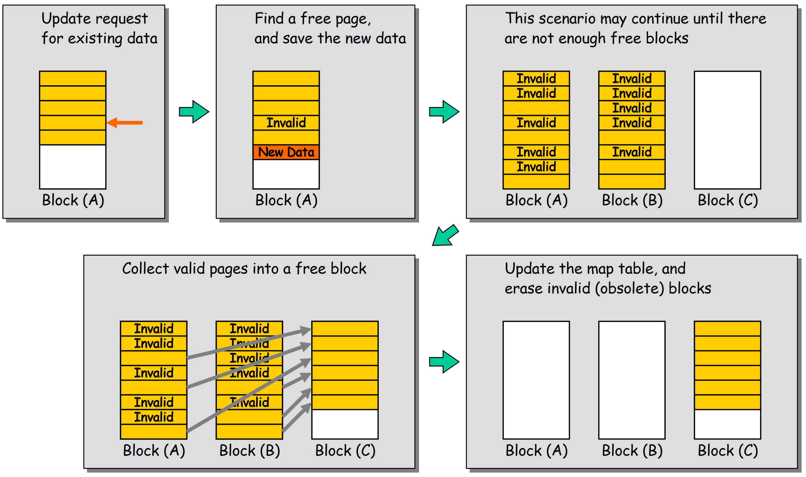
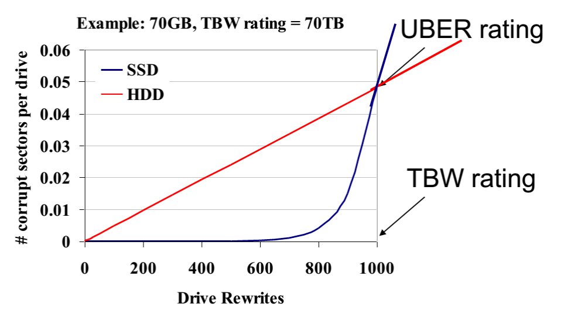

# Storage

Disks can be seen by an OS as a collection of  
data blocks that can be read or written independently. 

- To allow the ordering/management among them, each block is characterized by a unique numerical address called LBA (Logical Block Address). 
- Typically, the OS groups blocks into clusters to simplify the access to the disk. Clusters, which can range from 1 disk sector (512 B) to 128 sectors (64 KB), are the minimal unit that an OS can read from or write to a disk. 

Clusters contains: 

- File data
- Meta data:
	- File names  
	- Directory structures and symbolic links  
	- File size and file type  
	- Creation, modification, last access dates  
	- Security information (owners, access list, encryption)  
	- Links to the LBA where the file content can be located on the disk

Since the file system can only access clusters, the real occupation of space on a disk for a file is always a multiple of the cluster size.

$$\text{actual size on disk}= ceil (\frac{\text{the file size}}{\text{the cluster size}})*\text{the cluster size}$$

The waste of space is called internal fragmentation of files.
$$\text{waste disk space} = \text{actual size on disk} - \text{file size}$$

Deleting a file never actually deletes the data on the disk: when a new file will be written on the same clusters, the old data will be replaced by the new one.

As the life of the disk evolves, there might not be enough space to store a file contiguously. In this case, the file is split into smaller chunks that are inserted into the free clusters spread over the disk. The effect of splitting a file into non-contiguous clusters is called external fragmentation. As we will see, this can reduce a lot the performance of an HDD.

## HDD 

An HDD consists of one or more rigid ("hard") rotating disks (platters) with magnetic heads arranged on a moving actuator arm to read and write data to the surfaces.

HDD geometry: 

- Sectors arranged into tracks  
- A cylinder is a particular track on multiple platters  
- Tracks arranged in concentric circles on platters  
- A disk may have multiple, double-sided platters

To understand well this: 

- Externally, hard drives expose a large number of sectors (blocks)  
- Typically 512 or 4096 bytes  
- Individual sector writes are atomic  
- Have a header and an error correction code  
- Multiple sectors writes may be interrupted (torn write)

{width = 50%}

The external track are "faster" to read since angular velocity considerations and are more dense. 

Four types of delay:

1. Seek delay: The seek time represents the time necessary to align the head over the track  $T_{\text{seek AVG}}=\frac{T_{\text{seek MAX}}}{3}$ 
2. Rotational Delay: Time to rotate the desired sector to the read head related to RPM 2 $T_{rotation}=\frac{R_{period}}{2}$ with $R_{period}=\frac{1}{RPM}$. there is the time where the sector is waited to be under the head (and it's based on rotational speeds ... just an estimation)
3. Transfer time: then there is the time given by the controller to transfer data 
4. Controller Overhead: Overhead for the request management

So at the end:$T_{I/O}=T_{seek}+T_{rotation}+T_{transfer}+T_{overhead}$. Or, considering data locality: $T_{I/O}=(1-DL)(T_{seek}+T_{rotation})+T_{transfer}+T_{overhead}$.

### Disk Scheduling

Since there is a queue of requests to the disk, they can be reordered to improve performance in HDD. Several scheduling algorithms: 

- **First come, first serve** (FCFS): Most basic scheduler, serve requests in order {width = 50%}
- **Shortest seek time first** (SSTF): Minimize seek time by always selecting the block with the shortest seek time  
- **SCAN** (the elevator algorithm): Head sweeps across the disk servicing requests in order.{width=50%} 
- **C-SCAN** (circular scan), C-LOOK: variants of Scan 

# SSD 

{width=50%}

- Single-level cell (SLC): simplest solution. For each cell just a voltage. Single bit per cell.
- Multi-level cell (MLC): Two bits per cell
- Triple-level cell (TLC): three bits per cel
- QLC, PLC...

{width=50%}

NAND flash is organized into Pages and Blocks:

- A page contains multiple logical block (e.g. 512B-4KB) addresses (LBAs)
	- A block typically consists of multiple pages (e.g. 64) with a total capacity of around 128-256KB. Pages can be in three states:  
		- Empty or erased
		- dirty or invalid
		- in use or valid

Actually there are some constraints: 

- Pages: smallest unit that can be read/written. Can't be erased.
- Blocks (or Erase Block): smallest unit that can be erased.

Remark: we can write and read a single page of data from a SSD but we have to delete an entire block to release it. 

SSDs have a limited lifespan due to NAND flash memory limitations. A whole block cannot be erased until all pages within the block are not used. The SSD must move data from other pages to another block to ensure all pages in a block are no longer in use before erasing it. *Why erase an entire block and not just erase a single page?* Erasing a single page would require the memory controller to keep track of which pages have been erased and which ones haven't (slow) and erasing only blocks helps to **extend the overall lifespan of the device**. 
This because when flash cells undergo numerous write-erase cycles, their electrical properties deteriorate, causing them to become unreliable.
The oxide layer in floating-gate transistors of NAND flash memory breaks down during the erasing process since this one involves a sizable electrical charge. So basically **when a block is erased, it degrades the silicon material** due to a large electrical charge.

{width=50%}

### FTL

Flash Translation Layer (FTL) is an SSD component that make the SSD “look as HDD”

- **Data Allocation and Address translation**: efficient methods to reduce Write Amplification effects and program pages within an erased block. 
- **Garbage collection**: reuse of pages with old data
- **Wear leveling**: distributing writes and erases evenly across all blocks of the device, ensuring that they wear out roughly at the same time. Erasing a block only happens when all the pages within it are unused, and any valid data from other pages is moved to another block before erasing the block entirely. 

### Block Mapping problem 

**Data Allocation and Address translation**: efficient methods to reduce Write Amplification effects and program pages within an erased block. 

Also Mapping Table Size is a problem ... With a 1TB SSD with a 4byte entry per 4KB page, 1GB of DRAM is needed for mapping.
Some approaches to reduce the costs of mapping:

- Block-based mapping: Mapping at block granularity, to reduce the size of a mapping table. But this can cause an increment of operations necessary.
- Hybrid mapping: When looking for a particular logical block, the ftl will consult the page mapping table and block mapping table in order: log blocks (page mapped) and then data blocks (block-mapped). Also FTL can perform merge operations to reduce the numbers of occupied blocks. 
- Page mapping plus caching: cache the active part of the page-mapped FTL. If a given workload only accesses a small set of pages, the translations of those pages will be stored in the FTL memory

## Garbage Collection

**Garbage collection**: reuse of pages with old data

{width=50%}

Garbage collection is costly. Also many file systems do not truly erase data, for instance, on Linux, the "delete" function eliminates the file meta-data but not the actual file, and as a result, the garbage collector wastes resources duplicating useless pages. However, having an OS that supports TRIM is a possible solution.

## Wear leveling

**Wear leveling**: distributing writes and erases evenly across all blocks of the device, ensuring that they wear out roughly at the same time. Erasing a block only happens when all the pages within it are unused, and any valid data from other pages is moved to another block before erasing the block entirely. 

# Summary SSD vs HDD 

{width=50%}

- UBER is a measure of the number of data errors per bits read
- TBW is the total amount of data that a SSD can sustain before failing

## Storage Systems

| Number | Domain  and Advantages | Disadvantages |
| :---: | :--- | :--- | 
| DAS (Direct Attached Storage)  |  Suitability for budget and constraint-heavy environments. Simple storage solutions  |  Limited accessibility  and scalability. No central management or backup |
| NAS (Network Attached Storage)  |  File storage and sharing and big data storage. Scalability  and greater accessibility   |  Increased LAN traffic, performance limitations and security and reliability concerns |
| SAN (Storage Area Network)  |  Suitable for DBMS and virtualized environments, have best performance, best scalability  and best availability  |  High costs |

- A Direct Attached Storage (DAS): A DAS is a storage system directly connected to a server or workstation and appears as disks/volumes to the client operating system.
- A Network Attached Storage (NAS): a computer connected to a network that offers file-based data storage services such as FTP, Network File System, and SAMBA to other devices on the network. It appears as a File Server to the client OS.
- Storage Area Networks (SAN): Remote storage units are connected to PCs via networking technologies such as Fiber Channel and appear as disks/volumes on the client's OS.

{width=50%}

## NAS vs SAN 

San (Storage Area Network) has a dedicated network for accessing storage devices.

{width=50%}

- NAS provides storage and file system, while SAN only provides block-based storage.
- NAS is seen as a file server by the client OS, while SAN appears as a disk.
- NAS is used for low-volume access by many users, while SAN is used for petabytes of storage and simultaneous file access, like audio/video streaming.

Another factor contributing to write amplification is wear-leveling algorithms employed by SSD controllers. These algorithms distribute writes evenly across all available flash memory cells to prevent certain cells from wearing out faster than others.

