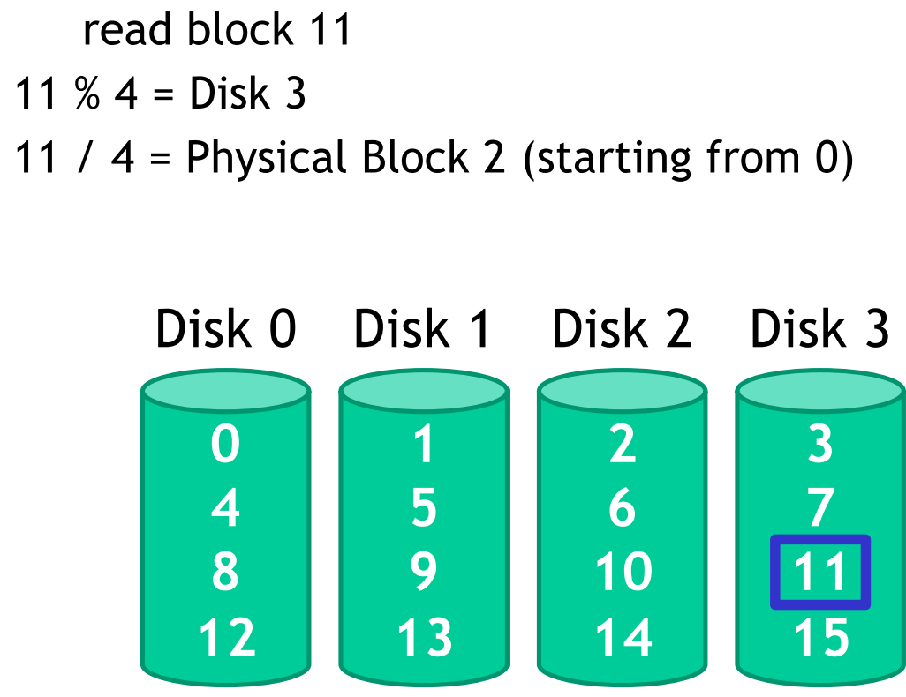
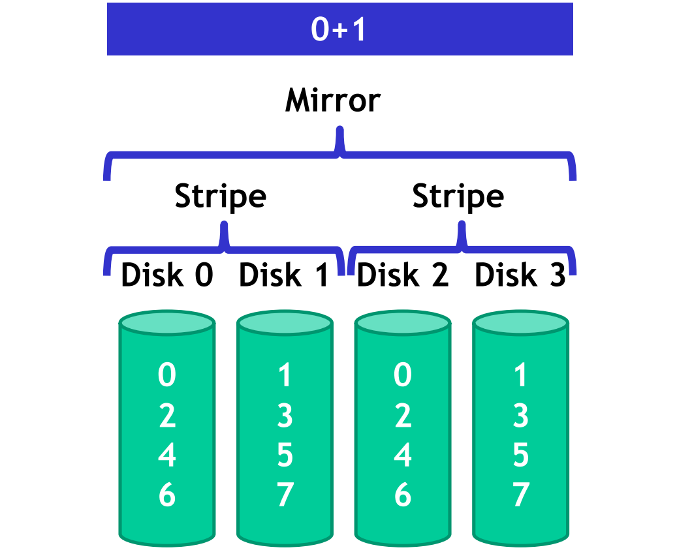
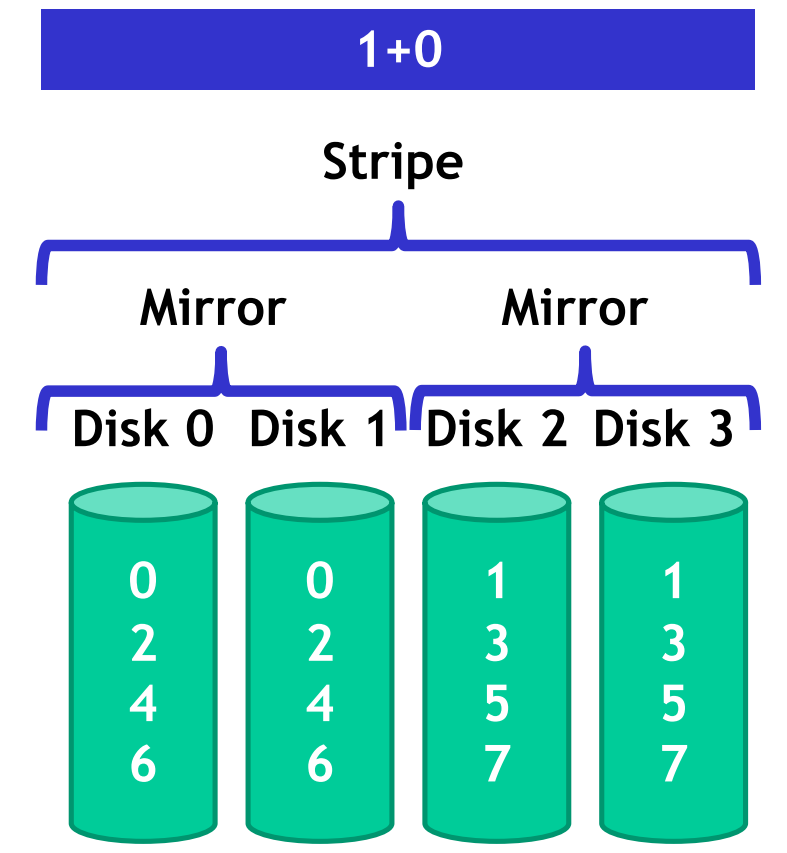
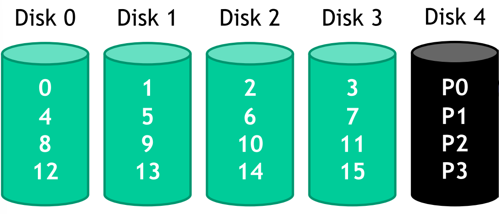

# Raid prologue

RAID increases performance, size, and reliability of storage systems by utilizing several independent disks as a single, large, high-performance logical disk. 
Data is striped across multiple disks, allowing for high data transfer rates as well as load balancing across the disks. 
2023-07-04
Two orthogonal techniques: 

- data striping: to improve performance 
- redundancy: to improve reliability

## Data striping 

Data is written on multiple disks according to a **cyclic algorithm** (round robin). 

# RAID 

Redundancy is used to tolerate disk failures with **error correcting codes**. The codes are calculated and stored separately from the data and this permits the **magic** of RAID 3, 4,5,6 etc. Write operations also update the redundant information, so **performance is worst** than traditional writes.

Super simple example of the idea that is the foundation of RAID:

## RAID levels 

### RAID 0 

Faster than using a single disk, but reliability is reduced because two disks are more likely to fail than one. Best write performance config since there is no need to update redundant data but still it's a parallelized approach.

Formulas: 

$$Disk = logical_{block \_ number} \space \space mod \space \space (number_{disks})$$
$$Offset = \frac{logical_{block \_ number}}{(number_{disks})}$$
Capacity: 

- All space on drives can be filled with data 

Reliability: 

- If a drive fails, data is permanently lost 
- $MTTDL = MTTF$ 

Sequential read and write (where $S$ is sequential transfer rate):

- Full parallelization across drives $N * S$

Random read and write (where $R$ is sequential transfer rate):

- Full parallelization across all drives $N * R$

{width=50%}

### RAID 1

{width=50%}

### RAID x + y

We can use the notation RAID $x+y$ to say:

- $n*m$ is the total number of disks
- $m$ groups of $n$ disks and applying RAID $x$ to each group before applying RAID $y$ to treat the $m$ groups as single disks.

Basically the number $y$ in the notation RAID $x+y$ indicates the **upper** organization. 

Example of RAID 0 (striped disks) + RAID 1 (mirrored) : 

{width=50%}

Example of RAID $1$ (mirrored disks) + RAID $0$ (striped) : 

{width=50%}

{width=50%}

RAID $1+0$ and RAID $0+1$ have the same blocks but allocated differently. The result is that both have the same performance and storage but **RAID $1+0$ has a higher fault tolerance compared to RAID $0+1$ on most RAID controllers**.

> "The problem is that in RAID $0$ if one disk fails the overall RAID $0$ system fails. So in case of the two different configurations, the one with less disks in RAID 0 has an higher reliability."

For this motivation RAID $0+1$ is never used. 

Formulas: 

- Capacity is $\frac{N}{2}$ 
- If you are lucky,  $\frac{N}{2}$  drives can fail without data loss
- the sequential write is $(\frac{N}{2})*S$
- the random **reading** doesn't suffer of block skipping so $N*R$ 
- since we have to copy two time the same information we have that the random **writing** is $(\frac{N}{2})*R$

#### The problem with RAID x+y 

The issue with these systems is that information have to be or committed or not committed at all. **Partially commited** data is very dangerous since it gives inconsistencies to the system. This is a problem when there are power failures.

### RAID 4 

{width=50%}

In this case the Disk 4 onlyu stores parity information for the other disks. The parity information can be computed in mainly two different ways: 

- **Additive parity**: when you modify $x-th$ disk, you have to read also the information of the other disks to compute the parity block.
- **Subtractive parity**: when you modify $x-th$ disk you are not required to read the other blocks to compute the parity block. To compute the new parity bit I use a different formula and not the "standard" one (example: $0 \oplus 0 \oplus 0 \oplus 1 = 1$ where $\oplus$ is `xor` operation) that permits to the raid controller to not read the others disks data: $P_{new} = C_{old} \oplus C_{new} \oplus P_{old}$ . 

In RAID 4, serial reads are not an issue. Serial writes only update the parity drive once, while random writes require updating the parity drive for each write (with three writes in three different disks can results other three writes in the parity disk). As a result, RAID 4 experiences poor write performance and is bottlenecked by the parity drive.

Case of random writes (the real bottleneck of RAID 4):

{width=50%}

### RAID 5

{width=50%}

- Parity blocks are spread across all N disks, solving the issue of RAID 4 as writes are evenly spread across all drives.
- For random writes in RAID 5:
   1. Read the target and parity blocks.
   2. Use subtraction to calculate the new parity block.
   3. Write the target and parity blocks.

### RAID 6 

RAID 6 improves reliability beyond RAID 5 by **tolerating two simultaneous disk failures**. It uses Solomon-Reeds codes with two redundant schemes, resulting in two parity blocks. To implement RAID 6, an additional two disks are required, for a total of $N+2$ disks.

### RAID recap

RAID types:

- RAID 0: Striping only
- RAID 1: Mirroring only
  - RAID 0+1
  - RAID 1+0
- RAID 2: Bit interleaving (not used)
- RAID 3: Byte interleaving with redundancy (parity disk)
- RAID 4: Block interleaving with redundancy (parity disk)
- RAID 5: Block interleaving with redundancy (distributed parity block)
- RAID 6: Greater redundancy with tolerance for 2 failed disks.

Formulas: 

|              | RAID 0 |  RAID 1   |  RAID 4   |  RAID 5   | RAID 6 |
|:------------:|:------:|:---------:|:---------:|:---------:|:------:|
|   Capacity   |  $N$   |   $N/2$   |   $N-1$   |   $N-1$   | $N-2$  |
|  Seq. Read   | $N*S$  | $(N/2)*S$ | $(N-1)*S$ | $(N-1)*S$ |        |
|  Seq. Write  | $N*S$  | $(N/2)*S$ | $(N-1)*S$ | $(N-1)*S$ |        |
| Random Read  | $N*R$  |   $N*R$   | $(N-1)*R$ |   $N*R$   |        |
| Random Write | $N*R$  | $(N/2)*R$ |   $R/2$   | $(N/4)*R$ |        |
| How many disks can fail?  | -  | 1 | 1   | 1  |   2 |

Best performance and most capacity ? raid 0 
Greatest error recovery raid 1 or (1+0) or RAID 6
Most popular and well balanced RAID 5 

RAID 6 is a configuration where there are, two Logical Block Address that work as parity LBA, for each row of data striped in the disks
So, if you have N disks, a total amount of 2 disks of memory is used as parity

Then, when you need to write a datum, you need to read from the disk where the datum is, plus the two other disks where the parity blocks are
Now, you can calculate the two new values of the parity blocks, and write them on the two respective disks, and finally write the new datum, replacing the old one
