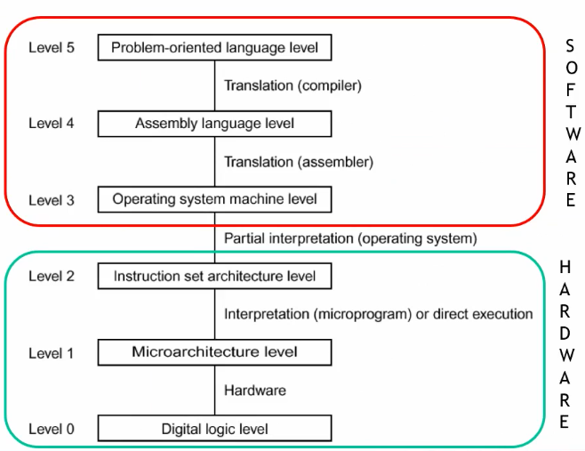
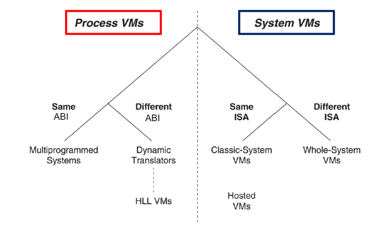
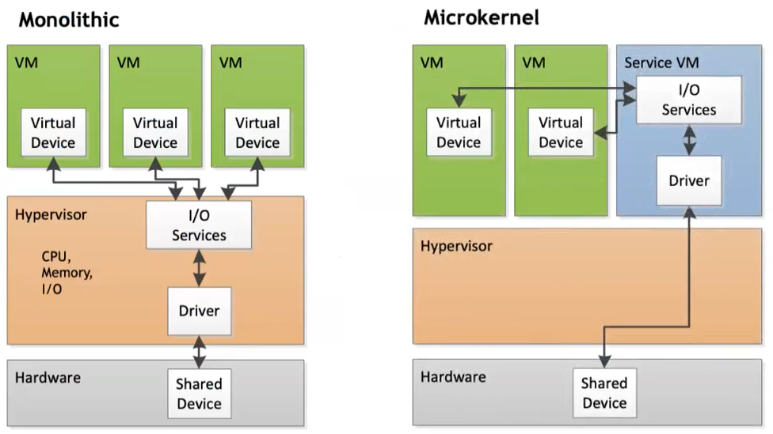
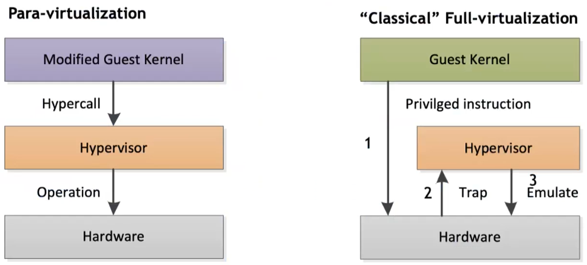

# Virtualization 

[Virtualization](../../Advanced%20OS%20(WIP)/src/02.Virtualization.md) adds a layer of abstraction between hardware and software for different purposes. 

**Virtualization Benefits:**

- Provides flexibility and super-user (root) access to the Virtual Machine (VM) for fine-tuning settings and software customization.

**Virtualization Issues:**

- Suffers from performance interference and inability to deliver strong Service Level Agreement (SLA) guarantees.

**Properties of Virtual Machines (VMs):**

- Partitioning: Divide a computer into separate, isolated segments where each segment functions as an individual system.
- Isolation: Every VM runs independently of the others, ensuring that activity (or failure) of one VM does not affect others.
- Encapsulation: The entire state of a VM can be captured into a file, which can be replicated or moved just like any other file. This simplifies the process of VM replication and migration.
- Hardware Independence: All VMs observe the same virtual hardware specifications independent of the host system. This homogeneity greatly simplifies VM provisioning and migration.

**Other definitions:**

- Virtual Machine Monitor:
	- The virtualization software
- Hypervisor:
	- A virtualization software that runs directly on the hardware. It can be divided into:
		- type 1: no Host OS
		- type 2: the VMM is executing over an Host OS
- Virtual Machine Manager:
	- A VMM or Hypervisor that is also used to create, configure and maintain virtualized resources.
	- It provides a user-friendly interface to the underlying virtualization software

**Recall ISA:**

- User ISA: the ISA visible to application includes operations like sum, multiplication, logic operations, and branches. 
- System ISA: this ISA is used when the OS interacts with hardware through drivers, memory management, and scheduling.

### Type of VMs

#### Process VMs

The process VMs "emulates" levels 0-3 of the architecture and has the capability to support individual processes. The virtualizing software is positioned at the ABI interface, sitting right above the OS. In addition to emulating user-level instructions, this software also mimics operating system calls.

- same ABI: basically a sandboxed application. Containers are exactly this. Process level VMs running on the same hw architecture.
- different ABI: what is generally called "emulation". Also an example of High Level Language VMs is the Java VM. JRE emulates everything up to the third level of the architecture. 

#### System VMs

**Classic-System Virtual Machine**

- Virtual Machine Monitor (VMM) directly installed on hardware
- Has the ability to intercept guest Operating System's (OS) interaction with hardware resources
- Among the most efficient VM architectures, allowing hardware to execute the same instructions of VMs
- Enables running two different OSs on the same hardware

**Whole-System VM**

- Entire software system is virtualized
- Involves different Instruction Set Architectures (ISAs) requiring emulation of both application and OS code, for instance, through binary translation
- No native execution is possible
- VMM and guest software are executed on top of a conventional host OS
- VM software needs to emulate the entire hardware environment and convert all the guest ISA operations into equivalent host OS calls

#### Type 1 hypervisor

Type-1 hypervisor presents two fundamental approaches to managing I/O:

**1. Monolithic:**

In this approach, device drivers run within the hypervisor itself. Its main advantages include better overall performance and improved performance isolation. However, the limiting factor is that monolithic hypervisors can only run on hardware for which they already have drivers.

**2. Microkernel (e.g. XEN - used by Amazon):**

The microkernel approach is more flexible, with device drivers running inside a service Virtual Machine (VM's). This makes the hypervisor smaller and allows for the leveraging of an existing operating system (OS) driver's ecosystem. It can also use 3rd party drivers, although recompiling may occasionally be required.

#### Type 2 hypervisors

Type-2 feature is that there is a Host OS that manages the hardware where the Virtual Machine Manager (VMM) runs. The benefits include its flexibility with regard to underlying hardware and simplicity in management and configuration, as the VMM can utilize the Host OS for GUI provision. However, conflicts might arise between the Host OS and Guest OS (e.g., Virtual Memory), and the Host OS can take up a significant set of physical resources, such as one core. 

#### System VMs–Same ISA Virtualization Techniques

Two main techniques: 

- Paravirtualization offers an interface resembling but not identical to hardware, with the aim of reducing costly tasks, simplifying the Virtual Machine Manager (VMM) and enhancing performance. The Guest OS must be specifically ported to the para-API in paravirtualized systems, so it's incompatible with an unmodified OS.
- Full Virtualization completely imitates the underlying hardware with an unmodified Guest OS and Hypervisor mediation of guest's tasks and requests. However, it's not compatible with all architecture. 

Almost all virtualization solutions today are grounded on full virtualization to avoid modifying the OS, and they generally incur a CPU overhead of 1-2%.

#### Containers

Containers are pre-configured packages for executing code that offer predictable, repeatable, and immutable functionality when duplicated. They act as kernel-based VMs, sharing the host system kernel with other containers, which makes them extremely lightweight. Due to this, containers are often used in DevOps procedures like CI/CD.
Containers are also useful for creating multi-user Platform-as-a-Service (PaaS) or Software-as-a-Service (SaaS). 

##### Docker 

Docker is an open-source platform for building, shipping, and running applications inside containers using a Docker File. Docker Swarm is a container orchestration tool that competes with Kubernetes. It is developed by Docker and closely integrated within the Docker ecosystem. Docker is the standard for building a single container.

##### Kubernetes

Kubernetes is for managing medium-large clusters and complex applications. Can run containers on many heterogeneous machines, increase/decrease performance, share load between containers, and start new containers on different machines if one fails.

## Cloud Computing

Cloud Computing is a model that provides convenient and on-demand network access. Access is provided to a shared pool of configurable computing resources. These include networks, servers, storage, applications, and services. These resources can be swiftly provisioned and released with minimal management effort or interaction with the service provider.

**Cloud Benefits**

1. Cost Efficiency: Reduces IT expenditure.
2. Enhanced Performance: Swift software updates ensure improved functionality.
3. Infinite Storage: Provides virtually unlimited data storage.
4. Reliable Data: Promotes data reliability and integrity.
5. Universal Accessibility: Ensures access to documents anywhere, anytime.
6. Device Independence: Operates independently of the device used.

**Cloud Limitations**

1. Internet Dependence: Requires continuous internet connectivity.
2. Low-Speed Connection Inefficiency: May deliver poor performance with slow connections.
3. Limited Features: Might have feature restrictions.
4. Data Security Concern: Potential risks associated with data security.

### Type of clouds

**Public Cloud Infrastructure**

- Accessible on a rental basis.
- Completely self-service for customers.
- Accountability is rooted in e-commerce.

**Private Cloud Infrastructure**

- An internally managed virtualization environment set up on organization's own servers.
- Provides total control over every aspect of the infrastructure.
- Involves capital investment and flexibility concerns.

**Community Clouds**

- Managed by several federated organizations.
- Economies of scale achieved by combining multiple organizations.
- Resources can be shared and used by one organization when others are not using them.
- Similar to private clouds.
- Either hosted locally or externally; common practice is to share participants' infrastructure.

#### Edge and Fog Computing

Edge and fog computing are two \"emerging\" paradigms that exploits
intelligence at the edge of the network (of sensors, of data hotspots
ecc) in order to provide faster communications and services. The progressive convergence between Cloud Computing and the Internet of Things (IoT is resulting in a Computing Continuum.

