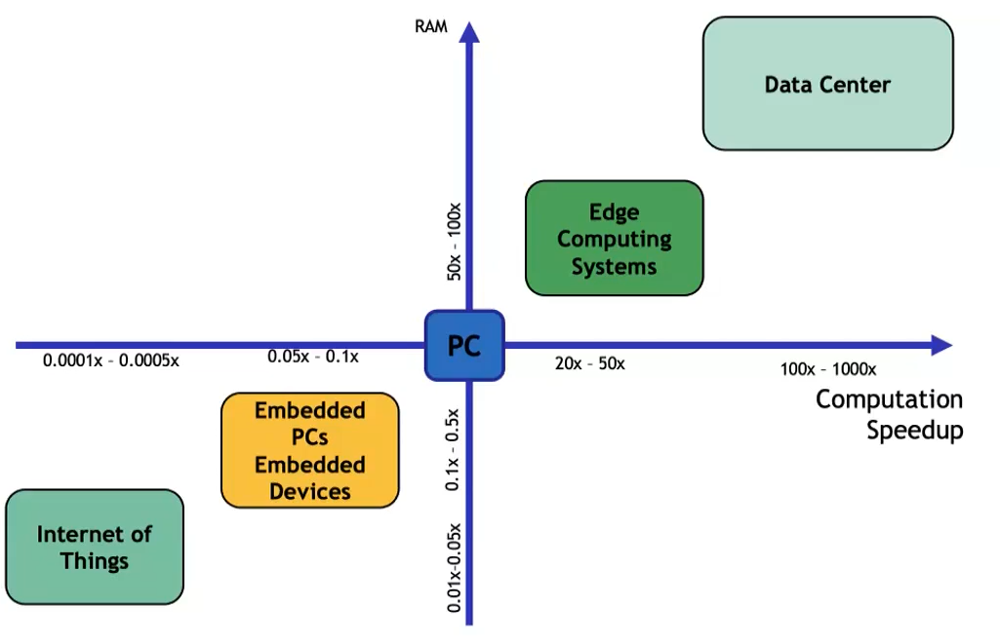

# Data centers

## Traditional data centers

The data center approach gained popularity in computing. DCs shift has led to the rise of Software as a Service (SaaS) and its widespread use. DCs also allow for more efficient and cost-effective execution of computationally intensive tasks, like training neural networks.

| ADVANTAGES                                        |     DISADVANTAGES         |
| :---: | :--:|        
| Lower IT costs                                    | Require a constant Internet connection (so not work well with low-speed connections and latency problem) |
| High performance, "unlimited" storage capacity and backup | Privacy and security issues                                                          |
|       Device independence (no need to manually configure ...) |                    High Power Consumption                                                                   |

## Warehouse-scale Computer

From a DCs are moving towards Warehouse Scale Computers (WSCs). Actually WSCs can be considered as a type of DCs, the main concept is that: 

- DCs consist of a collection of different servers
- WSCs use a relatively homogeneous hardware and system software platform to simplify management and reduce cost. 

The machine is itself this large cluster or aggregation of servers and needs to be considered as a single computing unit.	

Here the main differences: 

- Traditional data centers: 
	- DCs usually house many small- or medium-sized applications.
	- Each application runs on dedicated hardware, isolated from other systems.
	- Applications within a data center typically do not communicate with each other.
	- Data centers can host hardware and software for multiple organizational units or companies.
- WSCs:
	- WSCs run few large applications or internet services
	- There is a common resource management infrastructure which provides deployment flexibility
	- The main requirements are homogeneity, single-organization control, and cost efficiency.

