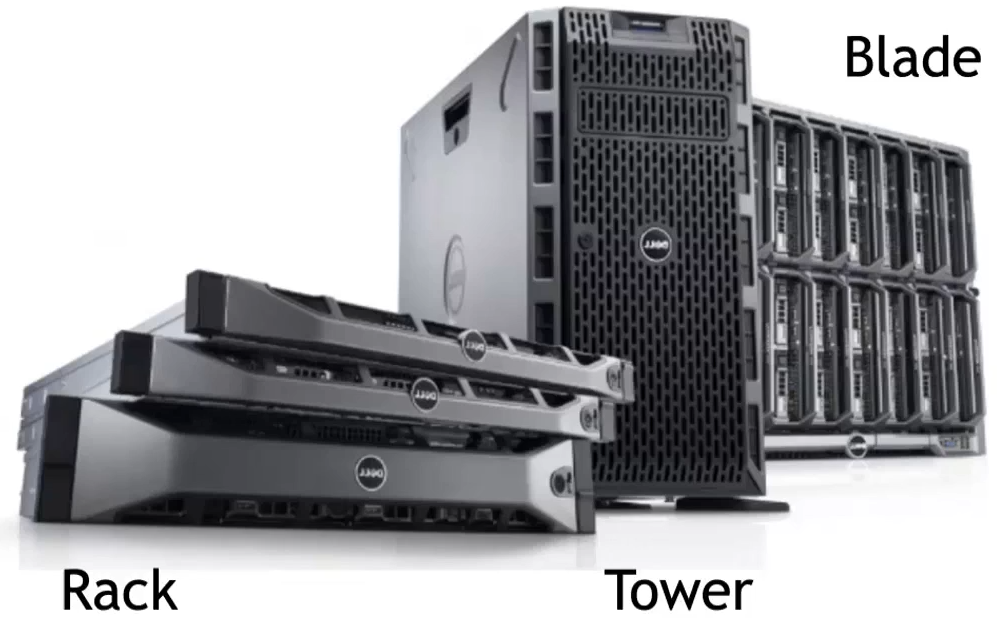

# Servers

Servers are organized in racks, blades, or towers and are the computational unit in data centers or WSC.

{width=50%}

## Tower 

A tower server looks and feels much like a traditional tower PC.

| PROs  | CONs| 
|---|----|
| Scalability and ease of upgrade | Consumes a lot of space |
| Cost-effective (cheapest servers) | Provides a basic level of performance |
| Cools easily (low component density) | Complicated cable management|

## Rack server

| PROs                        | CONs        |
| --------------------------- | ----------- |
| Failure containment         | Power usage |
| Simplified cable management |         Maintenance    |
| Cost-effective                            |             |

Server racks use rack units, or "U"s, as a measurement. 1U equals 44.45 mm (1.75 inches).

## Blade server 

Blade servers are a new and advanced type of server that can be described as a hybrid rack server. These servers are housed in blade enclosures, creating a blade system. Blade servers are the smallest type of server available, making them ideal for conserving space.

| PROs                                                               | CONs                                                 |
| ------------------------------------------------------------------ | ---------------------------------------------------- |
| Load balancing and failover                                        | Expensive configuration                              |
| Centralized management, all blades connected to a single interface | high component density -> effort to avoid overheated |
| Cabling                                                            |                                                      |
|                              Size and form-factor                                      |                                                      |

## Technologies inside servers

|     | Advantages | Disadvantages |
| --- | ---------- | ------------- |
| CPU | Easy to be programmed and * support any programming framework. | Most suited for simple models that do not take long to train and for small models with small training set.               |
| GPU |   Ideal for applications in which data need to be processed in parallel like the pixels of images or videos. | Programmed in languages like CUDA and OpenCL and therefore provide limited flexibility compared to CPUs. |
| TPU | Very fast at performing dense . vector and matrix computations  and are specialized on running very « fast ML workloads | For applications and models based on TensorFlow/PyTorch/ JAX Lower flexibility compared to CPUs and GPUs |
| FPGA | Higher performance, lower cost . and lower power consumption compared to other options like . CPUs and GPU | Programmed using OpenCL and High-level Synthesis (HLS). Limited flexibility compared to other platforms. |

