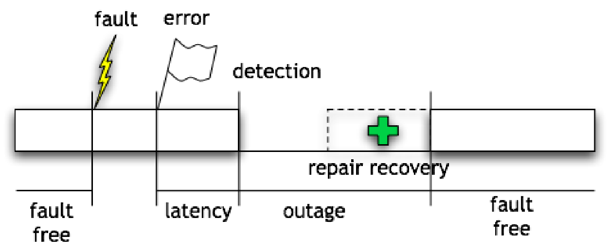
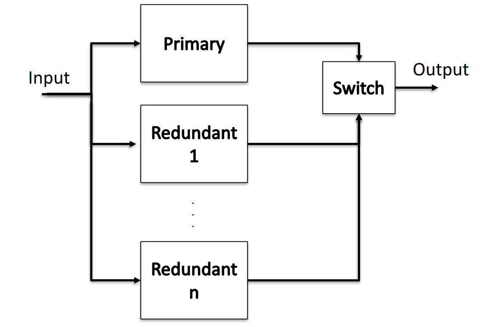
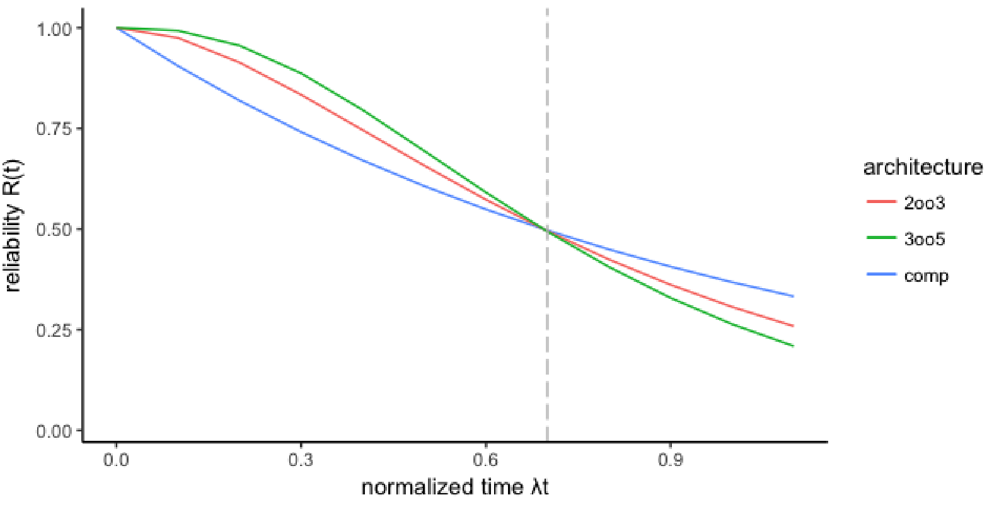
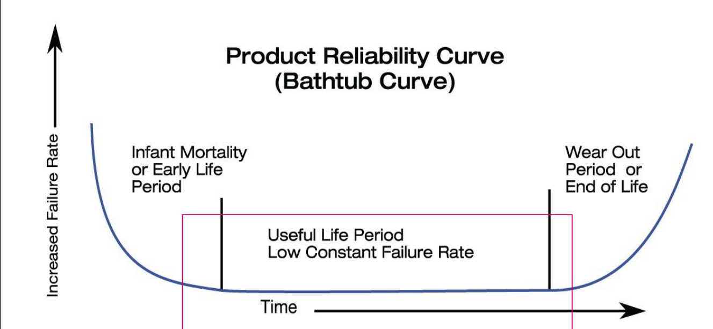

d
# Dependability

Dependability refers to the ability of a system to perform its intended functionality while also exposing several key properties, including:

- **Reliability**: Continuity of correct service
- **Availability**: Readiness for correct service
- Maintainability: Ability for easy maintenance
- Safety: Absence of catastrophic consequences
- Security: Confidentiality and integrity of data

#### Failure Rate

Type of malfunctioning:

-   Fault: physical defect or software bugs.
-   Error: program incorrectness that can result from a fault.
-   Failure: catastrophic scenario

A fault can cause 

## Reliability 

$R(t)$ = probability that the system will operate correctly **until** time $t$. 

$$R(t)=e^{-\lambda t}=e^{-\frac{1}{MTTF} t}$$

In other terms: $R(t) = P(\text{not failed during }[0, t])$ assuming it was operating at time $t = 0$. 

We can also define the unReliability:

$$S(t) = 1-R(t)$$
$S(t)$, gives the probability that the system will fail before time $t$.

### Reliability Block Diagrams

An inductive model where a system is divided into blocks that represent distinct elements such as components or subsystems (each with its own reliability).

Serie:
$$R_s = R_a*R_b*...R_n$$
Parallel:
$$R_p=1-(1-R_a)*(1-R_b)*...(1-R_n)$$

### RooN

A system having one primary replica and n redundant replicas (with identical replicas and perfect switching).

#### Triple Modular Redundancy - TMR

Triple Modular Redundancy (TMR) is a system that relies on three components and a voter to ensure proper functioning. The system is considered to be working properly if at least **two** out of the **three** components are functioning correctly, in addition to the voter. TMR is particularly useful for missions with shorter durations, as it provides a higher level of reliability than the single component's one. 

The important concept here is that the more components you add the higher will be the probability of failures at the limit of infinite of time.
It depends on the time horizon. There is always a point in time where the reliability of basic components are more realiable than any kind of redundancy. 
And this point in time is: 

$$t = \frac{ln2}{\lambda _m}$$ 
$R_{TMR}(t) > RC(t)$ when the mission time is shorter than $70\%$ of $MTTF$. So it's always important to know the goal and the length of the mission time to make correctly rendundant systems. 

$$R_S(t)=R_V \sum_{i=r}^n R_c^i\left(1-R_C\right)^{n-i} \frac{n !}{i !(n-i) !}$$

Where:

- $R_s$ System reliability 
- $R_c$ Component reliability }
- $R_V$ Voter Reliability
- $n$ Number of components
- $i$ Minimum number of components which must survive 

## Availability 

$A(t)$: probability that the system will be operational at time $t$

Fundamentally different from reliability since it admits the possibility of brief outages. 

| Availability | System      |                   |
| ------------:|:----------- |:----------------- |
|          99% | ~ 4 days     | Generic web site  |
|        99.9% | ~ 9 hours     | Amazon.com        |
 |       99.99% | ~ 1 hour     | Enterprise server |
|      99.999% | ~ 5 minutes  | Telephone system  |
|     99.9999% | ~ 30 seconds | Phone switches                  |

[Same definitions seen in Software Engineering 2](03.Availability.md) :

- Mean Time To Failures ($MTTF$): time between the recovery from one incident and the occurrence of the next incident, also known as up-time. 
- Mean Time Between Failures ($MTBF$): Mean time between the occurrences of two consecutive incidents

$$M T T F=\int_0^{\infty} R(t) d t$$
$$MTBF=\frac{\text{total operating time}}{\text{number of failures}}$$

sometimes we also use failure rate $\lambda=\frac{\text{number of failures}}{\text{total operating time}}$ .

$$A = \frac{MTTF}{(MTTF+MTTR)}=\frac{\text{uptime}}{\text{uptime} + \text{downtime}}$$

{width=50%}

### Data Center Availability 

Data-center availability is defined by in four different tier level. Each one has its own requirements:

- **Tier 1**: Basic infrastructure with 99.671% availability.
- **Tier 2**: Redundant infrastructure with 99.741% availability.
- **Tier 3**: Multiple independent paths and concurrent maintenance with 99.982% availability.
- **Tier 4**: Fault-tolerant infrastructure with 99.995% availability. with independently dual-powered cooling equipment and backup electrical power storage and distribution facilities 

