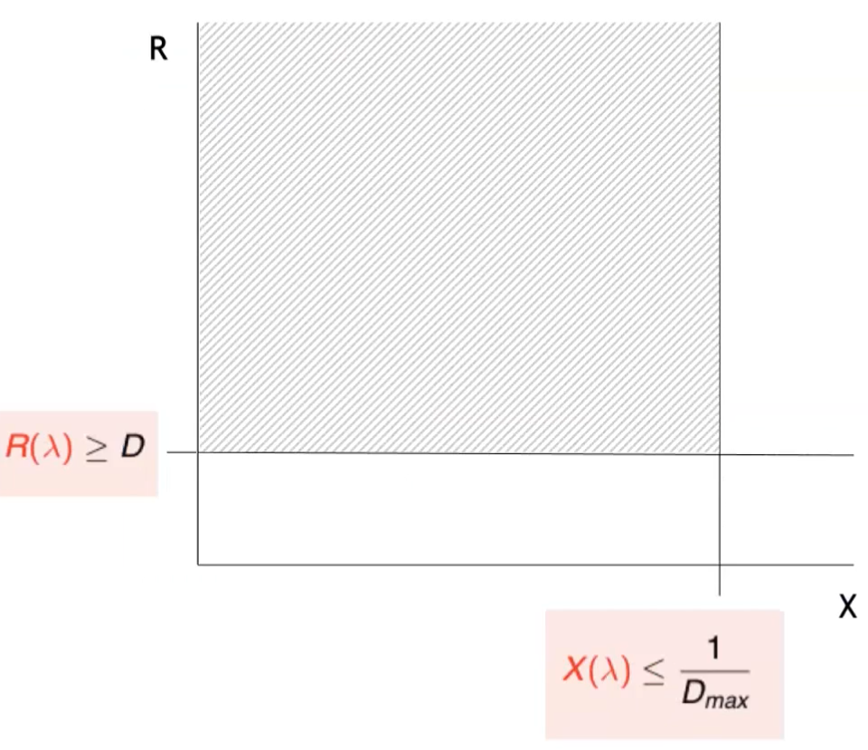
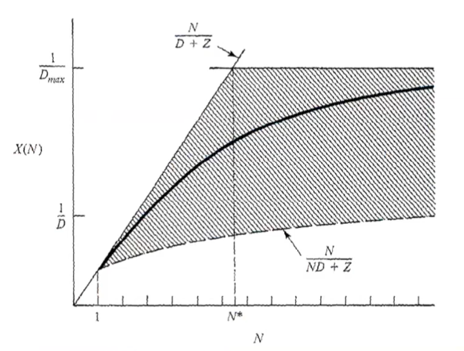

# Performance 

Measuring the quality of a system is a classic engineering question.

Possible models that we will se are: 

- Queueing networks 

### Queueing networks 

Queueing theory is the theory behind what happens when you have a lot of jobs, scarce resources, and so long queue and delays. 
Examples of queues in computer systems: 

- CPU uses a time-sharing scheduler
- Disk serves a queue of requests waiting to read or write blocks 
- A router in a network serves a queue of packets waiting to be routed 
- Databases have lock queues, where transactions wait to acquire the lock on a record

Different aspects characterize queuing models: 

- **Arrival**:  frequency of jobs is important: the average arrival rate $\lambda$ (req/s).
- **Service**: the service time is the time which a computer spends satisfying a job: the average duration $\frac{1}{\mu}$ and $\mu$ is the maximum service rate. 
- **Queue**: jobs or customers which cannot receive service immediately must wait in a buffer. 
- **Population**: we can both have members of the population indistinguishable or divided into classes, whose members differs in one or more characteristics, for example, arrival rate or service demand. 
- **Routing**: the policy that describes how the next destination is selected after finishing service at a station must be defined. It can be: 
	- probabilistic: random destination
	- round robin: the destination chosen by the job rotates among all the possible ones
	- shortes queue: jobs are moved to the one other subsystem with the mallest number of jobs waiting

{width=50%}

## Operational laws 

Operational laws represent the average behavior of any system, without assumptions about random variables. They are simple easy to apply equations.

If we observe a system we might measure these quantities: 
- $T$ the length of time we observe the system
- $A$ the number of request arrivals we observe
- $\mathrm{C}$ the number of request completions we observe
- $B$ the total amount of time during which the system is busy $(B \leq T)$
- $\mathrm{N}$ the average number of jobs in the system
- $R$ the average time a request remains in the system (also called **residence time**). It corresponds to the period of time from when a user submits a request until that user's response is returned. 
- $\tilde R_k$ of a sub-system $k$ is the **response time** and it's the average time spent by a job in $k$ when enters the node. 
- $Z$ is the think time which represents the time between processing being completed and the job becoming available as a request again, basically the time where in interactive systems the app is waiting the user. 

From the quantities we can derive these equations:

- $\lambda=A / T$, the arrival rate
- $X=C / T$, the throughput or completion rate where $C$ 
- $U=B / T$, the utilization
- $S=B / C$, the mean service time per completed job. Note that is the average time that a job spends when IT IS SERVED.
- $U=XS$ which is useful in situations like "consider a serving rate of $x$ where each serving need $S$ time to be completed". 
- $N=XR$ which is called the **little law**.  
- $R=\frac{N}{X} - Z$ in case of **interactive** systems.  
- $V_k = \frac{C_k}{C}$ is the visit count of sub-system $k$ in the system with $C$ as completion rate. It's possible that $C_k > C$ when there are "loops" in the model
- $C_k=V_kC$ 
- $X_k = V_k X$ is the force flow law and it captures the relationship between sub-system $k$ with the system. 
- $D_k=V_kS_k$ is the service demand and it represents the total time that the $k$ sub-system is needed for a generic request. It's a crucial characteristic of the sub-system/resource.
- $\tilde R_k$ is the time spent by a job in a service station, counting the queue time.
- $R _k=V_k\tilde R_k$ is the residence time and is the time spent by a job in a service station *during all system time*: so accounting the visits of the component. 
- $U_k=D_kX$ is the utilization of a resource/sub-system.

If the system is job flow balanced $C=A$ which means that $\lambda=X$ . Also the above formulas can also be applied to a single sub system $k$. 

## Performance bounds

We only consider single class systems and determine asymptotic bounds on a system's performance indices. Our focus will be on highlighting the **bottleneck** and quantify its impact.

The considered models and the bounding analysis make use of the following parameters:

- $K$, the number of service centers
- $D=\sum_k D_k$ 
- $Dmax$, the largest service demand at any single center
- $Z$, the average think time, for interactive systems

And the following performance quantities are considered:

- $X$, the system throughput
- $R$, the system response time

We distinguish between **open** model and **closed** model.

### Open Models

In open models we have the following bounds:

$$X(\lambda) \leq \frac{1}{D_{\max }}$$

which is essentially derived from these relations:

$$
D_{\max }=\max _k D_k
$$

$$
U \leqslant 1 \quad X \cdot D_k \leqslant 1
$$

And the for the response time:
$$D \le R(\lambda)$$

The upper bound for $R$ cannot be defined while minimum response time is the sum of all the demands of all components..

### Closed models

$$\frac{N}{N D+Z} \leq X(N) \leq \min \left(\frac{N}{D+Z}, \frac{1}{D_{\max }}\right)$$

$$\max \left(D, N D_{\max }-Z\right) \leq R(N) \leq N D$$

We can distinguish when the system is operating at "light load" from an heavy load.

  - Light load: $\frac{N}{ND + Z} \leq X \leq \frac{N}{D + Z}$
  - Heavy load: $\frac{N}{ND + Z} \leq X \leq D_{max}$
