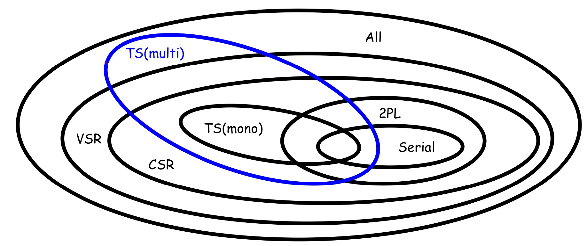
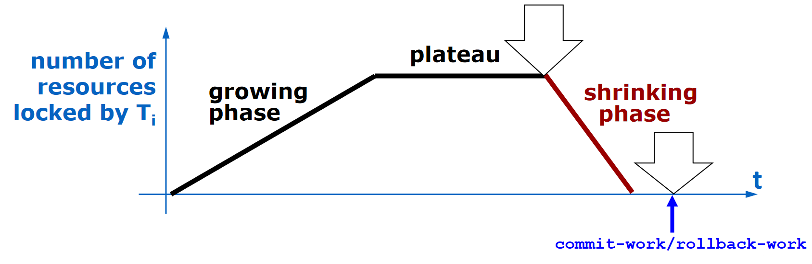
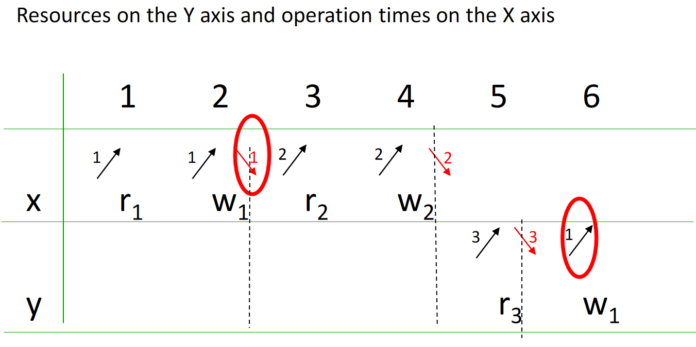
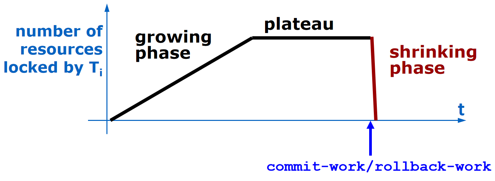
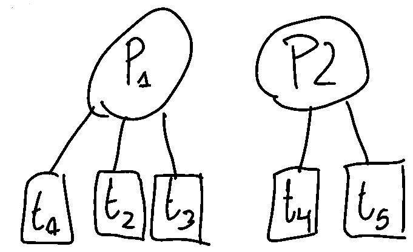
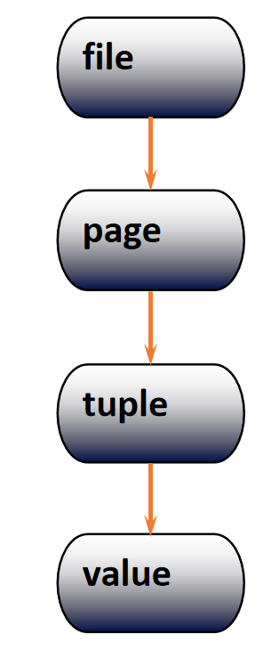

# Concurrency Control

Concurrency theory is "ideal" since it's based on the strong assumption that every transaction is submitted. 
Model: an abstraction of a system, object or process, which purposely disregards details to simplify the investigation of relevant properties.
Operation: a read or write of a specific datum by a specific transaction.

- `r1(x)` is a read operation performed by transaction 1 on variable x.
- `w1(x)` is a write operation performed by transaction 1 on variable x.
- `r1(x)` and `r1(y)` are different operations, as they are performed by the same transaction on different variables.
- `r1(x)` and `r2(x)` are different operations, as they are performed by different transactions on the same variable.
- `w1(x)` and `w2(x)` are different operations, as they are performed by different transactions on the same variable.
- Schedule: a sequence of operations performed by concurrent transactions which **respects the order of operations** of each transaction.

A serial schedule is a schedule  where each single operation of the same transaction is executed consecutively. By definition a serial schedule has not anomalies. 
Types of anomalies: 

- Lost update:  `r1 - r2 - w2 - w1` , an update is applied from a state that ignores a preceding update, which is lost.
- Dirty read: `r1 - w1 - r2 - abort1 - w2` , an uncommitted value is used to update the data. 
- Non-repeatable read: `r1 - r2 - w2 - r1`, someone else updates a previously read value.
- Phantom update: `r1 - r2 - w2 - r1`, someone else updates data that contributes to a previously valid constraint.
- Phantom insert: `r1 - w2(new data) - r1`, someone else inserts data that contributes to a previously read datum.

Serial schedules are "the dream schedules" but aren't realistic, so we will talk about **serializable schedule**: a schedule where concurrent transactions are executed in a way that produces the same results as if they were executed one at a time, avoiding inconsistencies.

## View-Serializability (VSR)

Two schedules are view-equivalent when they have the same operations, the same **Reads-from** and the same **Final writes**. Where:

- **Reads-from**: $ri(x)$ reads-from $wj(x)$ in a schedule $S$ when $wj(x)$ precedes $ri(x)$ and there is no $wk(x)$ in $S$ between $ri(x)$ and $wj(x)$.
- **Final write**: $wi(x)$ in a schedule $S$ is a final write if it is the last write on $x$ that occurs in $S$.

A schedule $S$ is said to be view-serializable (**VSR**) if it is view-equivalent to a serial schedule of the same transactions. Bad concurrency patterns are partially rejected by view-serializability. 

## Conflict-equivalence (CSR)

A schedule is **conflict-serializable** if it is **conflict-equivalent** to a serial schedule of the same transactions. Two schedules are **conflict-equivalent** if: 

- They contain the same operations
- All the conflicting pairs of each operation (read-write and write-write conflicts) of the transactions occur in the same order.

The class of conflict-serializable schedules is named CSR.
Since a **schedule is in CSR iff its conflict graph is acyclic**, we use a conflict graph that has:

- One node for each transaction $T_i$
- One arc from node $T_i$ to $T_j$ for each conflict between an operation $o_i$ of $T_i$ and an operation $o_j$ of $T_j$ such that $o_i$ precedes $o_j$ (note that a conflict is between two operations where at least one of them is a **write** operation... no conflict between two reads obviously).

## Timestamp Concurrency Control

In practice we can´t evaluate the schedules online/real-time and say if they are CSR or VSR. So we can use locks (which it's called "pessimistic tecnique" since it eventually makes the requester waiting) or optimistic tecniques based on timestamps and versions. 

### Ts Mono 

The scheduler receives read/write requests tagged with the timestamp of the requesting transaction . You use the age in order to resolve potential conflicts. 
We reject if:

-   $R_{ts}(x)$ we reject if $ts < WTM(x)$
-   $W_{ts}(x)$, we reject if $ts < RTM(x)$ or $ts < WTM(x)$ 

Where $WTM$ and $RTM$ are respectively the last write and the last read (indicated with timestamps). There is also a variant called "Thomas Rule" to basically reduce the killed transactions. 
The only difference of Thomas Rule is to no kill the write operations if $ts < WTM(x)$ with the motivation that our write is "obsolete" and it can be simply skipped without killing the entire transaction. That's a fair consideration: we are skipping a write on an object that has already been written by a younger transaction.
Note that this versions are not really implemented, they are just a little step to build some fundamentals for TS Multi.  

### TS Multi 

TS Multi is basically TS Mono multi-versioned.
Since every DBMS have to guarantee an 'undo command' it's very 'natural and logic' use a multi-versioned system (It's used actually). 

> Idea: each write generate new versions, reads access the "right" version.  $WTM_1(x) \dots WTM_N(x)$ are the versions, sorted from oldest to youngest.

$r_{ts}(x)$ is always accepted. A copy $x_k$ is selected for reading such that:

- If $ts \ge WTM_N (x)$, then $k = N$
- else $WTM_k (x) \le ts < WTM_{k+1}(x)$ 

$w_{ts}(x)$:

- If $ts < RTM(x)$ the request is rejected
- Else a new version is created for timestamp $ts$ and $N$ is incremented. NB!! For simplicity (in the exercises) we will kill also if $ts < WTM(x)$

We are complicating the implementation but in change we now have a huge benefit: **the read will be always accepted**. 

## 2 Phase Locking (2PL)

The rules of 2PL as a system of constraints imposes precedence rules upon the lock and unlock requests: basically each lock on any resource of the same transaction has to follow the "2 phase lock" rule.
Note that: 

- In the same resource **only shared locks can coexist**. 
- In the same transaction all the **locks must precede the unlocks**: showing an evident growing phase, a plateau and a shrinking phase.

_Last phrase written again_: 2PL imposes to **not** acquire any lock after the first release: in this way we would have a "growing phase" where all the locks are acquired, a plateau and then all the releases in a shrinking phase and the final commit/rollback. 

### Strict 2PL 

The strict 2PL has the same "two-phase rule" with a little variation: locks held by a transaction can be released only after commit/rollback. 

Extra: actually the Strict 2PL prevents all possible anomalies except "Phantom Insert" anomaly. To prevent this inconsistency, a technique called "predicate locks" can be used, which extends the notion of data locks on future data using a predicate that blocks all data that satisfies it.

As you know after 3 years of Computer Science when there are locks there are deadlocks and starvation. There are mainly three possible way to solve this: 

- Timeout: killing transactions after its timeout runs out
- Deadlock prevention: killing transactions which could lead to deadlock
- Deadlock detection: kill one of the transactions in a deadlock that occurred.

The two main rules to reduce the deadlocks frequency are: 

- use Update Locks 
- use Hierarchical Locks

We we will see a super simple algorithm to detect cycles in wait-for-graph, in particular in a "distributed systems" environment: Obermark's algorithm. 

### Update Locks

Same locks but with the introduction of Update Locks (UL):

- UL is used only if a write is needed later. 
- Obviously the scheduler uses UL and it can't get a SL, release it and then get XL later!

Clearly deadlocks are possible in the presence of UL but less frequently. Indeed, UL only makes deadlock less likely, by preventing one type of (very frequent) deadlock, due to update patterns, when two transactions compete for the same resource. If we consider two distinct resources X Y, and two transactions that want to access them in this order:
$$r1(X) \space r2(Y) \space w1(Y) \space w2(X)$$
It is likely that they end up in deadlock, especially if the system on which they run applies 2PL. UL is totally irrelevant here, because there is no update pattern.

### Hierarchical Locks 

{width=50%}

Generally all the exercises on Hierarchical Locks are in a 2PL or 2PL-strict environment. Basically are locks (actually are locks really used in reality and in practice applications) where there are **more levels** with difference importance (like a hierarchy). In a data structure, if you want to access an item, you will perform an "intentional lock" over all the containers of that item. In particular the scheduler can use: 

- ISL: Intention of locking a subelement of the current element in shared mode. 
- IXL: the same of ISL but in exclusive mode
- SIXL: Lock of the element in shared mode with intention of locking a subelement in exclusive mode (SL+IXL)

General rules: 

- Intentional shared/exclusive lock over the container
- shared/exclusive lock over the actual target

As always shared is compatible with others shared and with an intentional shared lock. **Different intentional locks on the same resource are always possible**. 

{width=25%}

### Obermark's algorithm

The algorithm is a distributed one and it communicates the waiting sequences to other instances of the same algorithm. Consider any waiting condition where a sub- transaction $t_i$ , activated by a remote DBMS on node $h$, is waiting for a lock to be released by another transaction $t_j$ which in turn waits for the termination of a remote sub-transaction invoked on a DBMS on node $k$. The waiting situation is summarized by the following wait sequence:

$$EXT_h \rightarrow t_i \rightarrow t_j \rightarrow EXT_k$$

Messages are sent only “‘ahead”’. That is, towards the DBMS on node $k$, where the sub-transaction for which $t_1$ is waiting was activated. Also, the message is sent only if $i>j$ . Also every message, sent from an instance to another one, is "compressed":

$$ E_h \rightarrow  t_i \rightarrow t_m \rightarrow t_n \rightarrow ... \rightarrow t_p \rightarrow t_j \rightarrow E_k$$

It's compressed into the message

$$ E_h \rightarrow  t_i \rightarrow t_j \rightarrow E_k$$
and is sent to node $k$ iff $i>j$.
Note that this is just a convention, the "main algorithm" just propagates local waiting condition to remote nodes and it could work also with the "opposite conventions": send only if $i<j$. 