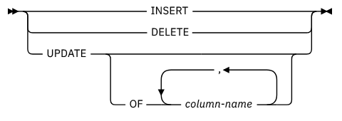

# SQL Triggers 

Main paradigm to reason: 

````
EVENT -> CONDITION -> ACTION
````

- Use triggers to guarantee that when a specific operation is performed, related actions are performed
- Do not define triggers that duplicate features already built into the DBMS. For example, do not define triggers to reject bad data if you can do the same checking through declarative integrity constraints 
- It is essential to enforce database constraints at the database level as opposed to at the application level. This is because multiple applications may access and manipulate the same database. By implementing constraints at the database level, it ensures that data remains consistent and organized across all applications that access the database, thereby preventing inconsistencies and disorganization.
- Limit the size of triggers to 60 lines of code or less
- Use stored procedures to contain most of the code and call them from the trigger
- Use triggers only for centralized, global operations that should be fired for the triggering statement, regardless of the user or application that issues the statement
- Avoid recursive triggers if not absolutely necessary, as they may cause the DBMS to run out of memory
- Use triggers to guarantee properties of data that cannot be specified by means of integrity constraints

## Termination analysis

Triggers are powerful but also complex due to cascading policies which can lead to bugs and recursive cascading. Some systems block cascading of triggers to prevent these issues. Cascading is generally not good and in some DBMS is even forbidden. But it's important to remember that triggers are powerful and can be useful if used correctly.
You can do termination analysis using a triggering graph: 

- Each node is a trigger
- Each arc from trigger $i$ to trigger $j$ is present only if $T_i$ effects may activate $T_j$

## Syntax 

Main structure to make triggers: 

````sql
create trigger <trigger_name>
{before | after}
{insert | delete | update [of <column>]} on <table>
[referencing (to put aliases on old, new, etc)]
[for each {row | statement}]
[when condition]
BEGIN
[my action]
END
````



### Some useful SQL functions when using triggers

- `COALESCE` function returns the first non-NULL value in a list of expressions. It can be used to provide a default value when a `NULL` value is encountered.

````sql
SELECT COALESCE(NULL, 'Tony Montana', 'Scarface') AS "Main Character";`
````

- `IS NULL`/`IS NOT NULL` operators are used to test for `NULL` values in a column or expression 

````sql
SELECT * FROM movies WHERE main_character IS NULL;
````

- `EXISTS` operator is used to check if a row exists in a subquery.

````sql
SELECT * FROM movies 
WHERE EXISTS
(SELECT 1 FROM box_office WHERE box_office.movie_id = movies.id AND box_office.revenue > 10000);
````

- `IFNULL`  and `DECLARE` common pattern: 

````sql
DECLARE X AS INTEGER
IFNULL(<SELECT_QUERY_HERE>, 0) INTO X

IF (X<>0)
THEN
	\\
ELSE
	\\
ENDIF;
````

- It is possible to add values for all the columns of a table using the `INSERT INTO` statement. 

````sql
INSERT INTO _table_name_  
VALUES (_value1_, _value2_, _value3_, ...);
````

- A `REFERENCING` clause in a SQL trigger is used to specify the name of a transition table that is used to hold the old and/or new values of the rows that are affected by the trigger. 

-  `FOR EACH ROW` just says to execute the trigger body for each of the matched and affected table rows. 

