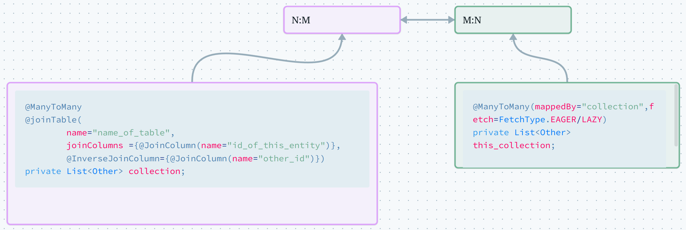
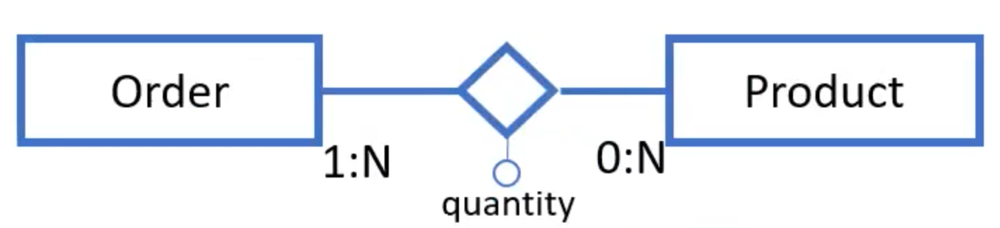
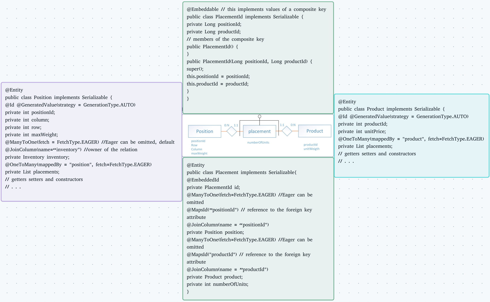

# JPA

ORM stands for Object-Relational Mapping, and it's basically a way to interact with a relational database using an object-oriented programming model. Instead of writing SQL queries to get data from a database, you can just use objects in your code.

One of the most popular ORM frameworks for Java is JPA (Java Persistence API). JPA is basically the standard for ORM in the Java Enterprise Edition (Java EE) platform, and it makes working with a relational database really simple. You can do all the basic stuff like creating, reading, updating, and deleting data without having to write complex SQL queries. Plus, it has some awesome features like caching and lazy loading that can help you make your code run faster.

[JPA Introduction - javatpoint](https://www.javatpoint.com/jpa-introduction)

JPA auto-generates SQL code from Java code, creating correspondence between Java objects and DB tuples. This is called ORM (Object-relational mapping): 

- classes are tables
- objects instances are tables rows (tuples)
- the physical memory address of an objects is the primary key of the tuple 
- references to other objects are the foreign keys 
- methods are triggers 

By default entities are mapped to tables with the same name and their fields to columns with the same names, but you can always change it using some annotations: 

````Java
@Entity @Table(name="SUPERHEROS")
public class Superhero {
@Column(name="REAL_NAME",nullable=false)
private String real_name;
...
}
````

### Relationships

All relationships in JPA are unidirectional, the only way to make bidirectional relationships is using two 'paired' unidirectional mappings. The types of relationships are:

- Many-to-one 
- One-to-many
- One-to-one
- Many-to-many

### Fetch Policy 

By default, single-valued relationships are fetched eagerly and collection-valued relationships are loaded lazily. However, you can specify the fetch mode using the `fetch` attribute in annotations such as `@ManyToOne` and `@OneToMany`.

- `@ManyToOne(fetch = FetchType.EAGER)` is used when there aren't many elements and you can load them runtime when needed. 
- `@OneToMany(fetch = FetchType.LAZY)` viceversa of `EAGER`.

### Cascade Types

Cascade types define the behavior of entities when other entities are persisted, removed, merged, etc. The available cascade types are:

-   PERSIST
-   REFRESH
-   REMOVE
-   MERGE
-   DETACH

## JPA relationships

In JPA, relationships are implemented by a foreign key column that refers to the key of the referenced table. This column is called a join column. The annotation `@JoinColumn` indicates the foreign key column that implements the relationship in the database, and is normally inserted in the entity owner of the relationship, which is the one mapped to the table that contains the foreign key column.

When specifying bidirectional relationships, the `mappedBy` attribute indicates that "this side" of the relationship is the inverse of the relationship, and the owner resides in the "other" related entity. In the absence of the `mappedBy` parameter, JPA creates a bridge table, which is used for many-to-many relationships. The purpose of the `mappedBy` parameter is to instruct JPA not to create a bridge table, as the relationship is already being mapped by a foreign key in the opposite entity of the relationship.

### One to many

````Java
@Entity
public class B{
@Id private int id
@OneToMany(mappedBy = "java_var")
private Collection<A> As; 
...
}

//On the other side:

@Entity  //this is the owner of the relationship
public class A{ 
@Id @GeneratedValue(strategy=GenerationType.AUTO)
private int id;

@ManyToOne 
@JoinColumn (name="fk") //the column where there is the foreign key
private B java_var;
...
}
````

### One to One
  
````Java
@OneToOne(mappedBy="B");
private Class A;

// owner side:
@OneToOne(mappedBy="A");
private Class B;
````


### Many to many 



The logical model of a N:M relationships requires a join table (aka bridge table). The N:M relationship with attributes between a parent product and its sub-products is mapped differently in the two directions.

````Java
@Entity
public class B{
@Id private int id
@ManyToMany(mappedBy = "java_list_of_Bs")
private List<A> As; //actually not only lists .. but any kind of collections 
...
}

//On the other side:

@Entity
public class A{
@Id @GeneratedValue(strategy=GenerationType.AUTO)
private int id;

@ManyToMany
@joinTable(
	name="table_name",
	JoinColumns = @JoinColumn(name="this_entity_fk"),
	@InverseJoinColumn = @JoinColumn(name="other_fk"))
private Collection<B> java_list_of_Bs;
...
}
````

Note that the owner in these cases is not relevant.

### ManyToMany with attributes

- In a "regular" N:M relationship, the access paths are:
    - Fetch all instances of A given B 
    - Fetch all instances of B given A
- In N:M with attributes, there are additional access paths:
    - The values of the attributes of the pair `<A, B>`

In every collections implemented as tuples (e.g., `<Product, quantity>`)) there are some differences with the "standard" `@ManyToMany` relationship:

- Entities key element collection are specified with the `@ElementCollection` annotation. 
- We also use a `@CollectionTable` annotation
- We map the join from father to child using the `@JoinColumn` to specify the column holding the father id (like in `@ManyToMany` )
- Instead of specifying the `@inverseJoinColumns`, we use a `@MapKeyJoinColumn` annotation to specify the column holding the PK of the entity used as a map index

````Java
@ElementCollection(fetch=FetchType.TYPE)
@CollectionTable(name="id_name",
				 joinColumns =
				 @JoinColumn(name="this_id")
)
@MapKeyJoinColumn(name="other_id")
@Column(name="third_attr_in_relation")
private Map<Other,Attribute> map;
````


#### Example


We can't have a traditional join table with 2 columns because we have 3 attributes: so we use a map ```Map<Product, Integer>``` . 
  





### Composite Keys  

A relation with a composite key is implemented by creating an `@Embeddable` class that represents the composite keys. This class should have the attributes of the ids that make up the composite key, and a constructor that takes these attributes as parameters and initializes them.

Then, this class is linked to the interested entity using the `@EmbeddedId` annotation. 



So the recap is: you have to use the keyword ```@Embeddable``` (over the class) and a ```@EmbeddedId``` over the primary key of this new bridge entity, which will also contain the ID of the other two entities using ```@MapsId("id1")``` before  ```@JoinColumn(name = "id1")``` and ```@MapsId("id2") ... ``` . 
 
### Extra: OrderBy 

You can specify an ordering every time you find in the exercise something like "The application permits the operator to select .... ordered by submission **date descending**" using `@OrderBy` : 

````Java
@OrderBy("submissionDate DESC")`
````
