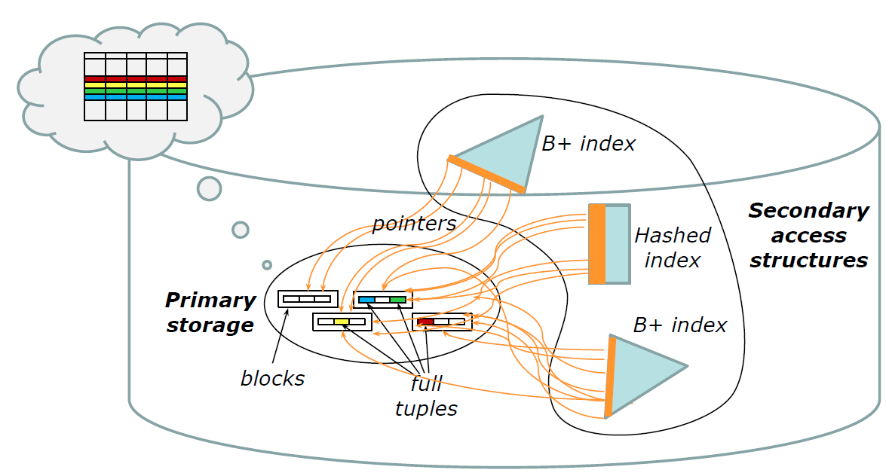
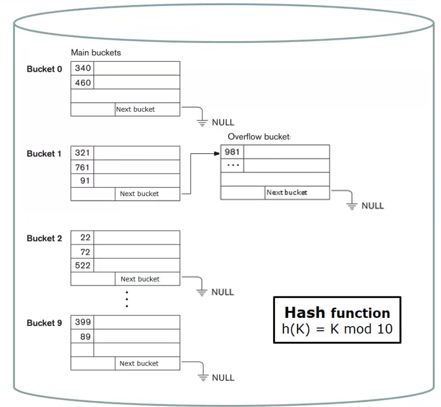
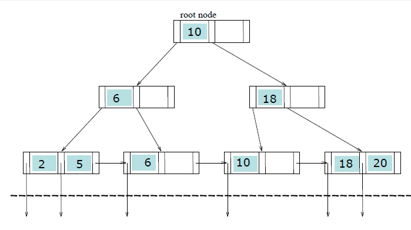

# Physical Databases and Query Optimizations

We can divide structures in two classes:

- Primary structure is the main storage mechanism of a table and contains all the tuples of the table. Its main purpose is to store the table content. 
- Secondary structures are used to index primary structures and only contain the values of certain fields.

Files are made up of "physical" components called blocks, while tables are made up of "logical" components called tuples. The size of a block is typically fixed and depends on the file system and disk formatting, while the size of a tuple (also known as a record) is variable and depends on the database design.

{width=75%}

Operations are performed in main memory and affect pages (in the buffer). These operations include:

- Insertion and update of a tuple
- Deletion of a tuple
- Access to a field of a particular tuple, which is identified according to an offset w.r.t. the beginning of the tuple and the length of the field itself (stored in the page dictionary). 

## Data structures

Three main types of data access structures:

- Sequential structures
- Hash-based structures
- Tree-based structures

$$\begin{array}{|l|l|l|}
\hline & \text { Primary } & \text { Secondary } \\
\hline \text { Sequential structures } & \text { Typical } & \text { Not used } \\
\hline \text { Hash-based structures } & \begin{array}{l}
\text { In some DBMSs (e.g., Oracle } \\
\text { hash clusters, IDM DB2 } \\
\text { "organize by hash" tables) }
\end{array} & \text { Frequent } \\
\hline \text { Tree-based structures } & \text { Obsolete/rare } & \text { Typical } \\
\hline
\end{array}$$

### Sequential structures

The entry-sequenced sequential structure is effective for:

- Insertion, which does not require shifting (The default setting for a data structure is not to sort data, and as such, a shifting operation will never happen. )
- Space occupancy, as it uses all the blocks available for files and all the space within the blocks
- Sequential reading and writing (e.g. `SELECT * FROM T`), especially if the disk blocks are contiguous (reducing seek and latency times)
- Only if all (or most of) the file is to be accessed

However, this structure is non-optimal for:

- Searching specific data units (e.g. `SELECT * FROM T WHERE ...`) as it may require scanning the whole structure. However, with indexes, it can be used more efficiently.
- Updates that increase the size of a tuple, as "shifts" are required. This shift may also require storage in another block.

$$\begin{array}{|l|l|l|}
\hline & \text { Entry-sequenced } & \text { Sequentially-ordered } \\
\hline \text { INSERT } & \text { Efficient } & \text { Not efficient } \\
\hline \text { UPDATE } & \begin{array}{l}
\text { Efficient (if data size } \\
\text { increases } \rightarrow \text { delete }+\text { insert } \\
\text { the new version) }
\end{array} & \begin{array}{l}
\text { Not efficient if data size } \\
\text { increases }
\end{array} \\
\hline \begin{array}{l}
\text { DELETE }
\end{array} & \text { "Invalid" } & \text { "Invalid" } \\
\hline \text { TUPLE SIZE } & \text { Fixed or variable } & \text { Fixed or variable } \\
\hline \begin{array}{l}
\text { SELECT * FROM T } \\
\text { WHERE key } \ldots
\end{array} & \text { Not efficient } & \\
\hline
\end{array}$$

### Hash based structures

Good for point query and bad for range queries (because the lack of sorting). 

{width=50%}

### B+ 

{width=50%}

The B+ tree is considered the most commonly used method for indexing data. As a multi-level index with one root and multiple intermediate and leaf nodes, each node is stored in a block and boasts a large fan-out (a high number of children). 

### Cost of queries and query optimization

Queries are evaluated based on their costs, which is determined by the number of IOPs required to execute them. We can estimate the cost of: 
- equality, conjunction and disjunction predicates
- sorting and interval queries
reasoning about the data structures properties and also the statistic on data contained in each structure.
Join operations can be done using different strategies, with costs that depend on the properties of the tables being joined:

- Nested loops: a "while cycle" on the external table for each block on the internal table. The cost is $ext_{blocks} + ext_{blocks} * int_{blocks}$. The smallest table is always the used as the external one and if a table is small enough, it is cached (loaded in (main) memory) so that the total cost is $ext_{blocks} + int_{blocks}$.
- Scan and lookup: if one table supports indexed access in the form of a lookup: the cost is $ext_{blocks} + ext_{tuples} * int_{lookup /space cost}$ .
- Merge-scan join: possible if **both** tables are ordered by the attribute used in the join predicate. The cost is linear in blocks of the two tables.   
- Hashed join: possible if both tables are hashed by the attribute used in the join predicate. The cost is linear in blocks of the two tables.  

