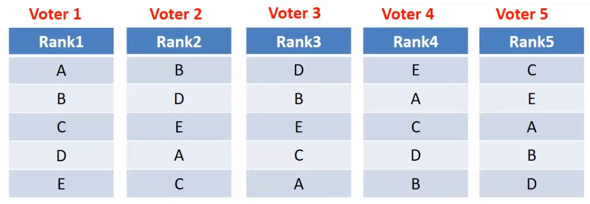
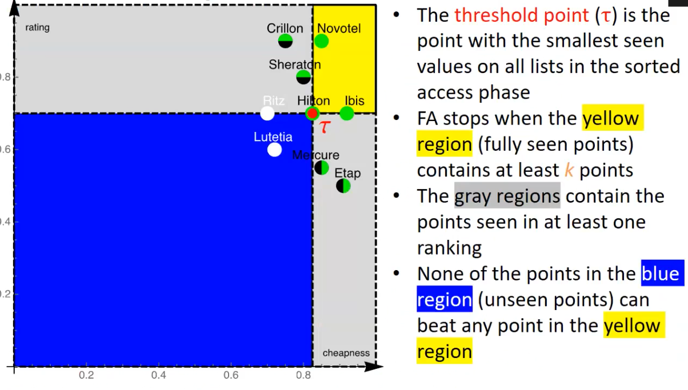
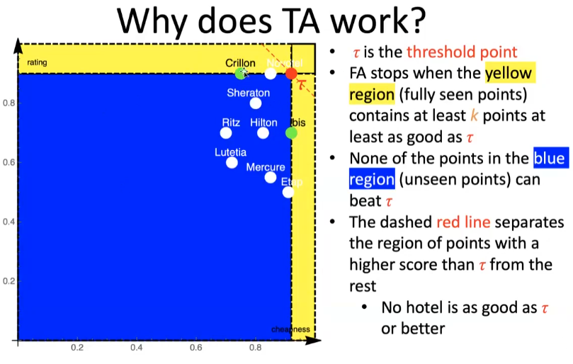
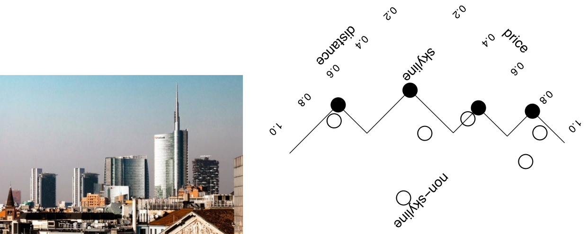

# Ranking 

Ranking is a method to return approximate matches to a query, based on relevance. It's a shift from exact queries to approximate ones where the result is not necessary an exact match. Results are returned in an order of relevance determined by ranking criteria or a scoring function. This "score" can be determined by a deterministic function or by a parametric function of some object attribute values weighted by parameters that can be subjective or even unknown.
Because of this, ranking is not sorting. Sorting is deterministic and not based on preferences, while ranking is based on preferences. Note that the boundary between them is not absolute.
The actual subject of the exam are: 

- Rank aggregation: This method combines several ranked lists of objects in a robust way to produce a single consensus ranking. 
- top-k queries: This method extracts the top $k$ objects according to a given quality criterion (typically a scoring function). 
- Skyline queries: This method extracts the subset of objects that are not dominated by other objects with respect to multiple quality criteria.


## Ranking aggregation



Borda's proposal, also called the Borda count, assigns points to objects based on their ranking. The object with the highest overall points wins. Condorcet's proposal, also known as the Condorcet method, pits objects against each other in head-to-head "matches" and the winner is determined by the object who wins the most matches. 

Both Borda and Condorcet methods aim to produce fairer results by considering all voters' preferences but they have limitations.

### MedRank

Other methods for rank aggregation only use the position of objects in the list, without any additional scores or weights.
One such method is MedRank, which is based on the concept of a median and is an effective technique for combining opaque rankings.

Input: integer $k$, ranked lists $R_1, …, R_m$ of $n$ elements
Output: the top $k$ elements according to median ranking
1. Use sorted accesses in each list, one element at a time, until there are $k$ elements that occur in more than $m/2$ lists
2. These are the top $k$ elements

An optimal algorithm has a cost of execution that is never worse than any other algorithm on any input. MedRank is not optimal, but it is instance-optimal, meaning that it is the best possible algorithm up to a constant factor on every input instance that accesses the lists in sorted order which means that its cost cannot be arbitrarily worse than any other algorithm on any problem instance.

## Top-k 

Top-k, aka ranking queries, aim to retrieve the top-$k$ best objects from a large set, where best means most relevant. 
This can be useful in various applications, such as Information Retrieval, Recommender Systems, and Data Mining.

### B0 algorithm 

Input: integer $k > 1$, ranked lists $R_1, ..., R_n$
Output: the top-$k$ objects according to the $MAX$ scoring function

1. Make exactly $k$ sorted accesses on each list and store objects and partial scores in a buffer
2.  For each object in the buffer, compute the MAX of its (available) partial scores
3.  Return the k objects with the highest scores. 

### FAGIN's algorithm 

1. Make $k$ sorted accesses in each list until there are at least $k$ objects in common
2. For each extracted object, compute its overall score by making random accesses wherever needed
3. Take the $k$ objects with the best overall score from the buffer




### Threshold algorithm

1. Do a sorted access in parallel in each list $R_1$ ... $R_n$
2. Don´t wait to do random access like FA, but do immediately and extract the score $S$
3. Define threshold $T=S(s1, ..., sn)$, where $s_i$ is the last value seen under sorted access for list $i$ 
4. If the score of the $k_{th}$ object is worse than $T$, go to step 1 otherwise return the current top-k objects

TA is an instance-optimal algorithm, which means that it is guaranteed to find the best possible results among all algorithms that use the same kind of accesses, but it's not guaranteed to be optimal among all algorithms in general. The authors of this algorithm received the Gédel prize in 2014 for the design of innovative algorithms.




### NRA algorithm 

NRA uses only sorted accesses over the lists. 

1. Make a sorted access to each list
2. Store in $B$ each retrieved object $o$ and maintain $S(o)$ and $S^*(o)$ and a threshold $r$
3. Repeat from step 1 as long as $S^-(B[k]) < \max \{ \max \{ S^+(B[i]), i> k \}, S(\tau) \}$ 

| Algorithm | scoring function | Data access | Notes |
| :--- | :---: | :---: | :---: |
| B_(0) | MAX | sorted | instance-optimal |
| FA | monotone | sorted and random | cost independent of scoring function |
| TA | monotone | sorted and random | instance-optimal |
| NRA | monotone | sorted | instance-optimal, no exact scores |


## Skyline



The skyline is the collection of objects that are ranked as the best according to a possible monotone scoring function. 
Skyline is based on the idea of dominance. 
Tuple $t$ dominates tuple $s$ if $t$ is not worse than $s$ in any attribute value and is better than $s$ in at least one attribute value. Typically, lower values are considered better.

|  | Ranking queries | Skyline queries |
| :--- | :---: | :---: |
| Simplicity | No | Yes |
| Overall view of interesting results | No | Yes |
| Control of cardinality | Yes | No |
| Trade-off among attributes | Yes | No |

A point is considered to be in the n-skyband if it is not dominated by more than n tuples. The skyline is a 1-skyband because all of its objects are not dominated. **To be part of the skyline, a tuple must be the top-1 result according to at least one monotone scoring function.**


### BNL - Block Nested Loop

Input: a dataset $D$ of multi-dimensional points
Output: the skyline of $D$

````
let W = []
for each point p in D:
    if there is no point q in W that dominates p:
        remove from W all points that p dominates
        add p to W

return W
````

*W=Window*

The time complexity of the algorithm is still $O(n^2)$.

### SFS - Sort Filter Skyline

Input: a dataset D of multi-dimensional points
Output: the skyline of D

````
Let S = D sorted by a monotone function of D’s attributes
Let W = []
for every point p in S
	if p not dominated by any point in W
		add p to W
return W
````

If the input is sorted, then a later tuple cannot dominate any previous tuple: pre-sorting pays off for large datasets. The time complexity of the algorithm is still $O(n^2)$.