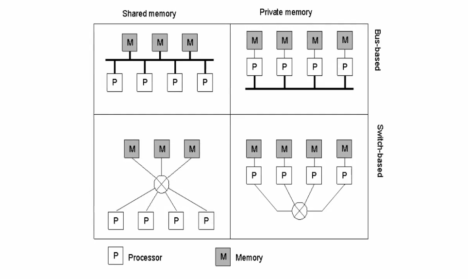

"A collection of independent computers that
appears to its users as a single coherent system"

Modeling distributed systems

- Economics
- Originally mainframes consolidated processing
- Price/performance ratio in favor of distribution
- Incremental growth and load balancing
- Easier to evolve the system and use its resources uniformly
- Inherent distribution
- e.g., banks, reservation services, distributed games, CSCW, mobile apps
- Reliability
- Failure does not bring down the whole system (important for mission critical applications)
- However, distributed systems are considerably more difficult to get right!!!

Nothing is reliable

A different paradigm: not shared memory but **message passing**. 

- Concurrency
- Absence of a global clock
- Independent (and partial) failures

• Heterogeneity
Of hosts, platforms, networks, protocols, languages, ...
• Openness
A distributed system should foster interoperability through standard access rules. Protocols
and interfaces play a key role
• Security
The ease of attaching a node to the system can be exploited maliciously
• Scalability
Use decentralized algorithms to allow the system to grow with the lowest possible impact
on performance
• Failure handling
Hosts can fail, links are unreliable, the two are usually undistinguishable, global state
complicates matters
Detecting, masking, tolerating, recovery from failures
• Concurrency
Synchronization without a physical clock and without shared memory
• Transparency
Hide the most to simplify the life of programmers/users

# Architectural Styles 

- Client-Server: Layers (tiers)
 - Service Oriented
	Specific case of client-server based on the concept of Service provider + service consumer + service broker
- REST: Set of principles that define how Web standards are supposed to be used Interactions are client-server and stateless. The REST most import concept is the "stateless" feature.  Components expose a uniform interface: ``GET``, ``POST``, ``PUT``, ``DELETE``. 
- Peer to Peer
- Object-Oriented: Components encapsulate a data structure providing an API to access and modify it through RPC (Remote Procedure Code). Enterprise Java Beans is an example of a client-server Object-Oriented interaction. 
- Data-centered: Components communicate through a common repository (usually passive). First example of this is Linda where data in the shared space is organized in tuples and clients work on it using primitives. 
- Event-Based: an example of peer-to-peer architecture.
- Mobile code: based on the concept to relocating components (remote evaluation - code on demand - mobile agent (one side has both code/data but not have the ability of processing, so it sends to the other side to complete the execuction) )

### third lesson 18/09 

- Synchronous ds:
	- predictable time constraints
	- each process has a local clock with a known level of accuracy.

- Asynchronous ds:
	- no bounds for process execution speeds, message transmission delays, clock drift rates

Any solution that is valid for an asynchronous distributed system is also valid for a synchronous one (but the vice versa is clearly false)

Regarding this example, ChatGpt, make it short and clearer: 

● The pepperland divisions are safe as long as they remain in their encampments ● If both charge at the same time they win, otherwise they loose ● Generals need to agree on: – Who will lead the charge – When the charge will take place ● We consider the case when messengers are able to walk from an hill to another without being captured by the enemies D1 D2 e e e e Charge! I wanna lead! Modeling distributed systems 34 The pepperland example ● Even in asynchronous pepperland it is possible to agree on who will lead the charge – How? ● Charging together is a different issue – It is not possible in asynchronous pepperland ● If the leader sends a messenger to the other general saying “charge!” the messenger may take three hours or just five minutes to reach the other general ● Also differences on each division’s clock do not allow strategies based on sending a message with the time to charge – In synchronous pepperland it is possible to determine the maximum difference between charge times ● Let min and max be the range of message transmission times ● The leader sends a message “charge!”, wait min minutes then charge ● On receiving the “charge!” message the other general immediately charge ● The second division may charge later then the first one but no more that (max-min) minutes ● If we know that the charge will last longer then the victory is guaranteed

- Synchronous ds:
	- predictable time constraints
	- each process has a local clock with a known level of accuracy.

- Asynchronous ds:
	- no bounds for process execution speeds, message transmission delays, clock drift rates

Solutions that work in an asynchronous distributed system also work in a synchronous one, but not vice versa.

Example fo the Pepperland: 

- Safety in Pepperland is ensured by divisions staying in their encampments.
- Both divisions must charge at the same time to win.
- Generals need to agree on the leader and the timing of the charge.
- In an asynchronous Pepperland, a messenger system can be used to agree on the leader.
- However, charging together is not possible in this scenario.
- The time it takes for a messenger to reach the other general can vary significantly.
- Differences in each division's clock prevent strategies based on sending a message with the charge time.
- In a synchronous Pepperland, the maximum difference between charge times can be determined.
- The leader can send a message to charge, wait for a specific time, and then initiate the charge.
- Upon receiving the message, the other general charges immediately.
- The second division may charge later but not beyond the maximum difference in message transmission times.
- If it is known that the charge will last longer, victory is guaranteed.

......

### The consensus problem

In the previous lesson we talked about the curious coordinated attack problem: two generals with **separated** battalions needed to reach an agreement to/not to attack at dawn with the assumption that messengers (they use to communicate) cannot be captured. 
The coordinated attack problem shows that consensus is not possible in the presence of **arbitrary communication failures** (messengers captured). 
We will analyze what happens when communication is reliable but processes are allowed to fail: 

- Crash Failures (fail-stop or fail-silent)
- Byzantine Failures
