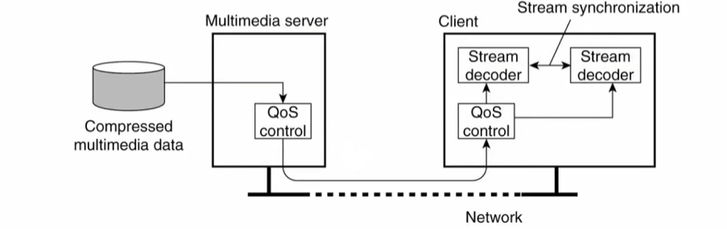
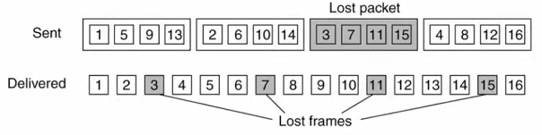

# Communication models

## Passing parameters approaches

Before dive in communication models just recall that parameters are embedded in the request and can be passed in three ways:

- **By value** (or **by copy**): A copy of the parameter's value is created and passed to the function. Changes made to the parameter within the function don't affect the original value (like in C when passing data types).
- **By reference**: The memory address of the parameter is passed to the function, allowing direct access and modification of the original value. This is impossible in DS since they don't share a common memory.
- **By copy/restore**: a copy of the original parameter is created and passed (like in *by value* approach) but the changes made to the parameter after the call are saved in the "original variable": this produce apparently the same effect as "by reference". 

## Middleware

Middleware as a protocol layer is adopted to raise the level of abstraction of communication. Middleware main function is to provide the (un)marshaling of data: 

- naming protocols
- security protocols
- scaling mechanisms (such as replication and caching)

Middleware can offer different forms of communication:

- Transient/persistent communication
- synchronous/asynchronous communication

Popular combination are:

- transient communication with synchronization after processing
- Persistent communication with synchronization at the request submission.

## Remote procedure call 

The Interface Definition Language (IDL) raises the level of abstraction of the service definition. 
it is used to describe the interface of the function 
It separates the service interface from its implementation – The language comes with “mappings” onto target languages (e.g., C, Pascal, Python…)
Enables the definition of services in a language independent fashion – Being defined formally, an IDL description can be used to automatically generate the service interface code in the target language

- The Interface Definition Language (IDL) is used to describe the interface of a function.
- It separates the service interface from its implementation.
- IDL has mappings onto target languages like C, Pascal, Python.
- IDL enables the definition of services in a language-independent fashion.
- An IDL description can be used to automatically generate the service interface code in the target language.

**Remote Procedure Call (RPC)** is a protocol that one program can use to request a service (function) from a program located in another computer on a network without having to understand the network's details. 

 RPC it's based on a sort of middleware which from signature creates the code to manage all the transport and "remote decoding and calling part". 
Also remember of :

- serialization
- marshalling: hosts may use different data representations (e.g., little endians vs. big endians) and proper conversions are needed. For example a data structure representation or even a integer can be completely different from source/destination machine.

Basically it's a library which provides a set of tools which makes a protocol over TCP/UDP. 

In general RPC is synchronized 

Lightweight RPC is basically a "variant" used in local environments
Use less threads/processes (no need to listen on a channel)

There are many variants of **asynchronous RPC** (with different
semantics)

Batched vs. queued RPC are also possible in some frameworks. 

RPC impossible by reference but possible copy

The main problem of Remote Procedure Call (RPC) is binding the client to the server: 

- determining the location of the server process
- establishing communication with it.

Two example solutions:

- Sun's solution: daemon process that bind calls and server ports. It solves only the second problem, since the clients must know in advance where the service resides.
- DCE's solution: Sun's solution but with a directory server to allow us to fully decoupled client-server such that the client has to known only the address of the directory service, goes to the directory service, list the set of functions that are available, search for the function that it must bind this happens at the binding time.

Extras: Sun RPC includes the ability to perform batched RPC

Lightweight RPC

It is natural to use the same primitives for inter-process communication, regardless of distribution. For this original RPC is a waste of resources so it' s invented Lightweight RPC.

Lightweight RPC enables efficient inter-process procedure calls between two processes on the same machine. Instead of sending actual packets, data is shared between processes by serializing and placing parameters in a shared area of memory. The receiving process then waits for the data to become available in the shared memory, processes it, and returns the result.

### Remote method invocation

RMI (Remote Method Invocation) is the natural extension to RPC: same thing but OOP. 
Actually, under the hood, there is a big difference to copy just data structures and objects which have methods! 

In RMI, there is a natural separation between the interface and implementation of an object. This distinction not only exists logically but also physically, as the object's implementation resides on a remote machine. This setup provides the illusion of referencing a remote object as if it were local, simplifying the interaction between objects located in different locations.

The use of a proxy **enables passing objects by reference** in RMI. This proxy serves as a representation of the remote object and allows the client to invoke methods on the remote object as if it were a local object.
In RMI it is not feasible to pass objects by copying due to the presence of methods. For example, in a multilingual environment would be necessary to translate the methods code while copying the object (impractical task). 
Therefore, RMI's approach of passing objects **by reference** using a proxy is a more effective solution.

### Recap on passing parameters approaches 

**RPC**: 

- In RPC is easy to pass by copy, copy/restore since the data structures are direcly accessible without problems
- In RPC it's impossible to pass by reference

**RMI**:

- In RMI is easy to pass **by reference** (**proxy of the object**) 
- Impossible to pass objects by copy with an exception: in **Java** RMI is possible to bass object by copy since it's Java <-> Java ... there exists the **JVM**. 

## Message oriented communication

RPC/ RMI you use invocations of methods and there is full synchronization whereas MOC is based on message and it is typically asynchronous.

The most straightforward form of message oriented communication is message passing – Typically directly mapped on/provided by the underlying network OS functionality (e.g., socket) – A (kind of) middleware provides another form of message passing called MPI • Message queuing and publish/subscribe are two different models provided at the middleware layer

One form of message oriented communication is message passing, which is mapped onto the underlying network OS functionality like sockets. Another form is provided by middleware called MPI. Message queuing and publish/subscribe are two different models provided by the middleware layer.

- Stream sockets: the server accepts connection on a port, the clients connect to the server (TCP: connection oriented)
- Datagram sockets: both client and server create a socket bound to a port and use it to send and receive datagrams (built on UDP)
- Multicast sockets: IP multicast is a protocol used to transmit UDP datagrams to multiple recipients simultaneously. 
- [MPI](../../Advanced%20Algorithms%20and%20Parallel%20Programming/src/13.MPI.md) :  an  higher  level  version  of  sockets designed  explicitly  for  clusters  of  machines. Still low-level and very lightweight. 

### Message  queuing 

A much  higher  level  than  sockets,  point-to-point, persistent (first  form  of  persistent  communication  that  we  encounter in this course) message  oriented  communication model.  
Main features: 

- Messages are sent to queues to a server's queue.
- The server asynchronously retrieves the requests from the queue, processes them, and returns the results to the client's queue.
- Queues are identified by symbolic names, eliminating the need for a lookup service.
- Queue managers act as relays to manipulate the queues.

### Publish-Subscribe 

**Event-based architectural style** where there is a **Event dispatcher component** which collects subscriptions and is responsible for routing events to matching subscribers. Subscriptions can be either **subject-based** or **content-based**.

Communication in this style is:

  - **Transient**: It is not stored for future reference.
  - **Asynchronous**: Events can be sent and received without waiting for a response.
  - **Implicit**: It does not require direct interaction between sender and recipient.
  - **Multipoint**: Multiple subscribers can receive the same event.

The dispatcher in a system can either be centralized or **distributed**. It is often the bottleneck of the system, especially when dealing with content-based matching, as it is more difficult to match based on content rather than simply matching the topic name.

When the topology of the distributed dispatcher is an acyclic graph (graph of brokers) three approaches exists:

- Message forwarding: each broker stores only subscriptions coming from directly connected clients (so subs are cheap since only interests the closer node). Messages are forwarded from broker to broker and eventually delivered to clients by the closer node only if they are subscribed.   a  lot  of  subscriptions  few  publications  better  using  message  forwarding
- Subscription forwarding: complementary approach of message forwarding where the subscription propagates through the network. And  now  if  you  send  a  message,  the  message  only  gets  delivered  along  the  minimal  route  that  goes  from  the  sender  to  the  destination. Subscription  is not  propagated  along route where it's already  propagated  before.  This approach is ok if you have  subject  based  subscriptions, while it's  not ok  if  you  have  content  based  subscription  because  in  principle  you  could  have  a  subscriptions  that  covers  another  subscription. This approach is better if you  don't  subscribe  too  much  and  you  publish  a  lot  so  few  subscriptions  a  lot  of  publications  better  using  sub  subscription  forwarding .   
- Hierarchical forwarding: the graph is organized as a tree which routes the messages only in the correct branches.

When the topology of the distributed dispatcher is an cyclic graph (graph of brokers) DHT approach exists:

- DHT approach: nodes are organized in a hash table. To subscribe for messages having a given subject $S$
- Calculate a hash of the subject $H_s$ 
- Use the DHT to route toward the node $\operatorname{succ}(H s)$
- While flowing toward $H_s$ leave routing information to return messages back

To publish messages having a given subject $S$

- Calculate a hash of the subject $H s$
- Use the DHT to route toward the node $\operatorname{succ}(H s)$
- While flowing toward $\operatorname{succ}(H s)$ follow back routes toward subscribers

And  since  the  DHT  do  routing  even  in  cyclic  graphs,  so  even  using  and  leveraging,  taking  advantage  of  the  fact  that  the  network  is  cyclic, you  may  implement,  efficiently  implement,  publish,  subscribe,  routing  on  top  of  the  DHT  by  distributing  the  routing subject-based system DHT can be used. 

Other approaches proposed in literature and basically never used:

- Per source forwarding (PSF): a spanning tree is built to keep a forwarding table organized per source. 
- Improved per source forwarding (iPSF): same as PSF but leveraging the concept of indistinguishable sources his concept brings several advantages – Smaller forwarding tables – Easier to build them
- Per receiver forwarding (PRF): same as before but a spanning tree for each receiver
Different strategies to build paths...
- Distance Vector (DV)
- Link-State (LS)

CEP systems adds the ability to deploy rules that
describe how composite events can be generated from
primitive (or composite) ones

## Stream-oriented communication

Stream-oriented communication is a different model of communication that focuses on streams. Streams are sequences of messages of the same type where their timeliness is important.
An example of this is a video stream, where each frame is connected to the next frame.

Transmission modes

- **Asynchronous**: The data items in a stream are transmitted one after the other without any further timing constraints (apart ordering)
- **Synchronous**: There is a max end-to-end delay for each unit in the data stream
- **Isochronous**: There is max and a min end-to-end delay (bounded jitter)

 There is no specific protocol. IP protocol is the best effort protocol and does not guarantee quality of service. However, it does have a **Differentiated Services** field in its header. This field consists of 8 bits:
 
  - 6 bits for the Differentiated Services Code Point (DSCP) field
  - 2 bits for the Explicit Congestion Notification (ECN) field. 
 
 
The DSCP field encodes (the more relevant) encodes Per Hop Behaviour (PHB) and includes options such as default, expedited forwarding, and assured forwarding (divided into 4 classes).  But basically it's useless, since most of internet providers ignore that header.

So, since  the  network  doesn't  provide  anything  specific,  everything  must  be  done  at  the  application  layer:

- **Buffering**: packets are not instantly delivered to the receiver but first they are stored in a buffer.
- **Forward error correction**: is a mechanism used to detect and correct errors in data transmission. Unlike backward error correction, which involves going back to a previous state to correct errors, FEC is a technique where errors are detected and corrected in real-time without needing to resend the data.
- **Interleaving**: instead of sending packets that include consecutive frames, you send packets that mix together different frames. This means that if a packet is lost in transit, consecutive frames will not be lost.

