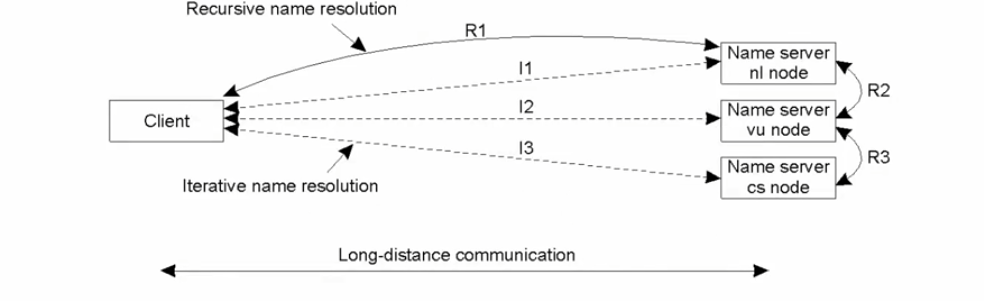
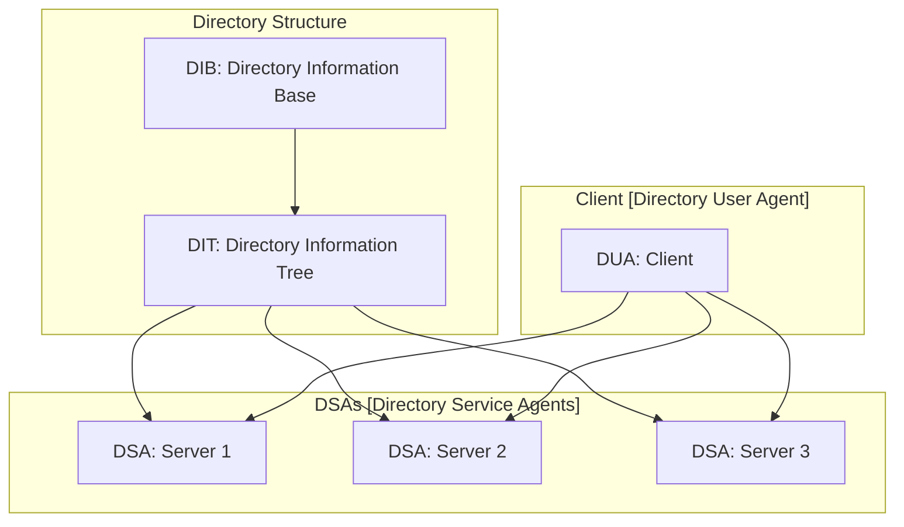

# Naming

In a DS, entities such as hosts, processes, threads, disks, and files need a mechanism is needed to be correctly mapped to their addresses. Names are used as references for these entities, allowing them to be accessed by other entities. These names can be classified as global or local, as well as human-friendly or machine-friendly.
## Flat naming 

In a **flat naming** schema, names are "flat", meaning they are simple strings without structure or content.
It can be implemented with: 

- **Simple solutions**: designed for small scale envs
		- **broadcast**
		- **multicast**
		- **forwarding pointers**: a particular technique to solve mobile nodes which consists in leaving reference to the next location at the previous location
- **Home-based approaches**: A single home node is used to track the location of the mobile unit. The assumption is that the home node is stable and can be replicated for reliability. However, this approach adds an extra step and increases latency. This system lacks geographical scalability, as the entity may be physically close to the client but still relies on the home node.
- **DHT**: DHT is a good solution for flat naming because it's strongly distributed. An example is **Chord** which is a protocol and algorithm for a peer-to-peer distributed hash table.
- **Hierarchical approaches**: Hierarchical approaches involve a two-tier system where a local registry is checked first, followed by the home location if the entity is not found locally.

### Chord 

Nodes and keys are organized in a logical ring and it's based on the idea that the routing table is used to "go" far as possible, as close as possible (in terms of nodes visited) to the node you are searching without overshooting. The highlights of Chord are:

- The "finger table" permits a **logarithmic search**: the item with key $k$ is stored by the largest node in the successor column where there are all nodes $(id + 2^i)$-th node for incrementing $i$. 
- The number of bits used by the DHT corresponds to the number of rows in the routing tables.
- The search space is typically much larger than the current number of computers connected, allowing for the addition of new nodes. This means that with a given ID there is no computer connected in most cases 

#### Chord considerations

The use of Chord in a network provides two key benefits: 

- Chord finger tables increase efficiency by allowing nodes to bypass large sections of the network during lookups. 
- Finger tables enable scalability as the network grows and more nodes join. These tables dynamically adjust to ensure that search time remains logarithmic, even with a larger number of nodes.

Drawbacks:

- A major drawback is the maintenance overhead. Nodes need to regularly update their finger tables to accommodate new nodes joining or existing nodes leaving the network. 
- Implementing and managing finger tables can be more **complex** when compared to simpler Peer-to-Peer (P2P) architectures.

## Structured naming

Structured naming systems organize names in a **namespace**, which is a labeled **graph** composed of leaf nodes (representing named entities) and directory nodes (with labeled outgoing edges pointing to different nodes). Names are referred to through path names, which can be absolute or relative. The namespace for large-scale systems is often distributed among different name servers, usually organized hierarchically.
The namespace can be partitioned into logical layers: 

- global level 
- administrational level 
- managerial level

| Item | Global | Administrational | Managerial |
| :--- | :--- | :--- | :--- |
| Geographical scale of network | Worldwide | Organization | Department |
| Total number of nodes | Few | Many | Vast numbers |
| Responsiveness to lookups | Seconds | Milliseconds | Immediate |
| Update propagation | Lazy | Immediate | Immediate |
| Number of replicas | Many | None or few | None |
| Is client-side caching applied? | Yes | Yes | Sometimes |

#### Name resolution techniques 

Two main techniques of name resolution are **iterative** and **recursive**:

- Iterative ns involves resolving the name by first asking the root and then its sub-nodes to find the responsible resource. Pros of this technique include:
	- reduced communication costs
	- more effective caching along the resolution chain. 
	However, it may lead to higher demand on each name server.
- Recursive ns starts from the root and then recursively forwards the request to its sub-nodes. This technique does not involve caching, which can result in slower lookups. Additionally, each name server in this resolution method is responsible for a single request, increasing demand on each server.

The DNS structure is a practical example of a structured naming system, where the namespace is hierarchically organized, and caching and replication are used to enhance efficiency.
DNS namespace is organized as a hierarchically rooted tree with separate authorities for each domain.
Each name server is responsible for a specific zone. Global servers are mirrored and queries are routed by IP anycast (not broadcast, it's a variant of unicast where is used only a node, chosen by the network among the nodes).
Caching and replication are widely used, with stability in the global and administrative layers while more frequent changes in the managerial layer.

While moving a host within the same domain only requires updating the domain name servers, if i's moved to a different domain, DNS servers can provide the new IP address or create a symbolic link to the new location but may affect lookup efficiency.

The structured naming system, implemented using a hierarchy of servers, is more efficient than a flat naming system because it allows for more effective caching and reduced communication costs due to its organized structure. The hierarchical organization of the namespace in structured naming systems, as exemplified by the DNS, enables faster lookups and better scalability. In contrast, flat naming systems, while simpler, can suffer from inefficiencies due to their lack of structure, especially as the scale of the system increases

## Attribute-based naming

The idea of attribute-based naming is to add a set of attributes (which code properties) to the name of entities. Attribute based naming systems are usually called **directory services** and they are usually implemented by using **DBMS**. 
**LDAP** (Lightweight Directory Access Protocol) is the dominant protocol used for directory services. LDAP directories consist in a collection of directory entries which is called Directory Information Base (**DIB**). 
Each record in the DIB has a unique name composed of naming attributes. 
In large-scale directories, the DIB is typically partitioned according to the Directory Information Tree (DIT) structure and: 

- Servers are known as **Directory Service Agents** (DSA)
- Clients as **Directory User Agents** (DUA)

## Removing unreferenced entities

- In some cases, objects need to be removed from the system since unreachable from any other node.
- This is typically done by creating a graph
- Automatic garbage collection is common in conventional systems.
- Distribution of systems complicates the process due to lack of global knowledge and network failures.

Different approaches: 

- **Reference counting**: Every object keeps track of the number of references it has. When an object is created, its reference counter is set to 1. When a reference is no longer needed, the counter decreases. The problem with this is **race conditions** when passing references between processes.
	- **Weighted reference counting**: Tries to circumvent the race condition by communicating only **counter decrements**: 
		- It uses two counters, a partial and total one.
		- Removing a reference subtracts the proxy partial counter from the total counter of the skeleton. 
		- The advantage over a "standard counting" is that creating a proxy doesn't require you to reform the skeleton. You only reform the skeleton when you destroy the proxy. 
		- When the total and partial weights become equal garbage collection happens. 
		- The only problem with this is that only a fixed number of references can be created. Still exists some techniques like "asking more weights form the proxy" or "create a recursive weighted reference counting" to solve this problem.
- **Reference listing**: it is used a list to track the identities of the proxies. Easier maintenance in the event of network failures since "pinging" clients to check if they are alive is possible. However, race conditions can still occur when copying references.
- **Mark-and-sweep**: Tries to identifies disconnected groups of objects from the root set using a graph and turning the problem into a "search/graph exploration". There are issues such as the requirement for a stable reachability graph and potential scalability problems.
