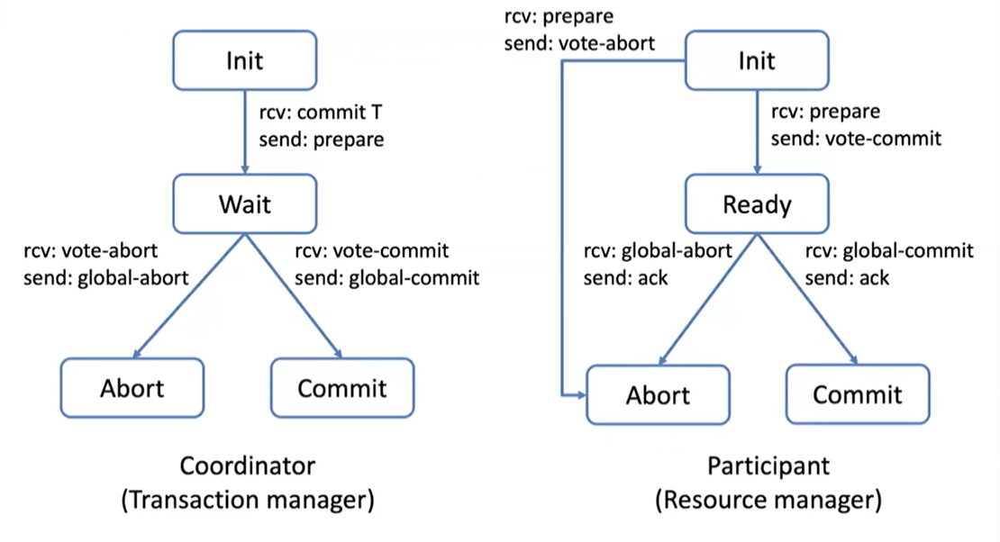
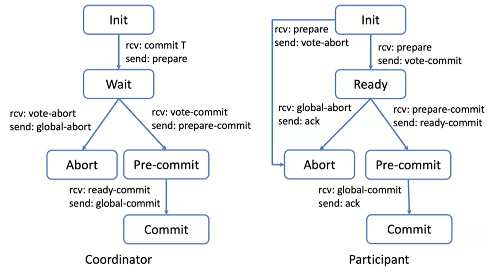
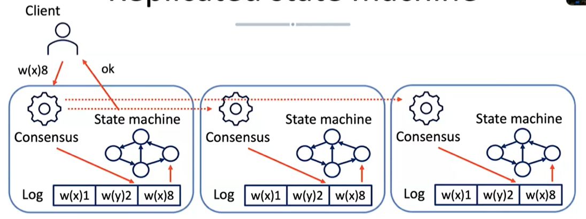
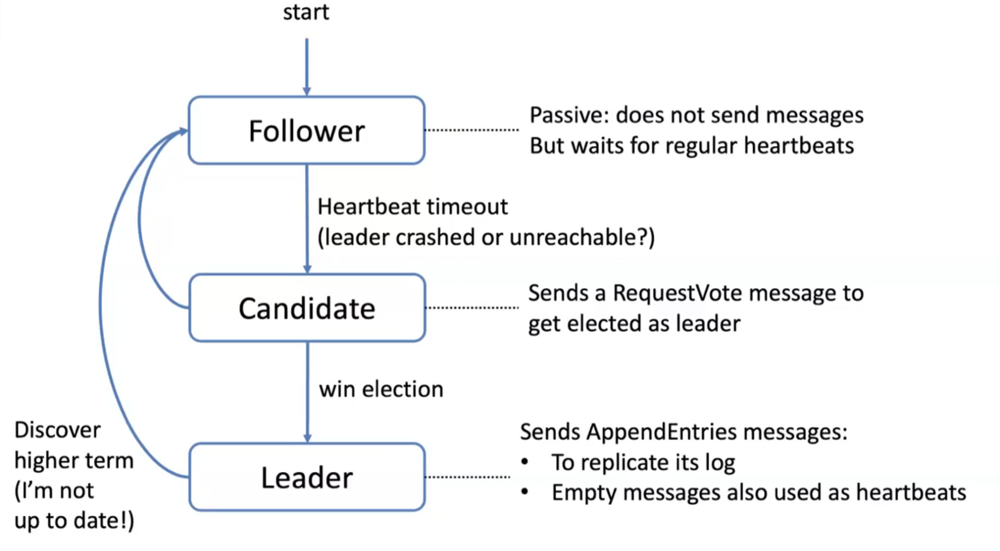
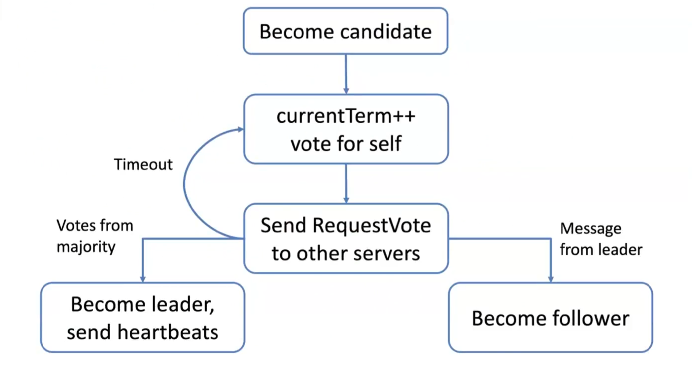

# Distributed agreement in practice

## Distributed commit 

We will discuss the concept of Distributed Commit, specifically focusing on atomic commitment. In a distributed database system, the challenge arises when we want to commit operations to databases that are partitioned. 

Atomic commit refers to a transaction which refers to the **atomicity** [ACID](../../../BSc(italian)/Basi%20di%20Dati/src/05.Transazione.md###ACID) property: the transaction is either completely successful or completely unsuccessful, no intermediate state is possible.

| Consensus      | Atomic commit      |
|:------------------ |:----------------- |
|  One or more nodes propose a value  | Every node votes to commit or abort  |
| Nodes agree on one of the proposed value | Commit if and only if all nodes vote to commit, abort otherwise |
| Tolerates failures, as long as a majority of nodes is available | Any crash leads to an abort    |

- Termination:
	- If there are no faults, all processes eventually decide (weak)
	- All non-faulty processes eventually decide (strong)

There are two different commit protocols:

- Two-phase commit (**2PC**): sacrifices liveness (blocking protocol)
- Three-phase commit(**3PC**): more robust, but more expensive so not widely used in practice

General result (FLP theorem): you cannot have both liveness and safety in presence of network partitions in an asynchronous system.

### 2PC

2PC is a blocking protocol which satisfies the **weak** termination condition, allowing to reach an agreement in less than $f+1$ rounds

There is a coordinator who coordinates the transactions. In the beginning the coordinator sends an IN IT message, then when it receives a COM M IT request, it sends a `VOTE-REQUEST`. When a replica receive a `VOTE-REQUEST` , it may decide for `VOTE-COMMIT` or `VOTE-ABORT` . In the meanwhile that all the replicas answers, the coordinator is in `WAIT` state. If it receives a `VOTE-ABORT` , it sends a `GLOBAL-ABORT` (abort all transactions) to all the replicas. Otherwise, if it receives a `VOTE-COMMIT` from all the replicas, it sends a `GLOBAL-COMMIT`. 

- A participant fails: after a timeout the coordinator can assume abort decision by participant.
- The coordinator fails:
- Participant blocked waiting for vote request $\rightarrow$ it can decide to abort
- Participant blocked waiting for global decision (state `READY` ) $\rightarrow$ it cannot decide on its own, it must wait for the coordinator to recover or it can request retransmission of the decision from another participant who may have received a reply from the coordinator.
- Participant in INIT state because the coordinator has crashed before completing the starting phase $\rightarrow$ the participant may safely abort.
- If everybody is in READY state, nothing can be decided until the coordinator recovers (blocking protocol).

If the coordinator fails before voting commit or abort and a replica is in READY state, from this state that replica has no safe exit. It cannot go vote for a commit because it does not know if someone else already aborted. The replica cannot decide if the coordinator fails before sending him a message (either commit or abort). This prove that if somebody fails, the $2 \mathrm{PC}$ cannot reach a consensus.

### 3PC 

With 3PC we are trying to solve the problems of two-phase commit by adding another phase to the protocol. In this protocol: • No state leading directly to `COMMIT` or `ABORT` • In case of indecision, no state can lead to `COMMIT`

3PC is a non-blocking protocol, which satisfies the strong termination condition but may require a large number of rounds to terminate. The good thing is that with no failures, only 3 rounds are required.

- A participant fails:
	- Coordinator blocked for vote $\rightarrow$ it can assume abort decision by participant.
	- Coordinator blocked in state PRECOMMIT $\rightarrow$ it can safely commit and tell the failed participant to commit when it recovers. This because when the coordinator is in PRECOMMIT, means that everybody already sent a VOTE-COMMIT, so the coordinator knows that the recovered participant can commit without any problem.
- The coordinator fails:
	- Participant blocked waiting for vote request $\rightarrow$ it can decide to abort.
	- Participant blocked waiting for global decision $\rightarrow$ it contacts other participant.
$$
\begin{aligned}
& * A B O R T \text { (at least one) } \rightarrow A B O R T ; \\
& \text { * COMMIT (at least one) } \rightarrow C O M M I T ; \\
& \text { * INIT (at least one) } \rightarrow A B O R T ; \\
& \text { * PRECOMMIT (majority) } \rightarrow C O M M I T \\
& \text { * READY (majority) } \rightarrow A B O R T
\end{aligned}
$$
	- Alternatively it is possible to elect a new coordinator.
	- No two participants ca be one in PRECOMMIT and the other in INIT.

### CAP theory 

Any distributed system where nodes share some (replicated) shared data can have at most two of these three desirable properties
- **C**: consistency equivalent to have a single up-to-date copy of the data
- **A**: high availability of the data for updates (liveness)
- **P**: tolerance to network partitions
In presence of network partitions, one cannot have perfect availability and consistency.

For the *hodlers* out there we can say that the blockchain **trilemma** is a concept that was derived from CAP Theorem.

## Replicated state machine

Modern data systems provide suitable balance of availability and consistency for the application at hand
- E.g., weaker definitions of consistency
We will discuss this under [Consistency and Replication](08.Consistency%20and%20Replication.md). 

### Replicated state machine

A general purpose consensus algorithm enables multiple machines to function as a unified group. These machines work on the same state and provide a continuous service, even if some of them fail. From the viewpoint of clients, this group of machines appears as a single fault-tolerant machine.

The idea is that the client connects to a leader which writes the operations onto a log. This log contains a sequence of operations that need to be propagated to the other nodes in the system through a consensus protocol. 
The ultimate objective is to maintain a coherent view of the system regardless of failures and network issues: such as leaders failing, network partitions, and clients connecting to multiple leaders.

Safety
- All non-failing machines execute the same command in the same order
Liveness / availability
- The system makes progress if any majority of machines are up and can communicate with each other
- Not always guaranteed in theory
- It is not possible, according to the FLP theorem
- Guaranteed in practice under typical operating conditions
- E.g., randomized approaches make blocking indefinitely highly improbable

### Paxos

Paxos, proposed in 1989 and published in 1998, has been the reference algorithm for consensus for about 30 years. However, it has a few problems. Firstly, it only allows agreement on a single decision, not on a sequence of requests. This issue is solved by multi-Paxos. Secondly, Paxos is very difficult to understand, making it challenging to use in practice. Finally, there is no reference implementation of Paxos: here is often a lack of agreement on the details of its implementation.

### Raft 

During normal operation, a leader server is responsible for accepting commands from clients and appending them to its log. The leader server then replicates its log to the other servers in the system.

In the event of a leader crash, a leader election process is initiated: if followers don't hear from the leader within a certain timeframe, they start an election. The timeout period is randomized to prevent multiple parallel elections from occurring simultaneously. The range for the timeout is set between 150ms and 300ms.

Raft divides time into terms of arbitrary length
- Terms are numbered with consecutive integers
- Each server maintains a current term value
- Exchanged in every communication
- Terms identify obsolete information
- Each term begins with an election, in which one or more candidate try to become leader
- There is at most one leader per term
- If there is a split vote (no majority for any candidate), followers try again when the next timeout expires

Safety is an important aspect of log replication. It ensures that the log remains consistent across all servers. Only servers that have up-to-date logs are eligible to become the leader. This ensures that the system can operate with integrity and avoid any conflicts or inconsistencies.

Basically it's not possible to guarantee something in distributed systems. You always have to make assumptions. The assumption for the Raft protocol is just one: no **byzantine** failures. 

There is a property called "Log matching consistency" that guarantees the consistency of log entries across different servers. This property ensures that if log entries on different servers have the same index and term, they will store the same command. 
Furthermore, the logs will be identical in all preceding entries. Additionally, if a specific log entry is committed, all preceding entries will also be committed.

To guarantee this a "consistency check" is used: this involves adding a `<index,term>` message to the request, which is then validated by the follower. If the follower detects an error, it will reject the request. In this case, the leader will make a new attempt with a lower log, aiming to bring the follower in sync with itself (and so with the majority of the network).

Furthermore Raft implements leader completeness to ensure correctness: this means that once a log entry is committed, all future leaders must store that entry. Servers with incomplete logs cannot be elected as leaders. To enforce this, candidates include the index and term of the last log entry in their RequestVote messages. 
Meanwhile, in terms of communication with clients, it's guaranteed that clients always interact with the leader: this because when a client starts, it connects to a random server, which communicates the leader for the current term to the client. 

## Blockchains 

Blockchains can be seen as **replicated state machines**, where the state represents the current balance of each user. This state is stored in a replicated ledger, which acts as a **log** and keeps records of all operations or transactions. 
Blockchains can be modeled inside a "byzantine environment": misbehaving user (byzantine failures) attempting to "double spend" their money by creating inconsistent copies of the log. 
verall, the choice of approach depends on the trade-offs between search expressivity, performance, and network fragility.