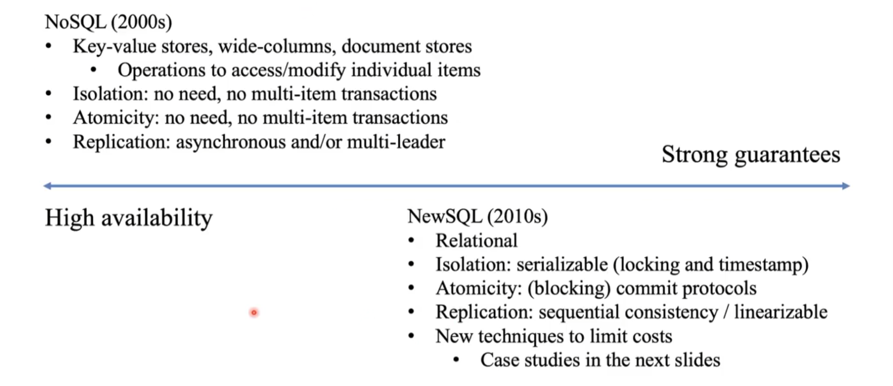

# Replication and Consistency

**Replication** is useful for:

- more **performance** by allowing workload sharing and **reducing latency** for individual requests. It can also enhance **availability** by replicating data closer to users. 
- more **fault tolerance** through **redundancy**

However, one of the main challenges in replication is ensuring **consistency** across replicas:  changes made to one replica need to be propagated to all others, which can result in conflicts. 
The objective is to maintain consistency while **minimizing communication overhead**. 

Ideally you want the illusion of a single copy, but actually it's impossible and we have to rely on a **consistency model** is a **contract** between the processes and the data store.  
Consistency models can be divided based on the promises made by the contract/protocol: 

- **guarantees on content**: maximum difference between versions of different replicas
- **guarantees on staleness**: timing constraints over propagation to all replicas
- **guarantees on the order of the updates**: constraints of possible behaviors in the case of conflicts 

**Consistency protocols** are responsible for implementing **consistency models**. These protocols are designed with various strategies in mind to handle different assumptions: 
- passive vs active: passive if the replicas just are for the storage and there is a "master" process, active if the replicas can also process user requests.
- single leader vs multiple leader vs no-leader: design a replica or more or no-one as "leader" which can process write requests.
- synchronous vs asynchronous vs semi-sync: sync if write operation completes only after the leader has received a **confirmation** from all followers. "Async" when the leader store the ops and all the follower updates happen asynchronously. Hybrid solution is to consider an operation completed after confirmation from at least k replicas.

## Data-centric consistency models

### Consistency definitions

It is quite difficult to have a precise definition of **consistency** in the context of data-centric models. We  focus  mainly  on models that  predicate  on  the  order  of operations. Some consistency models are stronger and provide stronger guarantees but are more expensive. On the other hand, weaker models are less costly. 

#### Strict consistency 

> "Any read on data item $x$ returns the value of the most recent write on $x$"

All writes are instantly visible and the global order is maintained. However, determining the "most recent" write is only possible within a single processor machine and in a DS (without a global time) is ambiguous.

#### Sequential consistency 

Processes can agree on a sequence of operations, regardless of the real-world clock time. This agreed-upon sequence preserves the semantics of the writes and reads. Although the distributed system itself may not have a real clock, we can imagine ourselves outside the system, observing the real order of operations. Let's assume that the x-axis of the schedule represents the definition of real time. 

> "The result is the same as if the operations by all processes were executed in some sequential order, and the operations by each process appear in this sequence in the order specified by its program"

The schedule is sequential, but ...
At this point in time $B$ thinks $x$ is already $1, C$ thinks $x$ is still 0
If they communicate (through a different channel), they break the illusion of a single copy

In practice: 

- Use a single coordinator (single leader replication): 
	- Sequential consistency **limits availability** since it's necessary to contact the leader (which might be further away from the client) which must propagate synchronously the update to the replicas to achieve fault-tolerance
	- **No tolerance for network partitions**: in case of net. part. clients are blocked or leader is blocked to contacts followers
- **Distributed agreement**: the use of leaderless protocols which are quorum-based where for each operation it's necessary a **quorum** (*quò·rum* is the quotient, in numbers or percentages, of the votes cast or of the voters, required for an election or resolution to be valid) of the servers which agrees on the version number of a resource. Typically:
	- $NR + NW > N$ to avoid read-write conflicts
	- $N W> \frac{N}{2}$ to avoid write-write conflicts
	- where $N R(N W)=$ number of replicas that the clients connects to read (write) and $N=N R+N W$

#### Linear consistency (linearizability)

Stronger than sequential consistency

> "The system is sequentially consistent and also if $ts_{OP_1}(x) < ts_{OP_2}(y)$ then operation $OP_1(x)$ precedes $OP_2(y)$ in the operation sequence" 

"We also care about time and not only order"

Linearizability is a consistency model that is stronger than sequential consistency but weaker than strict consistency. 

It relies on the assumption of globally available clocks.

Linearizability is particularly useful in cases where the application logic requires a certain ordering between operations to be enforced.

#### Causal consistency

Causal consistency is the strongest protocol among those we have discussed and is highly available.
 
> "Writes that are potentially causally related must be seen by all processes in the same order. Concurrent writes may be seen in any order at different machines."

Weakens sequential consistency based on Lamport’s notion of happened-before. Lamport’s model deals with message passing. Here causality is between reads and writes.

It is not a total order, it's a partial order. 

- Write operations by a single process must be seen in order by all processes
- (potentially correlated) Read-write operations by multiple processes must be seen in order by all processes

Operations that are not causally ordered are said to be concurrent. Why causal consistency? 
Easier to guarantee within a distributed environment (smaller overhead)
Easier to implement

Remember that Causal order is **transitive**.  

#### FIFO consistency

>"Writes done by a single process are seen by all others in the order in which they were issued; writes from different processes may be seen in any order at different machines"

Super simple consistency where causality across processes is dropped

Causal consistency implies FIFO 

Super simple consistency 

| Consistency | Description |
| :---: | :---: |
| Linearizable | All processes must see all shared accesses in the same order. Operations behave as if they took place at some point in (wall-clock) time. |
| Sequential | All processes see all shared accesses in the same order. Accesses are not  ordered in time. |
| Causal | All processes see causally-related shared accesses in the same order. |
| FIFO | All processes see writes from each other in the order they were used. Writes from different processes may not always be seen in that order. |

#### Eventual consistency

The models discussed previously focus on data-centric approaches that ensure a consistent view of the data system-wide with concurrent updates. However, there are scenarios where simultaneous updates are unlikely or can be easily resolved, and where read operations are more prevalent: examples include web caches, DNS, and geo-distributed data stores like Facebook/Instagram.

In these types of systems, eventual consistency is often deemed satisfactory, as it guarantees that updates will **eventually** propagate to all replicas:

- Very easy to implement
- Very few conflicts in practice
- E.g., in social media applications, a user often accesses and updates the same replica
- Today's networks offer fast propagation of updates
- Dedicated data-types (conflict-free replicated data-types)

This is widely used in practice, in scenarios where the order of messages is not important.

Eventual consistency doesn't imply any fifo/causal/sequential consistency. 
## Client-centric consistency models

###  Monotonic reads

> "If a process reads the value of a data item $x$, any successive read operation on $x$ by that process will always return that same value or a more recent value"

Once a process reads a value from a replica, it will never see an older value from a read at a different replica.

### Monotonic writes 

> "A write operation by a process on a data item $x$ is completed before any successive write operation on $x$ by the same process"

Similar to FIFO consistency, although this time for a single process. A weaker notion where ordering does not matter is possible if writes are commutative.

### Read your writes

> "The effect of a write operation by a process on a data item $x$ will always be seen by a successive read operation on $x$ by the same process"

"If you make a post, then when you read at a different location is important that you see that post"

### Writes follow reads 

> "A write operation by a process on a data item $x$ following a previous read operation on $x$ by the same process is guaranteed to take place on the same or more recent value of $x$ that was read"

"You see writes on something you already read"

Example: guarantee that users of a newsgroup see the posting of a reply only after seeing the original article

### Client-centric consistency implementations

In this scenario, each operation is assigned a unique identifier. These identifiers are created by combining the ReplicaID and a sequence number. There are two sets assigned to each client: 

- the **read-set**: write identifiers relevant for the read operations executed by the client
- the **write-set**: the identifiers of the write performed by the client. 

These sets can be represented using **vector clocks**, which keep track of the latest read/write identifiers from each replica.

## Design Strategies 

### Replica placement 

Three different approaches:

- **Permanent replicas**: statically configured (e.g., Web mirrors)
- **Server-initiated replicas**:
	- Created dynamically based on some criteria 
	- Move date closer to clients
	- Often require topological knowledge
- **Client-initiated replicas**: rely on a client cache, that can be shared among clients for enhanced performance

### Update propagation 

- What to propagate?
	- **Perform the update and propagate only a notification**: Invalidation protocols are used to avoid propagating subsequent writes unnecessarily. This can be done by using small communication overhead. These protocols work best when `#reads >> #writes`
	- **Transfer the modified data to all copies**: best is `#reads >> #writes`
	- **Active replication**: propagate information to enable the update operation to occur at the other copies. Very small communication overhead, but may require unnecessary processing power if the update operation is complex. Need to consider side effects.

- How to propagate?
	- **Push-based approach**: the update is propagated to all replicas, regardless of their needs. Typically used to preserve high degree of consistency
	- **Pull-based approach**: An update is fetched on demand when needed – More convenient if `#reads << #writes` . Typically used to manage client caches, e.g., for the Web

| Issue                   | Push-based                               | Pull-based        |
|:----------------------- |:---------------------------------------- |:----------------- |
| State of server         | List of client replicas and caches       | None              |
| Messages sent           | Update (and possibly fetch update later) | Poll and update   |
| Response time at client | Immediate (or fetch-update time)         | Fetch-update time |

## Consistency in Distributed Databases 

There is a tension between consistency and cost when it comes to guaranteeing consistency for clients. This tension is evident in various aspects such as synchronization, concurrency control, isolation, locking protocols, and timestamp-based protocols.

Locking protocols incur a cost when implementing synchronization and ensuring consistency. Atomicity, which involves two-phase commit protocols and three-phase commit protocols, also faces the challenge of balancing consistency and liveness.

In terms of replication, achieving sequential consistency means sacrificing high availability. Different protocols handle availability in different ways. Being available means the system can continue functioning despite partitions, while guaranteeing strong consistency.

The world of databases revolves around these properties, and finding the right balance between them.

### Case study: Spanner 

[Spanner: TrueTime and external consistency  |  Google Cloud](https://cloud.google.com/spanner/docs/true-time-external-consistency)

Spanner is a globally-distributed database developed by Google. It is specifically designed to handle very large databases, utilizing a partitioned approach where each partition is replicated.

To ensure fault-tolerance and reliability, Spanner adopts standard techniques: 

- Single leader replication with Paxos, which allows for followers and leaders to reach agreement. 
- Atomic commit is achieved through the use of the two-phase commit (2PC) protocol.
- Timestamp protocols are utilized for concurrency control within the database.

TrueTime is a distributed clock system that provides highly available timestamps to applications on Google servers. It enables applications to generate monotonically increasing timestamps and allows users to determine the uncertainty range of a given time. This is particularly useful in read-write transactions, where the transaction coordinator requests a timestamp and waits until the uncertainty range has passed for every node involved in the transaction before committing it. By ordering transactions based on time, TrueTime ensures linearizability.

TrueTime is also used in read-only transactions, where a timestamp is acquired but locks are not required since no write operations are performed. Instead, the latest value at the specified timestamp is read. This optimization eliminates the need for locks and speeds up processing, especially when read-only operations are frequent.

By leveraging atomic clocks and GPS, TrueTime provides precise and ordered transactions. Its usage ensures the correct and efficient execution of transactions.

### Case study: Calvin

Calvin is designed for the same settings as Spanner. It adopts a sequencing layer to order all incoming requests, both read and write. 

Guarantees: linearizability provided by the sequencing layer

Advantage:

- Agreement (order of execution) achieved before acquiring locks: lower lock contention
- No need for 2PC: as transactions are deterministic, they either succeed or fail in all replicas
- One message from (the leader replicas of) partitions that may lead to an abort is sufficient

### Case study: VoltDB

Developers have the ability to specify how to partition database tables and transactions. Specifying this allows the database to organize data efficiently based on query hints. This optimization can be particularly helpful for queries/transactions which are single-partitioned: 
they can be executed sequentially on that partition without the need for coordination with other partitions.
As an example: hotel and flights tables both partitioned by city. 