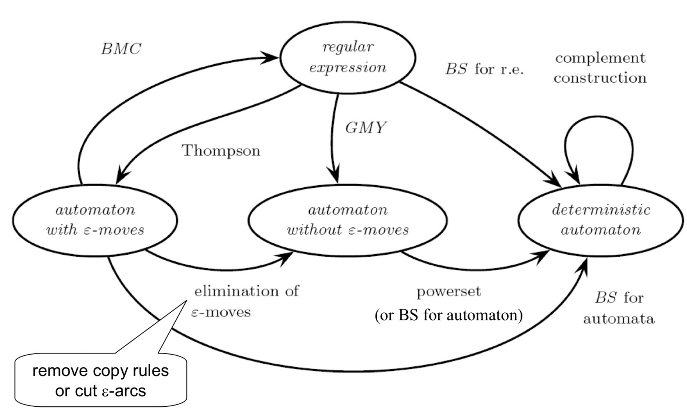
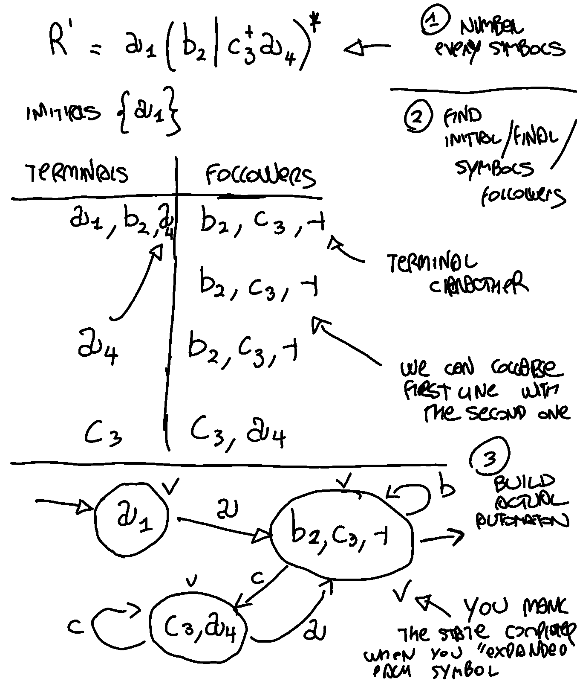
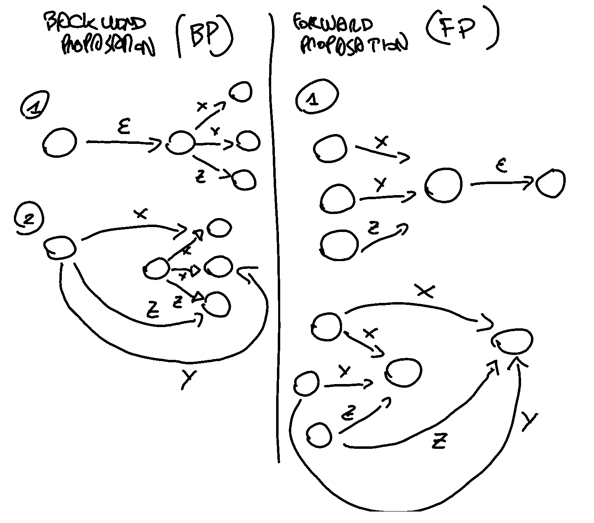

# Berry Sethy

Before starting: 

- initials: symbols at the start of the string 
- terminals: not the symbols that appear at the end of a string! But all the symbols that are not initials.
- followers: all the symbols that can follow a terminal

Convert a regular expression to finite state automaton. 

1) rename all the symbols giving a number to all of then 
2) find initial / terminals / followers symbols 
3) eventually collapse lines in the table
4) build actual automaton and in each state you put in the followers 

 

Procedure to check if it s minimal is to use a matrix where each column is a state and each line a transition letter. 

Berry Sethi can work also viceversa following the exact same rules. 

# BMC algorithm 

The BMC-algorithm (Brzozowski Mc-Kluskey) is used to convert a finite automata into a regular expression. It's very simple: eliminate all internal states once at time while adding compensatory moves labeled by regular expressions. The order in which internal states are deleted is irrelevant.

It is used to convert an automata into a regular expression. 

1) you add an initial and final state 
2) then you iteratively: 
	1) choose a random node $X$
	2) replace the arrows **concatenating the symbols** on the arcs with this rule: create an arc from $A$ to $B$  if there are an arc from $A$ to $X$ and an arc from $X$ to $B$.
	3) repeat until the two artificial nodes are linked
3) the reg expression will be on the only final arc. If there are multiple final arcs just use $|$ operator. 

### Two possible way to eliminate $\epsilon$ transition :

- backword propagation (BP)
- forward propagation (FP)

note that eliminating the $\epsilon$ - moves produce indeterministic automatons. 

we cut transition 2 ε−→ 3 and we back-propagate the outgoing arc

