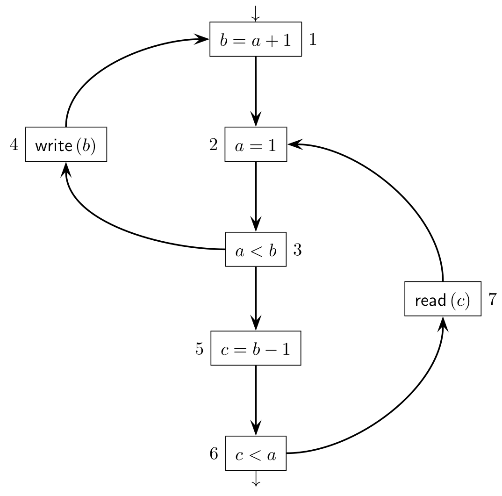

In other words, a variable is live out of a certain node if some instruction that may be successively executed, makes use of the value the variable has in the former node.

Static analysis 

Static analysis of programs is a set of operations that are performed a priori, or not during the execution of the program itself, which aims to extract information from the source code or an intermediate form of code, which then allows to perform some advantageous operations. 

In addition to recognition and parsing, many language processing tasks involve some form of transformation on the original sentence. For example, a compiler translates a program written in a high-level programming language such as Java, into the machine code of a specific microprocessor. 

- Consider only the simplest instructions, such as those involving a scalar variable and constant.
-   Focus on assignment to a variable and simple unary arithmetic, logic, or relational operations.
-   Only consider intraprocedural analysis (not interprocedural).
-   Every graph node represents a program instruction (statement).
-   If instruction p is immediately followed by q at execution time, the graph has an arc directed from p to q, with p being the predecessor of q.
-   The first instruction of the program is the graph input node (initial node).
-   An instruction without successors is a graph output node (final node).
-   Unconditional instructions have one successor, whereas conditional instructions have two or more successors.
-   An instruction with two or more predecessors is a confluence node (also called merge or join node).
-   Keep in mind that the control graph is not a complete and faithful representation of the program.
-   The logical value of a condition (true or false) that selects the appropriate successor of a conditional instruction is not represented.
-   Replace the assignment operation with abstractions such as:
    -   A variable defines that variable.
    -   Referencing a variable in the right member of an assignment, an expression, or a write operation uses that variable.

Liveness of a variable

A variable is alive in some point $p$ of the program if some instruction reachable from $p$ will use the value of the variable. 

Each define of any variable it's like a reset/breakpoint in the liveness of the variables. 

Liveness information is an hint for the compiler to "is this variable necessary to the program? Can I remove it?" . So basically liveness is used to optimize memory allocation. 

At the end you take the "in" and "out" sets and write them near the blocks. 

You make analysis for example on reaching definitions: For each variable we check where it's been defined.

A block A dominates a block B if to reach block B it's necessary to pass from block A . 

Where $p$ is an arbitrary block. 
$$\operatorname{in}(p)=\operatorname{use}(p) \cup(\operatorname{out}(p) \backslash \operatorname{def}(p))$$

$$\text{out}(p)= U \space \text{in}\left(p_{\text {successors }}\right)$$

live out of each set must be coherent with the in set of any p successors. 

The algorithm consists basically to apply the formulas through many iterations until we reach a "fixed point": the in and out set doesn´t change anymore from a set to another one. 

