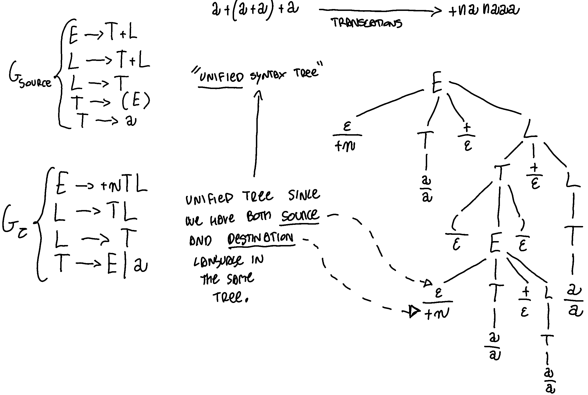

# Translation semantics 

A translation can be thought of as a function or, more generally, a mapping between the strings of the source language and the strings of the target language. 
Like string recognition, there are two main approaches to translation. 
The generative approach involves creating a mapping between the source and target languages, while the other approach uses a transducer, which is similar to a recognition automaton, but with the added capability to emit a target string.

Syntactic translation, or compilation, consists of obtaining a new string, called an image, from a certain source string. The two strings can belong to different languages, called source language and image language. The machine that does this is called a syntactic translator or compiler. The translation can be ambiguous or multi-valued if the same source string has multiple images in target. Inverse translation is simply the inverse relation of translation. The properties of a translation can be injectivity, surjectivity and biunivocity. There are two types of translation: purely syntactic and syntax-driven. Purely syntactic translation relies solely on source language syntax, while syntax-driven translation also uses some variables. Purely syntactic translation can be formalized using a translation grammar, a 2I-automaton, an IO-automaton or a regular translation expression.

## Translation grammars 

Translation grammars Syntactic schemes for purely syntactic translation A purely syntactic translation can be formalized in various equivalent ways:

1.  Through a translation grammar
2.  Through a 2I-automaton (also called a Rabin & Scott machine).
3.  Through an IO-automaton.
4.  Through a translation regular expression. Let's start here by looking at the first method. Translation grammars Given the source language and the target language, and given two grammars that generate these languages, if the following conditions are met:
5.  There is a one-to-one correspondence between the rules of and ;
6.  The corresponding rules of the two grammars differ only by the terminals that appear in them;
7.  The corresponding rules of and contain the same non-terminals, in the same order. Then a translation grammar ( ) can be constructed, which is actually just a more concise representation of the given pair of grammars. The translation grammar simply involves rewriting the same rules of and , by replacing the terminals with symbols of the type $\frac{a_1}{a_2}$ . 

Example: 

# Attribute grammars 

> Attribute grammars are basically the theory behind Bison

A "grammar with attributes" is a grammar in which one or more procedures can be associated with each rule to calculate the attributes associated with the nonterminals that appear in the rule itself.  Attributes are associated with various nonterminal or terminal symbols that appear in the grammar. The tree with the addition of these attributes is called a decorated tree. 

Attributes left and right

-   Left or synthesized attributes: an attribute is said to be left or synthesized if it allows calculating an attribute associated with the non-terminal present as the left part of the rule; it will therefore be of the type:

- Right or inherited attributes An attribute is said to be right or inherited if it allows calculating an attribute associated with one of the non-terminals in the right part of the rule; it will therefore be of the type: 
- An attribute cannot be both left and right at the same time.

Synthesized attributes are computed from the attributes of the children of a nonterminal.

Inherited attributes are computed from the attributes of the parent nonterminal and the attributes of the children. 

We generally use a table to indicate an attribute grammar. We use numbers to distinguish the symbols in the "given grammar". 

The important stuff to look in the attribute grammars is to look eventually circular dependency. Indeed if an attribute grammar is acyclic , it's also correct. 

Additionally, it is of type one-sweep, meaning that the attribute values can be computed in a single pass over the parse tree, with each attribute value depending only on the attribute values of its parent, children, and itself. This makes the attribute grammar easy to evaluate and understand. A dependency graph can be used to visualize the attribute dependencies and further confirm that the attribute grammar is of type one-sweep.

2 sweeps grammar ??? 

