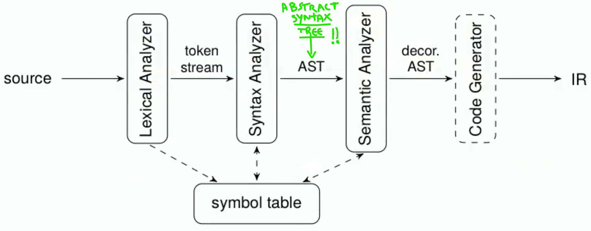

# Lab ACSE


{width=50%}

There are several variants of LR parsers, one of them are **LALR** parsers.
LR (and LALR) parsers can be generated by a parser generator from a formal grammar defining the syntax of the language to be parsed. This is what Bison (GNU Parser Generator) does: it's not a parser but a parser generator. Bison uses the LALR(1) parsing algorithm, LALR(1) stands for "Look-Ahead LR(1)" which is an efficient bottom-up parsing algorithm.
LALR(1) builds a parse tree for a given input string by starting at the leaves and working its way up to the root. It's an efficient algorithm for parsing context-free grammars.
LALR(1) languages are strictly less expressive than general context-free languages, but are more efficient to parse.


> Mindset: in this kind of exercises we are not actually doing assignments, we are just writing the instructions that will produce the assignment when the program will be executed. We are translating the program, not executing. Compilation is a form of planning. No space for its value is reserved in the memory of the compiler, however, the compiler knows in which register or memory location the variable will be at runtime. 


````shell 
sudo apt update && sudo apt install –y build-essential flex bison
````

In acse the assembly code is generated while the parser (generated by Bison) is parsing (using the Bison semantic rules).


## Flex 


It's implemented as non-deterministic finite state automaton. 


- definitions: where you can declare useful REs
- rules: most important part where you bind RE combinations to actions 
- user code: C code

Each part is separated by ```%%```  


Longest matching rule 
The flex scanner in case of more than one match (with more one rules) the longer match will always win: if a longer regular expression match an expression and then others regular expression match subsets of the expression, the longer rule willl have precedence. 

the first rule 


Flex breaks up the input into individual tokens that are then passed to the parser (in our case we use Bison) for further processing.


Flex -> we do lexical analysis: from words to tokens 
In particular Flex generates a scanner (which recognizes tokens in the stream of characters and maybe decorate them in order to provide additional info). 


A flex file is structured in this way (three sections separated by \%\%). 

```` C
Definitions 
//declare useful REs
%% 
Rules
//bind RE combinations to actions
%%
User code
//C code (generally helper functions)

````

Each rule basically corresponds to a token to be recognized: in particular it links a token with an action to perform when the token is matched. 

# Bison

It reads a specification of a grammar for a particular programming language or input format, and generates a parser which can recognize and parse input written in that language or format. 

- prologue: useful place where to put header file inclusions and variable declarations
- definitions
- rules 
- user code 


Bison file structure is similar to Acse. 


````C
%{
//prologue and headers 
}%
// definitions
%%
//rules like a context-free grammar 
not_terminal : terminal1 
				   | terminal2 TOKEN_A  
				   | terminal3 { /* C code */ }
%%
//user code
````


Very similar to grammar ... uppercase tokens are non terminals and lowercase tokens are terminals symbols. 

You can add semantic actions for each grammar rule. 

Byson uses bottom-up parsing: it always gives precedence to the inner-most rule. 


````C
%union{ //in the %union I list the possible semantic data types  
	float f_value;
	struct Expr expr;
}

//Here I specify the type which the tokens can assume: 

%token <f_value> FLOAT //%token are terminals  
%type <expr> expr //%type are non terminals 
````


The parser generated by Bison would be responsible for recognizing and parsing the ACSE code while the lexical analyzer (generated by Flex) would be responsible for breaking the code up into individual tokens.

## ACSE


Acse is a LANCE ( a simplified version of C) compiler which emits RISC-like assembly code and is built on Flex and Bison. 


 
ACSE is a simplified compiler in order to reduce the effort to understand how compilers work. ACSE accepts a C-like source language called LANCE:   
• very small subset of C99   
• standard set of arithmetic/logic/comparison operators   
• reduced set of control flow statements (while, do-whi le, if)   
• only one scalar type (int)   
• only one aggregate type (array of ints)   
- only two I/O operations:   
	- `read(var)` stores into var an integer read from standard   
	- `write(var)` writes var to standard output writing


LANCE produces a RISC-like assembly language: 

|Type  | Operands  | | 
|:--:|:---:|:--:|
| Ternary  | 1 destination and 2 source registers   | ADD R3 R1 R2  |
| Binary   | 1 destination and 1 source register, and 1 immediate operand  | ADD R3 R1 #4| 
| Unary   |1 destination and 1 address operand (label) |  LOAD R1 L0   |
| Jump   |1 address operand   |BEQ LO|

Jump instructions:
- BT: unconditional branch
- BEQ: branch if last result was zero 
- BNE: branch if last result was not zero

Using `( )` to point to the memory address. 


Special registers:

- `R0` zero, always contains 0  
- status word `PSW` , mainly exploited by conditional jumps
	- N, negative
	- Z, zero
	- V, overflow
	- C, carry
	

ACSE works using **mace** which is a simulator of the fictional MACE process. 

Compiler translates a program written in a language and it's organized as a pipeline: 

- front-end: source language into intermediate forms
- middle-end: where transformations and optimizations are applied (for example vectorization)
- back-end


- Front-end: the source code is tokenized by a flex-generated scanner, while the stream of tokens is parsed by a bison-generated parser. At the end, the code is translated to a temporary intermediate o a representation by the semantic actions in the parser.
- No middle-end since no optimizations are made
- Back-end: we use the MACE processor 


A real-world example of a compiler is LLVM.   


The theory part of the course mainly focused on the frontend: 




ACSE has: 

- reduced set of control flow statements (while, do-while, if)
- only one scalar type (int)
- only one aggregate type (arrayofuints)
- no functions
- limited I/O (just `read(var)` and `write(var)`)

Why this language? This is an ¨academical" language and its focus to education. So there is basically nothing so that they can ask stuff to be implemented during the exam. 

The parser (Bison) modifies the intermediate languages made of variable and instructions list. Then backend process it. 

Precedence and associativity of expressions are handled by Bison. 

Constant folding: optimization to "merge" constants at compile time.  
To do this we use a structure which memorize the "value" and the type "IMMEDIATE|REGISTER". If at compile time there is a sum of two immediate, they will merged inside a single immediate.

To do this, you will use: 

````C
handle_bin_numeric_op()  //Arithmetic and logical operations   
handle_binary_comparison()   // Comparisons
````

at the exam the grammar part is the most easy part. The difficult part is the semantic action. 

Tip: It's always useful to "de-sugar" a construct you are implementing to clear up any doubt you might have about its implementation

for syntax sugar -> any for can be replaced with while 


If in Bison part we use " $2" we refer to the second token

Semantic actions are independent blocks or scopes and variables declared in a semantic action are local to that action!
Our exam consists in: 

- add tokens modifying Flex (lexical)
- add grammar rules to recognize new constructs using Bison (syntactic)
- write semantic actions to generate code for new constructs 

In particular: 


1) add the "keyword" to the Flex token declaration:
	- `"keyword" { return KEYWORD_TOKEN }`
2) then in Bison ( `Acse.y`) we place the token definition: 
	- `%TOKEN KEYWORD_TOKEN` 
3) Then you have to define the syntactic rules or modifications to existing one. 
4) Define the semantic actions needed to implement the required functionality, always in `Acse.y`. General stuff in the exam could be:
	- generate a custom structure to manage results
	- use some of the 3 possible techniques to manage nesting expressions and the "stack". 
	- modify existing code

resources: 

- `Acse.lex` : flex source (scanner)
- `Acse.y`: Bison syntax grammar of LANCE in `Acse.y` . The semantic actions are responsible for the actual translation from LANCE to assembly
- `codegen`: instruction generation functions: `aze_gencode.h` where there are all the helper functions to generate assembly. 


approach: 
 
1) read the text 
2) rewrite the text using a snippet of pseudo code 
3) add the tokens needed in the `Acse.lex`  
````
[0-9]+        { yylval.value = atoi(yytext);
                return X; }
````
5) add the tokens in `Acse.y` with `%token`.  
````
%token <value> X
````
6) Is it a statement or an expression? You have to decide it. 
8) add the "rule like a context-free grammar" in the `Acse.y` and so the **semantic action** 
9) for the semantic action we probably need to define a struct in the `acse_struct.h` associated with what we are adding
10) any new struct declared as to be added as an item in the `%union{  <here> } ` ] ?? 
11) add the struct declared to the new token  ] ?? 


## ACSE Cheatsheet 

#### Basics 

- In order to use a value of an identifier non-terminal, we have to know where the variable is located (in which register). The function `get_symbol_location` is used in order to retrieve the register location assigned to a given identifier.  `int reg = get_symbol_location(program, $NUM, 0);`. The returned value is not the value contained in the register but the number of the register we need to use in the instructions!  
--- 
- always free `$NUM` the identifiers at the end
--- 
- in a statement it makes no sense to use \$\$ because I don´t have to pass any value to the caller
- \$\$ cannot be assigned in a midrule action
--- 
Check if a nonterminal (usually exp) is an immediate or a register: 
````C
// after this piece of code you can handle expression not caring if it is immediate or register
if ($2.expression_type == IMMEDIATE) {
	gen_addi_instruction(program, value, REG_0, $2.value);
} else {
	gen_add_instruction(program, value, REG_0, $2.value, CG_DIRECT_ALL)
}
````
--- 
- Copying the value of a register type nonterminal into another already initialized register: `gen_add_instruction(program, dest_reg, REG_0, $NUM.value, CG_DIRECT_ALL);`
--- 
- Adding another register value into a register: `gen_add_instruction(program, dest_reg, dest_reg, source_reg, CG_DIRECT_ALL);`


#### Immediates

- Creating a new register: `int reg = getNewRegister(program);`
- Creating a register and assigning an immediate value (in this case value assigned = 0 ): 
````C
int r_i = gen_load_immediate(program,0); //it returns registry ID
````
--- 
- Move an immediate value into a register
````C
void gen_move_immediate(program, int dest_reg, int imm); 
````

#### Variables 

````C
typedef struct t_axe_variable  {
	int type;   
	int isArray;   
	int arraySize;   
	int init_val;   
	char *ID;   
	t axe label *label ID;   
} t_axe_variable;
````

--- 
- Get variable from token with `getVariable(program,char * id)`:
````C
t_axe_variable *v_dst = getVariable(program,$1)
t_axe_variable *v_src1 = getVariable(program,$3)
t_axe_variable *v_src2 = getVariable(program,$5)
````
--- 
````C
t_axe_expression handle_bin_numeric_op(program,
									   t_axe_expression exp1,
									   t_axe_expression exp2, 
									   int binop);
````
binop = `ADD, ANDB, ANDL, ORB, ORL, EORB, EORL, SUB, MUL, SHL, SHR, DIV 

#### Arrays

````C
t_axe_variable *d_array = getVariable(program, $1);
t_axe_variable *s1_array = getVariable(program, $3);
t_axe_variable *s2_array = getVariable(program, $5);

// $NUM needs to be freed at the end of code

if(!d_array->isArray || !s1_array->isArray || !s2_array->isArray)yyerror("problem");
````
--- 
- array element into a new register 
````C
// in case of register index 
int r_i = gen_load_immediate(program,2);
//r_i can be modified here
int reg = loadArrayElement(program, $NUM, create_expression(r_i, REGISTER));
````
- alternative in case of immediate index (in this case accessing element 2):
````C
int reg = loadArrayElement(program, $NUM, create_expression(2, IMMEDIATE));
````
---
- Storing an array element into an identifier nonterminal of an array: 
````C
void storeArrayElement(program, $NUM, 
					   t_axe_expression index,
					   t_axe_expression data);
````
---
- Saving a nonterminal array (represented by identifier) into a variable: `t_axe_variable *array = getVariable(program, $NUM);`
- `$NUM` **needs to be freed at the end of code**.
--- 
#### Labels and branches

- Declaring label: `t_axe_label *label = newLabel(program)`
- Fixing label position of an already declared label in the code: `assignLabel(program, {labelname})`
--- 
- Declaring label and fixing its position in the same point (use only for backwards jumps):
`t_axe_label *label = assignNewLabel(program, {labelname})`
--- 
- Unconditional jump to label: `gen_bt_instruction(program, {labelname}, 0)`
--- 
- Jump if `r_index` is greater than array length: 
````C
gen_sub_instruction(program,getNewRegister(program),r_array->isArray,r_index)
gen_ble_instruction(program, l_exit , 0);
````
--- 
Alternative method for jumps using `handle_binary_comparison`:
````C
handle_binary_comparison(program,
	create_expression(r_j, REGISTER),
	create_expression(v_src1->arraySize,IMMEDIATE),
	_LT_); 
````
This function generates instructions that perform a comparison between two values. It takes as input two expressions and a binary comparison identifier.
Valid values for the condition are: 

- `_EQ_` 
- `_NOTEQ`  
- `_LT_`
- `_GT_` 
- `_LTEQ_`
- `_GTEQ_`  

--- 
Assigning label as global variable to a token: in the token declaration `%token <label> {tokenname}` then, to initialize it in the code of the rule `${num corresponding to the token} = newLabel(program)` and to place it `assignLabel(program, ${num corresponding to the token})

````C
int reg_i = gen_load_immediate(program, 0); //i=0

t_axe_label *exit_lbl = newLabel(program) ; //declare end of the loop
t_axe_label *loop_lbl = assignNewLabel(program) ; //declare start of the loop

//LOOP CONDITION
handle _binary_comparison(program, 
						  create_expression(reg_i, REGISTER),
						  create_expression(s1_array->arraySize, IMMEDIATE), 
						  _LT_); // i < size
gen_beq_instruction(program, exit_lbl, 0); // in case we skip to the end of the loop

// **************
// LOOP BODY
// **********

gen_addi_instruction(program, reg_i, reg_i, 1); // i++ 
gen_bt_instruction(program, loop_lbl, 0); //branch back  

assignLabel(program, exit_lbl); //here is the label to exit the loop
````

#### Sharing variables

We have 3 ways to share variables between semantic actions, basically equivalent:

1) global variable: super easy to apply but it doesn't work if the statement is nestable.
2) Re-purpose a symbol's semantic value as a variable: one of the token is used to store the value, generally use this at the exam. Sometimes the variable is a new struct which we make.
3) Stack method: most complicated one and sometimes overkill.

##### Global variable

Initializing a global register: `int glob_reg;` before the "semantic records" section in Acse.y, then initialize it with `glob_reg = getNewRegister(program);` before using it.

##### Struct in (2)

To implement the 2nd option it is usually needed to declare a new structure. 
How to declare a new structure:
- Add a new type to give global properties to a token
- In the token section: `%token <struct_of_token_name> token_name`
- Add to the `%union` struct: `t_new_struct struct_of_token_name` (when I create a new struct should I always include it in the `%union`).
- In the axe_struct.h file: 
```C
typedef struct t_new_struct{
	...members/fields...
} t_new_struct
````
- Access variables of the struct in the rule code: `$NUM.{variable name}`, where obviously you the `$NUM` is corresponding to the token name


##### List, Stack method

2nd option is the best but not possible to do in this case to make it in nestable situation where it's necessary to use "a stack method". In particularly we have to use a linked list. We have the t_list struct defined in `collections.h` as: 
````C
typedef struct t_list
{
	void *data;
	struct t_list *next;
	struct t_list *prev;
}t_list;
````

And we have mainly this methods: 
````C
/*add an element `data' to the list `list' at position `pos'. If pos is
 *negative, or is larger than the number of elements in the list, the new
 *element is added on to the end of the list. Function `addElement' returns a pointer to the new head of the list */
extern t_list* addElement(t_list *list, void *data, int pos);

/*add an element at the beginning of the list */
extern t_list* addFirst(t_list *list, void *data);

/*remove an element at the beginning of the list */
extern t_list* removeFirst(t_list *list);
````

The generic pattern scheme is: 

1) Declare in the var. declarations in acse.y the stack:
 
````C
t_list *actual_stack = NULL;
````
2) then we can push:
````C
//push
t_stack_node *top = malloc(sizeof(struct_stack_node));
top->value = get_load_immediate(program,0);
top->lbl = newLabel(program);
actual_stack = addFirst(actual_stack,top);
````
3) and pop 
````C
//pop
t_stack_node *top = (t_stack_node*)LDATA(actual_stack);
$$ = create_expression(top->value,REGISTER);
assignLabel(program,top->lbl);
````
where to get the data associated to the list item we use `#LDATA(item)`.
0) But we have to declare as always, in `axe_struct.h`, the struct we use to memorize the values to push to the stack. 
```C
typedef struct t_stack_node
{
	int value;
	t_axe_label *lbl;
} t_stack_node;
```

Example of unroll it at compile time with t_list: 

````C
for(int i=0, i<array->arraySize;i++){

	if(cur_list_elem ==NULL) yerror("expression list too short"); 

	//loading the t_axe_expression 
	t_axe_expression *cur_list_elem_exp =
		(t_axe_expression *) LDATA(cur_list_elem);
		
	mul = handle_bin_numeric_op(program,
								*cur_list_elem_exp,
							   create_expression(r_val,REGISTER), //an generic expression
							   MUL);

	free(cur_list_elem_exp) 
	cur_list_elem = LNEXT(cur_list_elem)	
}

if(cur_list_elem !=NULL) yerror("expression list too long"); 

````
