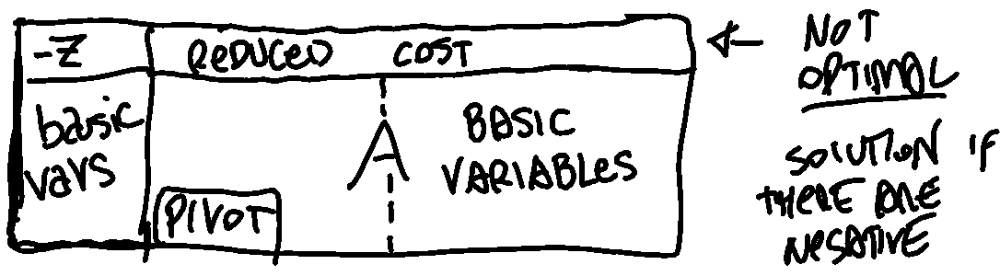

# Linear Programming

## Introduction

Understanding the mathematical language of optimization models and some important classes of models

Creating optimization models starting from the description of the problems

In computer science and operations research, **exact algorithms** are algorithms that always solve an optimization problem to optimality. But before actually select and develop an algorithm we have to define the problem and build a modelling. 

### How we model optimization problems

#### Decisional Variables 

We define decisional variables that represent ''what we decide'' in order to optimize the problem. They can be integer/float/binary(bool). 

#### Constraints 

In **linear** programming we will always have **linear** constraints. Constraints are equations or inequations. We can transform constraints using **slack** variables. 

$$x \ge 0 \text{ can become } x + s = 0 \text{ with } s \ge 0$$

Binary/logical/boolean transformations: 

$$\begin{aligned}
& \neg  x = 1-x \\
&x \text { xor } y \rightarrow x+y \le 1 \\
&x \text { or } y \rightarrow x+y \ge 1 \\
&x \text { and } y \rightarrow x \ge 1 , y \ge 1   \\
&x \Rightarrow y \ge 1, y \ge x \\
&x \leftrightarrow y \ge x=y \\
\end{aligned}$$

#### Objective Function 

A function with the decisional variables. We will try to optimize it. $$\min (f(x)) =  \max (-f(x)) $$

## Geometry of LP

- Each inequality defines an affine half-space in the variable space. An affine half-space is a region in the space defined by an hyperplane which divides the space into two regions, one on each side of the hyperplane.   
- The feasible region X of any LP (linear program) is a polyhedron P (intersection of a finite number of half-spaces). A polyhedron is a geometric object with flat faces, straight edges, and vertices (corners). In the context of an LP, the polyhedron represents the set of all points in the variable space that satisfy the constraints of the problem.   
- The polyhedron P is always convex (P is convex if for any two points in the set, the line segment connecting the two points is entirely contained in P). 
- A convex combination of two points is a point that can be represented as a weighted average of the two points. 
- A vertex is one of the "corners" of the polyhedron and that cannot be expressed as a convex combination of other distinct points in the set.
- A non-empty polyhedron P in standard form or canonical form has a finite number of vertices. Standard form refers to a specific way of writing the constraints of an LP, while canonical form refers to a specific way of writing the objective function of an LP. In both cases, the polyhedron will have a finite number of vertices because it is a bounded set. 

### Geometry 

In linear programming (LP), a level curve is a graphical representation of the objective function with constant values. It is also known as an iso-profit or iso-cost line. A level curve represents all possible combinations of decision variables that result in the same value of the objective function. In other words, it shows all points where the objective function has equal value and helps to identify optimal solutions by finding the highest or lowest point on the curve depending on whether you are maximizing or minimizing your objective function.

- $H=\left\{x \in \mathbb{R}^n: a^T x=b\right\}$ is a hyperplane;
- $H^{-}=\left\{x \in \mathbb{R}^n: a^T x \leq b\right\}$ is an affine half-space (half-plane in $\mathbb{R}^2$ ).

Since any half-space is convex and the intersection of a finite number of convex sets is also a convex set, the polyhedron P is a convex set of $\mathbb{R} ^n$ . 

A vertex of P is a point of P which cannot be expressed as a convex combination of 2 other distinct points of P. 

Any point x of polyhedron P can be expressed as a convex combination of vertices x .. xk plus an unbonded feasible direction d of P. Where an unbounded feasible direction of P is a "ray" contained in P. 

Understanding the geometric and algebraic aspects of linear programming (LP), and familiarity with an LP algorithm

feasible region 

vertices 

moving along each vertex 

canonical form and standard form 

transformations using slack variables

matrix notation and algebra stuff 

## Fundamental theorem of LP 

The fundamental theorem of linear programming states that any optimal solution to an LP can be found at one of the vertices (or corners) of the polyhedron P of feasible solutions. This means that to solve an LP, it is sufficient to consider only the vertices of the polyhedron, rather than all the points in the polyhedron.

Weyl-Minkoswki Theorem

Every point $x$ of a polyhedron $P$ can be expressed as a convex combination of its vertices $x^1, \ldots, x^k$ plus (if needed) an unbounded feasible direction $d$ of $P$:
$$
x=\alpha_1 x^1+\ldots+\alpha_k x^k+d
$$
where the multipliers $\alpha_i \geq 0$ satisfy the constraint $\sum_{i=1} \alpha_i=1$.

However, the geometrical definition of a vertex (a point that cannot be expressed as a convex combination of other points) is not very useful for solving LPs algorithmically. Instead, we need an algebraic characterization of a vertex, which is a way to describe a vertex using algebraic equations or inequalities. This allows us to identify the vertices of the polyhedron and evaluate the objective function at each vertex to find the optimal solution.

The facets of a polyhedron are its bounding surfaces, or faces. In two dimensions, the facets are simply the edges of the polyhedron. In higher dimensions, the facets are higher-dimensional surfaces.

In the context of an LP, the facets of the polyhedron of feasible solutions are obtained by setting one of the variables to 0. This means that we consider a constraint of the form x_i = 0, where x_i is one of the variables in the problem. This constraint defines a hyperplane in the variable space that intersects the polyhedron along a facet.

On the other hand, the vertices of the polyhedron are obtained by setting n-m variables to 0, where n is the number of variables in the problem and m is the number of constraints. This means that we consider a set of constraints of the form x_i = 0 for a subset of the variables. The intersection of the hyperplanes defined by these constraints defines a vertex of the polyhedron.

In general, the vertices of the polyhedron represent the "corners" of the feasible region, while the facets represent the bounding surfaces. By considering the vertices and facets of the polyhedron, we can fully describe the feasible region and find the optimal solution to the LP.

 
In a convex polyhedron, any point in the polyhedron can be expressed as a convex combination of the vertices of the polyhedron.

a feasible growing direction is a direction in which we can move from the current point without violating any of the constraints of the problem. In other words, it is a direction in which we can "grow" the objective function without leaving the feasible region.

The concept of a feasible growing direction is related to the concept of a gradient in optimization. The gradient of a function is a vector that points in the direction of the steepest ascent at a given point. In other words, it is a direction in which the function will increase the most if we move a small distance in that direction.

The simplex algorithm involves moving from one vertex (a point in the feasible region) to another in order to improve the solution. The direction in which the solution moves is called the feasible growing direction.

The concept of pivoting is closely related to the feasible growing direction. Pivoting refers to the process of selecting a pivot element (usually a variable or a constraint) and using it to improve the solution. The pivot element is chosen in such a way that it causes the feasible growing direction to change, leading to an improved solution.

In summary, the feasible growing direction is the direction in which the solution moves in the tableau method, and pivoting is the process of selecting a pivot element to change the feasible growing direction and improve the solution. These concepts are closely related and are essential for understanding and applying the simplex algorithm in linear programming.

Consider a $L P \min \left\{c^T x: x \in P\right\}$, where $P \subseteq \mathbb{R}^n$ is a non-empty polyhedron of the feasible solutions (in standard or canonical form). Then either there exists (at least) one optimal vertex or the value of the objective function is unbounded below on $P$.
Proof.
- Case 1: $P$ has an unbounded feasible direction $d$ such that $c^T d<0$. $P$ is unbounded and the values $z=c^T x$ tend to $-\infty$ along the direction $d$.
- Case 2: $P$ has no unbounded feasible direction $d$ such that $c^T d<0$, that is, for all of them we have $c^T d \geq 0$.
Any point of $P$ can be expressed as:
$$
x=\sum_{i=1}^k \alpha_i x^i+d,
$$
where $x^1, \ldots, x^k$ are the vertices of $P, \alpha_i \geq 0$ with $\alpha_1+\cdots+\alpha_k=1$, and $d=0$, or $d$ is an unbounded feasible direction.

If the objective function is unbounded below on P, it means that there is no lower limit to the value of the objective function for feasible solutions in the problem. In other words, as we move towards negative infinity along the direction of optimization (minimization or maximization), there are always feasible solutions with increasingly lower values of the objective function.

This situation can occur when a linear programming problem has constraints that do not restrict decision variables sufficiently and allow them to take arbitrarily large negative values. As a result, even if we keep decreasing these variables without bound, we will still have feasible solutions with ever-decreasing values of the objective function.

When an LP problem has an unbounded below objective function, it means that either there is no optimal solution or that any solution can be improved indefinitely by making some decision variable more negative.

Due to the fundamental theorem of Linear Programming, to solve any LP it suffices to consider the vertices (finitely many) of the polyhedron $P$ of the feasible solutions. Since the geometrical definition of vertex cannot be exploited algorithmically, we need an algebraic characterization.

For any polyhedron $P=\left\{x \in \mathbb{R}^n: A x=b, x \geq 0\right\}$ :
(1) the facets (edges in $\mathbb{R}^2$ ) are obtained by setting one variable to 0 ,
(2) the vertices are obtained by setting $n-m$ variables to 0 .

A basis of such a matrix $A$ is a subset of $m$ columns of $A$ that are linearly independent and form an $m \times m$ non singular matrix $B$.

Let $x^T=[\overbrace{x_B^T}^{m \text { components }} \mid \overbrace{x_N^T}^{n-m \text { components }}]$, then any system $A x=b$ can be written as $B x_B+N x_N=b$ and for any set of values for $x_N$, if $B$ is **non singular**, we have

$$
x_B=B^{-1} b-B^{-1} N x_N
$$

- A basic solution is a solution obtained by setting $x_N=0$ and, consequently, letting $x_B=B^{-1} b$.
- A basic solution with $x_B \geq 0$ is a basic feasible solution.
- The variables in $x_B$ are the basic variables and those in $x_N$ are then non basic variables.

Therefore, having a ***non-singular matrix*** allows us to find unique solutions for our linear programming problem and determine whether they are feasible or not based on their positivity constraints.

Weak duality
If $x$ is a feasible solution to the primal problem (Equation 3.3) and $y$ is a feasible solution to the dual problem (Equation 3.4), then
$$b^T y \leq c^T x$$

Strong duality 

If $X=\{x \mid A x \geq b, x \geq 0\} \neq \emptyset$ and $\min \left\{c^Tx \mid x \in X\right\}$ is finite, there exists $x^* \in X, y^* \in Y$ such that $c^T x^*=b^T y^*$.

--- 

From: 

In linear programming, a basic solution is a solution to the system of equations obtained by setting some variables equal to zero. This can be represented as $x_N=0$, where $x_N$ represents the non-basic variables and $x_B$ represents the basic variables. By solving for $x_B$, we obtain a unique solution given by:

$$
x_B=B^{-1} b-B^{-1} N x_N
$$

where $B$ is the matrix formed by selecting columns corresponding to the basic variables, and $N$ is the matrix formed by selecting columns corresponding to non-basic variables.

If all components of this solution are greater than or equal to zero, then it is called a basic feasible solution. A matrix that has at least one such feasible solution is said to be feasible.

A square matrix B that corresponds with basic variables in a linear program is non-singular if its determinant (the value used in finding its inverse) does not equal zero. If B is non-singular, then there exists an inverse B^-1 such that we can solve for all values of x using:

$$
x = \begin{bmatrix}
    x_{B}\\ 
    x_{N}
\end{bmatrix}= \begin{bmatrix}
    B^{-1} b\\ 
    0
\end{bmatrix}-\begin{bmatrix}
    B^{-1} N & I_{m\times m}\\ 
\end{bmatrix}\begin{bmatrix}
    x_{B}\\ 
    x_{N}
\end{bmatrix},
$$

where $I_{m\times m}$ denotes an identity sub-matrix of size $(n-m)\times(m)$.

Therefore, having a non-singular matrix allows us to find unique solutions for our linear programming problem and determine whether they are feasible or not based on their positivity constraints.

--- 

$x \in \mathbb{R}^n$ is a basic feasible solution iff $x$ is a vertex of $P=\left\{x \in \mathbb{R}^n: A x=b, x \geq 0\right\}$

This means that for each set of $n-m$ variables in a linear programming problem, there is at most one solution where those variables are equal to zero and the remaining $m$ variables have values that satisfy all constraints. The total number of possible solutions with this property is given by the formula $\frac{n!}{(n-m)!(n-(n-m))!}$ which can also be written as $\binom{n}{m}$.

## Simplex Algorithm 

List of basic solutions and at each iteration, we move from a basic feasible solution to a neighbour basic feasible solution. 

We know that a basic feasible solution is an optimal one looking if all reduced costs have positive coefficients. 
The simplex method with Bland's rule terminates after $\leq\left(\begin{array}{c} n \\ m \end{array}\right)$ iterations where $n$ is the number of decision variables and $m$ is the number of constraints. <- CORREGGERE IL NOME M E N 

### Tableu method with Bland's Rule

 

1) considering the canonical form, build the corresponding Tableu:
$$\{\begin{array}{c}
z=c^T x \\
A x=b
\end{array}\right.$$ $$\begin{array}{|l|ll|}
\hline 0 & & c^{\prime} (x_1 & \cdots & x_n) & \\
\hline b & & A & \\
\hline
\end{array}$$
	note that the first column contains the right hand side of the objective function and the right side vector.
2) while the coefficients are negative you continue to perform the pivoting operation switching the basic variables in the first column with non basic variables:
	1) the pivoting operation consist in selecting a **non negative** $a_{ij}$ from $A$ in the Tableu corresponding to the left most negative coefficient (column $j$) of the objective function (first line) and with the minimum ratio $\frac{a_{0j}}{a_{ij}}$ . 
	2) divide the whole row $i$ of the pivot by $a_{ij}$  
	3) subtract the others row (even the obj function) by the values of the row $i$ of the pivot $a_{ij}$  multiple by a value $k$  
	4) the value $k$ differs for each row and it's choose to make all the coefficients in the pivot column $j$ equal to zero. $$\begin{aligned}
&\begin{array}{|llll|l|}
\hline 1 & 1 & 1 & 0 & 6 \\
2 & 1 & 0 & 1 & 8 \\
\hline
\end{array}\\
&\text{after pivoting on } a_{10} : 
\\ &\begin{array}{|cccc|c|}
\hline 0 & 1 / 2 & 1 & -1 / 2 & 2 \\
1 & 1 / 2 & 0 & 1 / 2 & 4 \\
\hline
\end{array}
\end{aligned}$$
	5) during each pivoting you always have a feasible solution but with the difference that you have turned a negative coefficient in the reduced cost into a $0$ . 

### 2 Phase Method

After turning the LP problem in standard form, if a feasible basic solution is not evident, we apply the two-phase simplex method. 
The goal of the first phase is to find an initial basic feasible solution of the original LP problem if it exists.

1) We introduce an artificial variable $y_i$ for each equality constraint.
2) We express the basic variables with the nonbasic ones, changing non basic variables.
3) We pivot using the Tableau method as always (with Bland’s rule) and we continue to iterate until the reduced costs for the nonbasic variables are all nonnegative. 

At this point phase 1 stops, proving that the feasible region of the original problem is nonempty, and yielding an initial basic feasible solution with the basic variable. 

4) We re-change the objective function, replacing all the variables to have the non-basic variable explicit and we remove from the tableau the columns of the auxiliary variables. 

--- 

## Duality

$$\begin{array}{|c|c|}
\hline \text { MIN problem } & \text { MAX problem } \\
\hline \text { variables } & \text { constraints } \\
\hline \text { constraints } & \text { variables } \\
\hline \text { cost vector } & \text { right hand side (b) } \\
\hline \text { right hand side (b) } & \text { cost vector } \\
\hline \text{CONSTRAINTS }A_i x \ge b & y_i \ge 0 \\
\hline \text{CONSTRAINTS }A_i x \le b & y_i \le 0 \\
\hline  x_i \ge 0 & \text{CONSTRAINT }yA^{i} \le c_i \\
\hline  x_i \le 0 & \text{CONSTRAINT }yA^{i} \ge c_i \\
\hline  x/y \text { unrestricted} & \text{CONSTRAINT }A_i (y/x) = c_i \\
\hline
\end{array}$$

complementary slackness conditions

$$\begin{aligned}
y_i^*\left(a_i^T x-b_i\right)=0 & \forall i \in\{i=1, \ldots, m\} \\
\left(c_j-y^T A_j\right) x_j^*=0 & \forall j \in\{j=1, \ldots, n\}
\end{aligned}$$

## Sensitivity analysis

- Variation of the objective function coefficients: how much stable the solution is and how much is sensible to small variations on the objective function coefficients? 
- Variations of the right-hand side terms 

Changing the parameters influences: 

- the position of the constraint changing the right-side of a constraint
- direction of the objective function change the parameters

Understanding the economic interpretation of the dual of some LP problems

variations of B 

$$
\underline{b}^{\prime}:=\underline{b}+\delta_k \underline{e}_k
$$
$$
B^{-1}\left(\underline{b}+\delta_k \underline{e}_k\right) \geq \underline{0} \Rightarrow B^{-1} \underline{b} \geq-\delta_k B^{-1} \underline{e}_k
$$

variations of C:

$$
\underline{c}^{\prime}:=\underline{c}+\delta_k \underline{c}_k
$$

For $x_k$ nonbasic, $B$ remains optimal if and only if $\delta_k \geq-\bar{c}_k$ , so it's super ysy. 

For $x_k$ basic, $B$ remains optimal if and only if
$$
\underline{\bar{c}}^T{ }_N \geq \delta_k \underline{e}^T{ }_k B^{-1} N
$$