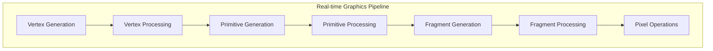

# GPU architecture

The focus will be on NVIDIA architectures, but other vendors followed a similar path.

## GPU evolution

The main steps in GPU Evolution can be resumed in:

1. GPU as a hardware accelerator for graphics pipeline
2. GPU for general-purpose computing
3. GPU architecture evolution to the present day

### GPU as a hardware accelerator for graphics pipeline

The GPU is actual a general pathos accelerator. If you care about computer graphics, there is [another course that is on computer graphics](../../Computer%20Graphics(WIP)/Computer%20Graphics.md) . The starting point here is to understand how the graphics pipeline works just because the has been originally defined based on this idea: 

- **3D Rendering:** The process of converting a 3D model into a 2D image, performed in real-time or offline depending on the application
- **Graphics Pipeline for 3D Rendering:** A conceptual model describing the necessary steps for real-time 3D rendering, standardized around OpenGL/Direct3D APIs and possibly accelerated in hardware. 

The real-time graphics pipeline implemented by OpenGL before 2007, consisting of a sequence of operations on several types of objects:

This workflow is characterized by an huge amount of data to be processed, single-stage elaborations can be performed in **parallel**, mainly data-intensive based on **matrix elaborations** and other arithmetic operations, **few branch instructions and data dependencies**. 

At the end the 3 main CG operations parallelized on GPU are:

1. Vertex Processing
2. Rasterization
3. Fragment/Pixel Processing

OpenGL/Direct3D workflow: 

- Application provides shader program binaries to the GPU
- Application sets graphics pipeline parameters.
- Application provides to the GPU a buffer of vertices
- Application send to the GPU a drawing command

### GPU for general-purpose computing 

At some point there was there was the necessity of hardware accelerators designed to accelerate the graphics pipeline.
To speed up we can divide the starting of the evolution of graphics pipeline accelerators into:

- Pre-GPU era: graphics supercomputers in the 70s/90s mainly targeted **specific market sections** such as computer simulation, digital content creation, engineering, and research.
- At the beginning **Fixed-function GPU:**  GPUs with fixed-functionality for specific tasks, such as 3dfx voodoo (1996) and NVIDIA GeForce 256 (1999)
- Later **Programmable GPU** arrived: GPUs with programmable stages, such as NVIDIA GeForce 3 (2001), GeForce 6 (2004), and GeForce 7800 (2005)
- **GPU based on unified shader processors**: GPUs with unified shader processors, such as NVIDIA GeForce 8 (2006) and Tesla (2006) The 3 key ideas:
	- Instantiate many shader processors
	- Replicate ALU inside the shader processor to enable SIMD processing
	- Interleave the execution of many groups of SIMD threads

## Basic architecture of GPU

The main idea is to use of many "slimmed down" and simplified cores to run in parallel.
Simplified means: 

- removed all components that help a single instruction stream run faster:
	- out of order logic out
	- branch prediction out
	- memory pre-fetcher out
	- and stuff like this, removed

At the end we obtain:

- A multicore of simplified processors: pack cores full of ALUs
- Sharing instruction streams across group of data chucks
- Implicit SIMD execution managed by HW 

 But because of the simplification we will have these problems:

- Branches impact on GPU performance
- The impact of stalls caused by data dependencies (for example memory access is 100x slower than an ALU instruction generally)

We move from a latency-oriented architecture (CPU) to a throughput-oriented one (GPU) to improve overall task execution latency:

- Latency of the single stream is **increased** (remember that all the components regarding the single instruction stream efficiency has been removed)
- But overall **throughput is decreased** 
- So at the end, indirectly the latency of the **overall** task execution is decreased

To make this happen we have absolutely to write arithmetic intensive (high math/memory instructions ratio) tjat re-uses as much as possible the data fetched from global memory. 

In general the architecture will:

- avoid latency stalls by interleaving execution of many groups of instruction streams: when a group stalls, work on another group
- the larger the arithmetic/memory instruction ratio, the lower the number of streams to hide memory stalls

and let's clarify that **coherent execution** (when the same instruction sequence applies to many data elements) is:

- necessary for SIMD processing resources to be used efficiently
- not necessary for efficient parallelization across different cores: indeed different cores independently executes different instructions streams

Divergent execution is a lack of instruction stream coherence.

At the end the takeaway is that the partition the data into groups and execute them concurrently on different groups of threads. This approach keeps the streaming multi-core busy by swapping to the next group of threads during memory latency periods.

The idea is that each thread gets a unique index to determine its data portion.

Overall, our focus we be always to maximize data parallelism and throughput, writing a program featuring a high memory instruction ratio for automatic intensity. 
The shared memory, directly connected to the streaming multi-core, is a high-speed solution. However, the programmer is responsible for loading and transferring data to and from the shared memory. Profiling and optimization are essential to maximize performance.

### Brief history of Nvidia GPUs 

- **1999 - 2008**: 
	- NVIDIA GeForce 256
		- First GPU, integrated transform and lighting (T&L) engine.
	- 2000: NVIDIA GeForce2
		- support for dual-texturing, and multi-texture blending.
	- 2001: NVIDIA GeForce3
		- Introduced programmable pixel and vertex shaders, support for DirectX 8.
	- 2002: NVIDIA GeForce4
		- Enhanced performance, introduced nView multi-display technology.
	- 2003: NVIDIA GeForce FX
		- Full support for DirectX 9, improved shader model capabilities.
	- 2004: NVIDIA GeForce 6 Series
		- Support for Shader Model 3.0, SLI (Scalable Link Interface) for multi-GPU setups.
	- 2005: NVIDIA GeForce 7 Series
		- Improved performance, introduced Transparency Anti-aliasing and PureVideo HD.
	- 2006: NVIDIA GeForce 8 Series
		- **CUDA** introduction 
		- unified shader processor
	- 2008: NVIDIA GeForce 9 Series
		- Further performance improvements, support for Hybrid SLI.
	- 2008: NVIDIA GeForce GTX 200 Series
		- Introduced GTX branding, support for PhysX and CUDA improvements.
- **2010: Fermi** (Thread blocks, restructured caches)
	- Streaming Multiprocessor (SM) architecture introduced.
	- Programmer divides threads into blocks, which are dispatched by the global scheduler among SMs.
	- Each SM has 32 streaming cores (CUDA cores).
	- Threads inside a block are divided into groups of 32 called "warps," sharing an instruction stream.
	- SM has 2 scheduling and dispatching units, selecting two warps each clock cycle.
	- Register file supports up to 48 interleaved "warps."
	- restructured cache hierarchy including L1 and L2 caches which avoid necessity to access global memory
	- 6 64-bit memory partitions 
- **2012: Kepler**
	- Dynamic parallelism: now a kernel can launch another kernel (GPU adapts to data, dynamically launches new threads)
	- New scheduler allows 2 independent instructions per warp per cycle, improving ILP (Instruction-Level Parallelism).
- **2014: Maxwell
	- FP16 for AI and deep learning applications.
- **2016: GTX 10 Series, Pascal**
	- **Unified Memory**, transparent transmission of memory pages between CPU and GPU.
	- Automatic handling of page faults and global data coherence.
	- NVLink
- **2017: Volta
	- Tensor Cores introduced for matrix multiply-accumulate operations, benefiting deep neural networks.
	- Streaming multicore partitioned in processing blocks
- **2018: RTX 20 Turing**
	- RT unit for ray tracing additional CUDA cores
	- Acceleration for all data types: FP16, FP64, INT8, INT4, binary
- **2020:  RTX 30 Ampere** (Virtualization capabilities)
	- Multi-instance GPU (MIG) virtualization and GPU partitioning feature in A100 supporting up to seven instances
	- Improved ray tracing and AI capabilities, GDDR6X memory, NVLink interface for multi-GPU architectures, support for all data types with new tensor cores.

- **2022: RTX 40 Ada Lovelace**
	- Further advancements in ray tracing, AI graphics with DLSS 3.0, improved power efficiency and performance

### Other GPU Vendors

**AMD Timeline:**

- **AMD Radeon HD 6970 Cayman (2010):** 
	- The streaming multiprocessor is called a compute unit
	- threads are grouped in 64 elements (wavefront)
	- four clocks are used to execute an instruction for all fragments in a wavefront.
	- The single SIMD lane has a **VLIW** architecture
- **AMD Radeon R9 290X (2013):** 
	- VLIW architecture replaced with a SIMD 16x vector architecture
	- Similar workflow of the NVIDIA counterpart (with wavefront (warp) interleaving)
	- The overall multicore architecture, including up to 44 compute units, and the memory hierarchy and communication infrastructure.

**ARM Mali GPUs:**

- **ARM Mali 628 (2014):** 
	- Targeted for embedded computing with fewer shader cores compared to NVIDIA and AMD GPUs.
- **ARM Mali G720 (2023):** 
	- Continued focus on embedded systems with improvements in performance and efficiency.