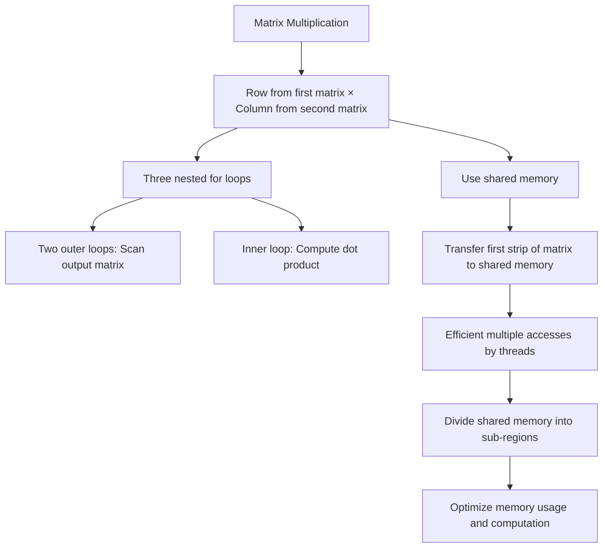

# CUDA memory model

The CUDA **memory model** is explicit to the programmer: caches are not entirely transparent, demanding a deeper understanding of memory hierarchy and access patterns.
The device memories are mainly:

- **registers**: registers are fast, private, and limited
- **caches**: non-programmable memories transparent to the programmer:
	- L1 private to each streaming multi-processor
	- L2 private per SM
- **device memory**: (aka global or video memory) is slower and accessible by all threads and the host. 


Also CUDA introduces the concept of **memory spaces** which help the programmer explicitly manage the placement and accessibility of variables.
The three most important keywords are:

- `__global__`: Variables declared with the `__global__` qualifier reside in global memory and can be accessed by all threads and the host.
- `__shared__`: Variables declared with the `__shared__` qualifier reside in shared memory and can be accessed by all threads within the same block.
- `__constant__`: Variables declared with the `__constant__` qualifier reside in constant memory and can be accessed by all threads and the host.


In addition to the memory types and spaces, CUDA also provides **memory management functions** for allocating, copying, and freeing memory on the device. These functions include:

- `cudaMalloc()`: Allocates memory on the device.
- `cudaFree()`: Frees memory allocated on the device.
- `cudaMemcpy()`: Copies data between host and device memory, or between different memory spaces on the device.
- `cudaMemcpyAsync()`: Performs an asynchronous memory copy, allowing overlap of memory transfers with computation.

## Shared memory

**Shared memory** is a fast, on-chip memory that is shared among all threads within a block. It is a programmer-managed memory and can be used to efficiently share data between threads in the same block. 

Shared memory is divided into equally-sized memory banks: it's crucial to avoid bank conflicts, which occur when multiple threads access different addresses within the same bank. 

Shared memory supports broadcasting: in the case of a single address read by threads in the same block (1 transaction). 

Proper usage of shared memory involves carefully designing access patterns to minimize bank conflicts and maximize memory bandwidth utilization.

An example of the use of shared memory is the **matrix-matrix Multiplication**:

- Compute each element of the output matrix as a product of a row from the first matrix and a column from the second matrix.
- Typically implemented using three nested for loops:
    - Two outer loops scan the entire output matrix.
    - One inner loop performs the dot product.
- Using Shared Memory:
  - Transfer the first strip of matrix $M$ to shared memory once.
  - This allows multiple accesses by threads, which is more efficient than accessing global memory.
  - Shared memory can handle broadcast access better than global memory can handle transactions.
- Optimizing with Sub-Regions:
  - Although shared memory is limited, it can be divided into sub-regions for computation.
  - Computing the first sub-region against the second can optimize memory usage and computational efficiency.





## Constant memory

**Constant memory** is a read-only memory that is cached and optimized for broadcast access patterns, where all threads in a warp read the same memory location. It is ideal for storing constants or lookup tables that do not change during kernel execution. 

Constant memory is limited in size (typically 64KB) and is accessible by all threads and the host. To use constant memory, variables must be declared with the `__constant__` qualifier and initialized on the host side using `cudaMemcpyToSymbol()`.

## Texture memory

**Texture memory** is a read-only memory that is optimized for spatial locality and can be used to accelerate access to data with 2D or 3D locality.
Texture memory provides caching, addressing, and filtering capabilities that can improve performance for certain access patterns. Textures are bound to a specific memory region and can be accessed using special texture fetching functions within the kernel. 

Texture memory is particularly useful for image processing, computer vision, and applications that exhibit spatial locality in their data access patterns.

## Global memory 

Global memory usage in CUDA is used ensuring aligned memory accesses:

- GPUs read an entire line or sector when a single value is requested.
- In newer architectures, lines are divided into 32-byte sectors.
- Transactions must be aligned with the base address of the data (multiple of 32 bytes)
- Multiple accesses to the same cache line are combined into a single transaction.
- So, the optimal access strategy is to access 32 consecutive addresses (32-byte aligned) to minimize transactions.

When all accesses request values from the same cache line, efficiency is maximized. The worst-case scenario is when threads access random addresses in global memory: it may result in a separate transaction for each value. 

### Efficiency of Array of Structures vs. Struct of Arrays

Let's compare Array of Structures (AoS) with Structure of Arrays (SoA):


```cpp
typedef struct {
    float x;
    float y;
} innerStruct_t;

innerStruct_t myAoS[N];
```

```cpp
typedef struct {
    float x[N];
    float y[N];
} innerArray_t;

innerArray_t mySoA;
```

SoA in the example of RGB to grayscale conversion: data into separate arrays for red, green, and blue yields higher efficiency. SoA achieves 100% efficiency compared to only 33% with AoS.

The reason about that is that in SoA all the elements in the array are consecutive in memory. 

### Instructions for synchronization

**Atomic instructions** are used to perform read-modify-write operations on global memory or shared memory, ensuring that no other thread can access the memory location simultaneously. These instructions are commonly used for synchronization and coordination among threads in a CUDA program.

| OPERATION          | FUNCTION     | SUPPORTED TYPES                                  |
| ------------------ | ------------ | ------------------------------------------------ |
| Addition           | `atomicAdd`  | int, unsigned int, unsigned long long int, float |
| Subtraction        | `atomicSub`  | int, unsigned int                                |
| Unconditional Swap | `atomicExch` | int, unsigned int, unsigned long long int, float |
| Minimum            | `atomicMin`  | int, unsigned int, unsigned long long int        |
| Maximum            | `atomicMax`  | int, unsigned int, unsigned long long int        |
| Increment          | `atomicInc`  | unsigned int                                     |
| Decrement          | `atomicDec`  | unsigned int                                     |
| Compare-And-Swap   | `atomicCAS`  | int, unsigned int, unsigned long long int        |
| And                | `atomicAnd`  | int, unsigned int, unsigned long long int        |
| Or                 | `atomicOr`   | int, unsigned int, unsigned long long int        |
| Xor                | `atomicXor`  | int, unsigned int, unsigned long long int        |

The **shuffle instruction** enables threads within the same warp to exchange data by directly accessing each other's registers without relying on shared or global memory. This allows for efficient data sharing and communication within a warp. The shuffle instruction is particularly useful when threads need to exchange data with other threads in the same warp without the overhead of using shared memory or global memory.

```cpp
int __shfl_sync(unsigned mask, int var, int srcLane, int width=warpSize);
```

with:

- `mask`: A 32-bit integer representing the threads participating in the shuffle operation. Each bit corresponds to a thread in the warp, and only threads with their corresponding bit set will participate in the shuffle.
- `var`: The variable or register containing the data to be exchanged among threads.
- `srcLane`: The lane (thread) from which the data will be read. Each thread can specify the lane it wants to read data from.
- `width`: The number of threads participating in the shuffle operation. By default, it is set to the warp size (32).

Threads can perform data exchange, reduction operations, or other collaborative computations within a warp.

