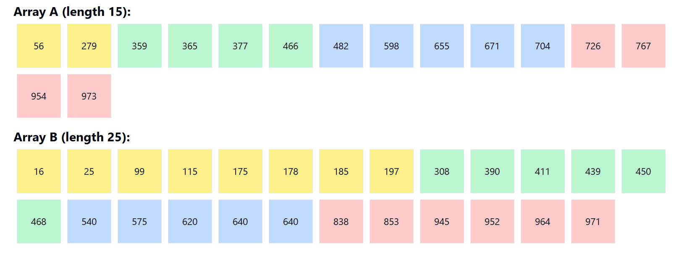

# Merge


[Merge Sort](../../../BSc(italian)/Algoritmi%20e%20Principi%20dell'Informatica/src/10.Sorting.md#Merge%20sort) can be optimized for parallel execution, but it's not just a matter of re-implementing a classical algorithm; it involves strategic data management and computation distribution. Merge sort adheres to a stable sort criterion where identical elements from $A$ precede those from $B$ in list $C$, preserving the input order.


```cpp
// Function for CPU merge computation
void merge_cpu(const int *A, const int dim_A, const int *B, const int dim_B, int *C) {
  int i = 0;
  int j = 0;
  int k = 0;

  while ((i < dim_A) && (j < dim_B)) {
    if (A[i] <= B[j])
      C[k++] = A[i++];
    else
      C[k++] = B[j++];
  }
  if (i == dim_A) {
    while (j < dim_B) { C[k++] = B[j++]; }
  } else {
    while (i < dim_A) { C[k++] = A[i++]; }
  }
}
```

## Naive

The basic approach divides the output list $C$ among multiple threads, with each thread responsible for merging a specific section from lists $A$ and $B$. This division is dynamic, depending on the specific elements of $C$ that each thread is calculating, which can lead to uneven workload distribution among the threads.


## Co rank 



A more sophisticated method involves calculating the "co-rank" of elements, which helps in determining how input elements from $A$ and $B$ are paired to form the output $C$. The co-rank, defined for an element $C[k]$, is derived from indices $i$ and $j$ such that $i + j = k$. 

$$A[i-1]\le B[j]$$
$$B[j-1]<A[i]$$

This means that to compute the value of $C[k]$, you need to merge elements up to $i$ from array $A$ and up to $j$ from array $B$.
By utilizing binary search based on co-rank, each thread can quickly determine the exact position (indices $i$ and $j$) in the input arrays $A$ and $B$ that it needs to process. 

This method uses a binary search to find the appropriate indices efficiently, optimizing the merge process with a complexity of $O(log N)$.

If `A` and `B` are the input arrays, and `k` is the index in the merged array `C`, we can define `co_rank(k, A, dim_A, B, dim_B)` as the function which finds the position in `A` such that the sum of elements from `A` and `B` up to this position is equal to `k`.

```cpp
__device__ int co_rank(const int k, const int *__restrict__ A, const int m, const int *__restrict__ B, const int n) {
    int i = min(k, m);   // Start i at the smaller of k or m
    int j = k - i;       // Calculate j based on i
    int i_low = max(0, k - n);  // Lower bound for i
    int j_low = max(0, k - m);  // Lower bound for j
    int delta;
    bool active = true;

    while (active) {
        if (i > 0 && j < n && A[i - 1] > B[j]) {
            // If A[i-1] is greater than B[j], adjust i and j
            // Ensure delta is at least 1 and calculate half the interval
            delta = max(1, (i - i_low) / 2);  
            i -= delta;
            j += delta;
        } else if (j > 0 && i < m && B[j - 1] >= A[i]) {
            // If B[j-1] is greater than or equal to A[i], adjust i and j
            // Ensure delta is at least 1 and calculate half the interval
            delta = max(1, (j - j_low) / 2);  
            i += delta;
            j -= delta;
        } else {
            // If neither condition is met, we've found the correct i
            active = false;
        }
    }

    return i;  // Return the co-rank i
}
```

With clear co-rank values, each thread or thread block can independently compute a segment of the output array without needing to wait for other threads to complete their tasks. 
For example the co-rank for `k = 2` :

- `A = [1, 3, 5, 7]`
- `B = [2, 4, 6, 8]`

`co_rank(2, A, 4, B, 4)` would find that one element from `A` (1) and one element from `B` (2) make up the first 2 elements in `C`.

In practical scenarios, the input arrays $A$ and $B$  might not be of equal size, which can complicate the parallel processing of data. Co-rank helps manage these irregularities by providing a systematic way to allocate elements of $A$ and $B$ to threads regardless of their lengths. 

Further optimizations include the use of shared memory and registers.

#### Tiling variant

Each iteration of the merge operation involves loading specific segments ("tiles") of lists A and B into shared memory. In this strategy, during the first iteration, segments from both lists are uploaded into shared memory. All threads then evaluate which parts of these segments they need to merge based on their specific task within the overall merge operation. 


In subsequent iterations, new segments of A and B are loaded into shared memory. It’s crucial to note that the entire shared memory may not always be filled if the segments from A and B do not align perfectly, potentially leading to inefficiencies and the introduction of bugs.


#### Circular buffering

One proposed enhancement involves using a circular buffering method to optimize the utilization of shared memory across iterations. Instead of reloading data that has already been brought into shared memory, the algorithm can maintain a dynamic index that tracks where new data should be written and read within the shared memory. This approach reduces the redundancy of memory accesses and maximizes the use of already-loaded data.

