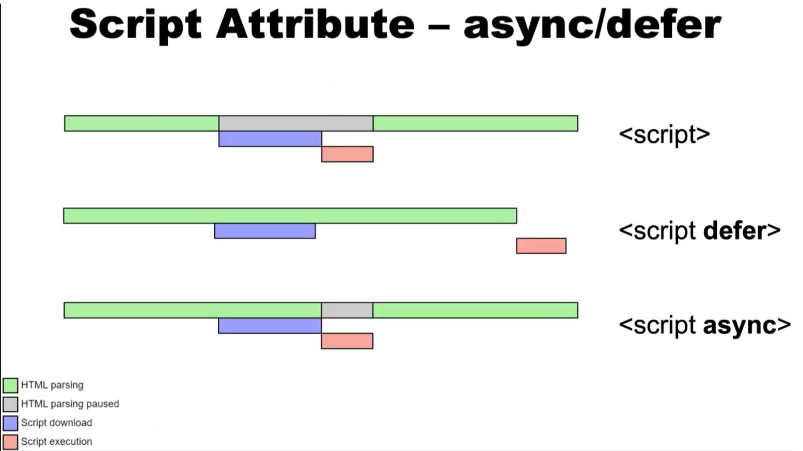

# HTML 

- HTML is a markup language that tells the browser how to structure a webpage: 
	- immediate effect of changes 
	- the browser won't tell you if there are any errors.
- any HTML page is composed of multiple HTML elements, which can be nested as long as the proper rules of opening and closing **tags** are followed.

{width=50%}

|   Tag    |  What It Is  |
|:--------:|:------------:|
|  `<p>`   |  Paragraph   |
|  `<h1>`  |  Heading 1   |
| `<code>` | code section |
| ``         |     Image  |


## DOM 

The DOM is a programming interface for web documents that represents an HTML page as a logical tree. Each element defined in the HTML page becomes a DOM node in the tree structure, and developers can access and manipulate the content and structure of the web page through JavaScript or other programming languages. In addition to elements, the DOM also provides access to other important properties of a web page, such as the document title, metadata, and scripts. Understanding the structure and properties of the DOM is crucial for creating dynamic and responsive web pages.

{width=50%}


# CSS 


A website can have obviously multiple CSS associated with. 


CSS (Cascading Style Sheets) is a language used to change the appearance of web pages. It is a rule-based language where each rule defines what changes need to be applied and the target element(s) in the web page. By using CSS, developers can create visually appealing and consistent web pages by controlling the colors, fonts, layout, and other style properties. CSS allows for a separation of style and content, making it easier to maintain and update web pages over time. Overall, understanding CSS is an important aspect of web development and can greatly enhance the user experience of a website.

{width=50%}


 {width=50%}

When working with CSS, there are several types of selectors that can be used to target specific elements on a web page.

A type selector targets all instances of a specific HTML element type, such as `<p>` or `<h1>`. For example, the CSS rule "p { color: blue; }" would apply the color blue to all paragraphs on the web page.

A class selector targets all elements that have a specific class attribute. Classes are useful for applying the same style to multiple elements on a web page. For example, the CSS rule ".highlight { background-color: yellow; }" would apply a yellow background color to all elements with the class "highlight".

An ID selector targets a single element with a specific ID attribute. IDs should be unique on a web page, so this selector is useful for targeting a specific element that you want to apply a specific style to. For example, the CSS rule "#header { font-size: 24px; }" would apply a font size of 24 pixels to the element with the ID "header".

- Type selector: `elementName`  
- Class selector `.className` 
- ID selector  `#idName`  

There are situations where different rules can be applied to the  
same element.  
CSS has two rules to resolve this situation:  
- Cascade  
- Specificity
- !important keyword 

````css
main  {
	width: 100%;   
	display: flex;   
	flex-direction: ro   
	align-items: center;
}
````


 


| ABSOLUTE |  | RELATIVE |  |
| :--- | :--- | :--- | :--- |
| Pixels | px | Percentage | % |
| Centimetres | cm | Font-sizes | em - rem |
| Millimetres | mm | Character-sizes | ex - ch |
| Inches | in | Viewport Dimensions | vw-vh |
| Points | pt | Viewport Max | vmax |
| Picas | pc | Viewport Min | vmin |


## Responsive Design  

Responsive web design is essential and involves designing web pages that can react and respond to different device screen sizes. In CSS, viewport sizing enables using device viewport dimensions to position and size elements on the page. Grid/flex layout is perfect for creating responsive. Also using percentages allow for proportional sizing of elements based on available screen space. 


# Javascript 

JavaScript is a popular **scripting language** (scripting language is a programming language that is interpreted, which means that there isn't any compiler) used in web development to make web pages interactive and dynamic. It is a cross-platform, object-oriented language and it can be used to manipulate the DOM of a web page: show or hide elements on a page, create animations, update the content of a web page without requiring a full page reload.

````html
<html> 
	<head>   
		<title>Test page </title>
		<script>   
			// inline or saying: src = "script.js" 
		</script>   
	</head>
	<body>
	</body>   
</html>
````


JavaScript has three kinds of variable declarations:

- `var` : declares a variable.
	- `Boolean`: true and false. 
	- `Number`: an integer or floating-point number.
	- `BigInt`: an integer with arbitrary precision.
	- `String`: a sequence of characters that represent a text value.
	- `Symbol`: a data type whose instances are unique and immutable.
	- `undefined`: a top-level property whose value is not defined.
	- `null`: a special keyword denoting a null value. (Because JavaScript is case-sensitive, `null` is not the same as `Null`, `NULL`, or any other variant.)
	- `Object`: a complex data type that allows you to store collections of data.
- `let` : declares a block-scoped, local variable.
- `const` : declares a block-scoped, read-only named constant that must be initialized.

````Javascript
let myString = "string using quotation mark";   
myString = 'string using apostrophe' ; 
myString = "mixing the 'two"';  
myString = 'now the "opposite"' ;
  
let stringOne = "first half, "; 
let stringTwo = "second half"; 


let newString  = stringOne + secondHalf;  
newstring = "Sentence:" + newstring;   

    
let valueVar = 5    
let test = 'The value is ${valueVar}' 

let arrayOfArray = [1,2,3,[1,2,3],"42"];
let sequence = [1,2,3];
console.log(sequence[0]) //1
sequence[0] = 42; // [2,3]

// String methods
const myString = "Hello, World!";
const myStringArray = myString.split(" "); // Split string into an array by delimiter
console.log(myStringArray); // Output: ["Hello,", "World!"]
console.log(myString.toLowerCase()); // Output: "hello, world!"
console.log(myString.toUpperCase()); // Output: "HELLO, WORLD!"
console.log(myString.length); // Output: 13

// Array methods
const myArray = [1, 2, 3];
console.log(myArray.length); // Output: 3
myArray.push(4); // Add element to the end of the array
console.log(myArray); // Output: [1, 2, 3, 4]
myArray.pop(); // Remove last element from the array
console.log(myArray); // Output: [1, 2, 3]
const myArrayString = myArray.join(" - "); // Join array elements into a string with separator
console.log(myArrayString); // Output: "1 - 2 - 3"

// do-while statement
let i = 1;
do {
  console.log(i);
  i++;
} while (i <= 5);

// while statement
let j = 1;
while (j <= 5) {
  console.log(j);
  j++;
}

// if statement
const x = 10;
if (x > 5) {
  console.log("x is greater than 5");
} else {
  console.log("x is less than or equal to 5");
}

// for statement
for (let k = 0; k < 5; k++) {
  console.log(k);
}
````

OBJECTS != CLASSES  

````javascript
const person = {
	firstName = "Martino",
	lastName = "Piaggi", 
	age: 22,

	fullName: function(){
		return this.firstName + " " + lastName;
	}

	increseAge: function(){
		this.age++;
	}
}
````

{width=75%}

Scripts loaded using the defer attribute will run in the order they appear in the page and execute them as soon as the script **and content** are downloaded. (order matters)

Scripts loaded using the **async** attribute will download the script **without blocking rendering** the page and will execute it as soon as the script finishes downloading.

## Event handlers 

````javascript
const btn = document.getElementById('my-button');
btn.addEventListener('click', myFunction);
function myFunction() {
  console.log('Button clicked!');
}
````


````HTML
<div class="myClass">This is my div.</div>
````


````javascript

const myClass = document.querySelector('.myClass');

// Add a mouseover event listener to the element
myClass.addEventListener('mouseover', function() {
  console.log('Mouse over!');
});

// Add a click event listener to the element
myClass.addEventListener('click', function() {
  console.log('Clicked!');
});
````


## Classes 

````javascript
class Rectangle{
	constructor(height,width)
	{
		this.height = height;
		this.width = width;	
	}
}
const r = new Rectangle(10,4);
````

## Promise

{width=50%}


Promise -> asynchronous task 


In JavaScript, a Promise is an object that represents the eventual completion or failure of an asynchronous operation and allows you to attach callbacks to handle the result when it is available.

During its execution, a Promise can be in one of these states:  
• pending: initial state, neither fulfilled nor rejected  
• fulfilled: the operation was completed successfully  
• rejected: the operation failed successfully


Promises are often used in conjunction with async/await to write asynchronous code in a more synchronous style.

## Async  

The keyword async transforms any function from synchronous to asynchronous. When an async function is called, a Promise object is returned to which it is possible to do chaining

````javascript

async function doAsync(){
//stuff 
}

doAsync().then(onResolve,onReject);

````


The await operator is used before calling an async function or creating a new Promise object. This allows to wait for the return value of a Promise instead of receiving the Promise object.

`resolve()` produces a value after an asynchronous (aka, async) operation completes successfully, or an error if it does not complete successfully due to time out, network error, and so on.

````javascript

// Create a function that returns a Promise that resolves after a delay
function delay(time) {
  return new Promise((resolve, reject) => {
    setTimeout(() => {
      resolve(); 
    }, time);
  });
}

// Use async/await to delay for 1 second and log a message to the console
async function main() {
  console.log('Starting...');
  await delay(1000);
  console.log('1 second has passed.');
}

// Call the main function
main();
````

