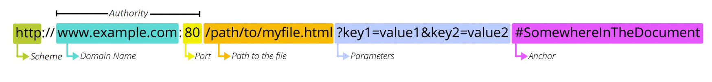
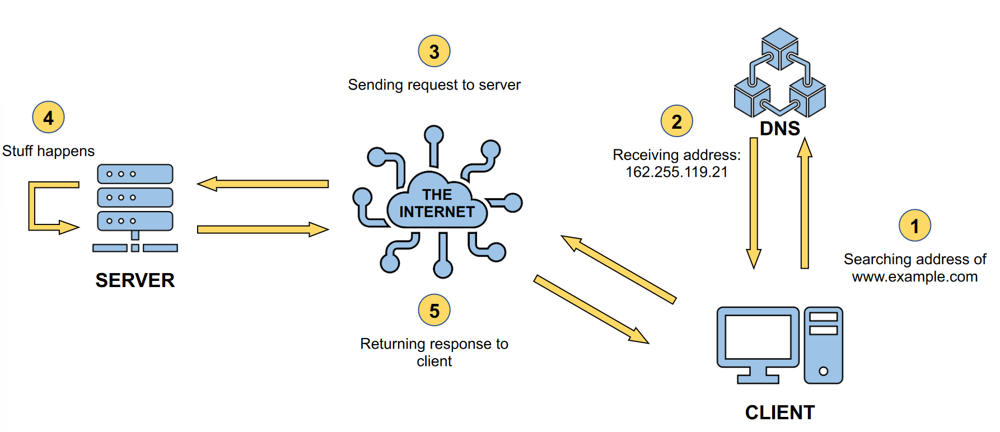

Basic stuff:



| Field | Sample | Description |
| :--- | :--- | :--- |
| Scheme | http | The protocol used. |
| Domain name | https://martino.im | The location of the resource. |
| Port | :80 | The "gate" used to access the resource. |
| Path | //path/to/myfile.html | The path to the resource we are looking for. |
| Parameters | ?key1=value1&key2=value2 | Parameters used to manage the operations for the resource. |
| Anchor | #SomewherelnTheDocument | A bookmark to a location in the webpage. |




Possible answers: 

| Code | Description | Actual Meaning (Server's perspective) |
| :--- | :--- | :--- |
| 2xx |  The action was successfully received, understood and  accepted.  | Everything is okay! |
| 3xx |  The client must perform additional actions to fulfil the request.  |  I know what you want, but it is not there, anymore. Let me tell you the new location... |
| 4xx | The request is syntactically incorrect or cannot be fulfilled |  I have actually no idea of what you want.|
| 5xx | The server has failed to fulfil an apparently valid request. | I just decided to blow up and stop, working.|

The most commonly utilized web servers are:

- Apache
- NGINX
- Microsoft IIS
- LiteSpeed Web Server

## Static files and dynamic files 

Static files are content that is already generated and complete  and, when served, doesn’t require any additional information/data.  HTML, JS, CSS, images are example of static files.

There are several reasons why **dynamic** files are crucial in web development:

* **Efficiency and Scalability:** Scale web applications as demand grows is easier since the server can generate pages and content as needed, rather than relying on static files that must be manually updated.
* **Customization and Interactivity:** generating pages on-the-fly, dynamic files make it possible to personalize web pages based on the individual user's preferences and behaviors. This is probably the most important feature of a dynamic website.

## JSON 

- JSON stands for JavaScript Object Notation.
- It is used as a data transfer convention over the internet.
- JSON is written in the format of a JavaScript Object/Array.

## API and REST

APIs enable abstraction of the internal workings of a system, providing only the relevant parts to the programmer. 
An API is categorized as REST API if it adheres to the following principles:

- Client-Server paradigm 
- Stateless
- Uniform interface
- Cacheability
- Layered system


NGINX and Apache  are good for static file serving and load balancing. In 2009, JavaScript was recognized as an actual programming language and not just a browser tool.


## NodeJS and modules 

Node.js is an environment for running JavaScript code outside a web browser, using the V8 engine. Modules are officially used to package and import code inside other modules. All modules used are saved in the ``node_modules`` folder within the project.
**Endpoints** are the main part of the web server, and each one corresponds to a functionality offered by the server.

It's very important to not upload `node_modules` folder since using `npm install` inside the folder any module is automatically fetched with `npm`. 

````javascript

import express from 'express';
const app = express();

//Each endpoint corresponds to a functionality that we offer

// Simple endpoint that send a message when called
    app.get('/', (req, res) => {
        res.send("Everything's OK!").status(200);
    })

// Endpoint that saves a value in the database
    app.post('/db', async (req, res) => {
        // The data is stored in the body of the request
        let data = req.body;
        
        // try/catch is a construct that allows to try to do something. 
        // If it fails, the operation inside the catch are executed
        try {
            // Trying to save data in the DB
            await model.DB.create(data);
            res.status(200).send()
        }
        catch {
            // Send back error in case something went wrong (for example, empty fields)
            res.status(400).send()
        }    
    })
    
// The server listen port 3000
app.listen(3000);
````

| Method | Function       | Description                                  |
|:------ |:-------------- |:-------------------------------------------- |
| GET    | `app.get(...) `      | Requests that usually want to retrieve data. |
| POST   | `app.post (...)`   | Requests that want to create new data.       |
| PUT    | `app.put(...) `      | Requests that want to modify existing data.  |
| DELETE | `app.delete (...)` | Requests that want to delete existing data   |

[Postman](https://www.postman.com/) is a website that can be used for testing servers. It is basically used to simplify the creation of APIs. 


## Random notes 

### Nodejs Express 


### NodeJS project

When you land into a project where there is `package.json` you can install everything ... using `npm install` . 

Remember to not commit `node_modules`. 

`npm run build`

