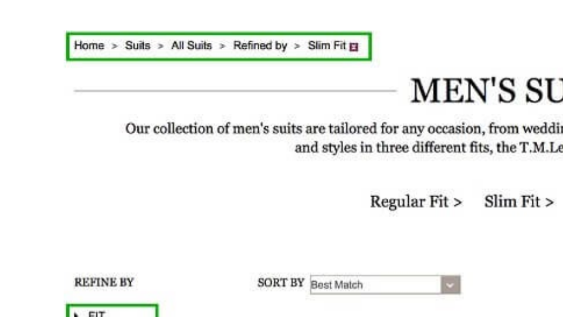
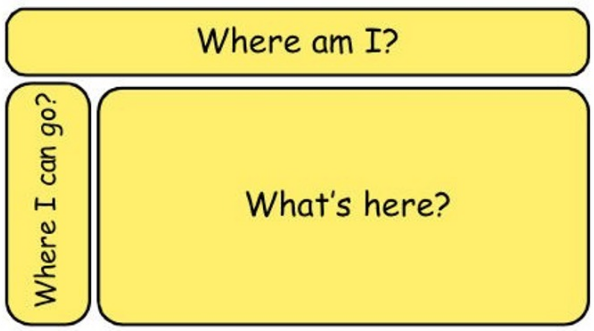
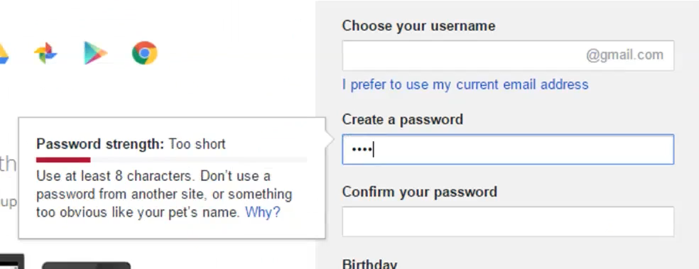

# Usability

> The user is always right. It's always your fault, not user fault.

Usability is the measure of the effectiveness, efficiency and satisfaction when we specify users can achieve a specified goal in particular environment.
In this course, we will focus on the functional view of usability, which emphasizes the simplicity and ease of use of any product.

## Usability Evaluation

There are two ways to perform a usability evaluation: 

- inspection: heuristic-based approach
- user testing: user behaviors are observed, recorded, and then analyzed by researchers (eye tracking and statistics on different parameters like time and tasks)

### User testing 

User profiles and user goals are used to segment the target audience and recruit users for usability testing.

User testing for usability evaluation is an example of **empirical research** (gaining knowledge through observed phenomena).
The data gathered can be:
- quantitative: task success rate and time on task
- qualitative: user satisfaction and perceived difficulty

#### Generic workflow for user testing

1) Define test **goals** 
2) Define qualitative and quantitative **variables** to measure and data to collect 
3) Define **tasks** to assign to the users
4) Define **how to recruit** users
5) Build the **materials** for data collection (e.g., forms) 
6) Create sw and hw setting 
7) “Test the test” with a mini-sample: If needed, go-back and re-design the test

### Inspection: heuristics-based

The most popular inspection method is heuristic evaluation, which is based on checklists and usability principles. Heuristics are a set of principles that guide in the discovery of usability flaws. Heuristics are useful for evaluating any interactive system, but they are not universally recognized.

#### Generic workflow for inspection

1) Identify typical user, his/her goal(s), expectations, background & experience
2) Test the user flows identified
3) Find problems with the eyes of the users who is trying to accomplish a task to get to an objective
4) For each problem find the severity, which heuristics it violates and possible solutions

| Problem Description | Severity (1-5) | Violated Heuristics | Redesign suggestions |
|:-------------------:|:--------------:|:-------------------:|:--------------------:|
| ...             | ...               |   ...            | ...                |

Ratings of severity:

0. Not a problem 
1. Cosmetic problem; should be addressed if schedule permits. 
2. Grammatical, spelling, or other errors; should be fixed as they can affect users' impressions of the interface and its creators, but won’t impact usability. 
3. Minor problem; should be fixed if possible as this will be an annoyance to users, but won’t affect ability to achieve goals. 
4. Major problem; important to fix, as this will impact users' ability to achieve goals. 
5. Catastrophic problem; must be fixed before product is released.

# Heuristics for User Interface Design

Usability heuristics are a set of guidelines or principles which serve as a benchmark for usability inspection. 
The three main types of usability heuristics are:

- navigation: how is easy to move use the interface and navigate 
- content: actual quality of the content
- presentation: visual design and layout of the interface or system.

## Nielsen Heuristics

Jakob Nielsen's 10 general principles are not only for website but for any interactive system. They are called "heuristics" because they are broad rules of thumb and not specific usability guidelines. Originally developed in 90s, the 10 heuristics themselves have remained relevant and unchanged. 

|   Category   |                       Heuristic                        |
|:------------:|:------------------------------------------------------:|
|  Navigation  |              Visibility of system status               |
| Presentation |        Match between system and the real world         |
|  Navigation  |                User control and freedom                |
| Presentation |               Consistency and standards                |
| Presentation |                    Error prevention                    |
|  Nav / Pres  |             Recognition rather than recall             |
|  Navigation  |           Flexibility and efficiency of use            |
| Presentation |            Aesthetic and minimalist design             |
| Presentation | Help users recognize, diagnose and recover from errors |
|   Content    |                 Help and documentation                 |

### Visibility of system status

- The system should always keep users informed about what is going on, through appropriate feedback within reasonable time.
- If the system acts as a black box, it can lead to errors.
- Status bars show the status of the ongoing process by the system.
- Interactive labels show the current position of the user in the ongoing process.
- Breadcrumbs are another technique that shows the path the user has taken.
- Labels can also be used for attributes of a particular page, such as the semantic classification of content objects.
- It is a good practice to remove the "home" label as it is redundant.

{width=50%}

**Bad** example: 

{width=50%}

- Interactive labels show users the path they have taken to arrive at a particular page.
- These labels are dynamically generated based on the pages the user has visited before arriving at the current page.
- However, there are risks of usability and visualization problems if the user has performed a high number of steps.
- When the number of steps is too high, the label may become too long, and it may be difficult for users to interpret and use effectively.

{width=50%}

### Match between system and the real world 

- The system should use the language that is familiar to the user, with words, phrases, and concepts that the user understands.
- It is important to follow real-world conventions to make information appear in a natural and logical order for the user. {width=50%}

{width=50%}

### User control and freedom

- Users may accidentally choose system functions and will need an emergency exit: undo and close functions to allow users to revert to a previous state.
- The emergency exit should be clearly marked and easily accessible
- The undo function should (instead of starting the selection process again from the beginning) just undo some actions.

### Consistency and standards

{width=50%}

- Users should not have to wonder whether different words, situations, or actions mean the same thing in the system.
- It is essential to follow conventions to ensure consistency across the system and make it easier for users to understand and use.

### Error prevention

- Careful design >> error messages: the design should aim to eliminate error-prone conditions. 
- Example of careful design: It is common to end up on the wrong page on many websites. Instead of relying on the browser's back button, it is better to make the link's destination explicit and understandable through a clear link label.

Holy grail of error prevention: 

{width=50%}

*Don´t make me insert all data and then throw me in an error page after I submitted the form. Just prevent it with an error popup.* 

### Recognition rather than recall

- It is better to suggest a set of options to the user (**recognition**) than to expect them to remember the information (**recall**).
- The goal is to minimize "the RAM used of the user brain" aka cognitive load

### Flexibility and efficiency of use

- Providing the user with the ability to personalize the system can make it more flexible and efficient to their needs.
- This allows the system to attract both inexperienced and experienced users.
- Examples of accelerators include system layout or keyboard shortcuts
- *Even in Webeep you can personalize your view*. 

### Aesthetic and minimalist design

- Everything you put in the view stimulates the user 
- So every useless stuff decreases the relative visibility of the important stuff

### Help users recognize, diagnose and recover from errors

- Error messages should be expressed in plain language (no error codes), precisely indicate the problem, and constructively suggest a solution.

{width=50%}

* *Is this popup useful?* 

### Help and documentation

- Ideally, a system should be designed so that it can be used without the need for documentation.
- However, in some cases, it may be necessary to provide help and documentation to users.

## ## MiLe Heuristics

MiLe (Milano Lugano) Usability Evaluation method is a comprehensive set of heuristics focused on organizing content in a clear and intuitive way, highlighting the importance of readability and consistency of visual elements.

|   Category   |               Heuristic               |
|:------------:|:-------------------------------------:|
|  Navigation  |        Interaction consistency        |
|  Navigation  |           Group navigation            |
|  Navigation  |         Structural Navigation         |
|  Navigation  |          Semantic Navigation          |
|  Navigation  |              Landmarks             |
|   Content    |         Information overload          |
|   Content    | Consistency of page content structure |
|   Content    |      Contextualized information       |
|   Content    |   Content Organization (hierarchy)    |
| Presentation |              Text layout              |
| Presentation |  Interaction placeholders-semiotics   |
| Presentation | Interaction placeholders-consistency  |
| Presentation |      Consistency visual elements      |
| Presentation |               Hierarchy               |
| Presentation |          Spatial allocation           |
| Presentation |     Consistency of Page Structure     |

## Navigation/Interaction

- **Interaction consistency**: Do pages of the same type have consistent navigation links and interaction capabilities?
- **Group navigation-1**: Is it easy to navigate between and within groups of items, including from a list of items to their members and vice versa?
- **Group navigation-2**: Do menus create cognitive overload?
- **Structural navigation**: Is it easy to navigate between components of a topic?
- **Semantic navigation**: Is it easy to navigate between related topics in both directions?
- **Landmarks**: Are links available on all pages effective for users to reach key parts of the website?

## Content

- **Information overload**: Is the amount of information on a page appropriate? There is too much content? 
- **Consistency of page content structure**: Do pages presenting topics of the same category have consistent types of elements?
- **Contextualized information**: Does the page provide information to help users understand where they are?
- **Content organization (hierarchy)**: Is the hierarchical organization of topics appropriate for their relevance?

## Presentation 

- **Text layout**: Is the text readable and is font size appropriate?
- **Interaction placeholders-semiotics**: Do interactive elements have intuitive textual and visual labels/icons that convey their functional meaning?
- **Interaction placeholders-consistency**: Are textual or visual labels of interactive elements consistent in wording, shape, color, position, etc.?
- **Consistency of visual elements**: Do pages of the same type have consistent visual properties for visual elements?
- **Hierarchy-1**: Is the on-screen allocation of contents within a page appropriate for their relevance?
- **Hierarchy-2**: Is the on-screen allocation of visual elements appropriate for their relevance?
- **Spatial allocation-1**: Are semantically related elements close to each other?
- **Spatial allocation-2**: Are semantically distant elements placed distant from each other?
- **Consistency of page spatial structure**: Do pages of the same type have consistent spatial organization for visual elements?

