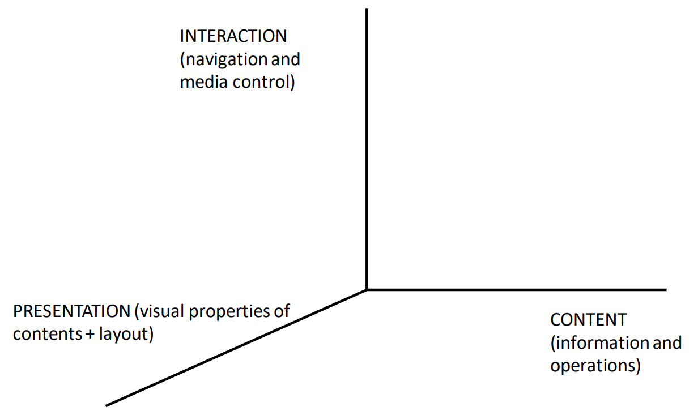
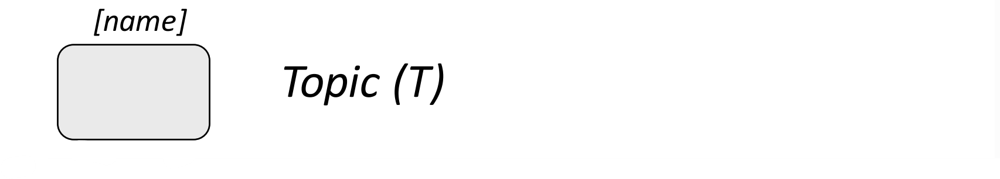
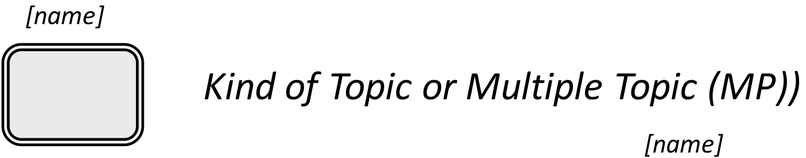
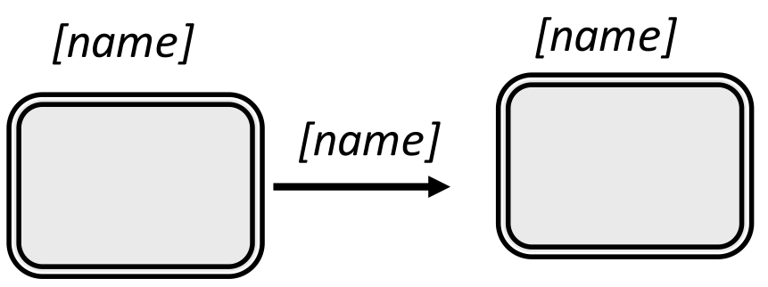
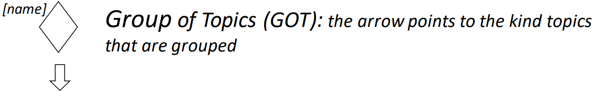
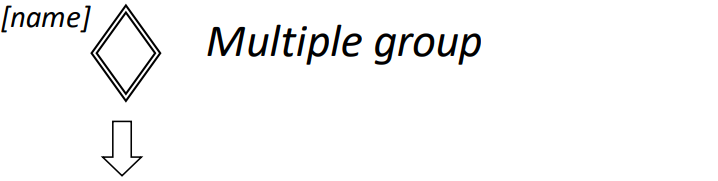
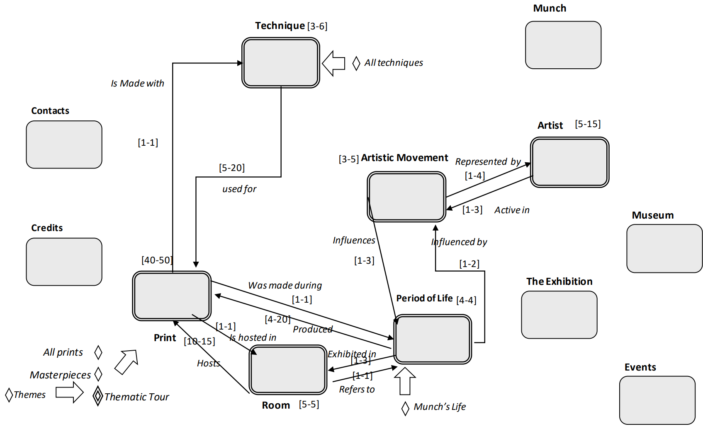
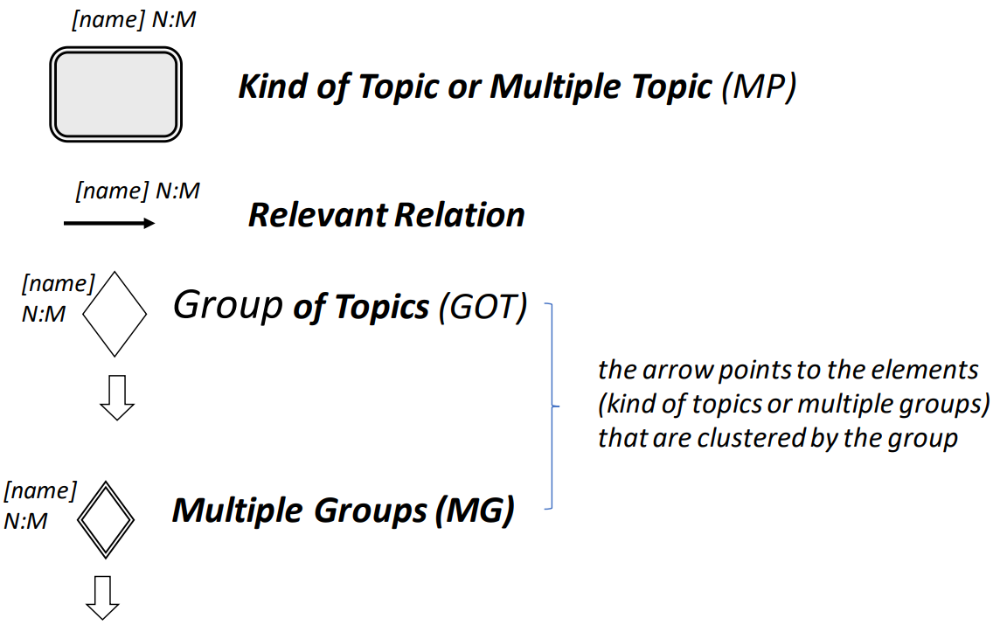

# Web Design

## Prologue

As in many different Computer Science problems, a good way to approach the complexity of web designing is using a "divide et impera" approach: separate the different design concerns. 

The 3 dimensions are always the same: 

The final pages integrate content, interaction, and presentation elements BUT the design PROCESS must be kept separate. "you design once for many things" : you have to design the general structure obv, not every single page. 

## IDM 

We also need a model to describe to support a systematic mapping to navigation and presentation design. A possible model is **IDM: Interactive Dialogue Model**. 
According to IDM, designing a web application involves designing the dialogue between humans and the application. IDM focuses on the in-the-large features only and is composed of sub-models for the various design dimensions. It doesn't include modeling how to interact with animations, videos, and other multimedia content, nor does it describe the detailed layout properties of pages.

### Content IDM 

- **Topic**: something unique that can be the subject of conversation between the user and the interactive application
{width=25%}
- **Multiple Topic** or **Kind of Topics**: a category (a "class") of possible subjects of conversation 
{width=25%}
- **Relevant Relation**: It models how topics and instances of kind of topics are related. It determines how the dialogue can switch from a topic to a different one.
{width=25%}
- **Group of topic**: a set of possible topics (subjects) of conversation
{width=50%}
- **Multiple Groups**: It models a set of groups having common characteristics
{width=50%}

#### Cardinality 

Cardinality refers to the expected minimum and maximum number of instances and should be associated with multiple topics, relevant relationships, and multiple groups. It helps in planning the overall size of the application and estimating editorial effort.

#### C-IDM in the small 

In the small the C-IDM notation is based on content tables. It describes the sets of data associated to each topic, kind of topic, group, or multiple group. Content table includes:

  - Data for describing topic/kind of topic
  - Data defining a preview of their relationships (for kinds of topics only)
  - Data describing the whole group
  - Data providing a preview of group members (for groups)

### Navigation IDM 

At the end a website consists of a network of pages  which are atomic units for visualization and interaction and containers for contents and links. 
We can eventually classify pages in these categories: 

- **Single Topic Pages**: where users consume contents about a given single topic
- **Multiple Topic Pages**: e where users consume contents about topics of a given kind
- **Introductory pages**: where users understand what are a group is about, and what are its members.
- **Transition Pages**: where users see the list of topics related to a given page
- **Home page**: it eventually can have a totally different page and it's focused on brand values

We can classify links in these categories: 

- **Structural Links**: to move across pages of the **same topic** and keep the user within the same "cognitive context". The user is exploring another piece of the same thing. 
- **Transition Links**: to move the user from a topic to a different topic ("cognitive jump"). 
- **Group Links**: to support navigation across Introductory pages of a group to the pages of the group members. Can be static or eventually dynamic when the same page belongs to multiple groups and there is some logic behind the "destination of the link". 
- **Landmarks**: links available in all pages. 

#### Navigation pattern 

Navigation strategies that have been proved effective and usable for navigation in large networks of interconnected contents. The three main ones are: 

- **All-to-all** links
- **Guided tour**: Identify an order among the group members, and creating sequential bidirectional links among them. A **circular** guided tour is possible too. 

- **Index**: The index pattern consists of defining bidirectional links (from the member to the entry point of the group collection) from the entry point of the group collection (the introductory page in IDM) to each member. 

### Presentation IDM 

Presentation design consists in:

- Decide where to place contents and links
- Choose the orientation of info
- Determine where to place links
- Decide on link labels and icons
- Set layout properties (size, color, etc.)
- Organize visual space

every step following the usability principles

## Scenarios 

Scenarios are used to illustrate design decisions through a "story about use" of an application by a typical user or persona. Basically is the same concept of use cases/ user stories or storyboards.
Scenarios are useful throughout the whole product lifecycle, from requirements elicitation to evaluation of a prototype or implemented system. They can be described textually or visually, using images or videos.
This is the structure of the scenario:

1. End User Profile: description of users who will use the system
2. Goal(s): Problems that the application solves
3. Context: situation of use of the application and user's environment
4. Task Textual and Visual Narrative: a narrative description of the interaction
	- Textual presentation of user's tasks
	- Screenshots, diagrams, and other graphical representations