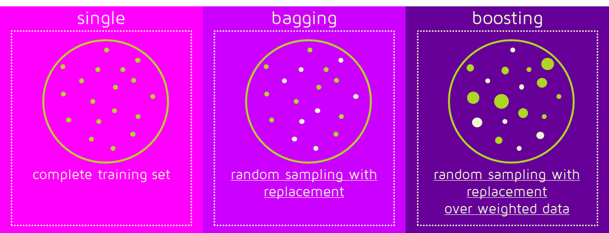
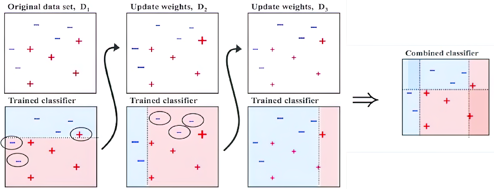
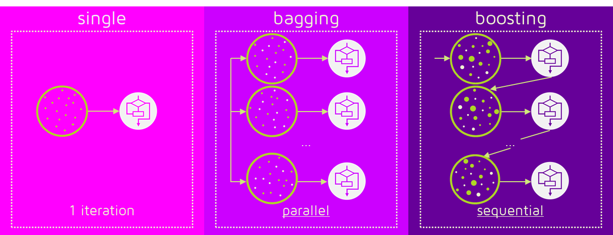
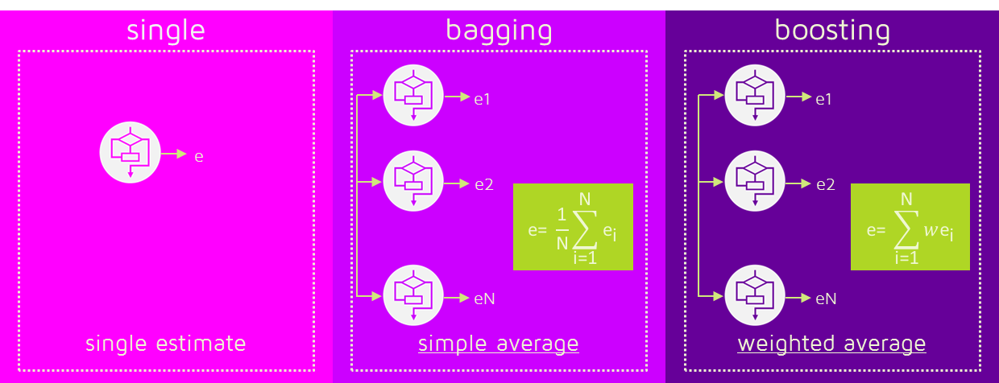

# Bias-Variance

The Bias-Variance is a framework to analyze the performance of models.

Typically there is a trade-off between bias-variance:

- bias measures the difference between truth and what we expect to learn
- variance in general measures the spread or dispersion of a set of data points around their mean (average) value. It indicates how much it changes according to the dataset used.

The more complex is the model and the higher will be the variance: 

{width=50%}

The term "degree of freedom" refers to the number of parameters that can vary in a model without violating any constraints. It represents the flexibility or complexity of a model.
Increasing the number of samples doesn't change the bias of my model: the bias of my model is the property of my model.  If I cannot represent the process generating data with my model doesn't change if I am increasing the data. 
Increasing the number of samples can instead reduce the variance.  
Another visualization: 

{width=50%}

A hypothesis space $H$ is the set of all possible models that can be learned by an algorithm. It represents the range of functions or mappings that the algorithm can choose from to make predictions based on input data.
If $H_1$ is a smaller subset of $H_2$:

- the bias of $H_2$ will be smaller than the bias of $H_1$.
- the variance of $H_1$ is smaller than that of $H_2$. 

## Bias-Variance decomposition

The **bias–variance decomposition** is a way of analyzing a learning algorithm's expected generalization error with respect to a particular problem as a sum of three terms:

$$
\begin{aligned}
\mathbb{E}\left[(t-y(\mathbf{x}))^2\right] & =\mathbb{E}\left[t^2+y(\mathbf{x})^2-2 t y(\mathbf{x})\right] \\
& =\mathbb{E}\left[t^2\right]+\mathbb{E}\left[y(\mathbf{x})^2\right]-\mathbb{E}[2 \operatorname{ty}(\mathbf{x})] \\
& =\mathbb{E}\left[t^2\right] \pm \mathbb{E}[t]^2+\mathbb{E}\left[y(\mathbf{x})^2\right] \pm \mathbb{E}[y(\mathbf{x})]^2-2 f(\mathbf{x}) \mathbb{E}[y(\mathbf{x})] \\
& =\operatorname{Var}[t]+\mathbb{E}[t]^2+\operatorname{Var}[y(\mathbf{x})]+\mathbb{E}[y(\mathbf{x})]^2-2 f(\mathbf{x}) \mathbb{E}[y(\mathbf{x})] \\
& =\operatorname{Var}[t]+\operatorname{Var}[y(\mathbf{x})]+(f(\mathbf{x})-\mathbb{E}[y(\mathbf{x})])^2 \\
& =\underbrace{\operatorname{Var}[t]}_{\sigma^2}+\underbrace{\operatorname{Var}[y(\mathbf{x})]}_{\text {Variance }}+\underbrace{\mathbb{E}[f(\mathbf{x})-y(\mathbf{x})]^2}_{\text {Bias}^2}
\end{aligned}
$$

Some considerations:

- $\sigma^2$ is also called **Irreducible error** while the **reducible error** is composed by the other components.
- It's always a good thing increase the number of samples, since it decreases the variance of the model and therefore the reducible error: since it is composed by the sum of the squared bias. 
- Increasing the complexity of the model will decrease your Reducible Error ? It depends... this is the whole point in model selection: balancing between the bias and the variance.

Note that the computation of the bias-variance decomposition is possible only theoretically and it is possible only if we know the true process.

## Ensemble models  

Improving the trade off between bias and variance:

- **Bagging**: reduce variance without increasing bias
- **Boosting**: reduce bias without increasing variance

### Bagging 

Bagging stands for Bootstrap Aggregation: it generates $N$ datasets applying random sampling with replacement.

- Reduces variance
- Not good for stable learners (A learning algorithm is stable if changing input slightly won't put effect on the hypothesis)
- Can be applied with noisy data
- Usually helps but the difference might be small
- Parallel by design

### Boosting 

- Reduces bias (generally without overfitting)
- Works with stable learners
- Might have problem with noisy data
- Not always helps but it can makes the difference
- Serial by design

Sequentially means that we train a model based on the prediction of the previous. The steps to perform boosting are the following,

- Give an equal weight to all training samples 
- Train a weak model on the training set 
- Compute the error of the model on the training set 
- For each training samples increase its weight if the model predicted wrong that sample. Doing so we obtain a new training set. 
- Iterate the training on the new training set, error computation and samples re-weighting until we are satisfied by the result

The final prediction is the weighted prediction of every weak learner. In practice we are combining a set of sequential underfitting model. Doing so, we have low variance and the bias is improved by combining the weak learner to form a strong learner. On average, boosting helps more than bagging, but it is also more common for boosting to hurt performance. 

