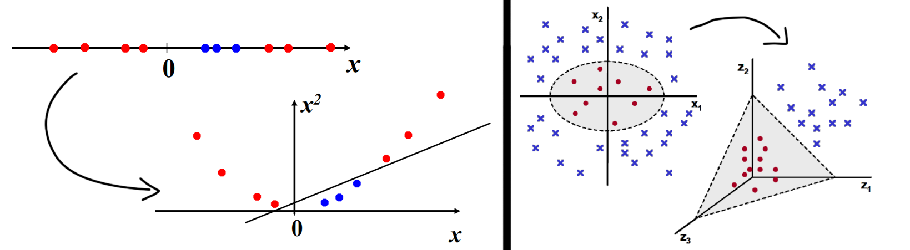
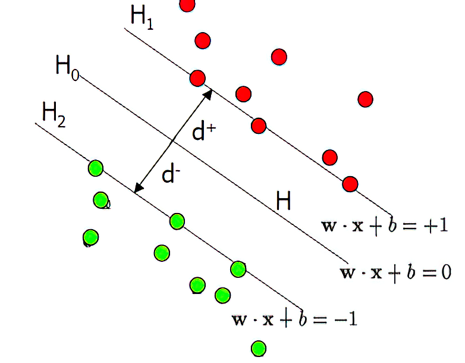

# Kernel Methods

Key idea: sometimes linear separators cannot be found in the input space. **But** it's possible to map the input space to a higher-dimensional feature space to make it easier to separate classes or find patterns.

The clever approach of Kernel methods is that instead of directly mapping the data to a higher-dimensional space and performing computations, kernel methods represent the data through pairwise similarity comparisons between the original data observations (basically we skip the mapping $\phi(x)$ and we only perform the similarity comparisons).
This means that instead of explicitly applying transformations and representing the data with transformed coordinates in the higher-dimensional feature space, kernel methods rely on comparing the similarities between data points.
By utilizing this approach, kernel methods enable efficient calculations without explicitly mapping to a higher dimension. This "trick" permits us to find the optimal separating hyperplane in this higher dimensional space without having to calculate or in reality even know anything about $\phi(x)$.

Computationally speaking is very very convenient: we can represent features expansion that include billions of elements with very simple kernel which need few operation to be computed. 

### Constructing Kernels

Theorem Mercer’s theorem tells us that any continuous, symmetric, positive semi-definite kernel function $k(x, x_0)$ can be expressed as a dot product in a high-dimensional space:

$$k(x,x')=\phi (x)^T \phi (x')$$

Since demonstrating the positive semi-finite function can be challenging, we can make new kernels using well-known kernels as **building blocks**. 
Given valid kernels $k_1\left(\mathbf{x}, \mathbf{x}^{\prime}\right)$ and $k_2\left(\mathbf{x}, \mathbf{x}^{\prime}\right)$ the following new kernels will be valid:

1) $k\left(\mathbf{x}, \mathbf{x}^{\prime}\right)=c k_1\left(\mathbf{x}, \mathbf{x}^{\prime}\right)$
2) $k\left(\mathbf{x}, \mathbf{x}^{\prime}\right)=f(\mathbf{x}) k_1\left(\mathbf{x}, \mathbf{x}^{\prime}\right) f\left(\mathbf{x}^{\prime}\right)$ where $f(\cdot)$ is any function
3) $k\left(\mathbf{x}, \mathbf{x}^{\prime}\right)=q\left(k_1\left(\mathbf{x}, \mathbf{x}^{\prime}\right)\right)$, where $q(\cdot)$ is a polynomial with non-negative coefficients
4) $k\left(\mathbf{x}, \mathbf{x}^{\prime}\right)=\exp \left(k_1\left(\mathbf{x}, \mathbf{x}^{\prime}\right)\right)$
3) $k\left(\mathbf{x}, \mathbf{x}^{\prime}\right)=k_1\left(\mathbf{x}, \mathbf{x}^{\prime}\right)+k_2\left(\mathbf{x}, \mathbf{x}^{\prime}\right)$
6) $k\left(\mathbf{x}, \mathbf{x}^{\prime}\right)=k_1\left(\mathbf{x}, \mathbf{x}^{\prime}\right) k_2\left(\mathbf{x}, \mathbf{x}^{\prime}\right)$
7) $k\left(\mathbf{x}, \mathbf{x}^{\prime}\right)=k_3\left(\phi(\mathbf{x}), \phi\left(\mathbf{x}^{\prime}\right)\right)$ where $\phi(\mathbf{x})$ is a function from $\mathbf{x}$ to $\mathbb{R}^M$
8) $k\left(\mathbf{x}, \mathbf{x}^{\prime}\right)=\mathbf{x}^T A \mathbf{x}^{\prime}, \quad$ where $A$ is a symmetric positive semidefinite matrix
9) $k\left(\mathbf{x}, \mathbf{x}^{\prime}\right)=k_a\left(\mathbf{x}_a, \mathbf{x}_a^{\prime}\right)+k_b\left(\mathbf{x}_b, \mathbf{x}_b^{\prime}\right)$ where $x_a$ and $x_b$ are variables with $\mathbf{x}=\left(x_a, x_b\right)$
10) $k\left(\mathbf{x}, \mathbf{x}^{\prime}\right)=k_a\left(\mathbf{x}_a, \mathbf{x}_a^{\prime}\right) k_b\left(\mathbf{x}_b, \mathbf{x}_b^{\prime}\right)$

Note that every kernel has to be symmetric and continuous.

### Gaussian Processes

Gaussian processes are versatile algorithms that can be used for both regression and classification. GPs aren't parametric methods:
they are memory-based ones and they use a big matrix computed with the samples to predict new samples.
A Gaussian process is a probability distribution over possible functions $y(x)$ such that the set of values $y(x)$ evaluated at an arbitrary set of points $x_1, \ldots, x_N$ jointly have a Gaussian distribution.
$\mathrm{K}$ or $C_N$ measures the similarity between all inputs pairs and so the correlation of the outputs $y$. 

$$K=\left[\begin{array}{lll}
k\left(\mathbf{x}_1, \mathbf{x}_1\right) & \ldots & k\left(\mathbf{x}_1, \mathbf{x}_N\right) \\
\vdots & \ddots & \vdots \\
k\left(\mathbf{x}_N, \mathbf{x}_1\right) & \ldots & k\left(\mathbf{x}_N, \mathbf{x}_N\right)
\end{array}\right]$$

This matrix is also called "Gram" since in linear algebra, the Gram matrix represents pairwise inner products between vectors in an inner product space. 
When we have to predict the target of a new point we use the $K$ matrix: 

$$\mathbf{C}_{N+1}=\left(\begin{array}{cc}
\mathbf{C}_N & \mathbf{k} \\
\mathbf{k}^{\top} & c
\end{array}\right)$$

We can compute both the mean and variance of any new target, defining a new probability distribution:

- $m\left(\mathbf{x}_{N+1}\right)=\mathbf{k}^{\top} C_N^{-1} \mathbf{t}$
- $\sigma^2\left(\mathbf{x}_{N+1}\right)=c-\mathbf{k}^{\top} C_N^{-1} \mathbf{k}$

with $k$ is the kernel between the new target and all the training data points (a vector where we keep in memory all the kernels).

### SVM Support Vector Machines 

SVMs try to find a decision boundary that maximizes the distance between support vectors (data points closest to the decision boundary) from both classes. 
To handle non-linearly separable datasets, SVMs use kernel functions mentioned earlier such as linear kernels, polynomial kernels, radial basis function (RBF) kernels which implicitly map input features into higher-dimensional spaces where they become linearly separable.

In SVM (Support Vector Machines), the decision boundary is defined by a hyperplane that separates different classes of data points. The support vectors are the data points that lie closest to this decision boundary.

To determine if a particular data point, such as $x_1$, is a support vector, we need to check if it lies on or within the margin region around the decision boundary. This margin region is defined by two parallel hyperplanes: one on each side of the decision boundary.
The equation for these hyperplanes can be written as:

$w^T x + b = 1$   (for the upper hyperplane)
$w^T x + b = -1$  (for the lower hyperplane)

Here, $w$ represents the weight vector and $b$ represents the bias term in SVM. The dot product $w^T x_1 + b$ gives us a measure of how far away $x_1$ is from these hyperplanes.

If $w^T x_1 + b \leq 1$, then it means that $x_1$ lies inside or on top of the upper margin plane. Similarly, if $w^T x_1 + b \geq -1$, then it means that $x_1$ lies inside or on top of the lower margin plane.

{width=50%}

Therefore, when checking if a data point like $x_1$ is a support vector, we want to ensure that it satisfies both conditions: 

- It should be correctly classified according to its class label.
- It should lie within or on top of either one of these two margin planes ($w^Tx+b=+/-  0ne)$

By satisfying both conditions simultaneously, we can identify whether a given data point belongs to any specific class and also acts as part of defining/supporting our decision boundary in SVM.

#### SVMs and Perceptron 

SVMs and Perceptron are similar but:

- the Perceptron adjusts weights iteratively to find a decision boundary, while SVMs aim to maximize the margin between support vectors. 
- So Perceptron focus on minimizing misclassifications, while SVMs prioritize maximizing margins.
- Perceptron can only learn linear boundaries, while SVMs can handle non-linear data using kernel functions. 

