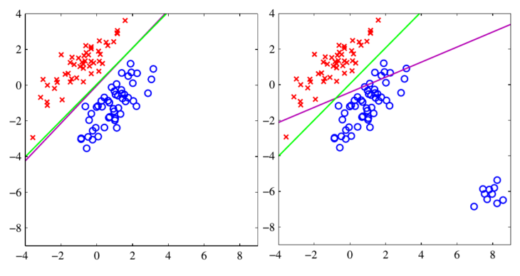
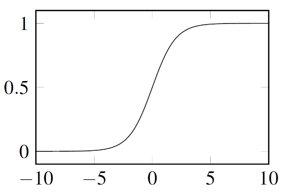
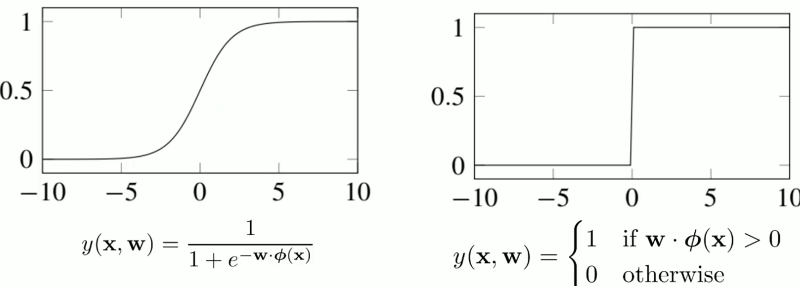

# Linear Classification

Linear classification is a type of supervised learning where the goal is to assign an input vector $x$ to one of $K$ discrete classes. There are different approaches:
- **Discriminant function approach** directly provides the predicted class $f(x) = Ck$: 
	- Ordinary Least square approach
	- Perceptron 
	- K-NN 
- **Probabilistic discriminant approach** provides the predicted probability
	- Logistic Regression 
- Probabilistic generative approach:
	- Naïve-Bayes 

## OLS  for classification

Least squares could be an approach for classification but is problematic in some cases. 

Least square is very sensitive to outliers. Least square tries to find a line which is the most close to all points. It does so evaluating the square distance between the samples and the line. It means that an outlier will have a greater impact on the line position because it will be more distant with respect to the probable samples.

This because one of the assumptions of least squares is to have a linear noise which follows a Gaussian distribution: the model generating the data is a linear model plus a noise with gaussian distribution with some unknown standard deviation (hopefully not too big). If we have outliers, it's like the noise is not following any gaussian distribution. So this, in practice, makes least square not able to find good decision boundaries.

{width=50%}

## Perceptron 

The perceptron is an algorithm for online supervised learning of binary classifiers. The algorithm finds the separating hyperplane by minimizing the distance of misclassified points to the decision boundary. Sum of the distances of misclassified points from the current separating hyperplane: 

$$
L_P(w)=-\sum_{n \in M} w^T \Phi\left(x_n\right) t_n
$$

It's designed to penalize the outliers:

- samples classified correctly do not contribute to $L$
- each misclassified sample contributes as $w^T \Phi\left(x_i\right) t_i$

The perceptron is an example of linear discriminant model. It has an online linear classification algorithm. The main function to decide if it's in a positive or negative class is:
$$y(\mathbf{x}) = f\left(\mathbf{w}^T \phi(\mathbf{x})\right)$$

where $f$ is a step function (sign function):
$$
f(a)= \begin{cases}+1 & a \geq 0 \\
-1 & a<0\end{cases}$$

In perceptron we apply a Stochastic Gradient Descent:
in case of correctly classified samples $\phi(x)$, the loss is zero so we do not do any update on the parameters, while we update the weights when we misclassified samples:

$$
w^{(k+1)}=w^{(k)}-\alpha \nabla L(w)=w^{(k)}+\alpha x t_n
$$
$$w \leftarrow w+\alpha \phi\left(x\right) t_2$$

Some other details: 

- If the dataset fed to a perceptron is not linearly separable, the Perceptron algorithm will not terminate. 
- If the dataset is linearly separable, Perceptron will converges in a finite number of steps. 
- Many hyperplanes exist and Perceptron converges on one, and it converges depending on the initialization and the order of how the data is processed 

## Logistic regression

While Least squares method is highly sensitive to outliers, logistic regression is not. Logistic regression is a statistical model that in its basic form uses a logistic function to model a binary variable. So it is capable of resolve two-class classification. Logistic regression is a discriminative model so we model directly the posterior probability $P(C_k|\Phi)$. In detail we use a logistic sigmoid function:

{width=50%}

In logistic regression, we assume that the hypothesis space is distributed as a Bernoulli because we are dealing with binary classification problems. The **Bernoulli distribution**, is the discrete probability distribution of a random variable which takes the value $1$ with probability $p$ and the value $0$ with probability $q = 1 - p$.  In this case, the Bernoulli distribution is used to model the probability of a certain class label being assigned given a set of input features.
The sigmoid function plays a crucial role in logistic regression. It is used to map the output of our linear model (which can take any real value) into a range between $0$ and $1$: $$ P\left(C_1 \mid \Phi\right)=\sigma\left(w^T \Phi\right)=\frac{1}{1+e^{-w^T \Phi}}$$ and for the negative class: $$ P\left(C_2 \mid \Phi\right)=1-P\left(C_1 \mid \Phi\right) = 1 - \frac{1}{1+e^{-w^T \Phi}}$$ Example:  $$ \begin{array}{ll} P\left(t_1=1 \mid \phi_1, w\right) & P\left(t_3=1 \mid \phi_3, w\right) \\ P\left(t_2=0 \mid \phi_2, w\right) &
\end{array}
$$

So we can take as loss function the product of all the probabilities $P(t_n)$. 

$$
R_L=\prod_{i=1}^3 P_i
$$

Then we want to maximize this probability. 
If a prediction is $> 0.5$ it will be in positive class

$$P(w|X,w)=\prod _{n=1}^Ny_n^{t_n}(1-y_n)^{1-t_n}$$

We convert the maximization into a minimization of the negative log-likelihood: 
$$
L(\mathbf{w})=-\ln p(\mathbf{t} \mid \mathbf{X}, \mathbf{w})=-\sum_{n=1}^N\left(t_n \ln y_n+\left(1-t_n\right) \ln \left(1-y_n\right)\right)=\sum_{n=1}^N L_n
$$

The loss function of LR is convex but LR does not admit a closed-form solution of the optimal weights. A closed-form solution refers to a mathematical solution that can be expressed using a finite number of mathematical operations, such as algebraic equations, integrals, and derivatives. No closed-form solution means: it doesn't allow for the use of analytical methods to find the optimal parameters. We can compute the derivative (gradient). 

The logistic regression classifier converges to a solution even when the training set is not linearly separable. Indeed, LR always provides the weights minimizing the corresponding loss function, being the objective function convex. If the training set is not linearly separable, the provided weights would not correspond to a separating hyperplane.
The more the number of features we are considering, the more the model il complex and prone to overfitting.

### Logistic regression as a generalization of perceptron

The perceptron classifier and the logistic regression classifier are both generalized linear models. Indeed, their prediction function can be both written as $f\left(x^T w+w_0\right)$. In particular, for the perceptron we have $f(y)=\left\{\begin{array}{ll}+1 & \text { if } y \geq 0 \\ -1 & \text { otherwise }\end{array}\right.$ and for logistic regression we have $f(y)=\sigma(y)$, where $\sigma(\cdot)$ is the sigmoid function.

## Naïve Bayes 

The main idea behind Naïve Bayes is to calculate the probability of a certain class label given a set of input features. It assumes that each feature contributes independently and equally to the probability calculation, which is why it's called "naïve". 
NB calculates the posterior probability $P(A|x_1,x_2, \dots x_n)$ and $P(B|x_1,x_2, \dots x_n)$ using Bayes theorem:

$$P(A|x_1,x_2, \dots x_n) = \frac{(P(x_1|A) * P(x_2|A) * \dots * P(xn|A) * P(A))}{P(x_1,x_2, \dots x_n)}$$

$$P(B|x_1,x_2, \dots x_n) = \frac{(P(x_1|B) * P(x_2|B) * \dots * P(xn|B) * P(B))}{P(x_1,x_2, \dots x_n)}$$

Here:

- The terms like $P(A)$ and $P(B)$ are prior probabilities representing our belief about the likelihood of each class occurring.
- The terms like $P(x_i | A)$, represent conditional probabilities indicating how likely each feature $x_i$ occurs given a specific class $A$.
- The denominator term represents evidence or normalization factor.

During training phase:

- Prior probabilities can be estimated by counting occurrences of each class in the training data.
- Conditional probabilities can be estimated by assuming a specific probability distribution for each feature, such as Gaussian (for continuous features) or multinomial (for discrete features).

During prediction phase:

- Given a new sample with input features $x_1, x_2, ..., x_n$, NB calculates the posterior probabilities for each class using the trained model.
- The class with the highest posterior probability is then assigned as the predicted class label.

$$P(C_k \mid x)=\frac{P(x \mid C_k)P(C_k)}{P(x)}$$

## K-Nearest Neighbor 

K-nearest neighbors (KNN), instead of estimating fixed parameters, stores all available training instances in memory during training.
During prediction with KNN, it calculates distances between new input samples and all stored instances in order to identify the $k$ nearest neighbors. The predicted output is then determined based on majority voting or averaging among those neighbors. 
For example in KNN it can be used the Euclidean distance. For each new sample are queried the $k$ nearest points and then predicted the class. Obviously if there is a tie, KNN is unable to provide a prediction, unless a the breaking rule is provided.

KNN is affected by the curse of dimensionality, which means that having a very high number of dimensions will decrease the performance of the predictor. The curse is caused by the fact that with high dimensions, all the points tend to have the same distance from one to another. So the more the $k$ parameter is small the more it is prone to overfit the original dataset. With $K = 1$ all the data in the training set are perfectly classified.
Said in another way, very low $k$ will have high variance and low bias, while a high $k$ will have a low variance but high bias.

## Parametric and non parametric

Two distinction: 

- **Non-parametric** models do not involve any weights and require no training. They simply query over the dataset to make predictions for both regression and classification problems.Remember that non parametric method has not training: every time you have constraints on memory or computation you prefer not parametric method. 
- A **parametric** method is trained on a dataset and then makes inference  with the developed weights. Usually Parametric approaches are faster in the prediction phase. 

| Scenario                                                              | I prefer parametric or not parametric approach? |
|:--------------------------------------------------------------------- |:----------------------------------------------- |
| Large dataset (big data scenario);                                    | Parametric    |
| Embedded system or component with reduced computational capabilities. | Non parametric        |
| Prior information on data distribution                                | Parametric     |
| Learning in a Real-time scenario                                      | Non parametric                                              |

- In the case we have a large dataset it is better to have a model which is able to capture the characteristics through parameters. Indeed, a non-parametric method would require storing the whole dataset and perform queries on it to perform predictions. 
- In the case of an embedded system, a parametric approach is possible if trained on another machine, non parametric if there is enough memory. 
- Learning in a real-time scenario is impossible: just memorise and queries like KNN for example. 

## Performance measures in Binary Classification 

To evaluate the performance of a method we need to consider the confusion matrix, which says the number of points which have been correctly classified and those which have been misclassified.

|                    | Actual Class: 1      | Actual Class: 0      |
|:------------------ |:-------------------- |:-------------------- |
| Predicted Class: 1 | $t p$ true positive  | $f p$ false positive |
| Predicted Class: 0 | $f n$ false negative | $t n$ true negative  |

The following metrics can be evaluated:

- Accuracy: $A c c=\frac{\left(t_p+t_n\right)}{N}$ is the fraction of predictions our model got right.
- Precision: Pre $=\frac{t_p}{t_p+f_p}$ answers to *"What proportion of positive identifications was actually correct?"*
- Recall: $\operatorname{Rec}=\frac{t_p}{t_p+f_n}$ answers to *"What proportion of actual positives was identified correctly?"*
- F1 score: $F 1=\frac{2 * \text { Pre } * \text { Rec }}{\text { Pre }+ \text { Rec }}$ 

Other metrics to evaluate the model: 

$$\operatorname{RSS}(\mathbf{w})=\sum_{n=1}^N\left(\hat{t}_n-t_n\right)^2$$
where $\hat{t}_n=y(x_n, w)$$

$$\operatorname{MSE}=\frac{\operatorname{RSS}(w)}{N}$$

$$\mathrm{RMSE}=\sqrt{\frac{\operatorname{RSS}(\mathbf{w})}{N}}$$

Another important to evaluate the linear model is R-squared: 
(the coefficient of determination)

$$R^2=1-\frac{\operatorname{RSS}(\mathbf{w})}{\mathrm{TSS}}$$
where TSS is the Total Sum of Squares: 
$$\mathrm{TSS}=\sum_{n=1}^N (\bar{t}-t_n)^2$$
with
$$\bar{t}=\frac{1}{N} \sum_{n=1}^N t_n$$

TSS (Total Sum of Squares) can be seen as a measure of the total variance in the target variable.
You happy when $R^2$ is close to $1$ . 

## Multiple classes 

Different approaches to multiple classes classifiers: 

- **one-versus-the-rest**: $K-1$ classifiers of which solves $2$ class problem, separating points of $C_k$ from points not in that class.  
- **one-versus-one**: $\frac{K(K-1)}{2}$ classifiers, each classifier for each pair of classes. This introduces ambiguity. 
- **k-classifier**: $K$ classifier each one will try to predict only a class, and each time the output will be the class with maximum probability. 

Recap on methods seen:

The **perceptron** deals with binary classification problems. It can be employed for K multi-class classification training K one-versus-the-rest classifiers.

**Logistic regression** classifier deals with binary classification problems. It can be extended to multi-class classification, using the softmax transformation.
The Softmax equation is as follows:
$$
p(y=j \mid \mathbf{x})=\frac{e^{\left(\mathbf{w}_j^T \mathbf{x}+b_j\right)}}{\sum_{k \in K} e^{\left(\mathbf{w}_k^T \mathbf{x}+b_k\right)}}
$$

**Naïve Bayes** is able to deal with multi-class classification problems by using a categorical distribution for the class distribution prior $p(C_k)$ and estimating the posterior $P(x|C_k)$ for each class.

**KNN** is naturally able to deal with multi-class classification problems by using majority voting to decide the class. However, we need to carefully choose the way we are breaking ties since this might be crucial in the case of many classes.
