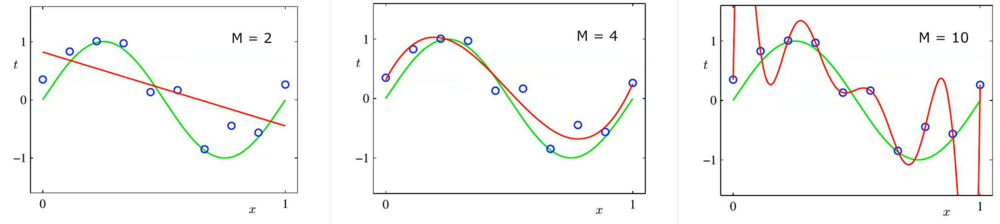
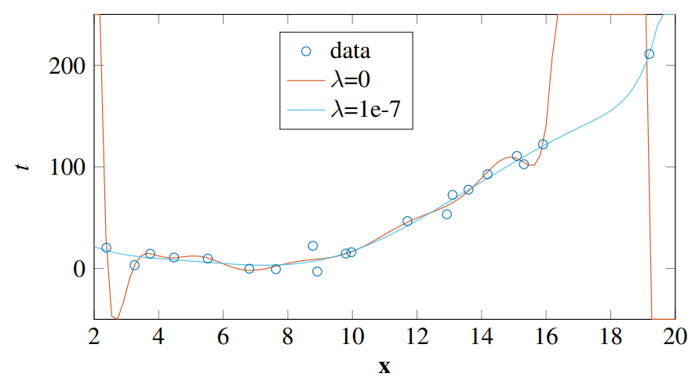
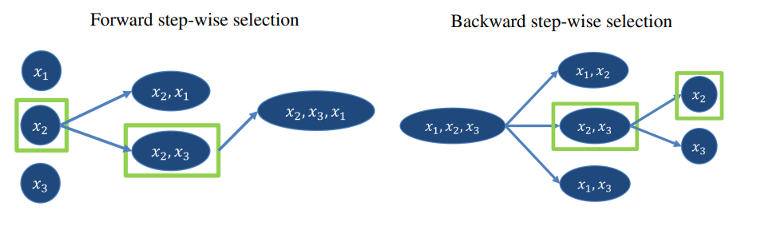
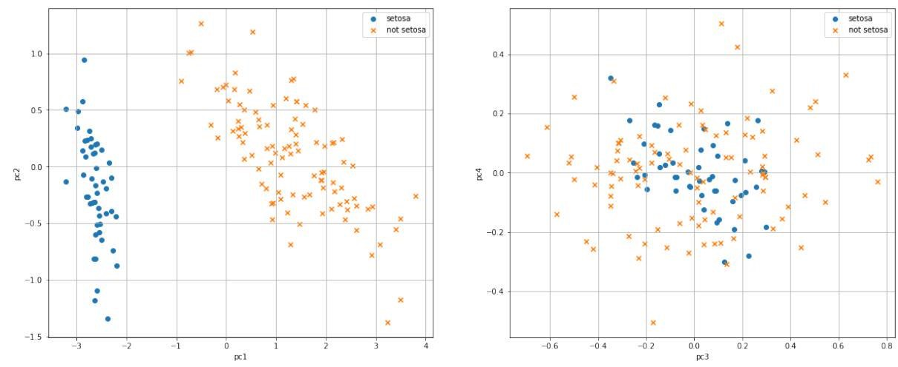

# Model Selection


## Regularization 


{width=50%}

Increasing the order of the polynomial model reduces the smoothness of the approximation. The weights also increase in size with higher order models. To address this, we can use a **regularization** coefficient, which can be implemented through methods like **ridge** regression or **lasso** regression.


### Ridge

Ridge regression is a technique that adds a penalty term to the ordinary least squares (OLS) method to prevent overfitting. The formula for the Ridge loss function is:

$$
L(\mathbf{w})=\frac{1}{2} \operatorname{RSS}(\mathbf{w})+\frac{\lambda}{2}\|\mathbf{w}\|_2^2
$$

In this formula, $\operatorname{RSS}(\mathbf{w})$ represents the residual sum of squares, which measures the difference between predicted and actual values. The second term $\frac{\lambda}{2}\|\mathbf{w}\|_2^2$ is the regularization term that penalizes large coefficients by adding their squared magnitudes multiplied by a tuning parameter $\lambda$. This helps to shrink or regularize the coefficients towards zero.
When performing Ridge Regression the OLS formula is modified in this way: 
$$\hat{\mathbf{w}}_{\text {ridge }}=\left(\lambda \mathbf{I}+\boldsymbol{\Phi}^T \boldsymbol{\Phi}\right)^{-1} \boldsymbol{\Phi}^T \mathbf{t}$$

the magic: 



 Things to remember: 

1) training RSS -> increases ! 
2) test RSS -> maybe increase/decrease OK (U shape)
3) the variance -> decrease surely 
4) square bias -> increase surely 
5) irreducible error -> doesn't change


### Lasso 

Lasso is a regularization method that introduces sparsity constraints by setting many weights to 0. This helps identify the most important features, leading to more **interpretability**. However, Lasso is nonlinear in the $t_i$ and does not have a closed-form solution, making it computationally complex with quadratic complexity.
Lasso regression is another regularization technique that also prevents overfitting but has a slightly different penalty term compared to Ridge regression. The formula for Lasso loss function is:

$$
L(\mathbf{w})=\frac{1}{2} \operatorname{RSS}(\mathbf{w})+\frac{\lambda}{2}\|\mathbf { w }\| _ 1 
$$

Similar to Ridge regression, it includes both an RSS term and a regularization term with coefficient $\lambda$. However, instead of using squared magnitudes like in Ridge regression ($\|\cdot\|_2$), it uses absolute magnitudes ($\| \cdot \| _1$). 
The 1-norm $\| \cdot \| _ 1$ is simply the sum of the absolute values of the columns:
$$
\sum_{i=1}^n x_i
$$
This leads to a sparsity-inducing effect, as it tends to set some coefficients exactly to zero.

The $||\cdot||_1$ notation denotes the L-1 norm or Manhattan norm of vector $\mathbf{w}$.


### Elastic Net

Elastic Net regression is a combination of Ridge and Lasso regularization techniques. It includes both penalty terms in its loss function:

$$
L(\mathbf{w})=\frac{1}{2} \operatorname{RSS}(\mathbf{w})+\frac{\lambda_1}{2}\|\mathbf{w}\|_2^2+\frac{\lambda_2}{2}\|\mathbf{w}\|_1
$$

## Features Selection

### Filter 

The filter method in feature selection is a technique used to select the most relevant features from a dataset. 
It typically works in this way:

1. For each feature calculate a statistical measure (for example the Pearson correlation coefficient) between $x_k$ and target $y$ 
2. Rank the features based on their scores
3. Select the features with higher Pearson correlation coefficient (or the statistical measure choosen)
4. Remove irrelevant features

The advantage of using filter methods is that they are computationally efficient and **independent** of any specific machine learning algorithm. 
Pearson correlation coefficient between $x_k$ and target $y$ : 

$$\hat{\rho}\left(x_j, y\right)=\frac{\sum_{n=1}^N\left(x_{j, n}-\bar{x}_j\right)\left(y_n-\bar{y}\right)}{\sqrt{\sum_{n=1}^N\left(x_{j, n}-\bar{x}_j\right)^2} \sqrt{\sum_{n=1}^N\left(y_n-\bar{y}\right)^2}}$$

where $\bar{x}_j=\frac{1}{N} \sum_{n=1}^N x_{j, n}$ and  $\bar{y}=\frac{1}{N} \sum_{n=1}^N y_n$ and $j$ is for each feature on $M$ features, while $N$ is the number of samples. 

### Wrapper 

The wrapper method is a technique which "wraps" the used ml algorithm and treats the feature selection process as a **search problem**. 
This search problem can be solved in two ways: brute-force or step-wise evaluation of a subset of possibilities.




### Embedded

Embedded methods refer to algorithms that perform feature selection during the model training process. These methods **incorporate feature selection directly into the learning algorithm**, rather than treating it as a separate preprocessing step.  Lasso can be classified as embedded since it identifies and selects the most important features during the training.

## Features Extraction 

Feature Extraction reduces the dimensionality of the dataset by selecting only the number of principal components retaining information about the problem.
Reducing the dimensionality of the input means maybe to be able to visualize the data:



While all the previous seen methods perform selection, feature **extraction** methods provide novel features that are linear combinations of the original ones.

### Principle Components Analysis

In Principal Component Analysis (PCA) is an unsupervised dimensionality reduction technique which extracts some features from a dataset. 
The steps of PCA (deterministic) are: 

1) Translate the original data $\mathbf{X}$ to $\tilde{\mathbf{X}}$ s.t. they have zero mean. Even if all the input features are on very similar scales, we should still perform mean normalization.
2) Compute the covariance matrix of $\tilde{\mathbf{X}}, \mathbf{C}=\tilde{\mathbf{X}}^{\top} \tilde{\mathbf{X}}$. Covariance matrix captures relationships between features. It measures how variables vary together or independently.
3) The **eigenvectors** of $\mathbf{C}$ are the principal components, which explain most of the variance in our data.
4) The eigenvector $\mathbf{e}_{1}$ corresponds to the largest eigenvalue $\lambda_{1}$. Sorting features by their variance helps identify which features have higher variability and contribute more to capturing patterns or trends in our dataset.
5) $k$ is the number of features to keep (it's the dimension of space where the features are projected). 

This is the code: 

```python
import numpy as np
X_tilde = X - np.mean(X, axis=0)
C = np.dot(X_tilde.T, X_tilde)
eigenvalues, W = np.linalg.eig(C)
T = np.dot(X_tilde, W[:,:2])
```

Nomenclature of PCA stuff:

- the mean normalized sample vector is $\tilde{x}$
- The **loadings**  $\mathbf{W}=\left(\mathbf{e}_{1}\left|\mathbf{e}_{2}\right| \ldots \mid \mathbf{e}_{M}\right)$  is matrix of the principal components.
- The scores are the transformation of the input dataset $t=\tilde{x} \mathbf{W}$
- variance: $\left(\lambda_{1}, \ldots, \lambda_{M}\right)^{\top}$ vector of the variance of principal components

There are a few different methods to determine how many feature to choose

- Keep all the principal components until we have a cumulative variance of $90 \%-95 \%$
- Keep all the principal components which have more than $5 \%$ of variance (discard only those which have low variance)
- Find the elbow in the cumulative variance