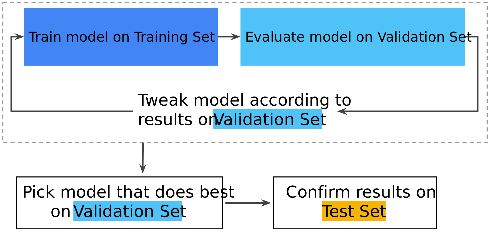

# Model Evaluation 

### Training, Validation, Test

We split data in three parts: 

- **Training Data**: the sample of data used to fit the model
- **Validation Data**: the sample of data used to provide an unbiased evaluation of a model fit on the training dataset, while tuning model hyperparameters
- **Test Data**: the samples of data used to provide an unbiased evaluation of the final model fit

We use training data to learn model parameters and for each model learned (i.e., different features and hyperparameters) we use validation data to compute the validation error.  
We then select the model with the lowest validation error and finally use test data to estimate prediction error. 

This separation is important to avoid creating statistical dependency. To further evaluate the model's performance, techniques to obtain a more reliable assessment of the model's generalization ability exist: 

- **cross validation** 
- **leave one out** (which is cross validation where `fold_size=n`)
- **adjustment techniques**

## LOO Leave One Out

Leave One Out is the best you can do. It provides an almost unbiased estimate of prediction error (slightly pessimistic) and it's often used when dataset is small and the models are simples (the computational complexity doesn't explode).  
Indeed LOO is extremely expensive to compute: you might have problems if you have many data because you have to perform a large number of training.  

## K-fold cross validation

K-fold is useful if you want to evaluate the performances of a set of different models in case of **large** dataset.

- The training data is randomly split into $k$ folds.
- For each fold, the model is trained on the rest of the data
- The error is computed on the fold
- The prediction error is estimated by averaging the errors computed for each fold.
- The $k$-fold cross-validation provides a slightly biased estimate of prediction error but is computationally cheaper.
- Typically, $k$ is around 10.

## Adjustment techniques 

Adjustment techniques should be a last resort. It is recommended to avoid using them whenever possible: in cases where you want to avoid reserving any data for validation, adjustment techniques can be employed. This is particularly useful when dealing with a small dataset and complex models that you do not want to train. 
There are several other adjustment techniques that can be employed.

$$
\begin{aligned}
& C_p=\frac{1}{N}(R S S+2 d \tilde{\sigma}) \\
& A I C=-2 \log L+2 d \\
& B I C=\frac{1}{N}(R S S+\log (N) d \tilde{\sigma}) \\
& \quad R^2 R_{a d}^2=1-\frac{R S S /(N-d-1)}{T S S /(N-1)}
\end{aligned}
$$

