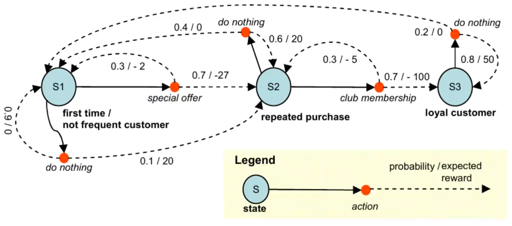

## Markov Decision Processes

MDPs are a mathematical framework used in reinforcement learning to describe an environment fully observable by the agent. MDPs provide a way to represent the agent's interaction and behavior. 
They operate under the Markov property: 

> "The future is independent of the past given the present"




We model the MDP as a tuple of six elements $\mathcal{M}:=(\mathcal{S}, \mathcal{A}, P, R, \mu, \gamma)$:

- **States**: $S$
- **Actions**: $A$ note that not all actions are possible in all the states
- **Transition model**: $P: S \times A \rightarrow \Delta(S)$ tells how the environment evolves after each action.  It's possible to rapresent it with a matrix. 
- **Reward function**: $R: S \times A \rightarrow \mathbb{R}$
- **Initial distribution** $\mu \in \Delta(S)$, we need $\operatorname{dim}(\mu)=|S|$ numbers to store it
- **Discount factor**: $\gamma \in(0,1]$

The agent's behavior is modeled by means of a policy $\pi: S \rightarrow \Delta(A)$. 
The policy can be both deterministic or probabilistic. 
Other interesting tools are: 

- $P^\pi\left(s^{\prime} \mid s\right)=\sum_{a \in \mathcal{A}} \pi(a \mid s) P\left(s^{\prime} \mid s, a\right)$ is the probability to reach state $s'$ given we are in state $s$ , so it's a function which maps state. 
- $R^\pi(s)=\sum_{a \in \mathcal{A}} \pi(a \mid s) R(s, a)$ expected reward you will ever get from state $s$ . Formula based on the expected value of the reward function. 

### Bellman Expectation Equation

The Bellman expectation equation is a mathematical tool which represents the expected value of the sum over an infinite horizon of the reward function, with a discount factor $\gamma$ regulating future rewards' weight. It can be solved iteratively or recursively.

The **Bellman** expectation equation: 

$$\begin{aligned}
V^\pi(s)=\mathbb{E}^\pi\left[\sum_{t=0}^{+\infty} \gamma^t R\left(s_t, a_t\right) \mid s_0=s\right] & =\sum_{a \in \mathcal{A}} \pi(a \mid s)\left[R(s, a)+\gamma \sum_{s^{\prime} \in \mathcal{S}} P\left(s^{\prime} \mid s, a\right) V^\pi\left(s^{\prime}\right)\right] \\
& =R^\pi(s)+\gamma \sum_{s^{\prime} \in \mathcal{S}} P^\pi\left(s^{\prime} \mid s\right) V^\pi\left(s^{\prime}\right)
\end{aligned}$$

We can invert the matrix (computationally costly) and say: 

$$V^\pi=\left(I-\gamma P^\pi\right)^{-1} R^\pi$$

or we can simply approximate the $V^{\pi}$ in an **iterative** and **recursive** way: 

$$V^\pi=R^\pi+\gamma P^\pi V^\pi$$


Both methods have their pros and cons, and the choice between them depends on the specific requirements of the problem.


In code, the first method uses a direct, closed-form solution:

``` python
V1 = np.linalg.inv(np.eye(nS) - gamma * pi @ P_sas) @ (pi @ R_sa)
```

*Remember that: The `@` symbol in Python is used for matrix multiplication.*

Here, `np.linalg.inv` computes the inverse of the matrix $(I - \gamma P^\pi)$, where $I$ is the identity matrix. This method can be computationally expensive, especially when the number of states or actions is large. Additionally, when $\gamma=1$, the matrix to be inverted becomes singular, meaning it does not have a unique inverse, leading to potential computation errors.

The second method applies the Bellman expectation equation **iteratively** until the change in the value function between iterations is less than a predefined tolerance:

``` python
V_old = np.zeros(nS)
tol = 0.0001
V2 = pi @ R_sa
while np.any(np.abs(V_old - V2) > tol):
V_old = V2
V2 = pi @ (R_sa + gamma * P_sas @ V)
```

This iterative method is more computationally efficient and doesn't suffer from the singularity issue when $\gamma=1$. However, it might take a long time to converge to the true value function if the tolerance is set too low.

### Markov Reward Processes and Policies

A Markov reward process is a tuple $\langle\mathcal{S}, \mathcal{P}, \mathcal{R}, \gamma\rangle$, where $\mathcal{S}$ is a set of states, $\mathcal{P}$ is a transition probability matrix, $\mathcal{R}$ is a reward function, and $\gamma$ is a discount factor. A policy $\pi$ defines the behavior of an agent by determining actions based on the current state. Policies can be categorized as Markovian or history-dependent, deterministic or stochastic, and stationary or non-stationary.

- Markovian examples: chess, Rubik's cube
- Non-Markovian examples: poker, blackjack (requires information about past cards that have already been played)

A policy fully defines the behavior of the agent by determining which action to take at each step. Policies can be categorized as:

- **Markovian vs history dependent**: A policy is Markovian if it only depends on the current state. A policy is history-dependent if it also depends on the previous states.
- **Deterministic vs stochastic**: A policy is deterministic if, given a state, the action taken is always the same, creating a deterministic mapping between states and actions. A policy is stochastic if, given a state, there is a probability distribution over the actions.
- **Stationary vs non-stationary**: A policy is stationary if it does not depend on time, but **only on the state**. A policy is non-stationary if it depends on both time and states.

Nothing prevents a policy from considering real states and previous actions when determining which action to play. A history-dependent policy, as the name suggests, depends on everything that happened in the past. A Markovian policy, by contrast, depends only on the current state.

**For Markov decision processes, Markovian policies are sufficient.** There is no need to base decisions on the entire history. However, in **finite** horizon and Markov decision processes, non-stationary policies may be necessary. If the same state is encountered at the beginning and end of a certain number of steps, it is not guaranteed that the same action will be played in both cases. It may be more beneficial to reach certain states at the beginning, while maximizing immediate reward becomes important towards the end. 
This distinction does not exist in **infinite** horizon scenarios where there is no endpoint. In an **infinite** horizon MDP, Markovian stationary deterministic policies are sufficient.

### Bellman operator $T^\pi$

The Bellman operator simplifies expectation equations, helping to find the best performance in a Markov Decision Process. Repeatedly using the Bellman operator leads to converging on a solution. The optimal value function shows the highest utility achievable in every state. Choosing the Bellman operator for the Bellman equation is recommended as it offers a computationally efficient way to approximate the value function in an MDP.

The state-value function $V^\pi(s)$ of an MDP is the expected return starting from state $s$, and then following policy $\pi$:
$$
V^\pi(s)=E_\pi\left[v_t \mid s_t=s\right]
$$
For control purposes, rather than the value of each state, it is easier to consider the value of each action in each state

The **Bellman operator** $T^\pi$ for $V^\pi$ is defined as $T^\pi: \mathbb{R}^{|S|} \rightarrow \mathbb{R}^{|S|}$. This operator takes as an argument a value function and it returns a value function:

$$T^\pi(V)=R^\pi+\gamma P^\pi V$$


